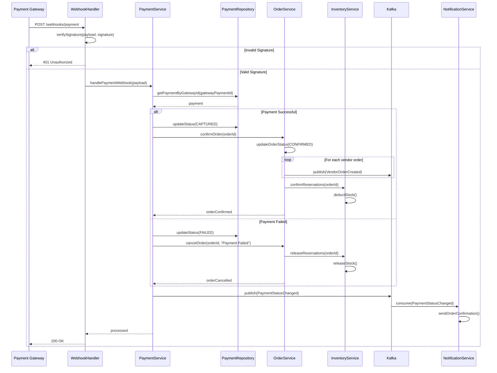

# Payment Processing Sequence Diagram

Detailed sequence showing internal object interactions for payment webhook processing.

```mermaid
sequenceDiagram
    participant Gateway as Payment Gateway
    participant Webhook as WebhookHandler
    participant PaymentSvc as PaymentService
    participant PaymentRepo as PaymentRepository
    participant OrderSvc as OrderService
    participant InventorySvc as InventoryService
    participant EventBus as Kafka
    participant NotifSvc as NotificationService
    
    Gateway->>Webhook: POST /webhooks/payment
    Webhook->>Webhook: verifySignature(payload, signature)
    
    alt Invalid Signature
        Webhook-->>Gateway: 401 Unauthorized
    else Valid Signature
        Webhook->>PaymentSvc: handlePaymentWebhook(payload)
        
        PaymentSvc->>PaymentRepo: getPaymentByGatewayId(gatewayPaymentId)
        PaymentRepo-->>PaymentSvc: payment
        
        alt Payment Successful
            PaymentSvc->>PaymentRepo: updateStatus(CAPTURED)
            PaymentSvc->>OrderSvc: confirmOrder(orderId)
            
            OrderSvc->>OrderSvc: updateOrderStatus(CONFIRMED)
            
            loop For each vendor order
                OrderSvc->>EventBus: publish(VendorOrderCreated)
            end
            
            OrderSvc->>InventorySvc: confirmReservations(orderId)
            InventorySvc->>InventorySvc: deductStock()
            
            OrderSvc-->>PaymentSvc: orderConfirmed
            
        else Payment Failed
            PaymentSvc->>PaymentRepo: updateStatus(FAILED)
            PaymentSvc->>OrderSvc: cancelOrder(orderId, "Payment Failed")
            
            OrderSvc->>InventorySvc: releaseReservations(orderId)
            InventorySvc->>InventorySvc: releaseStock()
            
            OrderSvc-->>PaymentSvc: orderCancelled
        end
        
        PaymentSvc->>EventBus: publish(PaymentStatusChanged)
        EventBus->>NotifSvc: consume(PaymentStatusChanged)
        NotifSvc->>NotifSvc: sendOrderConfirmation()
        
        PaymentSvc-->>Webhook: processed
        Webhook-->>Gateway: 200 OK
    end
```
