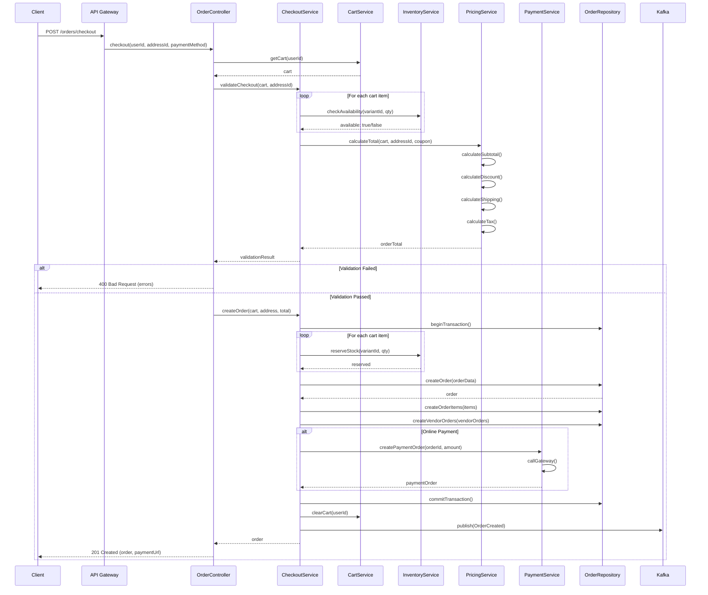

# Place Order Sequence Diagram

Detailed sequence showing internal object interactions for order placement.

```mermaid
sequenceDiagram
    participant Client
    participant Gateway as API Gateway
    participant OrderCtrl as OrderController
    participant CheckoutSvc as CheckoutService
    participant CartSvc as CartService
    participant InventorySvc as InventoryService
    participant PricingSvc as PricingService
    participant PaymentSvc as PaymentService
    participant OrderRepo as OrderRepository
    participant EventBus as Kafka
    
    Client->>Gateway: POST /orders/checkout
    Gateway->>OrderCtrl: checkout(userId, addressId, paymentMethod)
    
    OrderCtrl->>CartSvc: getCart(userId)
    CartSvc-->>OrderCtrl: cart
    
    OrderCtrl->>CheckoutSvc: validateCheckout(cart, addressId)
    
    loop For each cart item
        CheckoutSvc->>InventorySvc: checkAvailability(variantId, qty)
        InventorySvc-->>CheckoutSvc: available: true/false
    end
    
    CheckoutSvc->>PricingSvc: calculateTotal(cart, addressId, coupon)
    PricingSvc->>PricingSvc: calculateSubtotal()
    PricingSvc->>PricingSvc: calculateDiscount()
    PricingSvc->>PricingSvc: calculateShipping()
    PricingSvc->>PricingSvc: calculateTax()
    PricingSvc-->>CheckoutSvc: orderTotal
    
    CheckoutSvc-->>OrderCtrl: validationResult
    
    alt Validation Failed
        OrderCtrl-->>Client: 400 Bad Request (errors)
    else Validation Passed
        OrderCtrl->>CheckoutSvc: createOrder(cart, address, total)
        
        CheckoutSvc->>OrderRepo: beginTransaction()
        
        loop For each cart item
            CheckoutSvc->>InventorySvc: reserveStock(variantId, qty)
            InventorySvc-->>CheckoutSvc: reserved
        end
        
        CheckoutSvc->>OrderRepo: createOrder(orderData)
        OrderRepo-->>CheckoutSvc: order
        
        CheckoutSvc->>OrderRepo: createOrderItems(items)
        CheckoutSvc->>OrderRepo: createVendorOrders(vendorOrders)
        
        alt Online Payment
            CheckoutSvc->>PaymentSvc: createPaymentOrder(orderId, amount)
            PaymentSvc->>PaymentSvc: callGateway()
            PaymentSvc-->>CheckoutSvc: paymentOrder
        end
        
        CheckoutSvc->>OrderRepo: commitTransaction()
        CheckoutSvc->>CartSvc: clearCart(userId)
        
        CheckoutSvc->>EventBus: publish(OrderCreated)
        
        CheckoutSvc-->>OrderCtrl: order
        OrderCtrl-->>Client: 201 Created (order, paymentUrl)
    end
```
