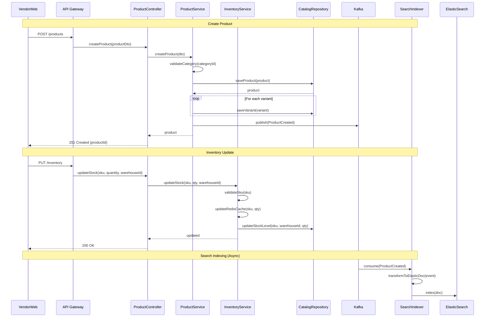

# Product Management Sequence Diagram

Detailed sequence showing internal object interactions for product creation and inventory management.

```mermaid
sequenceDiagram
    participant Client as VendorWeb
    participant Gateway as API Gateway
    participant ProductCtrl as ProductController
    participant ProductSvc as ProductService
    participant InventorySvc as InventoryService
    participant CatalogRepo as CatalogRepository
    participant EventBus as Kafka
    participant SearchIndexer
    
    Note over Client,SearchIndexer: Create Product
    
    Client->>Gateway: POST /products
    Gateway->>ProductCtrl: createProduct(productDto)
    
    ProductCtrl->>ProductSvc: createProduct(dto)
    ProductSvc->>ProductSvc: validateCategory(categoryId)
    
    ProductSvc->>CatalogRepo: saveProduct(product)
    CatalogRepo-->>ProductSvc: product
    
    loop For each variant
        ProductSvc->>CatalogRepo: saveVariant(variant)
    end
    
    ProductSvc->>EventBus: publish(ProductCreated)
    
    ProductSvc-->>ProductCtrl: product
    ProductCtrl-->>Client: 201 Created (productId)
    
    Note over Client,SearchIndexer: Inventory Update
    
    Client->>Gateway: PUT /inventory
    Gateway->>ProductCtrl: updateStock(sku, quantity, warehouseId)
    
    ProductCtrl->>InventorySvc: updateStock(sku, qty, warehouseId)
    
    InventorySvc->>InventorySvc: validateSku(sku)
    InventorySvc->>InventorySvc: updateRedisCache(sku, qty)
    
    InventorySvc->>CatalogRepo: updateStockLevel(sku, warehouseId, qty)
    
    InventorySvc-->>ProductCtrl: updated
    ProductCtrl-->>Client: 200 OK
    
    Note over Client,SearchIndexer: Search Indexing (Async)
    
    EventBus->>SearchIndexer: consume(ProductCreated)
    SearchIndexer->>SearchIndexer: transformToElasticDoc(event)
    SearchIndexer->>ElasticSearch: index(doc)
```
