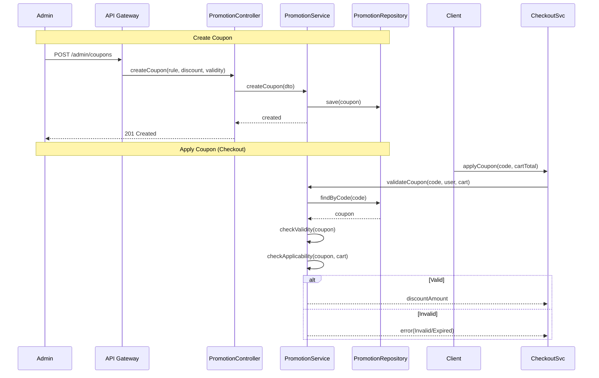

# Promotion Management Sequence Diagram

Detailed sequence showing internal object interactions for creating and applying promotions.

```mermaid
sequenceDiagram
    participant Admin
    participant Gateway as API Gateway
    participant PromoCtrl as PromotionController
    participant PromoSvc as PromotionService
    participant PromoRepo as PromotionRepository
    
    Note over Admin,PromoRepo: Create Coupon
    
    Admin->>Gateway: POST /admin/coupons
    Gateway->>PromoCtrl: createCoupon(rule, discount, validity)
    
    PromoCtrl->>PromoSvc: createCoupon(dto)
    PromoSvc->>PromoRepo: save(coupon)
    PromoSvc-->>PromoCtrl: created
    PromoCtrl-->>Admin: 201 Created
    
    Note over Admin,PromoRepo: Apply Coupon (Checkout)
    
    Client->>CheckoutSvc: applyCoupon(code, cartTotal)
    CheckoutSvc->>PromoSvc: validateCoupon(code, user, cart)
    
    PromoSvc->>PromoRepo: findByCode(code)
    PromoRepo-->>PromoSvc: coupon
    
    PromoSvc->>PromoSvc: checkValidity(coupon)
    PromoSvc->>PromoSvc: checkApplicability(coupon, cart)
    
    alt Valid
        PromoSvc-->>CheckoutSvc: discountAmount
    else Invalid
        PromoSvc-->>CheckoutSvc: error(Invalid/Expired)
    end
```
