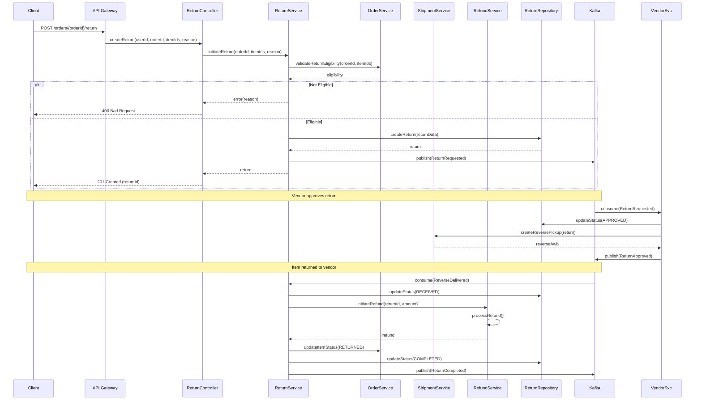

# Return Processing Sequence Diagram

Detailed sequence showing internal object interactions for return and refund processing.

```mermaid
sequenceDiagram
    participant Client
    participant Gateway as API Gateway
    participant ReturnCtrl as ReturnController
    participant ReturnSvc as ReturnService
    participant OrderSvc as OrderService
    participant ShipmentSvc as ShipmentService
    participant RefundSvc as RefundService
    participant ReturnRepo as ReturnRepository
    participant EventBus as Kafka
    
    Client->>Gateway: POST /orders/{orderId}/return
    Gateway->>ReturnCtrl: createReturn(userId, orderId, itemIds, reason)
    
    ReturnCtrl->>ReturnSvc: initiateReturn(orderId, itemIds, reason)
    
    ReturnSvc->>OrderSvc: validateReturnEligibility(orderId, itemIds)
    OrderSvc-->>ReturnSvc: eligibility
    
    alt Not Eligible
        ReturnSvc-->>ReturnCtrl: error(reason)
        ReturnCtrl-->>Client: 400 Bad Request
    else Eligible
        ReturnSvc->>ReturnRepo: createReturn(returnData)
        ReturnRepo-->>ReturnSvc: return
        
        ReturnSvc->>EventBus: publish(ReturnRequested)
        
        ReturnSvc-->>ReturnCtrl: return
        ReturnCtrl-->>Client: 201 Created (returnId)
    end
    
    Note over Client,EventBus: Vendor approves return
    
    EventBus->>VendorSvc: consume(ReturnRequested)
    VendorSvc->>ReturnRepo: updateStatus(APPROVED)
    
    VendorSvc->>ShipmentSvc: createReversePickup(return)
    ShipmentSvc-->>VendorSvc: reverseAwb
    
    VendorSvc->>EventBus: publish(ReturnApproved)
    
    Note over Client,EventBus: Item returned to vendor
    
    EventBus->>ReturnSvc: consume(ReverseDelivered)
    ReturnSvc->>ReturnRepo: updateStatus(RECEIVED)
    
    ReturnSvc->>RefundSvc: initiateRefund(returnId, amount)
    RefundSvc->>RefundSvc: processRefund()
    RefundSvc-->>ReturnSvc: refund
    
    ReturnSvc->>OrderSvc: updateItemStatus(RETURNED)
    ReturnSvc->>ReturnRepo: updateStatus(COMPLETED)
    
    ReturnSvc->>EventBus: publish(ReturnCompleted)
```
