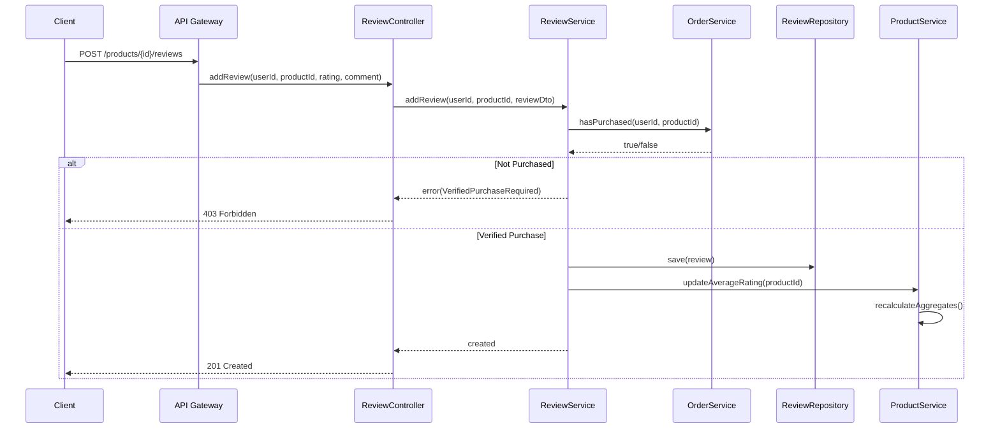

# Review & Rating Sequence Diagram

Detailed sequence showing internal object interactions for product reviews.

```mermaid
sequenceDiagram
    participant Client
    participant Gateway as API Gateway
    participant ReviewCtrl as ReviewController
    participant ReviewSvc as ReviewService
    participant OrderSvc as OrderService
    participant ReviewRepo as ReviewRepository
    participant ProductSvc as ProductService
    
    Client->>Gateway: POST /products/{id}/reviews
    Gateway->>ReviewCtrl: addReview(userId, productId, rating, comment)
    
    ReviewCtrl->>ReviewSvc: addReview(userId, productId, reviewDto)
    
    ReviewSvc->>OrderSvc: hasPurchased(userId, productId)
    OrderSvc-->>ReviewSvc: true/false
    
    alt Not Purchased
        ReviewSvc-->>ReviewCtrl: error(VerifiedPurchaseRequired)
        ReviewCtrl-->>Client: 403 Forbidden
    else Verified Purchase
        ReviewSvc->>ReviewRepo: save(review)
        
        ReviewSvc->>ProductSvc: updateAverageRating(productId)
        ProductSvc->>ProductSvc: recalculateAggregates()
        
        ReviewSvc-->>ReviewCtrl: created
        ReviewCtrl-->>Client: 201 Created
    end
```
