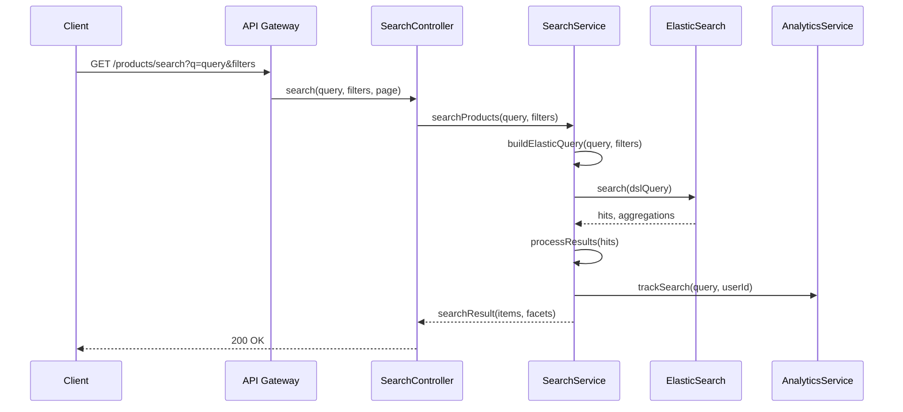

# Search & Discovery Sequence Diagram

Detailed sequence showing internal object interactions for product search and filtering.

```mermaid
sequenceDiagram
    participant Client
    participant Gateway as API Gateway
    participant SearchCtrl as SearchController
    participant SearchSvc as SearchService
    participant Elastic as ElasticSearch
    participant Analytics as AnalyticsService
    
    Client->>Gateway: GET /products/search?q=query&filters
    Gateway->>SearchCtrl: search(query, filters, page)
    
    SearchCtrl->>SearchSvc: searchProducts(query, filters)
    
    SearchSvc->>SearchSvc: buildElasticQuery(query, filters)
    
    SearchSvc->>Elastic: search(dslQuery)
    Elastic-->>SearchSvc: hits, aggregations
    
    SearchSvc->>SearchSvc: processResults(hits)
    SearchSvc->>Analytics: trackSearch(query, userId)
    
    SearchSvc-->>SearchCtrl: searchResult(items, facets)
    SearchCtrl-->>Client: 200 OK
```
