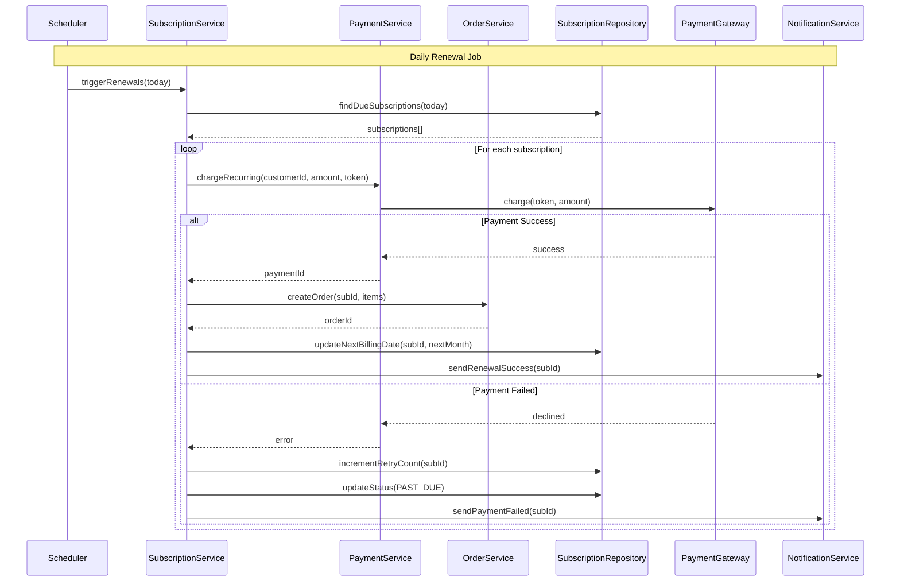

# Subscription Billing Sequence Diagram

Detailed sequence showing internal object interactions for recurring subscription billing.

```mermaid
sequenceDiagram
    participant Scheduler
    participant SubSvc as SubscriptionService
    participant PaySvc as PaymentService
    participant OrderSvc as OrderService
    participant SubRepo as SubscriptionRepository
    participant Gateway as PaymentGateway
    participant NotifSvc as NotificationService
    
    Note over Scheduler,NotifSvc: Daily Renewal Job
    
    Scheduler->>SubSvc: triggerRenewals(today)
    
    SubSvc->>SubRepo: findDueSubscriptions(today)
    SubRepo-->>SubSvc: subscriptions[]
    
    loop For each subscription
        SubSvc->>PaySvc: chargeRecurring(customerId, amount, token)
        PaySvc->>Gateway: charge(token, amount)
        
        alt Payment Success
            Gateway-->>PaySvc: success
            PaySvc-->>SubSvc: paymentId
            
            SubSvc->>OrderSvc: createOrder(subId, items)
            OrderSvc-->>SubSvc: orderId
            
            SubSvc->>SubRepo: updateNextBillingDate(subId, nextMonth)
            SubSvc->>NotifSvc: sendRenewalSuccess(subId)
            
        else Payment Failed
            Gateway-->>PaySvc: declined
            PaySvc-->>SubSvc: error
            
            SubSvc->>SubRepo: incrementRetryCount(subId)
            SubSvc->>SubRepo: updateStatus(PAST_DUE)
            SubSvc->>NotifSvc: sendPaymentFailed(subId)
        end
    end
```
