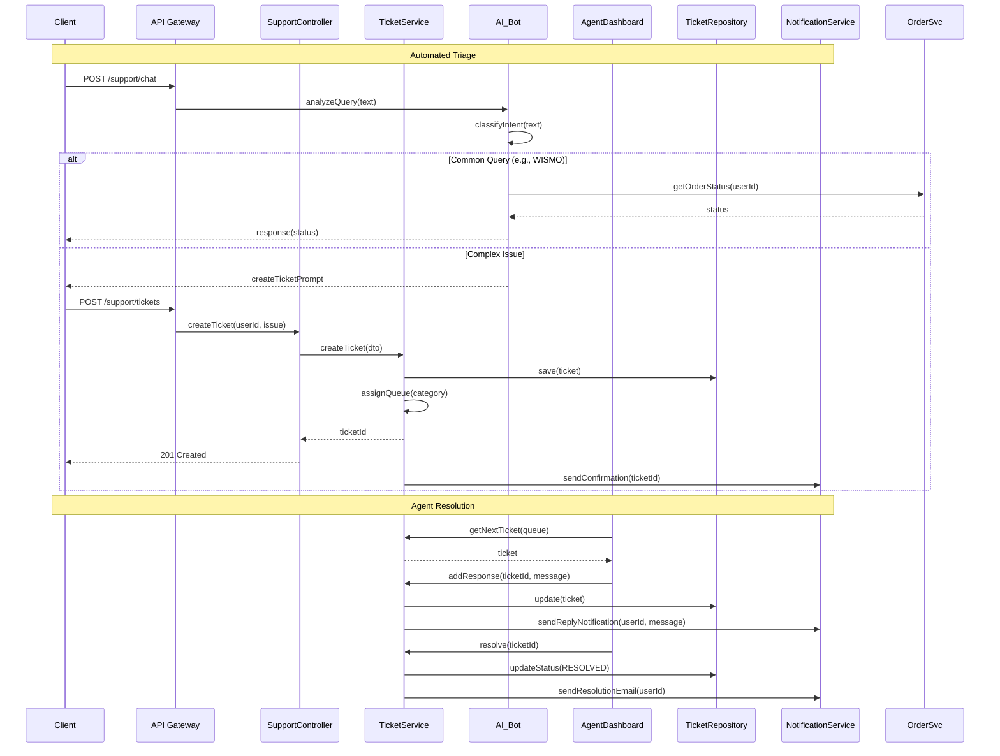

# Support Ticket Sequence Diagram

Detailed sequence showing internal object interactions for customer support ticketing.

```mermaid
sequenceDiagram
    participant Client
    participant Gateway as API Gateway
    participant SupportCtrl as SupportController
    participant TicketSvc as TicketService
    participant Chatbot as AI_Bot
    participant AgentApp as AgentDashboard
    participant TicketRepo as TicketRepository
    participant NotifSvc as NotificationService
    
    Note over Client,NotifSvc: Automated Triage
    
    Client->>Gateway: POST /support/chat
    Gateway->>Chatbot: analyzeQuery(text)
    
    Chatbot->>Chatbot: classifyIntent(text)
    
    alt Common Query (e.g., WISMO)
        Chatbot->>OrderSvc: getOrderStatus(userId)
        OrderSvc-->>Chatbot: status
        Chatbot-->>Client: response(status)
    else Complex Issue
        Chatbot-->>Client: createTicketPrompt
        Client->>Gateway: POST /support/tickets
        Gateway->>SupportCtrl: createTicket(userId, issue)
        
        SupportCtrl->>TicketSvc: createTicket(dto)
        TicketSvc->>TicketRepo: save(ticket)
        TicketSvc->>TicketSvc: assignQueue(category)
        
        TicketSvc-->>SupportCtrl: ticketId
        SupportCtrl-->>Client: 201 Created
        
        TicketSvc->>NotifSvc: sendConfirmation(ticketId)
    end
    
    Note over Client,NotifSvc: Agent Resolution
    
    AgentApp->>TicketSvc: getNextTicket(queue)
    TicketSvc-->>AgentApp: ticket
    
    AgentApp->>TicketSvc: addResponse(ticketId, message)
    TicketSvc->>TicketRepo: update(ticket)
    TicketSvc->>NotifSvc: sendReplyNotification(userId, message)
    
    AgentApp->>TicketSvc: resolve(ticketId)
    TicketSvc->>TicketRepo: updateStatus(RESOLVED)
    TicketSvc->>NotifSvc: sendResolutionEmail(userId)
```
