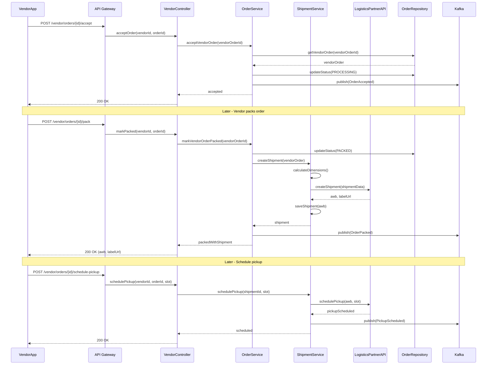

# Vendor Order Fulfillment Sequence Diagram

Detailed sequence showing internal object interactions for vendor order management.

```mermaid
sequenceDiagram
    participant Client as VendorApp
    participant Gateway as API Gateway
    participant VendorCtrl as VendorController
    participant OrderSvc as OrderService
    participant ShipmentSvc as ShipmentService
    participant LogisticsClient as LogisticsPartnerAPI
    participant OrderRepo as OrderRepository
    participant EventBus as Kafka
    
    Client->>Gateway: POST /vendor/orders/{id}/accept
    Gateway->>VendorCtrl: acceptOrder(vendorId, orderId)
    
    VendorCtrl->>OrderSvc: acceptVendorOrder(vendorOrderId)
    OrderSvc->>OrderRepo: getVendorOrder(vendorOrderId)
    OrderRepo-->>OrderSvc: vendorOrder
    
    OrderSvc->>OrderRepo: updateStatus(PROCESSING)
    OrderSvc->>EventBus: publish(OrderAccepted)
    OrderSvc-->>VendorCtrl: accepted
    VendorCtrl-->>Client: 200 OK
    
    Note over Client,EventBus: Later - Vendor packs order
    
    Client->>Gateway: POST /vendor/orders/{id}/pack
    Gateway->>VendorCtrl: markPacked(vendorId, orderId)
    
    VendorCtrl->>OrderSvc: markVendorOrderPacked(vendorOrderId)
    OrderSvc->>OrderRepo: updateStatus(PACKED)
    
    OrderSvc->>ShipmentSvc: createShipment(vendorOrder)
    ShipmentSvc->>ShipmentSvc: calculateDimensions()
    ShipmentSvc->>LogisticsClient: createShipment(shipmentData)
    LogisticsClient-->>ShipmentSvc: awb, labelUrl
    
    ShipmentSvc->>ShipmentSvc: saveShipment(awb)
    ShipmentSvc-->>OrderSvc: shipment
    
    OrderSvc->>EventBus: publish(OrderPacked)
    OrderSvc-->>VendorCtrl: packedWithShipment
    VendorCtrl-->>Client: 200 OK (awb, labelUrl)
    
    Note over Client,EventBus: Later - Schedule pickup
    
    Client->>Gateway: POST /vendor/orders/{id}/schedule-pickup
    Gateway->>VendorCtrl: schedulePickup(vendorId, orderId, slot)
    
    VendorCtrl->>ShipmentSvc: schedulePickup(shipmentId, slot)
    ShipmentSvc->>LogisticsClient: schedulePickup(awb, slot)
    LogisticsClient-->>ShipmentSvc: pickupScheduled
    
    ShipmentSvc->>EventBus: publish(PickupScheduled)
    ShipmentSvc-->>VendorCtrl: scheduled
    VendorCtrl-->>Client: 200 OK
```
