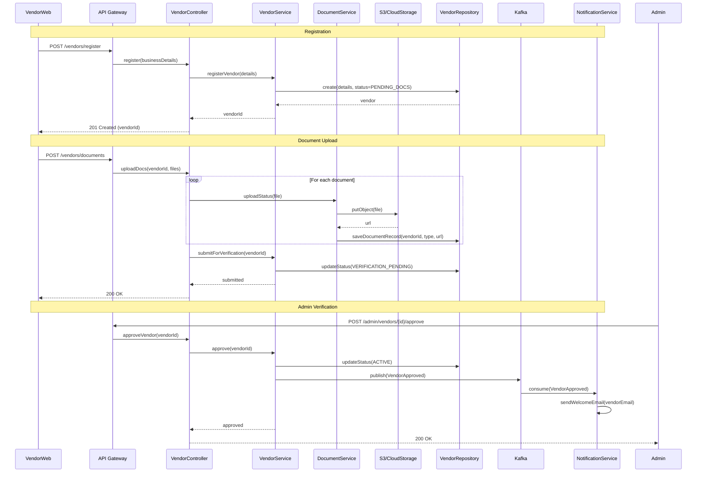

# Vendor Onboarding Sequence Diagram

Detailed sequence showing internal object interactions for vendor registration and onboarding.

```mermaid
sequenceDiagram
    participant Client as VendorWeb
    participant Gateway as API Gateway
    participant VendorCtrl as VendorController
    participant VendorSvc as VendorService
    participant DocSvc as DocumentService
    participant Storage as S3/CloudStorage
    participant VendorRepo as VendorRepository
    participant EventBus as Kafka
    participant NotifSvc as NotificationService
    
    Note over Client,NotifSvc: Registration
    
    Client->>Gateway: POST /vendors/register
    Gateway->>VendorCtrl: register(businessDetails)
    VendorCtrl->>VendorSvc: registerVendor(details)
    
    VendorSvc->>VendorRepo: create(details, status=PENDING_DOCS)
    VendorRepo-->>VendorSvc: vendor
    
    VendorSvc-->>VendorCtrl: vendorId
    VendorCtrl-->>Client: 201 Created (vendorId)
    
    Note over Client,NotifSvc: Document Upload
    
    Client->>Gateway: POST /vendors/documents
    Gateway->>VendorCtrl: uploadDocs(vendorId, files)
    
    loop For each document
        VendorCtrl->>DocSvc: uploadStatus(file)
        DocSvc->>Storage: putObject(file)
        Storage-->>DocSvc: url
        DocSvc->>VendorRepo: saveDocumentRecord(vendorId, type, url)
    end
    
    VendorCtrl->>VendorSvc: submitForVerification(vendorId)
    VendorSvc->>VendorRepo: updateStatus(VERIFICATION_PENDING)
    VendorSvc-->>VendorCtrl: submitted
    VendorCtrl-->>Client: 200 OK
    
    Note over Client,NotifSvc: Admin Verification
    
    Admin->>Gateway: POST /admin/vendors/{id}/approve
    Gateway->>VendorCtrl: approveVendor(vendorId)
    
    VendorCtrl->>VendorSvc: approve(vendorId)
    VendorSvc->>VendorRepo: updateStatus(ACTIVE)
    
    VendorSvc->>EventBus: publish(VendorApproved)
    
    EventBus->>NotifSvc: consume(VendorApproved)
    NotifSvc->>NotifSvc: sendWelcomeEmail(vendorEmail)
    
    VendorSvc-->>VendorCtrl: approved
    VendorCtrl-->>Admin: 200 OK
```
