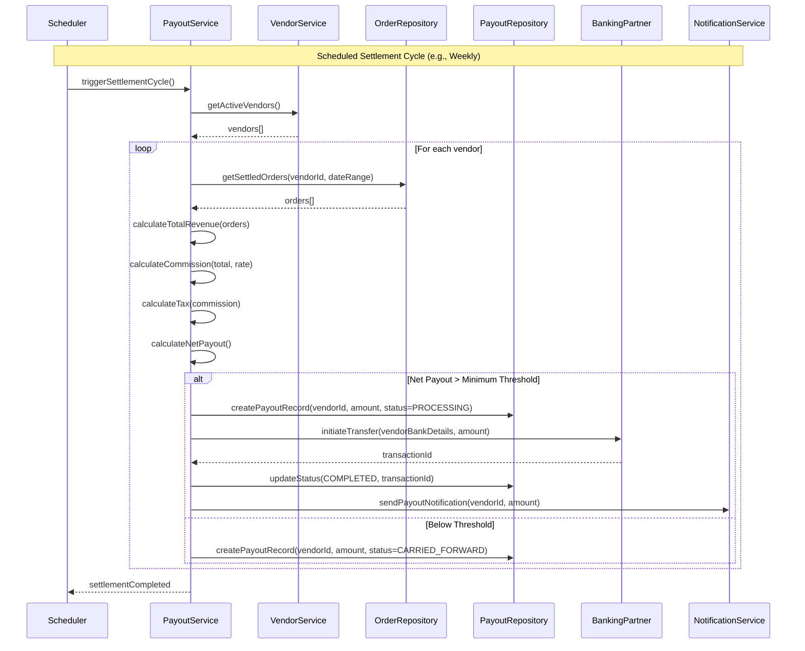

# Vendor Payouts Sequence Diagram

Detailed sequence showing internal object interactions for vendor settlements and payouts.

```mermaid
sequenceDiagram
    participant Scheduler
    participant PayoutSvc as PayoutService
    participant VendorSvc as VendorService
    participant OrderRepo as OrderRepository
    participant PayoutRepo as PayoutRepository
    participant BankGateway as BankingPartner
    participant NotifSvc as NotificationService
    
    Note over Scheduler,NotifSvc: Scheduled Settlement Cycle (e.g., Weekly)
    
    Scheduler->>PayoutSvc: triggerSettlementCycle()
    
    PayoutSvc->>VendorSvc: getActiveVendors()
    VendorSvc-->>PayoutSvc: vendors[]
    
    loop For each vendor
        PayoutSvc->>OrderRepo: getSettledOrders(vendorId, dateRange)
        OrderRepo-->>PayoutSvc: orders[]
        
        PayoutSvc->>PayoutSvc: calculateTotalRevenue(orders)
        PayoutSvc->>PayoutSvc: calculateCommission(total, rate)
        PayoutSvc->>PayoutSvc: calculateTax(commission)
        PayoutSvc->>PayoutSvc: calculateNetPayout()
        
        alt Net Payout > Minimum Threshold
            PayoutSvc->>PayoutRepo: createPayoutRecord(vendorId, amount, status=PROCESSING)
            
            PayoutSvc->>BankGateway: initiateTransfer(vendorBankDetails, amount)
            BankGateway-->>PayoutSvc: transactionId
            
            PayoutSvc->>PayoutRepo: updateStatus(COMPLETED, transactionId)
            
            PayoutSvc->>NotifSvc: sendPayoutNotification(vendorId, amount)
        else Below Threshold
             PayoutSvc->>PayoutRepo: createPayoutRecord(vendorId, amount, status=CARRIED_FORWARD)
        end
    end
    
    PayoutSvc-->>Scheduler: settlementCompleted
```
