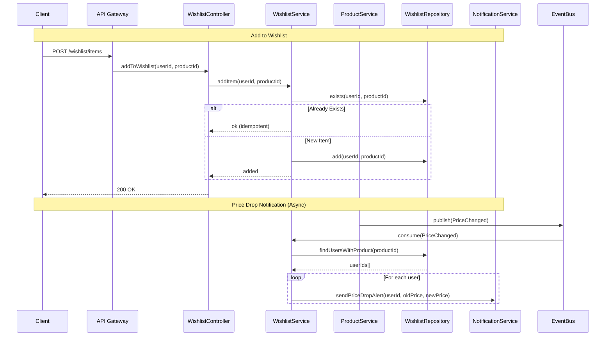

# Wishlist Operations Sequence Diagram

Detailed sequence showing internal object interactions for wishlist management.

```mermaid
sequenceDiagram
    participant Client
    participant Gateway as API Gateway
    participant WishlistCtrl as WishlistController
    participant WishlistSvc as WishlistService
    participant ProductSvc as ProductService
    participant WishlistRepo as WishlistRepository
    participant NotifSvc as NotificationService
    
    Note over Client,NotifSvc: Add to Wishlist
    
    Client->>Gateway: POST /wishlist/items
    Gateway->>WishlistCtrl: addToWishlist(userId, productId)
    
    WishlistCtrl->>WishlistSvc: addItem(userId, productId)
    
    WishlistSvc->>WishlistRepo: exists(userId, productId)
    
    alt Already Exists
        WishlistSvc-->>WishlistCtrl: ok (idempotent)
    else New Item
        WishlistSvc->>WishlistRepo: add(userId, productId)
        WishlistSvc-->>WishlistCtrl: added
    end
    
    WishlistCtrl-->>Client: 200 OK
    
    Note over Client,NotifSvc: Price Drop Notification (Async)
    
    ProductSvc->>EventBus: publish(PriceChanged)
    EventBus->>WishlistSvc: consume(PriceChanged)
    
    WishlistSvc->>WishlistRepo: findUsersWithProduct(productId)
    WishlistRepo-->>WishlistSvc: userIds[]
    
    loop For each user
        WishlistSvc->>NotifSvc: sendPriceDropAlert(userId, oldPrice, newPrice)
    end
```
