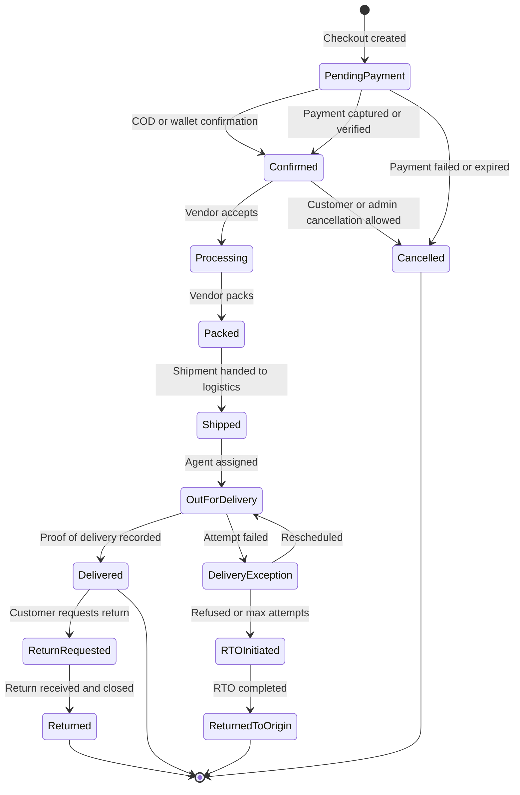
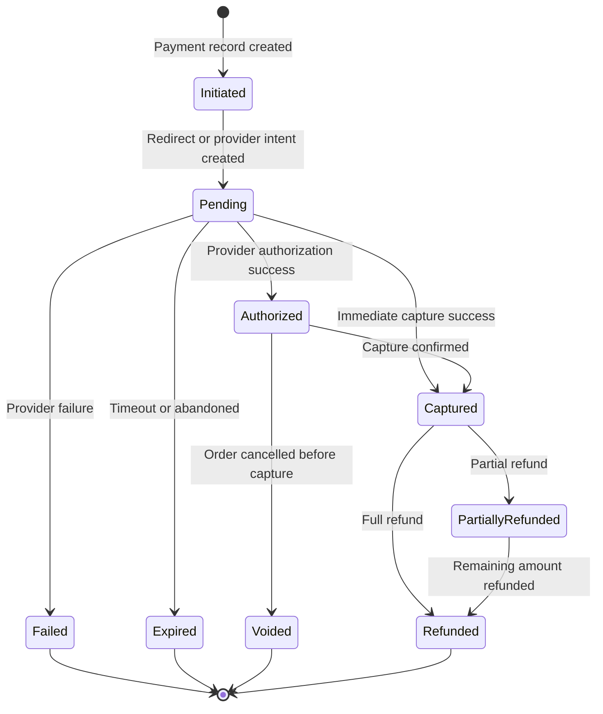
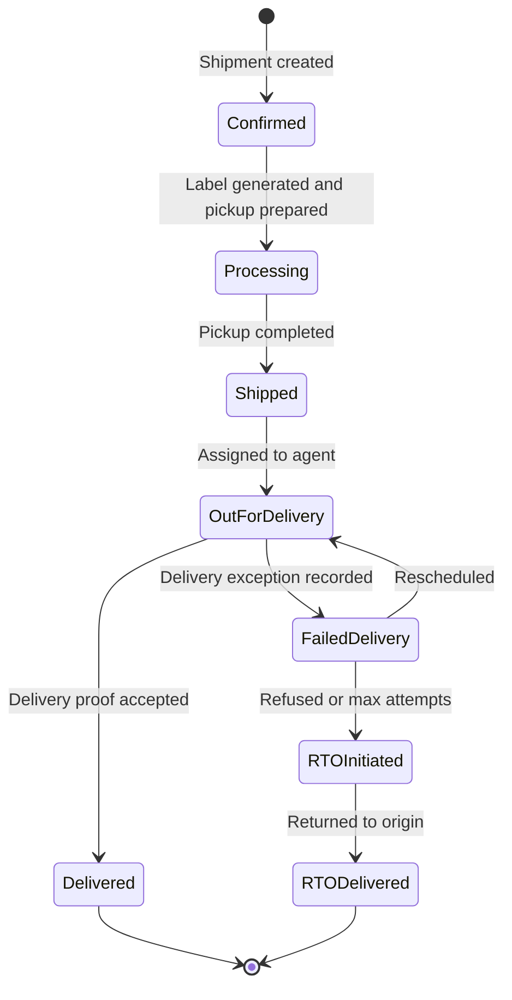
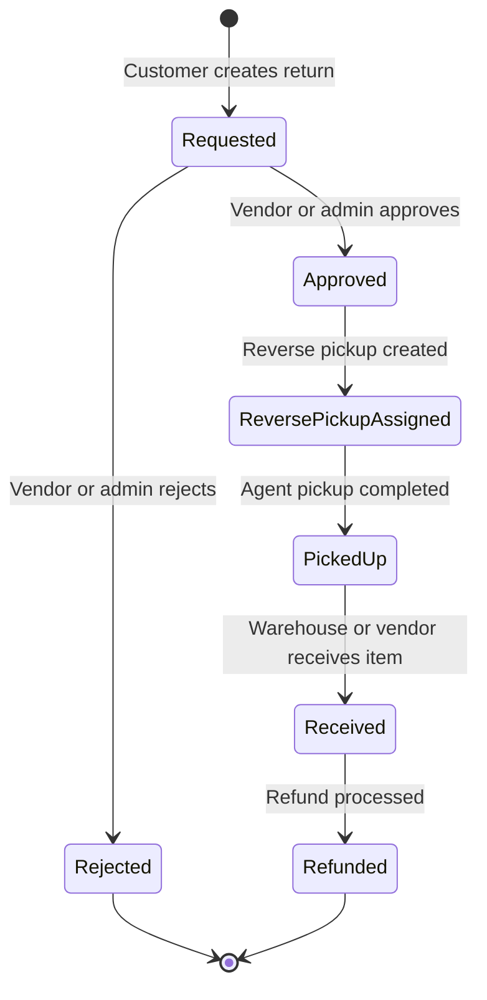
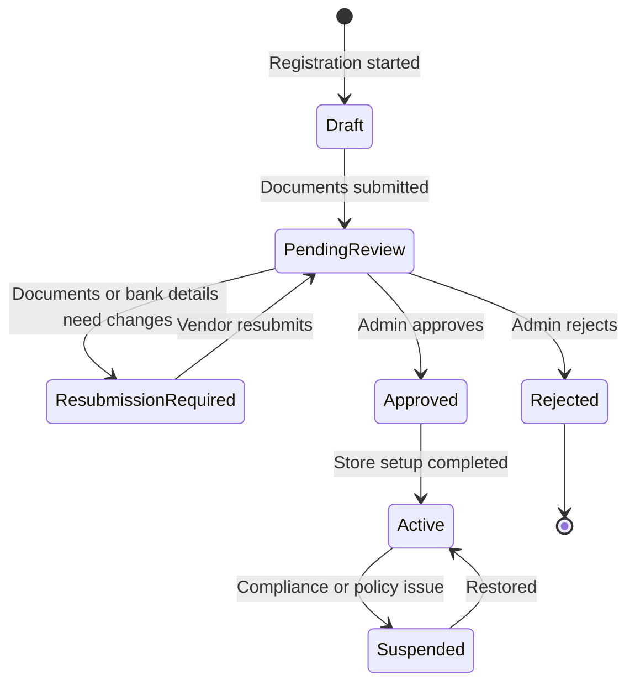
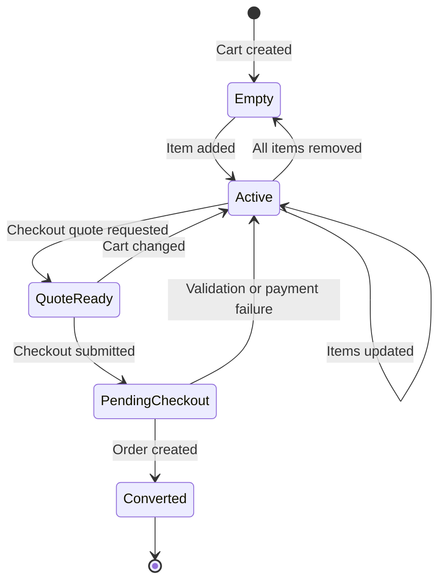
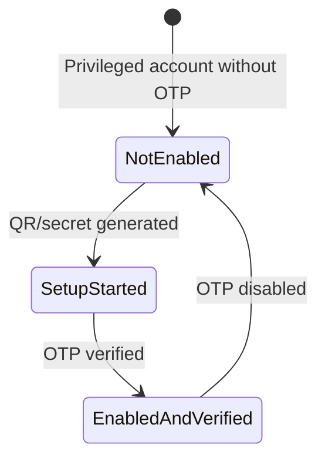

# State Machine Diagrams

## Overview
State machines for the implemented backend entities and lifecycle transitions.

---

## Order State Machine

---

## Payment State Machine

---

## Shipment State Machine

---

## Return State Machine

---

## Vendor Onboarding State Machine

---

## Cart State Machine

---

## Admin OTP Readiness State Machine

---

## Status Notes

| Entity | Important Notes |
|--------|-----------------|
| Orders | `PendingPayment` is the starting state for online payments; reservations are committed on payment success and released on failure/expiry |
| Shipments | Shipping-label generation happens during `Processing` and can be reused idempotently |
| Returns | The implemented lifecycle emphasizes `Requested`, `Approved`, `ReversePickupAssigned`, `PickedUp`, `Received`, and `Refunded` |
| Admin OTP | OTP is optional for admins in this pass, but readiness and audit visibility are implemented |
