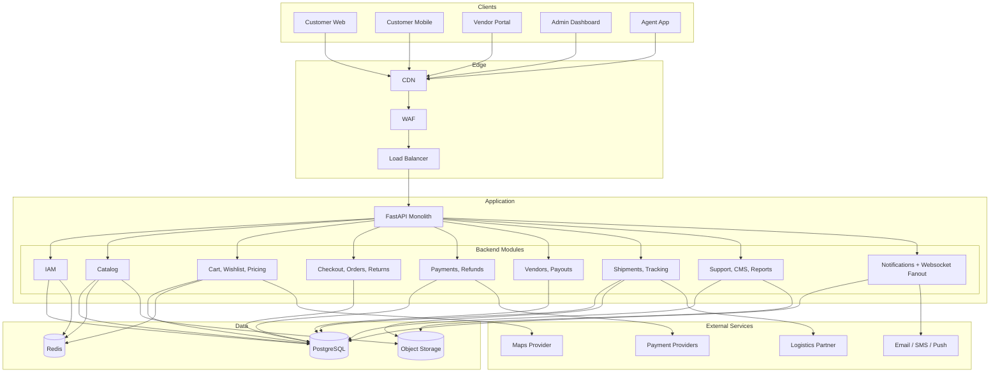
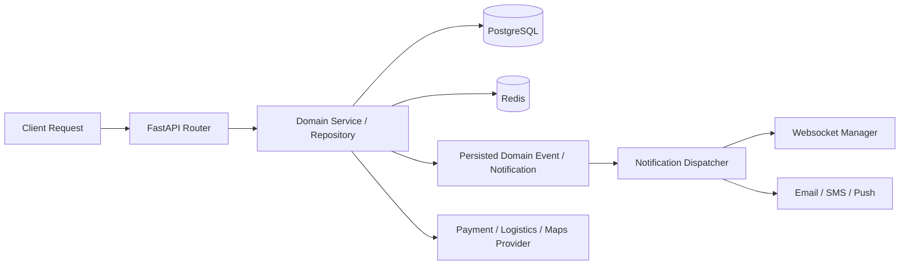

# High-Level Architecture Diagram

## Overview
This document summarizes the implemented backend architecture. The current codebase runs as a FastAPI monolith with domain modules, shared persistence, async notification tasks, websocket fanout, and external payment/logistics/maps integrations.

---

## System Architecture Overview

---

## Runtime Interaction Model

---

## Key Backend Responsibilities

| Module | Main Responsibilities |
|--------|-----------------------|
| IAM | JWT auth, OTP enable/verify/disable, privileged-account OTP readiness |
| Catalog | Product CRUD, search/filtering, CSV import, variant price history |
| Commerce | Cart, wishlist, share links, quote building, tax and shipping rules |
| Orders | Checkout, idempotency, order timelines, returns, invoice metadata |
| Payments | Initiation, verify/webhooks, refunds, reconciliation |
| Vendors | Onboarding, verification flow, payouts, settlement exports |
| Logistics | Shipment lifecycle, delivery exceptions, RTO, label artifacts |
| Support | Tickets, comments, SLA fields, reports, banners, static pages |
| Notifications | Persisted notifications, websocket fanout, low-stock and commerce events |

---

## Current Constraints

- The repository is documented as a monolith even where older design drafts discussed microservices.
- Search is implemented without a separate search engine dependency requirement.
- Route optimization, courier GPS ingestion, and recommendation ranking are implemented inside the FastAPI monolith. External routing engines and larger ML serving stacks remain optional future upgrades.
