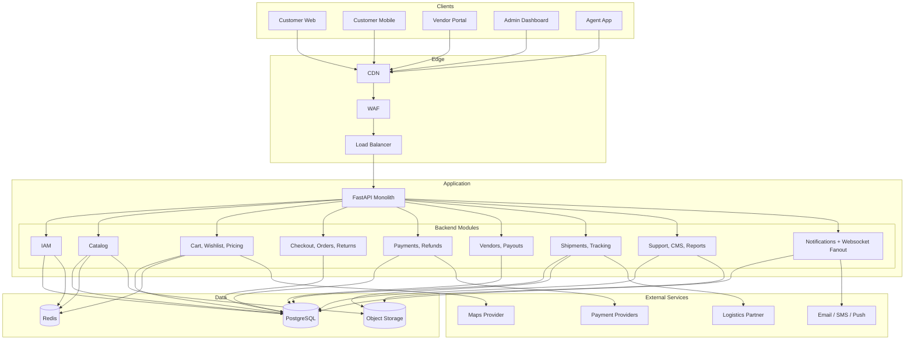
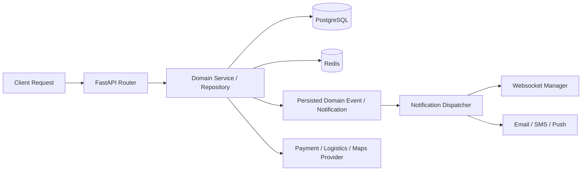

# High-Level Architecture Diagram

## Overview
This document summarizes the implemented backend architecture. The current codebase runs as a FastAPI monolith with domain modules, shared persistence, async notification tasks, websocket fanout, and external payment/logistics/maps integrations.

---

## System Architecture Overview

---

## Runtime Interaction Model

---

## Key Backend Responsibilities

| Module | Main Responsibilities |
|--------|-----------------------|
| IAM | JWT auth, OTP enable/verify/disable, privileged-account OTP readiness |
| Catalog | Product CRUD, search/filtering, CSV import, variant price history |
| Commerce | Cart, wishlist, share links, quote building, tax and shipping rules |
| Orders | Checkout, idempotency, order timelines, returns, invoice metadata |
| Payments | Initiation, verify/webhooks, refunds, reconciliation |
| Vendors | Onboarding, verification flow, payouts, settlement exports |
| Logistics | Shipment lifecycle, delivery exceptions, RTO, label artifacts |
| Support | Tickets, comments, SLA fields, reports, banners, static pages |
| Notifications | Persisted notifications, websocket fanout, low-stock and commerce events |

---

## Service Boundaries (Logical Modules in the Monolith)

| Bounded Context | Owns | Publishes Events | Consumes Events |
|---|---|---|---|
| Pricing & Promotions | Quote composition, promotion eligibility, discount allocation, campaign limits | `QuoteCalculated`, `PromotionApplied` | `InventoryReservationExpired`, `OrderCancelled` |
| Tax Engine | Jurisdiction resolution, tax rule versioning, tax evidence snapshots | `TaxCalculated` | `QuoteRequested`, `OrderRepriced` |
| Checkout & Order Orchestrator | Idempotent checkout command, order aggregate/state machine, split-order creation | `OrderCreated`, `OrderStateChanged` | `PaymentAuthorized`, `InventoryReserved`, `FraudDecisioned` |
| Inventory | ATP computation, reservation/hold expiry, release/commit logic | `InventoryReserved`, `InventoryReleased`, `InventoryCommitted` | `CheckoutRequested`, `OrderCancelled`, `ShipmentFailed` |
| Payment Orchestration | Authorization/capture/refund orchestration, webhook ingest, provider routing | `PaymentAuthorized`, `PaymentCaptured`, `RefundCompleted` | `OrderCreated`, `CancelApproved`, `RefundApproved` |
| Fraud & Risk | Risk scoring, velocity rules, challenge/manual-review policies | `FraudDecisioned` | `CheckoutRequested`, `PaymentAttempted` |
| Settlement & Ledger | Double-entry posting, reconciliation, payout batching/holdbacks | `LedgerPosted`, `ReconciliationExceptionRaised`, `PayoutBatchClosed` | `PaymentCaptured`, `RefundCompleted`, `ChargebackReceived` |

---

## Eventual Consistency Strategy

- Use the transactional outbox pattern for all domain events emitted from order, payment, inventory, and ledger modules.
- Consumers process events at-least-once with deduplication by `event_id + aggregate_id + version`.
- Define convergence SLOs:
  - Order/payment consistency <= 2 minutes for 99% flows.
  - Order/inventory consistency <= 1 minute for 99% flows.
  - Ledger reconciliation visibility <= 24 hours (daily close cycle).
- Implement automated repair jobs:
  - Payment-authorized-without-order repair.
  - Order-confirmed-without-reservation rollback/compensation.
  - Refund-complete-without-ledger-post backfill.

---

## Idempotency Patterns

- **Command idempotency**: client-supplied idempotency key on checkout/cancel/refund APIs stored with normalized request hash.
- **Provider idempotency**: outbound capture/refund requests include provider idempotency references.
- **Webhook idempotency**: store webhook delivery id + provider event id; ignore duplicates and out-of-order retries.
- **State transition idempotency**: enforce optimistic concurrency on order aggregate version and reject stale writes.

---

## Inventory Reservation Flow (High-Level)

1. Checkout service requests reservation for each line item with a TTL hold.
2. Inventory service atomically decrements ATP -> reserved bucket.
3. Payment authorization begins only after reservation success.
4. On successful payment capture, reservation converts to committed allocation.
5. On timeout/cancel/failure, reservation is released by compensating command or TTL expiry worker.
6. Expiration worker emits `InventoryReservationExpired` and triggers quote invalidation if needed.

---

## Payment Orchestration Options

### Option A: Synchronous Provider-First (Simpler, Lower Resilience)
- API waits for provider response before final order confirmation.
- Good for low scale and easier debugging.
- Higher risk of customer-visible timeout while provider succeeded.

### Option B: Async Orchestrated Saga (Recommended)
- Checkout creates pending order + reservation, then payment authorization/capture proceeds asynchronously.
- Webhooks and callback workers drive state transitions with idempotent commands.
- Better resilience to partner latency and retry storms; requires stronger observability.

### Option C: Hybrid by Payment Method
- Instant methods (wallet/UPI collect) use synchronous confirmation.
- Cards/BNPL/net banking use asynchronous saga and webhook finalization.
- Balances UX speed and operational consistency.

---

## Current Constraints

- The repository is documented as a monolith even where older design drafts discussed microservices.
- Search is implemented without a separate search engine dependency requirement.
- Route optimization, courier GPS ingestion, and recommendation ranking are implemented inside the FastAPI monolith. External routing engines and larger ML serving stacks remain optional future upgrades.
