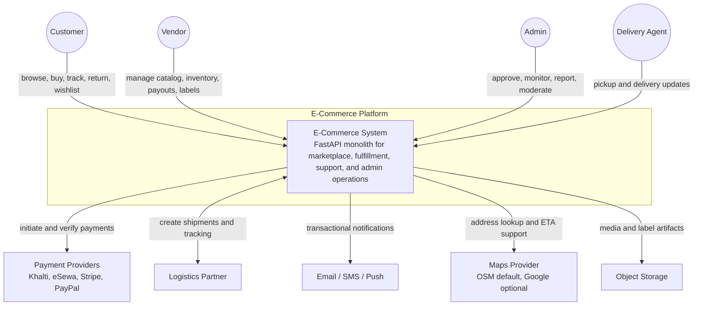
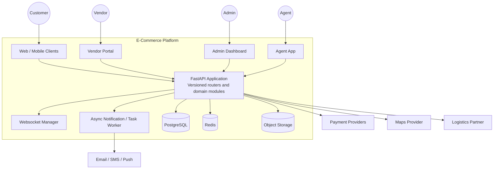
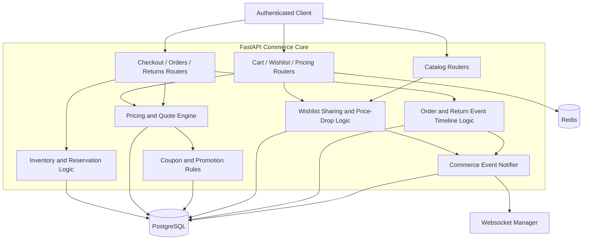
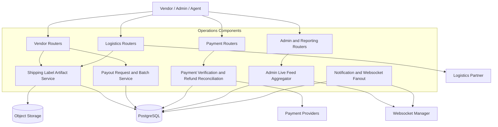

# C4 Diagrams

## Overview
These C4 diagrams describe the current repository architecture, not the earlier microservice proposal. The running backend is a FastAPI monolith with internal modules for catalog, commerce, orders, payments, logistics, vendors, support, notifications, and websocket fanout.

---

## Level 1: System Context Diagram

---

## Level 2: Container Diagram

---

## Level 3: Component Diagram - Commerce Core

---

## Level 3: Component Diagram - Operations And Fulfillment

---

## Current-Future Boundary

| Area | Current Repository State |
|------|--------------------------|
| Architecture | Monolith |
| Search | Database-backed filtering and fuzzy application-side ranking |
| Notifications | Persisted notifications plus websocket fanout |
| Payments | Khalti, eSewa, Stripe, PayPal, wallet, COD |
| Routing | Built-in nearest-neighbor + 2-opt optimization plus persisted courier GPS ingestion |
| Recommendations | Weighted feature ranker with diversity re-ranking |
| Future-only | Razorpay and external route optimization engines |
