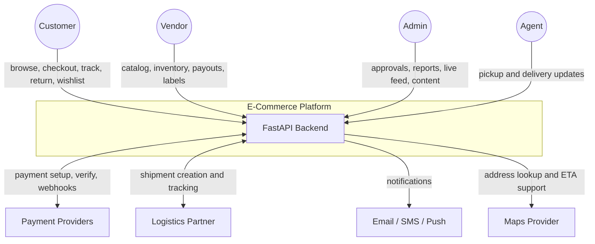
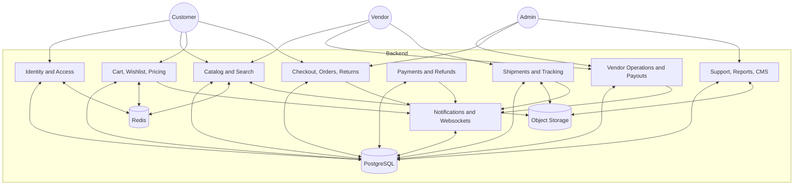
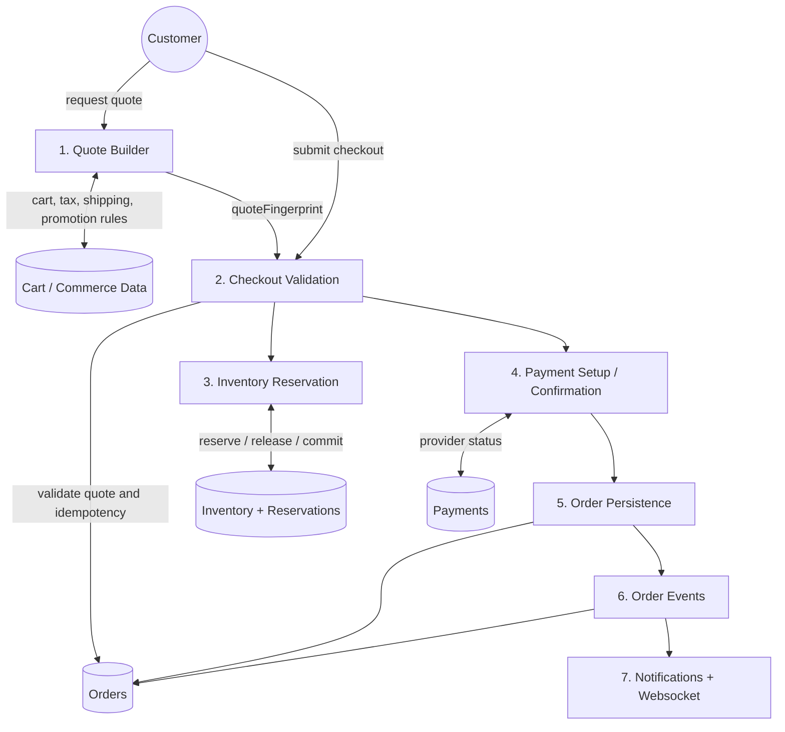
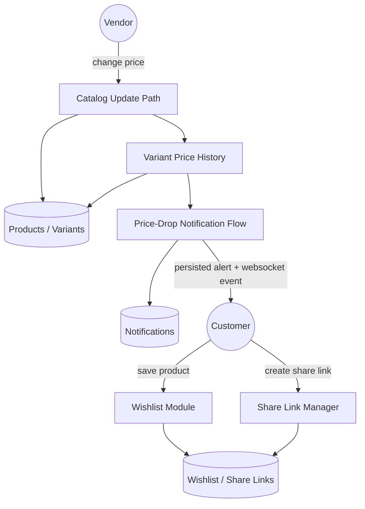
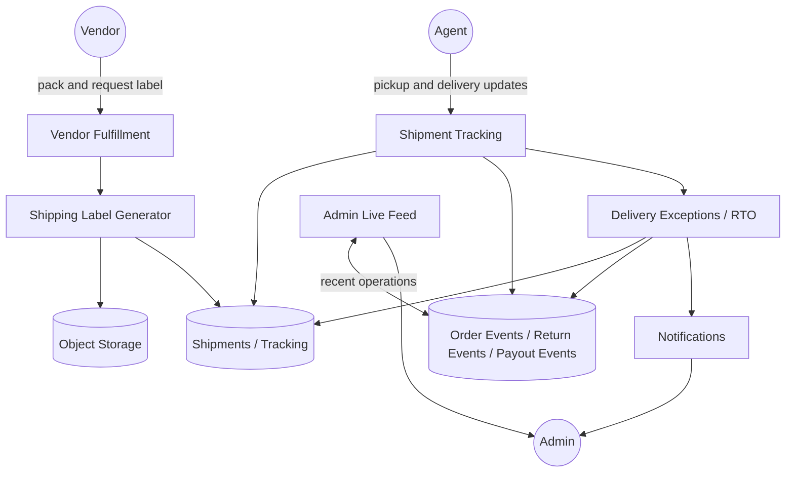

# Data Flow Diagrams

## Overview
These DFDs show the implemented data movement through the current backend.

---

## Level 0: Context Diagram

---

## Level 1: Major Subsystems

---

## Level 2: Checkout And Order Flow

---

## Level 2: Wishlist Sharing And Price-Drop Flow

---

## Level 2: Fulfillment, Shipping Labels, And Live Feed

---

## Notes

| Area | Current State |
|------|---------------|
| Notifications | Generated automatically from domain mutations rather than manually triggered notification APIs |
| Shipping labels | Saved as backend-generated artifacts with stable URLs |
| Live operations feed | Aggregates persisted domain and audit events |
| Routing and GPS | Built-in route optimization and persisted courier GPS ingestion are part of the current backend scope |
| Future-only | External route optimization vendors remain outside current DFD scope |
