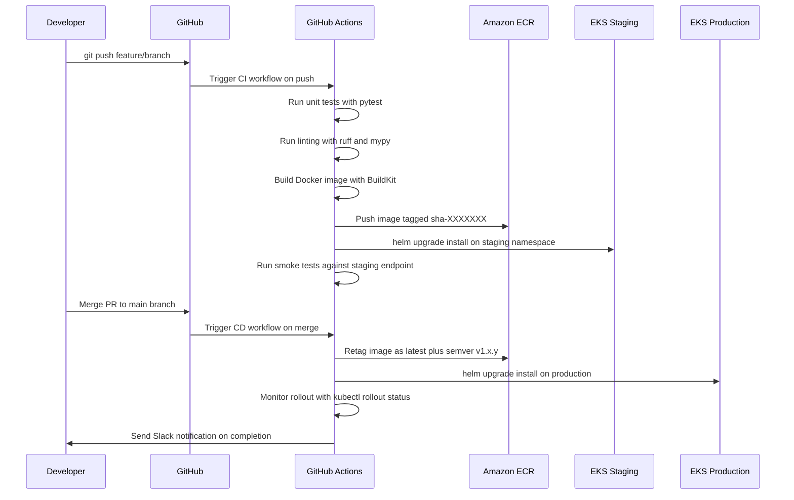

# Deployment Architecture — E-Commerce Multi-Vendor Marketplace

## Overview

This document describes the full AWS deployment architecture for the multi-vendor
e-commerce marketplace. The system is deployed across three environments (production,
staging, dev) using Amazon EKS, with traffic flowing from Route53 through CloudFront
and ALB into Kubernetes workloads backed by managed data services.

---

## Full AWS Deployment Architecture

```mermaid
graph TB
    subgraph Internet["Internet — End Users"]
        USERS["End Users / Vendors / Admins"]
    end

    subgraph DNS["DNS Layer — Route53"]
        R53_PROD["marketplace.com\nA Record to CloudFront"]
        R53_API["api.marketplace.com\nA Record to ALB"]
        R53_MEDIA["media.marketplace.com\nCNAME to CloudFront"]
        R53_STAGING["staging.marketplace.com\nA Record to ALB-Staging"]
    end

    subgraph CDN["Content Delivery — CloudFront"]
        CF_MAIN["CloudFront Distribution\nPOP: 450+ Edge Locations\nHTTPS Only, TLS 1.3\nOrigin: ALB + S3"]
        CF_MEDIA["CloudFront Media Distribution\nOrigin: S3 Media Bucket\nSigned URLs for Private Assets\nCache TTL: 86400s"]
    end

    subgraph WAF["Security Layer — AWS WAF v2"]
        WAF_ACL["Web ACL\nRate Limiting: 2000 req/5min\nSQL Injection Rules\nXSS Protection\nAWS Managed Rules CRS\nBot Control\nGeo Blocking"]
    end

    subgraph LB["Load Balancing — us-east-1"]
        ALB_PROD["ALB Production\nInternal: false\nHTTPS:443 to HTTP:8000\nACM Certificate: marketplace.com\nAccess Logs to S3\nDeletion Protection: enabled"]
        ALB_STAGING["ALB Staging\nHTTPS:443 to HTTP:8000\nACM Certificate: staging.marketplace.com"]
    end

    subgraph EKS_PROD["EKS Cluster — Production us-east-1"]
        direction TB

        subgraph NS_API["Namespace: api-gateway"]
            GW_POD1["api-gateway-pod-1\nImage: ecr/api-gateway:v1.x\nCPU: 500m to 2000m\nMem: 512Mi to 2Gi"]
            GW_POD2["api-gateway-pod-2"]
            GW_HPA["HPA: api-gateway\nmin:2 max:10\nCPU threshold: 60%"]
        end

        subgraph NS_PRODUCT["Namespace: product-service"]
            PROD_POD1["product-service-pod-1\nCPU: 250m to 1000m\nMem: 256Mi to 1Gi"]
            PROD_POD2["product-service-pod-2"]
            PROD_HPA["HPA: product-service\nmin:2 max:8\nCPU threshold: 70%"]
        end

        subgraph NS_ORDER["Namespace: order-service"]
            ORD_POD1["order-service-pod-1\nCPU: 500m to 2000m\nMem: 512Mi to 2Gi"]
            ORD_POD2["order-service-pod-2"]
            ORD_HPA["HPA: order-service\nmin:2 max:12\nCPU threshold: 65%"]
        end

        subgraph NS_PAYMENT["Namespace: payment-service"]
            PAY_POD1["payment-service-pod-1\nCPU: 500m to 1500m\nMem: 512Mi to 1.5Gi"]
            PAY_POD2["payment-service-pod-2"]
            PAY_HPA["HPA: payment-service\nmin:3 max:10\nCPU threshold: 60%"]
        end

        subgraph NS_VENDOR["Namespace: vendor-service"]
            VEN_POD1["vendor-service-pod-1\nCPU: 250m to 1000m\nMem: 256Mi to 1Gi"]
            VEN_HPA["HPA: vendor-service\nmin:2 max:6\nCPU threshold: 70%"]
        end

        subgraph NS_SEARCH["Namespace: search-service"]
            SRCH_POD1["search-service-pod-1\nCPU: 500m to 2000m\nMem: 512Mi to 2Gi"]
            SRCH_POD2["search-service-pod-2"]
            SRCH_HPA["HPA: search-service\nmin:2 max:8\nCPU threshold: 60%"]
        end

        subgraph NS_NOTIFY["Namespace: notification-service"]
            NOTIF_POD1["notification-service-pod-1\nCPU: 250m to 500m\nMem: 256Mi to 512Mi"]
            NOTIF_HPA["HPA: notification-service\nmin:2 max:6\nCPU threshold: 75%"]
        end

        subgraph NS_WORKER["Namespace: celery-workers"]
            CELERY_DEFAULT["celery-worker-default\nQueue: default\nConcurrency: 4\nmin:2 max:8"]
            CELERY_EMAIL["celery-worker-email\nQueue: email\nConcurrency: 8\nmin:1 max:4"]
            CELERY_PAYMENT["celery-worker-payment\nQueue: payment\nConcurrency: 2\nmin:2 max:6"]
            CELERY_BEAT["celery-beat\nScheduler Pod\nReplicas: 1"]
        end

        subgraph NS_INGRESS["Namespace: ingress-nginx"]
            NGINX["nginx-ingress-controller\nReplicas: 3\nService: LoadBalancer\nSSL Termination at ALB"]
        end
    end

    subgraph EKS_STAGING["EKS Cluster — Staging us-east-1"]
        STG_SERVICES["All Services — 1 replica each\nResource limits: 50% of prod\nNamespaces mirror production"]
        STG_WORKERS["Celery Workers\nconcurrency: 2 — min:1 max:2"]
    end

    subgraph DATA["Managed Data Services — us-east-1"]
        subgraph RDS["RDS PostgreSQL 15 — Multi-AZ"]
            RDS_PRIMARY["RDS Primary\ndb.r6g.2xlarge\nus-east-1a\nStorage: 500GB gp3\nIOPS: 3000 — KMS Encrypted"]
            RDS_STANDBY["RDS Standby\ndb.r6g.2xlarge\nus-east-1b\nAutomatic Failover\nRTO: under 60s"]
            RDS_READ1["Read Replica 1\ndb.r6g.xlarge — us-east-1a\nFor analytics queries"]
            RDS_READ2["Read Replica 2\ndb.r6g.xlarge — us-east-1c\nFor reporting load"]
        end

        subgraph REDIS["ElastiCache Redis 7 — Cluster Mode"]
            REDIS_PRIMARY["Redis Primary\ncache.r6g.large — us-east-1a\nMaxmemory: 12GB\nPolicy: allkeys-lru"]
            REDIS_REPLICA1["Redis Replica\ncache.r6g.large — us-east-1b"]
            REDIS_REPLICA2["Redis Replica\ncache.r6g.large — us-east-1c"]
        end

        subgraph OPENSEARCH["Amazon OpenSearch 2.x"]
            OS_MASTER["Master Node x3\nm6g.large.search — 1 AZ each"]
            OS_DATA1["Data Node us-east-1a\nr6g.xlarge.search\n500GB EBS gp3"]
            OS_DATA2["Data Node us-east-1b\nr6g.xlarge.search\n500GB EBS gp3"]
            OS_DATA3["Data Node us-east-1c\nr6g.xlarge.search\n500GB EBS gp3"]
        end

        subgraph S3_STORES["S3 Storage Buckets"]
            S3_MEDIA["marketplace-media-prod\nProduct images, vendor assets\nVersioning: enabled\nIntelligent Tiering"]
            S3_BACKUP["marketplace-backups-prod\nRDS snapshots, exports\nLifecycle: 90d to Glacier"]
            S3_LOGS["marketplace-logs-prod\nALB access logs\nCloudTrail — Retention: 1 year"]
            S3_ASSETS["marketplace-static-prod\nFrontend build artifacts\nCSS, JS, fonts"]
        end
    end

    subgraph CICD["CI/CD Pipeline"]
        GH["GitHub\nSource Repository\nmain / develop / feature branches"]
        GH_ACTIONS["GitHub Actions\nBuild — Test — Push — Deploy"]
        ECR["Amazon ECR\nPrivate Registry\nImage Scanning: enabled\nLifecycle: keep latest 20"]
        HELM["Helm Charts v3.x\nEnvironment-specific values"]
    end

    subgraph MONITORING["Observability Stack"]
        CW["CloudWatch\nMetrics, Logs, Alarms"]
        PROM["Prometheus\nkube-prometheus-stack\nRetention: 15 days"]
        GRAFANA["Grafana Dashboards\nAlerting Rules"]
        PD["PagerDuty\nOn-call routing\nEscalation policies"]
    end

    USERS --> R53_PROD
    USERS --> R53_API
    R53_PROD --> CF_MAIN
    R53_MEDIA --> CF_MEDIA
    CF_MAIN --> WAF_ACL
    WAF_ACL --> ALB_PROD
    CF_MEDIA --> S3_MEDIA
    ALB_PROD --> NGINX
    NGINX --> GW_POD1
    NGINX --> GW_POD2
    GW_POD1 --> PROD_POD1
    GW_POD1 --> ORD_POD1
    GW_POD1 --> PAY_POD1
    GW_POD1 --> VEN_POD1
    GW_POD1 --> SRCH_POD1
    GW_POD1 --> NOTIF_POD1
    PROD_POD1 --> RDS_PRIMARY
    ORD_POD1 --> RDS_PRIMARY
    PAY_POD1 --> RDS_PRIMARY
    PROD_POD1 --> REDIS_PRIMARY
    ORD_POD1 --> REDIS_PRIMARY
    PAY_POD1 --> REDIS_PRIMARY
    SRCH_POD1 --> OS_DATA1
    CELERY_DEFAULT --> RDS_PRIMARY
    CELERY_DEFAULT --> REDIS_PRIMARY
    GH --> GH_ACTIONS
    GH_ACTIONS --> ECR
    GH_ACTIONS --> HELM
    HELM --> EKS_PROD
    ECR --> EKS_PROD
    R53_STAGING --> ALB_STAGING
    ALB_STAGING --> EKS_STAGING
    EKS_PROD --> CW
    EKS_PROD --> PROM
    PROM --> GRAFANA
    GRAFANA --> PD
```



---

## Environment Specifications

### Production Environment

| Parameter              | Value                                   |
|------------------------|-----------------------------------------|
| AWS Region (Primary)   | us-east-1                               |
| AWS Region (DR)        | us-west-2                               |
| EKS Version            | 1.28                                    |
| Node Groups            | 3 (general, compute-intensive, spot)    |
| General Node Type      | m6i.2xlarge (On-Demand, 3–10 nodes)     |
| Compute Node Type      | c6i.4xlarge (On-Demand, 2–6 nodes)      |
| Worker Node Type       | m6i.xlarge (Spot, 2–12 nodes)           |
| Total Namespace Count  | 10                                      |
| Cluster Autoscaler     | Enabled (aws-cluster-autoscaler v1.28)  |

### Staging Environment

| Parameter              | Value                                    |
|------------------------|------------------------------------------|
| AWS Region             | us-east-1                                |
| EKS Node Type          | m6i.xlarge (On-Demand, 2–4 nodes)        |
| Replicas per Service   | 1                                        |
| RDS Instance           | db.t3.large (Single-AZ)                  |
| ElastiCache            | cache.t3.medium (no replication)         |
| OpenSearch             | t3.small.search (1 node)                 |

### Development Environment

| Parameter              | Value                                    |
|------------------------|------------------------------------------|
| Deployment Type        | Docker Compose (local) / EKS namespace   |
| RDS Instance           | db.t3.micro                              |
| ElastiCache            | cache.t3.micro                           |
| OpenSearch             | Single node via Docker Compose           |

---

## Kubernetes HPA Configuration per Service

| Service               | Min | Max | CPU Target | Mem Target | Scale-Up Stabilize | Scale-Down Stabilize |
|-----------------------|-----|-----|------------|------------|-------------------|---------------------|
| api-gateway           | 2   | 10  | 60%        | 75%        | 30s               | 300s                |
| product-service       | 2   | 8   | 70%        | 80%        | 30s               | 300s                |
| order-service         | 2   | 12  | 65%        | 75%        | 15s               | 300s                |
| payment-service       | 3   | 10  | 60%        | 70%        | 15s               | 300s                |
| vendor-service        | 2   | 6   | 70%        | 80%        | 30s               | 300s                |
| search-service        | 2   | 8   | 60%        | 75%        | 30s               | 300s                |
| notification-service  | 2   | 6   | 75%        | 80%        | 60s               | 300s                |
| celery-worker-default | 2   | 8   | N/A (KEDA) | N/A        | Queue depth 100   | Queue depth 10      |
| celery-worker-email   | 1   | 4   | N/A (KEDA) | N/A        | Queue depth 50    | Queue depth 5       |
| celery-worker-payment | 2   | 6   | N/A (KEDA) | N/A        | Queue depth 20    | Queue depth 5       |

---

## Pod Resource Requests and Limits

| Service               | CPU Request | CPU Limit | Mem Request | Mem Limit |
|-----------------------|-------------|-----------|-------------|-----------|
| api-gateway           | 500m        | 2000m     | 512Mi       | 2Gi       |
| product-service       | 250m        | 1000m     | 256Mi       | 1Gi       |
| order-service         | 500m        | 2000m     | 512Mi       | 2Gi       |
| payment-service       | 500m        | 1500m     | 512Mi       | 1.5Gi     |
| vendor-service        | 250m        | 1000m     | 256Mi       | 1Gi       |
| search-service        | 500m        | 2000m     | 512Mi       | 2Gi       |
| notification-service  | 250m        | 500m      | 256Mi       | 512Mi     |
| celery-worker-default | 500m        | 2000m     | 512Mi       | 2Gi       |
| celery-worker-email   | 250m        | 500m      | 256Mi       | 512Mi     |
| celery-beat           | 100m        | 250m      | 128Mi       | 256Mi     |

---

## KEDA ScaledObject for Celery Workers

```yaml
apiVersion: keda.sh/v1alpha1
kind: ScaledObject
metadata:
  name: celery-worker-default-scaler
  namespace: celery-workers
spec:
  scaleTargetRef:
    name: celery-worker-default
  minReplicaCount: 2
  maxReplicaCount: 8
  pollingInterval: 15
  cooldownPeriod: 60
  triggers:
    - type: redis
      metadata:
        address: "elasticache-redis.prod.internal:6379"
        listName: celery
        listLength: "100"
        enableTLS: "true"
```

---

## CI/CD Deployment Sequence



---

## Node Group Definitions (EKS Managed Node Groups)

### General Purpose Node Group

```yaml
nodeGroupName: general
instanceType: m6i.2xlarge
capacityType: ON_DEMAND
desiredSize: 3
minSize: 2
maxSize: 10
labels:
  workload: general
availabilityZones:
  - us-east-1a
  - us-east-1b
  - us-east-1c
diskSize: 100
```

### Spot Worker Node Group

```yaml
nodeGroupName: spot-workers
instanceTypes:
  - m6i.xlarge
  - m5.xlarge
  - m5a.xlarge
capacityType: SPOT
desiredSize: 2
minSize: 0
maxSize: 12
labels:
  workload: batch
taints:
  - key: workload
    value: batch
    effect: NoSchedule
diskSize: 50
```

### Compute-Intensive Node Group

```yaml
nodeGroupName: compute-intensive
instanceType: c6i.4xlarge
capacityType: ON_DEMAND
desiredSize: 2
minSize: 1
maxSize: 6
labels:
  workload: search
diskSize: 100
```

---

## Namespace Isolation and Network Policies

Each Kubernetes namespace is isolated using NetworkPolicy resources. Services can
only communicate via defined ingress rules. The payment-service namespace enforces
the strictest policy — only accepting traffic from the order-service and api-gateway
namespaces over port 8000.

| Namespace             | Ingress Allowed From                       | Egress Allowed To                    |
|-----------------------|--------------------------------------------|--------------------------------------|
| api-gateway           | ingress-nginx                              | All service namespaces               |
| order-service         | api-gateway                               | payment-service, product-service, RDS, Redis |
| payment-service       | order-service, api-gateway                | RDS, Redis, external payment APIs    |
| product-service       | api-gateway, search-service               | RDS, Redis, S3                       |
| search-service        | api-gateway                               | OpenSearch, Redis                    |
| vendor-service        | api-gateway                               | RDS, Redis, S3                       |
| celery-workers        | None (pull-based)                         | All service namespaces, RDS, Redis   |
| notification-service  | api-gateway, celery-workers               | SES, SNS, external webhook endpoints |

---

## Helm Release Structure

```
helm/
├── charts/
│   ├── api-gateway/
│   │   ├── Chart.yaml
│   │   ├── values.yaml
│   │   ├── values-staging.yaml
│   │   ├── values-production.yaml
│   │   └── templates/
│   │       ├── deployment.yaml
│   │       ├── service.yaml
│   │       ├── hpa.yaml
│   │       ├── ingress.yaml
│   │       └── configmap.yaml
│   ├── product-service/
│   ├── order-service/
│   ├── payment-service/
│   ├── vendor-service/
│   ├── search-service/
│   ├── notification-service/
│   └── celery-workers/
└── umbrella/
    ├── Chart.yaml
    └── values-production.yaml
```
