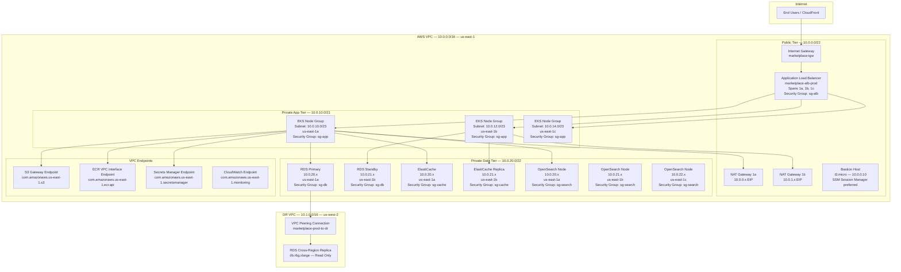

# Network Infrastructure — E-Commerce Multi-Vendor Marketplace

## Overview

This document defines the complete network infrastructure for the marketplace platform
deployed on AWS us-east-1 (primary) and us-west-2 (disaster recovery). The design
enforces strict network segmentation across three tiers: public, private application,
and private data. All inter-tier communication is controlled via Security Groups and
Network ACLs with least-privilege rules.

---

## VPC Design

### Primary VPC — us-east-1

| Parameter            | Value                          |
|----------------------|--------------------------------|
| VPC Name             | marketplace-vpc-prod           |
| CIDR Block           | 10.0.0.0/16                    |
| DNS Hostnames        | Enabled                        |
| DNS Resolution       | Enabled                        |
| Tenancy              | Default                        |
| IPv6 CIDR            | Disabled                       |
| Flow Logs            | Enabled (CloudWatch Logs)      |
| Flow Log Filter      | ALL (ACCEPT + REJECT)          |

### DR VPC — us-west-2

| Parameter            | Value                          |
|----------------------|--------------------------------|
| VPC Name             | marketplace-vpc-dr             |
| CIDR Block           | 10.1.0.0/16                    |
| VPC Peering          | marketplace-vpc-prod           |
| Peering CIDR         | 10.0.0.0/16 via peering conn   |

---

## Subnet Layout

### Public Subnets (ALB, NAT Gateways, Bastion)

| Subnet Name                   | AZ           | CIDR           | Purpose                     |
|-------------------------------|--------------|----------------|-----------------------------|
| marketplace-public-1a         | us-east-1a   | 10.0.0.0/24    | ALB, NAT Gateway            |
| marketplace-public-1b         | us-east-1b   | 10.0.1.0/24    | ALB, NAT Gateway            |
| marketplace-public-1c         | us-east-1c   | 10.0.2.0/24    | ALB, NAT Gateway (standby)  |

Public subnets have `map_public_ip_on_launch = true`. Internet Gateway is attached
to the VPC and public route tables send `0.0.0.0/0` directly to the IGW.

### Private Application Subnets (EKS Worker Nodes)

| Subnet Name                   | AZ           | CIDR           | Purpose                      |
|-------------------------------|--------------|----------------|------------------------------|
| marketplace-private-app-1a    | us-east-1a   | 10.0.10.0/23   | EKS nodes, general workloads |
| marketplace-private-app-1b    | us-east-1b   | 10.0.12.0/23   | EKS nodes, general workloads |
| marketplace-private-app-1c    | us-east-1c   | 10.0.14.0/23   | EKS nodes, general workloads |

These subnets route outbound internet traffic through NAT Gateways in their
respective AZs. Each subnet has a /23 block providing 510 usable addresses per AZ,
supporting up to 170 pods per node with AWS VPC CNI plugin.

### Private Data Subnets (RDS, ElastiCache, OpenSearch)

| Subnet Name                   | AZ           | CIDR           | Purpose                      |
|-------------------------------|--------------|----------------|------------------------------|
| marketplace-private-data-1a   | us-east-1a   | 10.0.20.0/24   | RDS Primary, ElastiCache     |
| marketplace-private-data-1b   | us-east-1b   | 10.0.21.0/24   | RDS Standby, ElastiCache     |
| marketplace-private-data-1c   | us-east-1c   | 10.0.22.0/24   | Read Replicas, OpenSearch     |

Data subnets have NO route to the internet (no NAT Gateway route). All data service
traffic is strictly internal. DB subnet groups for RDS and ElastiCache span all
three data subnets.

---

## Network Topology Diagram



---

## Security Groups

### ALB Security Group (sg-alb-prod)

| Rule Direction | Protocol | Port      | Source/Destination   | Description                 |
|----------------|----------|-----------|----------------------|-----------------------------|
| Inbound        | TCP      | 443       | 0.0.0.0/0            | HTTPS from internet         |
| Inbound        | TCP      | 80        | 0.0.0.0/0            | HTTP redirect to HTTPS      |
| Outbound       | TCP      | 8000      | sg-app-prod          | Forward to EKS app tier     |
| Outbound       | TCP      | 443       | 0.0.0.0/0            | Health check callbacks      |

### App Security Group (sg-app-prod)

| Rule Direction | Protocol | Port      | Source/Destination   | Description                 |
|----------------|----------|-----------|----------------------|-----------------------------|
| Inbound        | TCP      | 8000      | sg-alb-prod          | Traffic from ALB            |
| Inbound        | TCP      | 8000      | sg-app-prod          | Pod-to-pod inter-service    |
| Inbound        | TCP      | 9090      | sg-app-prod          | Prometheus scrape           |
| Inbound        | TCP      | 22        | sg-bastion-prod      | SSH from bastion (legacy)   |
| Outbound       | TCP      | 5432      | sg-db-prod           | PostgreSQL to RDS           |
| Outbound       | TCP      | 6379      | sg-cache-prod        | Redis to ElastiCache        |
| Outbound       | TCP      | 443       | sg-search-prod       | HTTPS to OpenSearch         |
| Outbound       | TCP      | 443       | 0.0.0.0/0            | HTTPS egress via NAT        |
| Outbound       | TCP      | 53        | 10.0.0.0/16          | DNS resolution              |
| Outbound       | UDP      | 53        | 10.0.0.0/16          | DNS resolution              |

### DB Security Group (sg-db-prod)

| Rule Direction | Protocol | Port      | Source/Destination   | Description                 |
|----------------|----------|-----------|----------------------|-----------------------------|
| Inbound        | TCP      | 5432      | sg-app-prod          | PostgreSQL from app tier    |
| Inbound        | TCP      | 5432      | sg-bastion-prod      | Admin access via bastion    |
| Outbound       | ALL      | ALL       | NONE                 | No outbound (deny all)      |

RDS instances use encrypted storage (AES-256 via AWS KMS) and enforce SSL connections
via the `rds.force_ssl=1` parameter group setting. The DB subnet group spans all
three data subnets for Multi-AZ failover.

### Cache Security Group (sg-cache-prod)

| Rule Direction | Protocol | Port      | Source/Destination   | Description                 |
|----------------|----------|-----------|----------------------|-----------------------------|
| Inbound        | TCP      | 6379      | sg-app-prod          | Redis from app tier         |
| Inbound        | TCP      | 6379      | sg-bastion-prod      | Admin access via bastion    |
| Outbound       | ALL      | ALL       | NONE                 | No outbound                 |

### OpenSearch Security Group (sg-search-prod)

| Rule Direction | Protocol | Port      | Source/Destination   | Description                 |
|----------------|----------|-----------|----------------------|-----------------------------|
| Inbound        | TCP      | 443       | sg-app-prod          | HTTPS REST API from app     |
| Inbound        | TCP      | 9200      | sg-app-prod          | OpenSearch REST API         |
| Inbound        | TCP      | 9300      | sg-search-prod       | Node-to-node cluster comms  |
| Outbound       | ALL      | ALL       | NONE                 | No outbound                 |

### Bastion Security Group (sg-bastion-prod)

| Rule Direction | Protocol | Port      | Source/Destination   | Description                 |
|----------------|----------|-----------|----------------------|-----------------------------|
| Inbound        | TCP      | 22        | CORPORATE_CIDR/32    | SSH from corporate network  |
| Outbound       | TCP      | 5432      | sg-db-prod           | DB admin access             |
| Outbound       | TCP      | 6379      | sg-cache-prod        | Cache admin access          |
| Outbound       | TCP      | 22        | sg-app-prod          | SSH to app nodes            |

---

## Network Access Control Lists (NACLs)

NACLs provide a stateless second layer of defense at the subnet boundary. They are
evaluated before Security Groups and operate on all traffic in and out of a subnet.

### Public Subnet NACL (nacl-public-prod)

| Rule # | Direction | Protocol | Port Range | Source/Destination | Action |
|--------|-----------|----------|------------|--------------------|--------|
| 100    | Inbound   | TCP      | 443        | 0.0.0.0/0          | ALLOW  |
| 110    | Inbound   | TCP      | 80         | 0.0.0.0/0          | ALLOW  |
| 120    | Inbound   | TCP      | 1024–65535 | 0.0.0.0/0          | ALLOW  |
| 200    | Inbound   | TCP      | 22         | 10.0.0.0/8         | ALLOW  |
| 32766  | Inbound   | ALL      | ALL        | 0.0.0.0/0          | DENY   |
| 100    | Outbound  | TCP      | 443        | 0.0.0.0/0          | ALLOW  |
| 110    | Outbound  | TCP      | 80         | 0.0.0.0/0          | ALLOW  |
| 120    | Outbound  | TCP      | 8000       | 10.0.10.0/21       | ALLOW  |
| 130    | Outbound  | TCP      | 1024–65535 | 0.0.0.0/0          | ALLOW  |
| 32766  | Outbound  | ALL      | ALL        | 0.0.0.0/0          | DENY   |

### Private App Subnet NACL (nacl-private-app-prod)

| Rule # | Direction | Protocol | Port Range | Source/Destination | Action |
|--------|-----------|----------|------------|--------------------|--------|
| 100    | Inbound   | TCP      | 8000       | 10.0.0.0/22        | ALLOW  |
| 110    | Inbound   | TCP      | 1024–65535 | 0.0.0.0/0          | ALLOW  |
| 120    | Inbound   | TCP      | 8000       | 10.0.10.0/21       | ALLOW  |
| 32766  | Inbound   | ALL      | ALL        | 0.0.0.0/0          | DENY   |
| 100    | Outbound  | TCP      | 5432       | 10.0.20.0/22       | ALLOW  |
| 110    | Outbound  | TCP      | 6379       | 10.0.20.0/22       | ALLOW  |
| 120    | Outbound  | TCP      | 443        | 10.0.20.0/22       | ALLOW  |
| 130    | Outbound  | TCP      | 443        | 0.0.0.0/0          | ALLOW  |
| 140    | Outbound  | TCP      | 1024–65535 | 0.0.0.0/0          | ALLOW  |
| 150    | Outbound  | UDP      | 53         | 10.0.0.0/16        | ALLOW  |
| 32766  | Outbound  | ALL      | ALL        | 0.0.0.0/0          | DENY   |

### Private Data Subnet NACL (nacl-private-data-prod)

| Rule # | Direction | Protocol | Port Range | Source/Destination | Action |
|--------|-----------|----------|------------|--------------------|--------|
| 100    | Inbound   | TCP      | 5432       | 10.0.10.0/21       | ALLOW  |
| 110    | Inbound   | TCP      | 6379       | 10.0.10.0/21       | ALLOW  |
| 120    | Inbound   | TCP      | 443        | 10.0.10.0/21       | ALLOW  |
| 130    | Inbound   | TCP      | 9200       | 10.0.10.0/21       | ALLOW  |
| 140    | Inbound   | TCP      | 1024–65535 | 0.0.0.0/0          | ALLOW  |
| 32766  | Inbound   | ALL      | ALL        | 0.0.0.0/0          | DENY   |
| 100    | Outbound  | TCP      | 1024–65535 | 10.0.10.0/21       | ALLOW  |
| 32766  | Outbound  | ALL      | ALL        | 0.0.0.0/0          | DENY   |

---

## Routing Tables

### Public Route Table (rtb-public-prod)

| Destination    | Target           | Purpose                        |
|----------------|------------------|--------------------------------|
| 10.0.0.0/16    | local            | VPC local routing              |
| 0.0.0.0/0      | igw-xxxxxxxxx    | Internet gateway for outbound  |
| 10.1.0.0/16    | pcx-xxxxxxxxx    | VPC peering to DR region       |

### Private App Route Table 1a (rtb-private-app-1a)

| Destination    | Target           | Purpose                        |
|----------------|------------------|--------------------------------|
| 10.0.0.0/16    | local            | VPC local routing              |
| 0.0.0.0/0      | nat-xxxxxxxxa    | NAT Gateway us-east-1a         |
| 10.1.0.0/16    | pcx-xxxxxxxxx    | VPC peering to DR region       |
| 10.0.20.0/22   | local            | Data tier routing              |

### Private App Route Table 1b (rtb-private-app-1b)

| Destination    | Target           | Purpose                        |
|----------------|------------------|--------------------------------|
| 10.0.0.0/16    | local            | VPC local routing              |
| 0.0.0.0/0      | nat-xxxxxxxxb    | NAT Gateway us-east-1b         |

### Private Data Route Table (rtb-private-data-prod)

| Destination    | Target           | Purpose                        |
|----------------|------------------|--------------------------------|
| 10.0.0.0/16    | local            | VPC local routing only         |
| 10.1.0.0/16    | pcx-xxxxxxxxx    | VPC peering for cross-region   |

Data subnets have no default route (no `0.0.0.0/0`). Data services access AWS APIs
exclusively through VPC Endpoints, never through the public internet.

---

## VPC Endpoints

| Endpoint Name         | Service                            | Type      | Subnets       |
|-----------------------|------------------------------------|-----------|---------------|
| vpce-s3               | com.amazonaws.us-east-1.s3         | Gateway   | App + Data    |
| vpce-ecr-api          | com.amazonaws.us-east-1.ecr.api    | Interface | App           |
| vpce-ecr-dkr          | com.amazonaws.us-east-1.ecr.dkr    | Interface | App           |
| vpce-secretsmanager   | com.amazonaws.us-east-1.secretsmanager | Interface | App       |
| vpce-cloudwatch       | com.amazonaws.us-east-1.monitoring | Interface | App           |
| vpce-cloudwatch-logs  | com.amazonaws.us-east-1.logs       | Interface | App           |
| vpce-sts              | com.amazonaws.us-east-1.sts        | Interface | App           |
| vpce-kms              | com.amazonaws.us-east-1.kms        | Interface | App + Data    |

Gateway endpoints (S3) are free and route traffic through the AWS backbone without
NAT Gateway charges. Interface endpoints (PrivateLink) incur hourly costs but are
required for services that do not have gateway endpoint support.

---

## AWS WAF v2 Configuration

The WAF Web ACL is attached to the CloudFront distribution (global scope) and to
the ALB (regional scope, us-east-1). Rules are evaluated in priority order.

### WAF Rule Groups

| Priority | Rule Group Name                     | Type              | Action    | WCU  |
|----------|-------------------------------------|-------------------|-----------|------|
| 1        | AWS-AWSManagedRulesCommonRuleSet     | Managed           | Block     | 700  |
| 2        | AWS-AWSManagedRulesKnownBadInputs   | Managed           | Block     | 200  |
| 3        | AWS-AWSManagedRulesSQLiRuleSet      | Managed           | Block     | 200  |
| 4        | AWS-AWSManagedRulesLinuxRuleSet     | Managed           | Block     | 200  |
| 5        | marketplace-rate-limit-global       | Custom Rate-based | Block     | 2    |
| 6        | marketplace-rate-limit-api          | Custom Rate-based | Block     | 2    |
| 7        | marketplace-rate-limit-auth         | Custom Rate-based | Block     | 2    |
| 8        | AWS-AWSManagedRulesBotControlRuleSet| Managed Bot       | Block     | 1500 |
| 9        | marketplace-geo-block               | Custom Geo        | Block     | 1    |
| 10       | marketplace-ip-allowlist-admin      | Custom IP Set     | Allow     | 1    |
| Default  | Default action                      | —                 | Allow     | —    |

### Custom Rate-Limiting Rules

#### Global Rate Limit

```
Rule: marketplace-rate-limit-global
Scope: CloudFront (global)
Rate-based statement:
  - Evaluate over: 5 minutes
  - Request limit: 2000 per IP
  - Scope-down: ALL requests
Action: BLOCK (response 429)
Custom response: {"error": "rate_limit_exceeded", "retry_after": 300}
```

#### API Rate Limit (Auth endpoints)

```
Rule: marketplace-rate-limit-auth
Scope: ALB (regional)
Rate-based statement:
  - Evaluate over: 5 minutes
  - Request limit: 20 per IP
  - Scope-down: URI path starts with /api/v1/auth
Action: BLOCK (response 429)
Custom response: {"error": "too_many_auth_attempts"}
```

#### Payment API Rate Limit

```
Rule: marketplace-rate-limit-payment
Scope: ALB (regional)
Rate-based statement:
  - Evaluate over: 1 minute
  - Request limit: 10 per IP
  - Scope-down: URI path starts with /api/v1/payments
Action: BLOCK (response 429)
```

### SQL Injection Protection

The AWSManagedRulesSQLiRuleSet covers 24 SQL injection signatures including:
- UNION-based SQL injection in query strings
- Blind SQL injection via boolean conditions
- Time-based SQL injection using database-specific delay functions
- Stacked queries and comment-based bypass techniques
- SQL injection in HTTP headers (User-Agent, Referer, Cookie)
- JSON body SQL injection patterns

### XSS Protection

The AWSManagedRulesCommonRuleSet includes XSS rules (CrossSiteScripting_BODY,
CrossSiteScripting_COOKIE, CrossSiteScripting_QUERYARGUMENTS,
CrossSiteScripting_URIPATH) covering:
- Reflected XSS in URL parameters and HTTP headers
- DOM-based XSS via JavaScript event handlers
- Stored XSS via body content inspection
- Script tag injection in form fields

### Bot Protection Configuration

```
AWS Managed Rules Bot Control:
  - Inspection level: COMMON
  - Block category: MONITORING_BOTS
  - Allow category: SEARCH_ENGINE (Google, Bing, etc.)
  - Challenge: SCRAPERS, VULNERABILITY_SCANNERS, HTTP_LIBRARY
  - Custom signal: honeypot endpoint /api/v1/trap → Block IP for 24h
```

### Geo-Blocking Rules

```
Rule: marketplace-geo-block
Blocked countries: (configurable list based on fraud analysis)
  - Countries determined by fraud team based on chargeback rates
Action: BLOCK (403 Forbidden)
Note: Admin panel endpoints require IP-allowlist bypass
```

---

## NAT Gateway High Availability

One NAT Gateway is deployed in each AZ to ensure that EKS nodes losing an AZ do not
lose outbound internet connectivity. Each AZ's private route table points exclusively
to its own NAT Gateway, preventing cross-AZ NAT traffic charges.

| NAT Gateway    | AZ           | Subnet                    | Elastic IP        |
|----------------|--------------|---------------------------|-------------------|
| nat-prod-1a    | us-east-1a   | marketplace-public-1a     | 52.x.x.1 (EIP)    |
| nat-prod-1b    | us-east-1b   | marketplace-public-1b     | 52.x.x.2 (EIP)    |
| nat-prod-1c    | us-east-1c   | marketplace-public-1c     | 52.x.x.3 (EIP)    |

---

## DNS Architecture

Route53 is configured with private hosted zones for internal service discovery and
public hosted zones for external DNS.

### Public Hosted Zone: marketplace.com

| Record Name             | Type  | TTL  | Value / Target                         |
|-------------------------|-------|------|----------------------------------------|
| marketplace.com         | A     | 60   | Alias to CloudFront distribution       |
| api.marketplace.com     | A     | 60   | Alias to ALB prod                      |
| media.marketplace.com   | CNAME | 300  | CloudFront media distribution          |
| staging.marketplace.com | A     | 60   | Alias to ALB staging                   |
| admin.marketplace.com   | A     | 60   | Alias to ALB (admin-ingress rule)      |

### Private Hosted Zone: marketplace.internal

| Record Name                       | Type  | Value                            |
|-----------------------------------|-------|----------------------------------|
| rds.marketplace.internal          | CNAME | RDS cluster endpoint             |
| rds-read.marketplace.internal     | CNAME | RDS reader endpoint              |
| redis.marketplace.internal        | CNAME | ElastiCache primary endpoint     |
| opensearch.marketplace.internal   | CNAME | OpenSearch domain endpoint       |

---

## VPC Flow Logs

VPC Flow Logs are enabled at the VPC level and deliver to both CloudWatch Logs and
S3 for long-term retention and analysis.

```
Flow Log Configuration:
  - Log destination: CloudWatch Logs + S3
  - CloudWatch log group: /aws/vpc/flowlogs/marketplace-prod
  - CloudWatch retention: 30 days
  - S3 bucket: marketplace-logs-prod/vpc-flow-logs/
  - S3 lifecycle: 90 days to Glacier, 1 year delete
  - Log format: ${version} ${account-id} ${interface-id}
                ${srcaddr} ${dstaddr} ${srcport} ${dstport}
                ${protocol} ${packets} ${bytes} ${start} ${end}
                ${action} ${log-status}
  - Traffic type: ALL
  - Aggregation interval: 1 minute
```

Athena is configured to query S3 flow logs for security investigations. Partitions
are created daily using AWS Glue crawlers.
