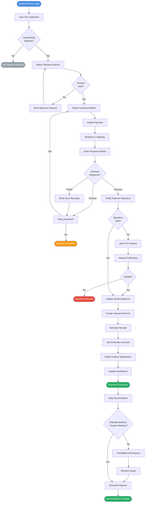
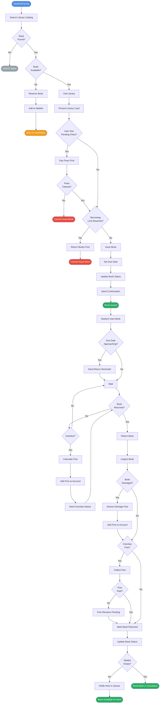
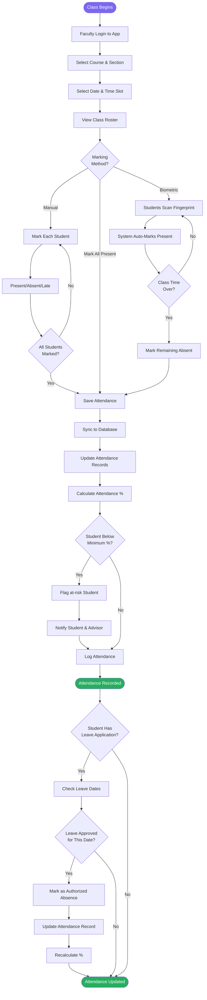
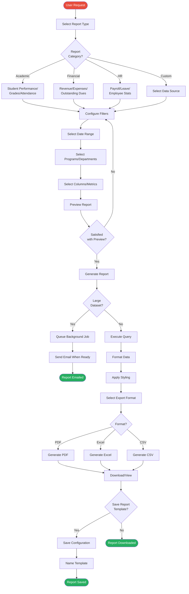

# EMIS - Business Process Flow & Activity Diagrams

## 1. Student Admission & Enrollment Process

### Overview
This flowchart shows the complete process from application submission to student enrollment.

## 2. Course Registration Process

## 3. Grade Submission & Processing

## 4. Fee Payment & Collection Process

## 5. Library Book Circulation

## 6. Attendance Marking Process

## 7. Report Generation Process

## Summary

This document provides detailed flowcharts and activity diagrams for 7 critical business processes:

1. **Student Admission & Enrollment**: End-to-end process from application to enrollment
2. **Course Registration**: Student course selection and enrollment workflow
3. **Grade Submission & Processing**: Faculty grade entry and GPA calculation
4. **Fee Payment & Collection**: Online payment processing and reconciliation
5. **Library Book Circulation**: Book issue and return process with fine management
6. **Attendance Marking**: Multiple methods of attendance tracking
7. **Report Generation**: Configurable report creation and export

Each diagram shows decision points, validation steps, error handling, and success/failure paths to guide implementation and testing.
