# EMIS - Business Process Flow & Activity Diagrams

## 1. Student Admission & Enrollment Process

### Overview
This flowchart shows the complete process from application submission to student enrollment.

```mermaid
flowchart TD
    Start([Prospective Student]) --> A1[Visit Website]
    A1 --> A2[Create Account]
    A2 --> A3[Fill Application Form]
    A3 --> A4{Complete All<br/>Required Fields?}
    A4 -->|No| A3
    A4 -->|Yes| A5[Upload Documents]
    A5 --> A6{Documents<br/>Valid?}
    A6 -->|No| A5
    A6 -->|Yes| A7[Pay Application Fee]
    A7 --> A8{Payment<br/>Successful?}
    A8 -->|No| A7
    A8 -->|Yes| A9[Submit Application]
    A9 --> A10[Receive Application Number]
    
    A10 --> B1[Admissions Office Reviews]
    B1 --> B2{Documents<br/>Complete?}
    B2 -->|No| B3[Request Additional Docs]
    B3 --> B4[Applicant Submits Docs]
    B4 --> B1
    
    B2 -->|Yes| B5[Evaluate Application]
    B5 --> B6[Enter Scores/Rating]
    B6 --> B7{Decision}
    
    B7 -->|Reject| C1[Send Rejection Email]
    C1 --> End1([Application Closed])
    
    B7 -->|Shortlist| D1[Add to Merit List]
    D1 --> D2[Invite for Interview/Test]
    D2 --> D3[Conduct Assessment]
    D3 --> D4{Pass Assessment?}
    D4 -->|No| C1
    D4 -->|Yes| D5[Offer Admission]
    
    D5 --> E1[Send Acceptance Letter]
    E1 --> E2[Student Accepts Offer]
    E2 --> E3[Pay Admission Fee]
    E3 --> E4{Payment<br/>Received?}
    E4 -->|No| E3
    E4 -->|Yes| E5[Create Student Record]
    E5 --> E6[Generate Student ID]
    E6 --> E7[Assign to Program & Batch]
    E7 --> E8[Create User Account]
    E8 --> E9[Send Welcome Email]
    E9 --> E10[Student Enrolled]
    E10 --> End2([Process Complete])
    
    style Start fill:#4A90E2,color:#fff
    style End1 fill:#E74C3C,color:#fff
    style End2 fill:#27AE60,color:#fff
    style A9 fill:#F39C12
    style B7 fill:#9B59B6,color:#fff
    style D4 fill:#9B59B6,color:#fff
    style E10 fill:#27AE60,color:#fff
```

## 2. Course Registration Process

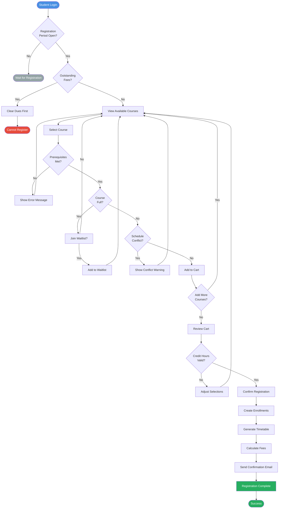

## 3. Grade Submission & Processing

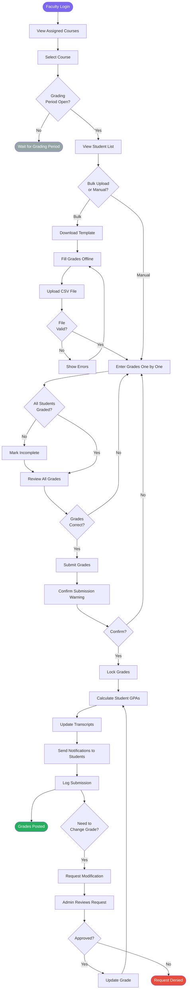

## 4. Fee Payment & Collection Process

## 5. Library Book Circulation

## 6. Attendance Marking Process

## 7. Report Generation Process

## 8. Graduation Application & Degree Conferral

The end-to-end process from student graduation application through degree conferral.

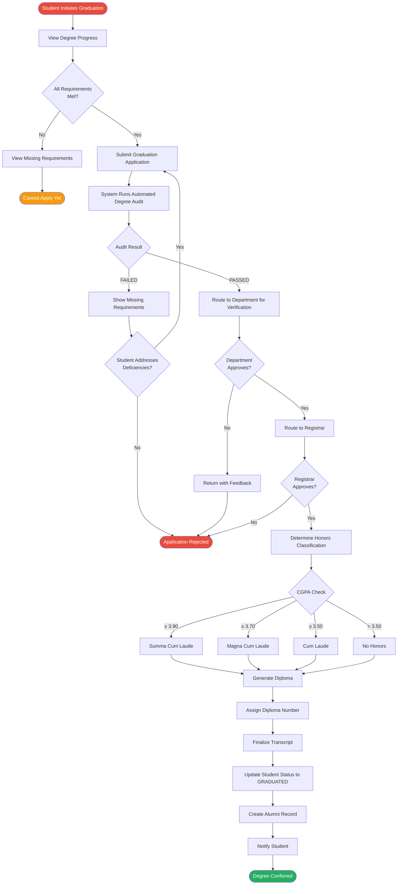

## 9. Disciplinary Case Processing

The workflow for handling student disciplinary incidents from report through resolution.

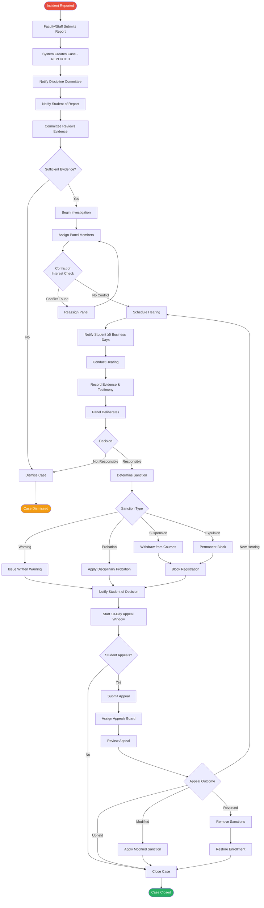

## 10. Grade Appeal & Revaluation

The multi-level grade appeal process with mandatory escalation.

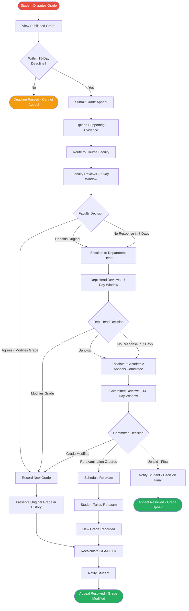

## 11. Faculty Recruitment Pipeline

The end-to-end faculty recruitment process from position creation to onboarding.

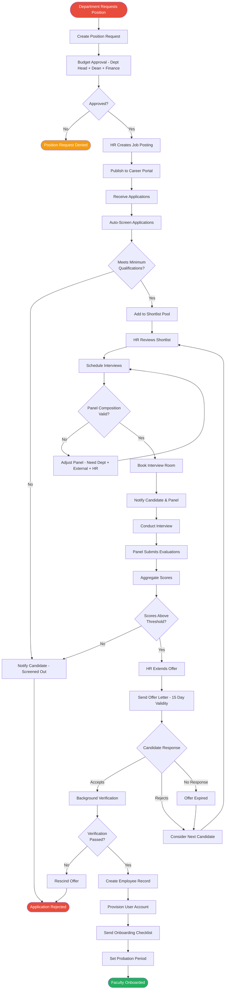

## 12. Academic Semester Lifecycle Management

The complete lifecycle of an academic semester from creation to archival.

```mermaid
flowchart TD
    Start([Admin Creates Semester]) --> A1[Set Semester Dates]
    A1 --> A2[Configure Registration Window]
    A2 --> A3[Set Add/Drop Deadline]
    A3 --> A4[Set Grading Window]
    A4 --> A5[Department Heads Configure Course Offerings]
    A5 --> A6[Assign Faculty to Sections]
    A6 --> A7[Set Room Assignments]
    A7 --> A8[Publish Course Catalog]
    A8 --> A9[Open Registration]
    A9 --> A10[Students Register for Courses]
    A10 --> A11{Registration\nWindow Closed?}
    A11 -->|No| A10
    A11 -->|Yes| A12[Activate Semester]
    A12 --> A13[Classes Begin]
    A13 --> A14[Add/Drop Period Active]
    A14 --> A15{Add/Drop\nDeadline Passed?}
    A15 -->|No| A14
    A15 -->|Yes| A16[Lock Enrollments]
    A16 --> A17[Regular Classes Continue]
    A17 --> A18[Enter Exam Period]
    A18 --> A19[Block Enrollment Changes]
    A19 --> A20[Conduct Exams]
    A20 --> A21[Open Grading Window]
    A21 --> A22[Faculty Submit Grades]
    A22 --> A23{All Grades\nSubmitted?}
    A23 -->|No| A24[Send Reminders to Faculty]
    A24 --> A22
    A23 -->|Yes| A25[Close Grading Window]
    A25 --> A26[Calculate GPA/CGPA for All Students]
    A26 --> A27[Determine Academic Standing]
    A27 --> A28[Generate Dean's List]
    A28 --> A29[Publish Results]
    A29 --> A30[Notify Students]
    A30 --> A31[Close Semester]
    A31 --> A32[Archive Semester Data]
    A32 --> End1([Semester Archived])

    style Start fill:#E74C3C,color:#fff
    style End1 fill:#27AE60,color:#fff
```

## 13. Transfer Credit Evaluation

The workflow for evaluating and approving transfer credits from external institutions.

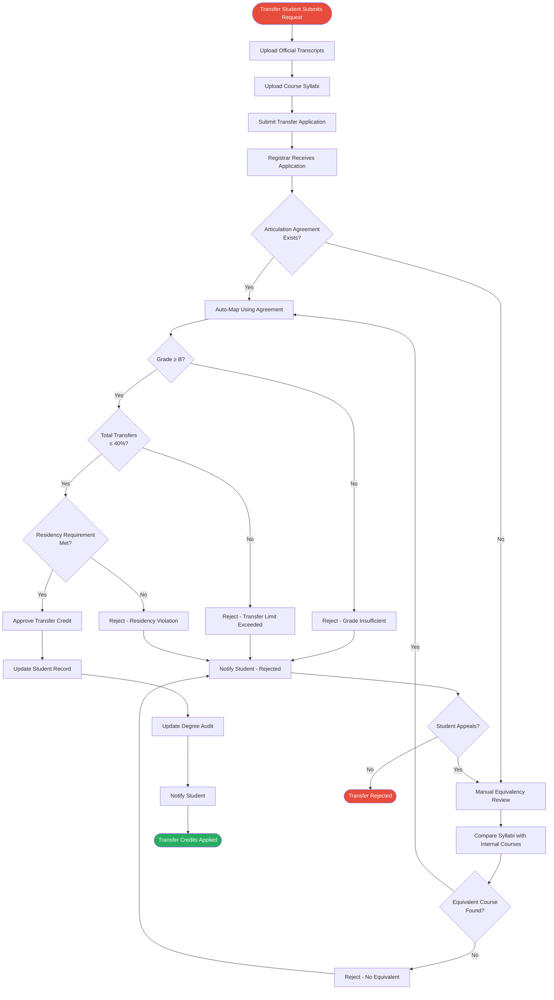

## 14. Scholarship Application & Lifecycle

The workflow for scholarship application, disbursement, and renewal.

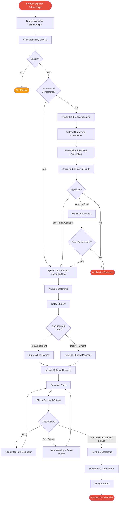

## 15. Student Admission to Enrollment

The complete workflow from admission cycle opening to student enrolled in semester with classroom and faculty assignments.

```mermaid
flowchart TD
    Start([Admin Opens Admission Cycle]) --> A1[Configure Cycle Details]
    A1 --> A2[Set Program, Dates, Seat Limit]
    A2 --> A3[Publish Cycle to Portal]
    A3 --> A4([Cycle Published])

    A4 --> B1[Student Visits Portal]
    B1 --> B2[Fill Application Form]
    B2 --> B3[Upload Documents]
    B3 --> B4[Pay Application Fee]
    B4 --> B5[Submit Application]
    B5 --> B6([Application Submitted])

    B6 --> C1[Admissions Reviews Application]
    C1 --> C2{Documents\nComplete?}
    C2 -->|No| C3[Request Additional Documents]
    C3 --> B3
    C2 -->|Yes| C4[Evaluate Application]
    C4 --> C5{Decision}
    C5 -->|Reject| C6[Send Rejection Notification]
    C6 --> End1([Application Rejected])
    C5 -->|Shortlist| C7[Shortlist Applicant]

    C7 --> D1{Entrance Exam\nRequired?}
    D1 -->|No| D8[Use Application Score]
    D1 -->|Yes| D2[Schedule Entrance Exam]
    D2 --> D3[Conduct Entrance Exam]
    D3 --> D4{Auto-Score\nEnabled?}
    D4 -->|Yes| D5[System Auto-Scores]
    D4 -->|No| D6[Manual Scoring]
    D5 --> D7[Finalize Scores]
    D6 --> D7
    D7 --> D8

    D8 --> E1[Generate Merit List]
    E1 --> E2[Assign Ranks Based on Scores]
    E2 --> E3[Calculate Cutoff Score]
    E3 --> E4[Publish Merit List]
    E4 --> E5{Student Rank\n≤ Seat Limit?}
    E5 -->|No| E6[Waitlist or Reject]
    E6 --> End2([Not Selected])
    E5 -->|Yes| E7[Send Admission Offer]

    E7 --> F1{Top N Merit\nStudent?}
    F1 -->|Yes| F2[Auto-Award Scholarship]
    F2 --> F3[Scholarship Linked to Student]
    F1 -->|No| F3

    F3 --> G1[Student Accepts Offer]
    G1 --> G2[Generate Fee Invoice]
    G2 --> G3{Scholarship\nAwarded?}
    G3 -->|Yes| G4[Auto-Deduct Scholarship from Invoice]
    G4 --> G5[Student Pays Remaining Balance]
    G3 -->|No| G5[Student Pays Full Invoice]
    G5 --> G6{All Bills\nCleared?}
    G6 -->|No| G7[Notify Outstanding Balance]
    G7 --> G5
    G6 -->|Yes| G8[Bills Cleared]

    G8 --> H1[Staff Initiates Conversion]
    H1 --> H2{Documents Verified\n& Offer Accepted?}
    H2 -->|No| H3[Return Error to Staff]
    H3 --> End3([Conversion Failed])
    H2 -->|Yes| H4[Create Student Record]
    H4 --> H5[Generate Student ID]
    H5 --> H6[Create Semester Enrollment]
    H6 --> H7[Assign Classroom]
    H7 --> H8[Assign Teachers to Subjects]
    H8 --> H9[Send Welcome Email]
    H9 --> End4([Student Enrolled])

    style Start fill:#4A90E2,color:#fff
    style A4 fill:#F39C12,color:#fff
    style B6 fill:#F39C12,color:#fff
    style End1 fill:#E74C3C,color:#fff
    style End2 fill:#E74C3C,color:#fff
    style End3 fill:#E74C3C,color:#fff
    style End4 fill:#27AE60,color:#fff
    style C5 fill:#9B59B6,color:#fff
    style E5 fill:#9B59B6,color:#fff
    style F1 fill:#9B59B6,color:#fff
    style G6 fill:#9B59B6,color:#fff
    style H2 fill:#9B59B6,color:#fff
```

## 16. Semester Progression & Repeat

The workflow for assigning students to next semester or repeating a previous semester.

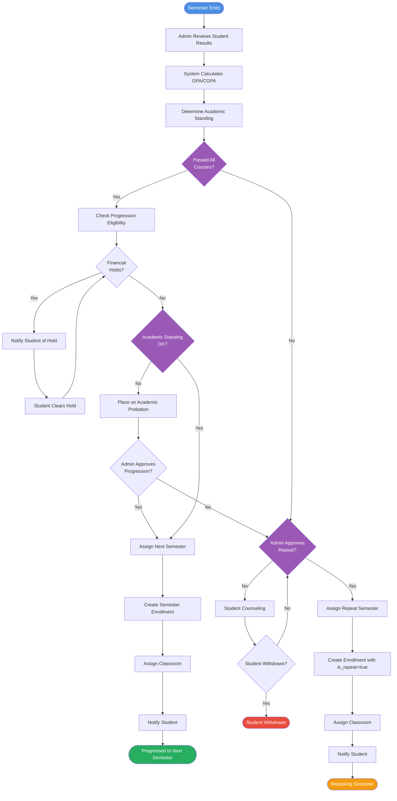

## Summary

This document provides detailed flowcharts and activity diagrams for 16 critical business processes:

1. **Student Admission & Enrollment**: End-to-end process from application to enrollment
2. **Course Registration**: Student course selection and enrollment workflow
3. **Grade Submission & Processing**: Faculty grade entry and GPA calculation
4. **Fee Payment & Collection**: Online payment processing and reconciliation
5. **Library Book Circulation**: Book issue and return process with fine management
6. **Attendance Marking**: Multiple methods of attendance tracking
7. **Report Generation**: Configurable report creation and export
8. **Graduation Application & Degree Conferral**: Student graduation through degree conferral and alumni record creation
9. **Disciplinary Case Processing**: Incident report through hearing, sanctions, and appeals
10. **Grade Appeal & Revaluation**: Multi-level grade appeal with escalation and re-examination
11. **Faculty Recruitment Pipeline**: Position creation through hiring and onboarding
12. **Academic Semester Lifecycle Management**: Semester creation through grading and archival
13. **Transfer Credit Evaluation**: External credit evaluation with articulation agreements
14. **Scholarship Application & Lifecycle**: Scholarship application, disbursement, and renewal
15. **Student Admission to Enrollment**: Complete admission cycle from opening through entrance exam, merit list, scholarship, payment, and conversion to enrolled student
16. **Semester Progression & Repeat**: Student progression to next semester or repeat assignment with eligibility checks

Each diagram shows decision points, validation steps, error handling, and success/failure paths to guide implementation and testing.
