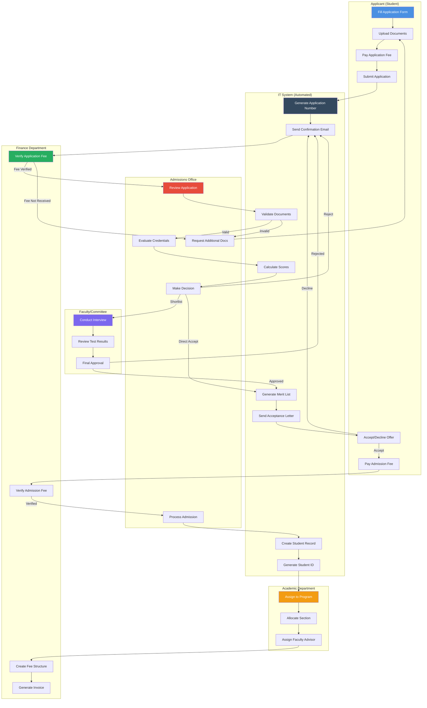
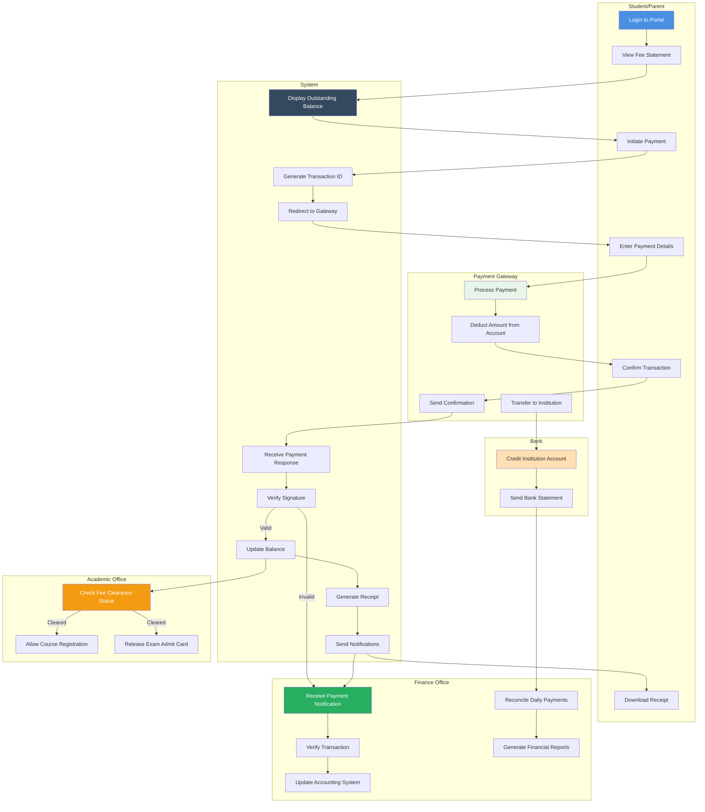
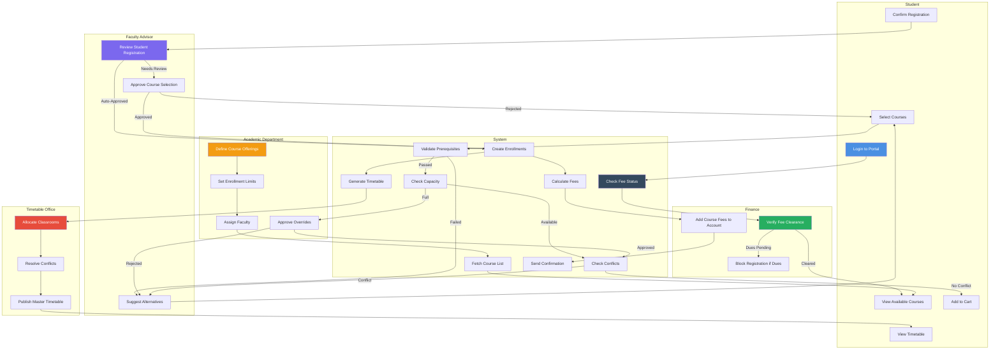
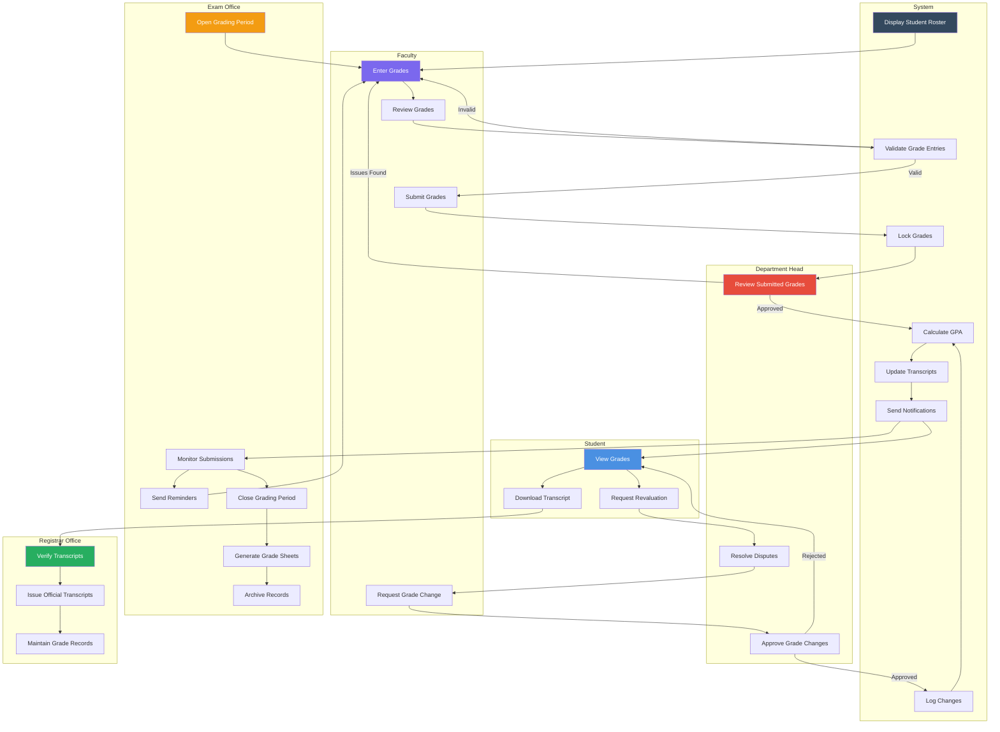
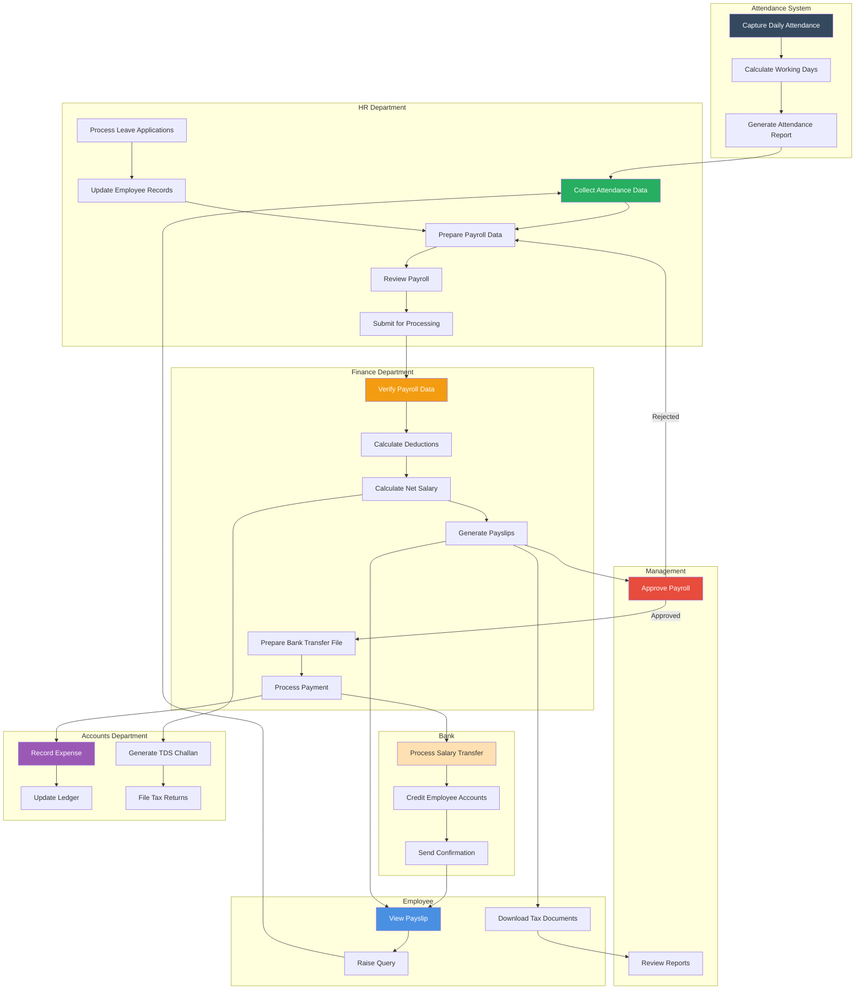
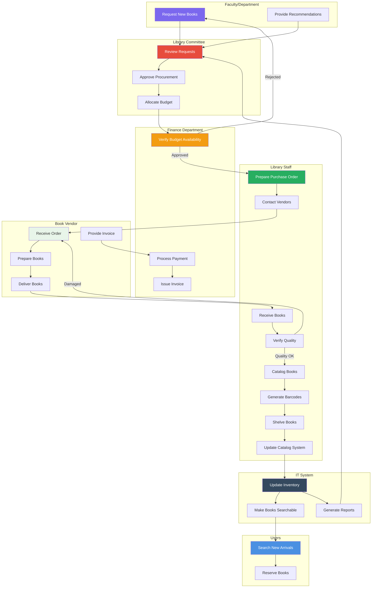

# EMIS - BPMN & Swimlane Diagrams

## 1. Student Admission Process (Cross-Department)

### Overview
This BPMN swimlane diagram shows how the admission process flows across different departments and actors.

## 2. Fee Payment & Collection Workflow

## 3. Course Registration Process (Multi-Department)

## 4. Grade Processing & Transcript Generation

## 5. Employee Payroll Processing

## 6. Library Book Procurement & Cataloging

## Summary

This document provides BPMN-style swimlane diagrams for 6 cross-departmental workflows:

1. **Student Admission Process**: Multi-stakeholder workflow from application to enrollment
2. **Fee Payment & Collection**: Payment processing across student, system, gateways, and finance
3.**Course Registration**: Complex workflow involving students, advisors, academics, and finance
4. **Grade Processing & Transcript Generation**: Grade submission, approval, and record-keeping
5. **Employee Payroll Processing**: Monthly payroll across HR, finance, and accounting
6. **Library Book Procurement & Cataloging**: Book acquisition workflow

Each diagram clearly shows:
- Responsibilities of each actor/department (swimlanes)
- Handoffs between departments
- Decision points and approvals
- System automation points
- Integration touchpoints

These diagrams are valuable for understanding dependencies, identifying bottlenecks, and defining department responsibilities.
