# EMIS - BPMN & Swimlane Diagrams

## 1. Student Admission Process (Cross-Department)

### Overview
This BPMN swimlane diagram shows how the admission process flows across different departments and actors.

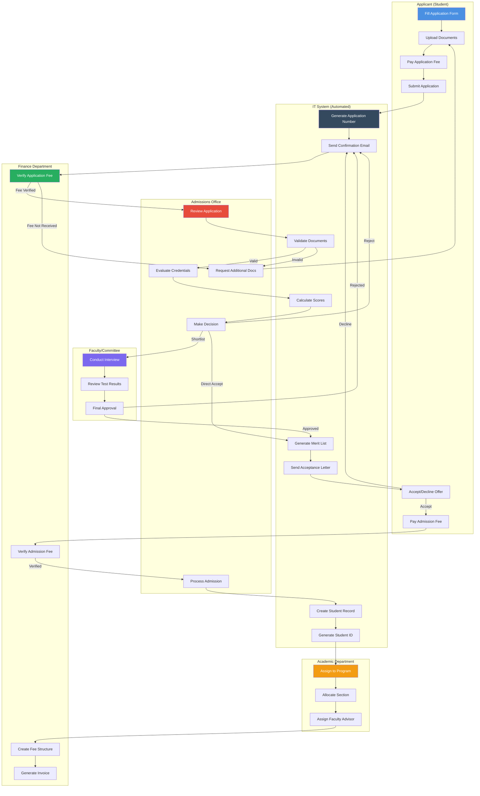

## 2. Fee Payment & Collection Workflow

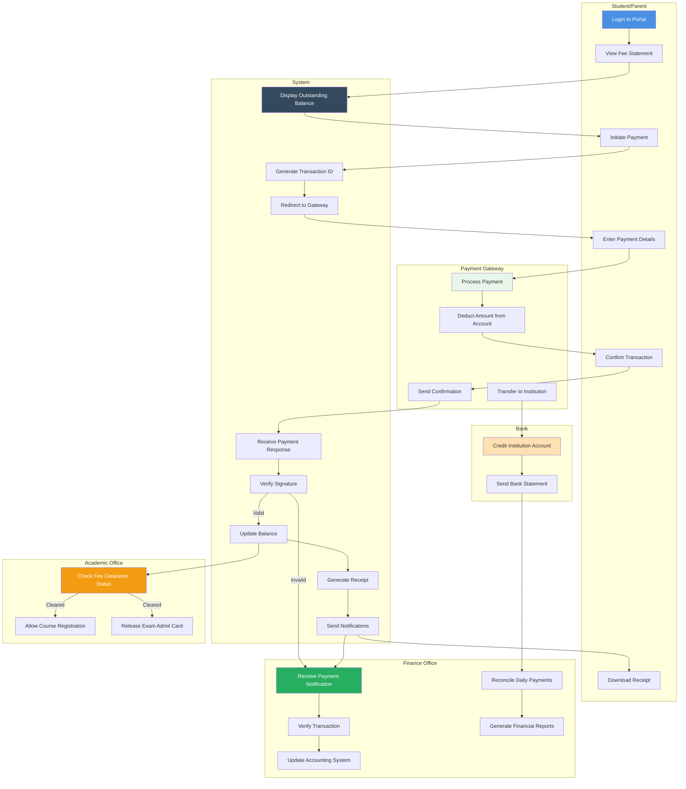

## 3. Course Registration Process (Multi-Department)

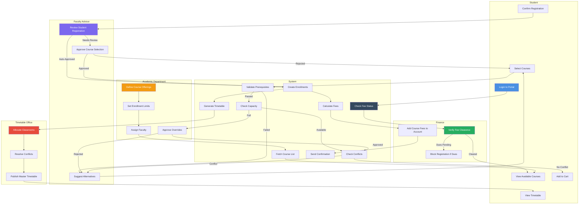

## 4. Grade Processing & Transcript Generation

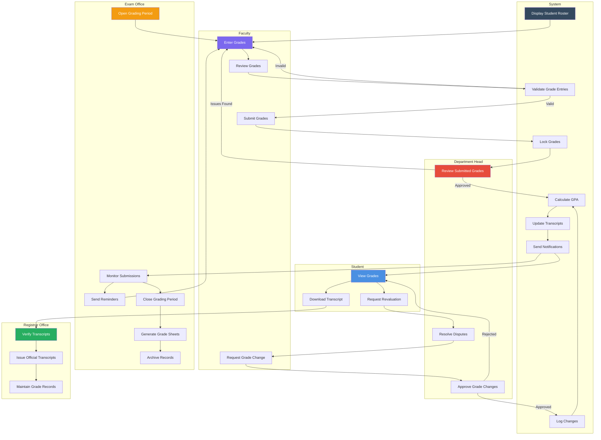

## 5. Employee Payroll Processing

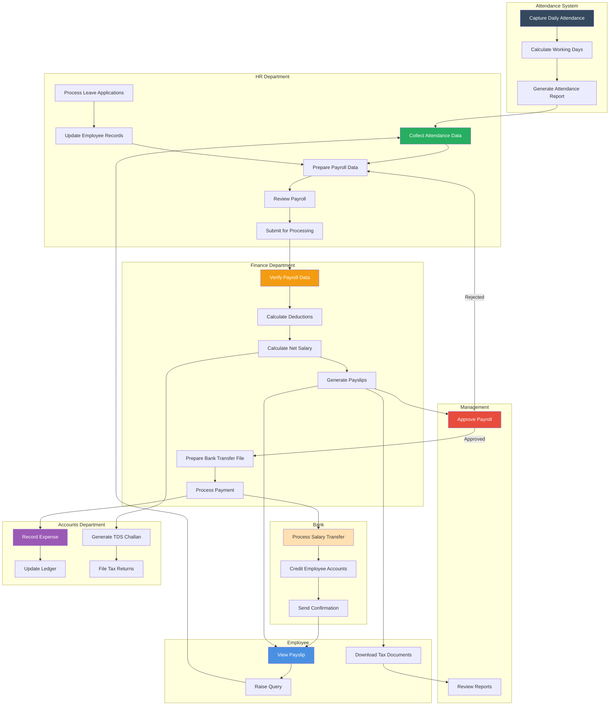

## 6. Library Book Procurement & Cataloging

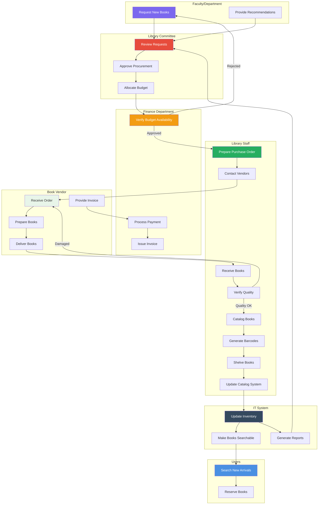

## 7. Graduation & Degree Conferral Process

Cross-departmental workflow for processing graduation applications.

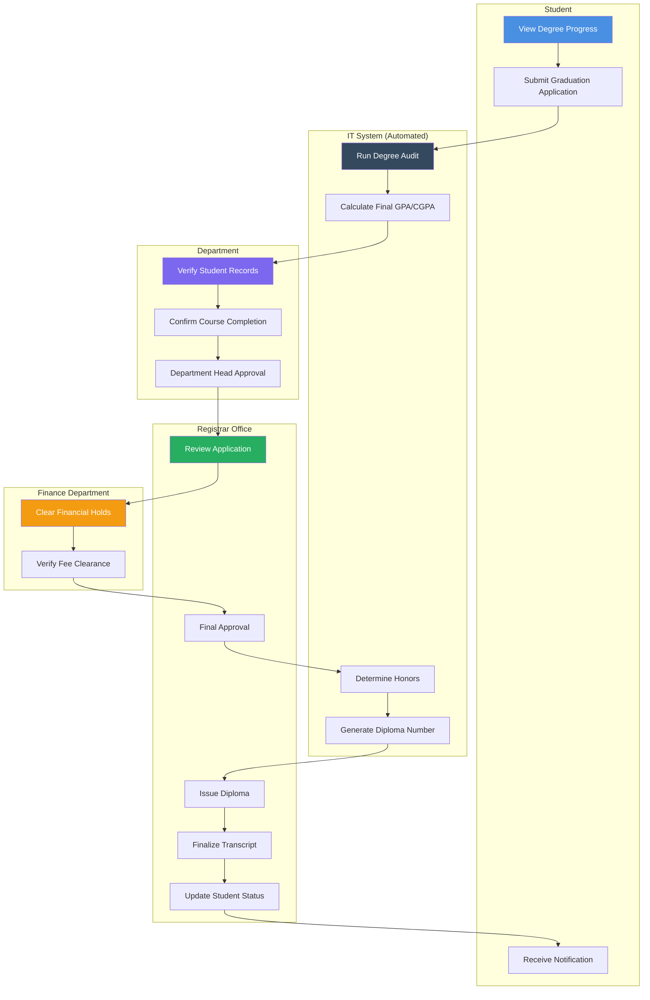

## 8. Faculty Recruitment & Onboarding Process

Cross-departmental workflow for hiring faculty from requisition to onboarding.

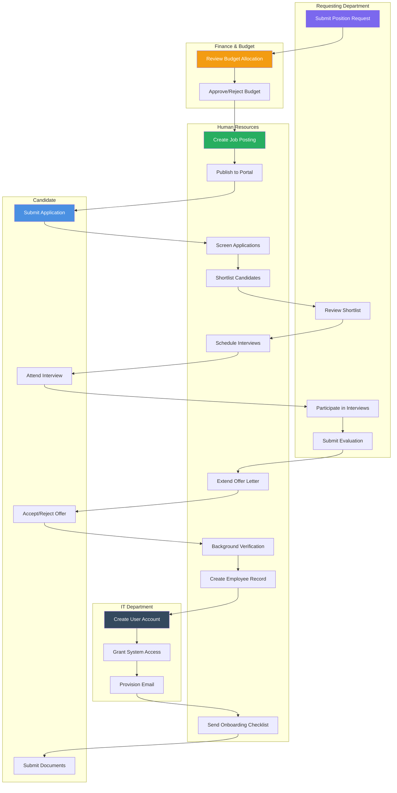

## 9. Disciplinary Case Adjudication Process

Cross-departmental workflow for handling student discipline cases.

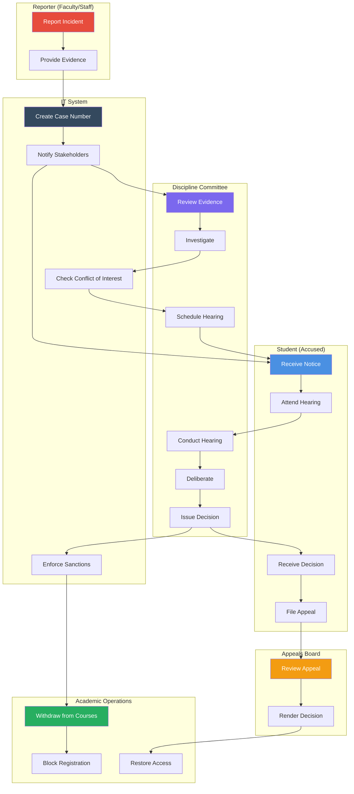

## 10. Academic Semester Lifecycle Process

Cross-departmental workflow for managing the complete semester lifecycle.

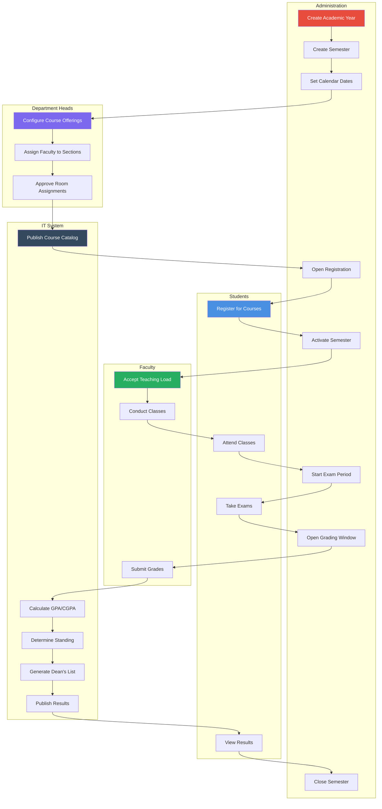

## 11. End-to-End Admission to Enrollment Process

Cross-departmental workflow covering the complete admission cycle from opening through student enrollment, including entrance examination, merit list, scholarship, payment, and conversion.

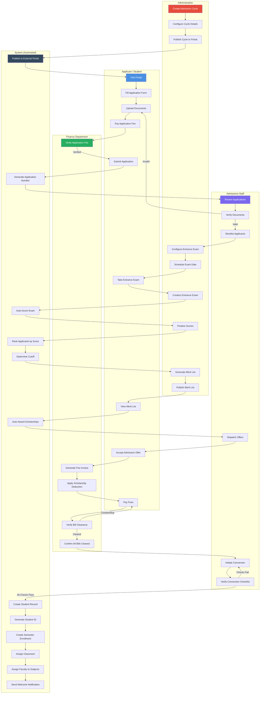

## Summary

This document provides BPMN-style swimlane diagrams for 11 cross-departmental workflows:

1. **Student Admission Process**: Multi-stakeholder workflow from application to enrollment
2. **Fee Payment & Collection**: Payment processing across student, system, gateways, and finance
3. **Course Registration**: Complex workflow involving students, advisors, academics, and finance
4. **Grade Processing & Transcript Generation**: Grade submission, approval, and record-keeping
5. **Employee Payroll Processing**: Monthly payroll across HR, finance, and accounting
6. **Library Book Procurement & Cataloging**: Book acquisition workflow
7. **Graduation & Degree Conferral Process**: Cross-departmental graduation application and diploma issuance
8. **Faculty Recruitment & Onboarding Process**: End-to-end faculty hiring from requisition to onboarding
9. **Disciplinary Case Adjudication Process**: Student discipline case handling with appeals workflow
10. **Academic Semester Lifecycle Process**: Complete semester management from creation to closure
11. **End-to-End Admission to Enrollment Process**: Complete admission cycle with entrance exam, merit list, scholarship auto-award, payment clearance, and applicant-to-student conversion across Admin, Applicant, Admissions, Finance, and System

Each diagram clearly shows:
- Responsibilities of each actor/department (swimlanes)
- Handoffs between departments
- Decision points and approvals
- System automation points
- Integration touchpoints

These diagrams are valuable for understanding dependencies, identifying bottlenecks, and defining department responsibilities.
