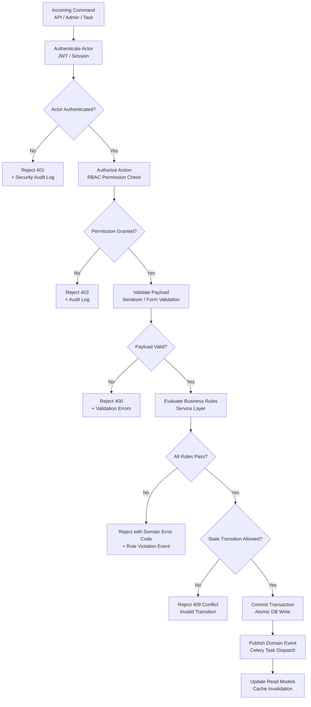

# Business Rules — Education Management Information System

**Version:** 1.0
**Status:** Approved
**Last Updated:** 2026-01-15

---

## Table of Contents

1. [Overview](#1-overview)
2. [Rule Evaluation Pipeline](#2-rule-evaluation-pipeline)
3. [Enforceable Rules by Domain](#3-enforceable-rules-by-domain)
4. [Exception and Override Handling](#4-exception-and-override-handling)
5. [Traceability Table](#5-traceability-table)
6. [Operational Policy Addendum](#6-operational-policy-addendum)

---

## 1. Overview

This document defines the enforceable business rules governing the Education Management Information System. Rules in this document are implemented in the service layer, enforced at every command-processing boundary (API, admin console, background jobs), and tested with dedicated unit/integration test suites.

**Domain focus:** Student academic lifecycle, enrollment, grading, finance, admissions, LMS, and HR workflows.
**Rule categories:** Lifecycle transitions, authorization, compliance, and resilience.
**Enforcement points:** DRF API views, service layer methods, Celery tasks, Django signals, and admin actions.

---

## 2. Rule Evaluation Pipeline

Every state-changing command passes through this pipeline before any database mutation is committed.

---

## 3. Enforceable Rules by Domain

### 3.1 Authentication and Access Control

**BR-AUTH-001:** Every request to a protected resource must carry a valid JWT Bearer token or active session cookie. Requests without valid credentials receive HTTP 401 with error code `UNAUTHENTICATED`.

**BR-AUTH-002:** Role-based access control (RBAC) is enforced at the permission level. Each role has an explicit allowlist of permitted actions; any action not in the allowlist is denied with HTTP 403 and error code `PERMISSION_DENIED`. There is no implicit permission escalation.

**BR-AUTH-003:** Account lockout triggers after 5 consecutive failed login attempts within a 10-minute window. Locked accounts require admin unlock or a 30-minute cooldown before retry. All lockout events are recorded in the security audit log.

**BR-AUTH-004:** JWT access tokens expire after 60 minutes. Refresh tokens expire after 7 days. A refresh token that has been used once is invalidated; the next refresh request must use the newly issued token (token rotation). Refresh tokens are invalidated immediately on password change or admin-forced logout.

**BR-AUTH-005:** API keys for external integrations are scoped to a specific role and resource set, cannot escalate beyond their assigned role, expire after 365 days, and are single-use-per-request (HMAC-signed). Every API key usage is logged.

**BR-AUTH-006:** Parent portal access to a student's records requires explicit student consent (for students over 18). Consent is recorded with timestamp and the consenting student's actor ID. Revoking consent takes effect immediately on the next request.

---

### 3.2 Student Enrollment and Registration

**BR-ENROLL-001:** A student may only register for courses during the open registration window for their current semester. The window is defined in the academic calendar and must be open (`AcademicCalendar.registration_open = True`) before any enrollment is accepted. Registrations submitted outside the window receive error code `REGISTRATION_WINDOW_CLOSED`.

**BR-ENROLL-002:** All prerequisite courses for a section must have been completed (status = `PASSED`) by the student before enrollment is allowed. Completed means a passing grade was recorded and the semester is closed. In-progress concurrent courses do not satisfy prerequisites. Violation returns `PREREQUISITES_NOT_MET` with the list of missing courses.

**BR-ENROLL-003:** A course section has a defined `max_enrollment` capacity. Enrollment is rejected when `current_enrollment >= max_enrollment`. The seat count is updated atomically using a `SELECT FOR UPDATE` lock to prevent race conditions. Violation returns `COURSE_CAPACITY_EXCEEDED`.

**BR-ENROLL-004:** Students may not enroll in two sections whose scheduled time slots overlap. The timetable conflict check runs against all the student's confirmed enrollments in the same semester. Violation returns `TIMETABLE_CONFLICT` with the conflicting section identifier.

**BR-ENROLL-005:** A student may not enroll in more than `program.max_credit_hours_per_semester` credit hours in a single semester, unless an approved credit overload exception is on record. Students may not enroll in fewer than `program.min_credit_hours_per_semester` without an approved underload exception. Violation returns `CREDIT_HOUR_LIMIT_EXCEEDED` or `CREDIT_HOUR_MINIMUM_NOT_MET`.

**BR-ENROLL-006:** A student with an outstanding financial hold (unpaid overdue invoices beyond 30 days) may not register for new courses. The hold is lifted automatically when the outstanding balance is cleared. Violation returns `FINANCIAL_HOLD_ACTIVE`.

**BR-ENROLL-007:** Course add/drop is permitted only during the defined add/drop period (a sub-window of the registration period, typically the first two weeks of a semester). Dropped courses within this window leave no grade record. Courses dropped after the add/drop window but before the late-drop deadline are recorded as `W` (Withdrawn) on the transcript. Drops after the late-drop deadline require department head approval and are recorded as `WF` (Withdrawn Failing).

**BR-ENROLL-008:** Applicant-to-student conversion requires all of the following: (a) application status = `ACCEPTED`, (b) all account section bills cleared (zero outstanding balance), (c) all required documents verified (status = `VERIFIED`), (d) offer letter accepted by the applicant. Conversion attempted with any condition unmet returns `CONVERSION_PREREQUISITES_NOT_MET` with the list of failing conditions.

**BR-ENROLL-009:** Semester progression is admin-driven: the system does not auto-progress students to the next semester. After a semester ends, the admin must explicitly assign each student to the next semester or a repeat semester. Students without an explicit assignment remain in `AWAITING_ASSIGNMENT` status and cannot register for courses.

**BR-ENROLL-010:** Semester repeat is permitted only if the student meets at least one of: (a) failed one or more courses in the semester (grade = `FAIL`), (b) attendance fell below the minimum threshold for the program, or (c) admin override with a documented reason. Repeat requests that meet none of these criteria are rejected with `REPEAT_NOT_ELIGIBLE`.

**BR-ENROLL-011:** Classroom assignment is mandatory during semester enrollment. A student cannot be enrolled in a semester without a classroom/section assignment. Enrollment attempted without a classroom returns `CLASSROOM_ASSIGNMENT_REQUIRED`.

---

### 3.3 Academic Operations

**BR-ACAD-001:** Faculty may submit grades only during the open grading window, defined per examination event. Once the grading window closes, grades are locked and require a formal grade amendment request (approved by department head) to modify. Grade submissions outside the window return `GRADING_WINDOW_CLOSED`.

**BR-ACAD-002:** GPA is calculated using the institution's configured grading scale (`GradeScale` table). The GPA is recalculated automatically when any grade for the student is published or amended. Cumulative GPA (CGPA) includes all completed semesters. The calculation is deterministic: given the same grades and grading scale, the result is always identical.

**BR-ACAD-003:** A student who falls below the minimum attendance threshold (configurable per program, default 75%) for a course receives an automated academic warning after the first breach, and an academic hold after the second consecutive breach. The hold prevents exam registration for that course. Hold removal requires department head approval with a documented reason.

**BR-ACAD-004:** Exam hall assignment must satisfy: `assigned_students <= hall.seating_capacity`. Room double-booking (same hall, same time slot) is prevented by a uniqueness constraint on `(exam_hall_id, exam_time_slot_id)`. Any exam schedule that would result in a student having two exams at the same time is rejected with `EXAM_SCHEDULE_CONFLICT`.

**BR-ACAD-005:** A transcript may only be issued in `FINAL` status after all enrolled courses for the student's completed semesters have received a grade. Semesters with any `INCOMPLETE` or `PENDING` grade prevent the transcript from being sealed. Students who have not completed all degree requirements receive an unofficial transcript only.

**BR-ACAD-006:** Program curriculum changes do not retroactively affect students who enrolled before the change. Existing students continue under the curriculum version active at their enrollment date. New curriculum versions are date-stamped and applied prospectively.

---

### 3.4 Finance and Payments

**BR-FIN-001:** Fee invoices are generated automatically per student per semester, based on the `FeeStructure` version active at the student's enrollment date for that semester. Fee structure changes after invoice generation do not modify existing invoices; an adjustment invoice must be issued explicitly.

**BR-FIN-002:** All online payments are processed using an idempotency key derived from `(invoice_id, payment_attempt_id)`. Duplicate payment requests with the same idempotency key return the original response without re-charging the payment method. Duplicate detection window is 24 hours.

**BR-FIN-003:** A payment is not considered confirmed until the payment gateway issues a confirmed webhook event. A pending payment (gateway session created but no confirmation) does not reduce the outstanding balance. If no confirmation is received within 30 minutes, the pending payment session expires and the invoice returns to `UNPAID` status.

**BR-FIN-004:** Refunds may only be issued for invoices in `PAID` or `OVERPAID` status. Refund amount may not exceed the amount paid minus any applicable non-refundable fee heads. Refunds require finance officer authorization. All refund transactions are recorded in the audit log with authorizer identity and reason.

**BR-FIN-005:** Installment plans define fixed due dates. A missed installment triggers an automated late payment penalty (configurable percentage) added as a separate invoice line item. Penalties are applied once per overdue installment, not compounding daily.

**BR-FIN-006:** Scholarship and discount application reduces the invoice total on the relevant fee heads only. Scholarships cannot reduce an invoice below zero. If a scholarship is revoked, an adjustment invoice for the difference is issued. Retroactive scholarship application requires finance head approval.

---

### 3.5 Admissions

**BR-ADM-001:** Online applications are accepted only while the application window is open for the target program and intake year. Applications submitted outside the window are rejected with `APPLICATION_WINDOW_CLOSED`. Application window dates are managed via the `AdmissionCycle` model.

**BR-ADM-002:** Merit list generation uses the configured ranking criteria for the program (e.g., weighted score of entrance test, academic grades). All accepted applicants must appear in the merit list with a rank. Manual additions to the merit list require director-level approval and are flagged in the audit log.

**BR-ADM-003:** An accepted applicant has `enrollment_deadline` days from the acceptance date to complete enrollment (pay the admission fee and submit required documents). Failure to enroll by the deadline moves the applicant to `EXPIRED` status and the seat is released for the next merit list candidate.

**BR-ADM-004:** Required documents must be verified (status = `VERIFIED`) before final enrollment is completed. Document verification is performed by the admissions officer. Enrollment with `PENDING` or `REJECTED` documents returns `DOCUMENT_VERIFICATION_PENDING`.

**BR-ADM-005:** Admission cycle must have `open_date < close_date`; only one admission cycle may be in `ACTIVE` status per program at a time. Attempting to activate a second cycle for the same program returns `ADMISSION_CYCLE_CONFLICT`. Cycle dates are managed via the `AdmissionCycle` model.

**BR-ADM-006:** Admission open notice is only visible to users who are NOT currently enrolled students of the institution. The public portal filters admission notices based on user enrollment status; authenticated students with an active enrollment see no admission notices. Unauthenticated visitors and prospective applicants see all active admission notices.

**BR-ADM-007:** Merit list generation requires all entrance exam scores to be finalized (status = `FINALIZED`) before the merit list can be generated. No partial merit lists are allowed. Attempting to generate a merit list with any pending scores returns `EXAM_SCORES_NOT_FINALIZED`.

**BR-ADM-008:** Scholarship auto-award from the merit list requires all of the following: (a) merit list is finalized and published, (b) scholarship program is configured with number of seats and award amount, (c) the student does not already hold an active scholarship for the same program. Auto-award is executed only after the admin confirms the auto-award configuration. Violation returns `SCHOLARSHIP_AUTO_AWARD_BLOCKED` with the specific failing condition.

---

### 3.6 Learning Management System (LMS)

**BR-LMS-001:** Assignment submissions are accepted only before the `due_datetime`. After the deadline, submissions are accepted with a `late` flag if the faculty has enabled late submissions for the assignment. The late submission window and penalty (percentage deduction) are configured per assignment. After the late window closes, submissions are rejected with `ASSIGNMENT_SUBMISSION_CLOSED`.

**BR-LMS-002:** Each quiz has a configurable `max_attempts` limit per student. After `max_attempts` is reached, the quiz is locked for that student with status `ATTEMPTS_EXHAUSTED`. The highest or latest attempt score is used for grade calculation, per the assignment configuration.

**BR-LMS-003:** Quiz auto-grading runs immediately upon submission for objective question types (MCQ, True/False). Subjective question types (short answer, essay) are flagged for manual grading by the faculty. Auto-graded scores are marked as `PROVISIONAL` until the faculty confirms or adjusts them.

**BR-LMS-004:** Course content is only visible to students enrolled in the course section. Content marked as `DRAFT` is only visible to the faculty member and course admin. Published content becomes visible to enrolled students immediately upon publish; scheduled content becomes visible at the configured `visible_from` datetime.

---

### 3.7 HR and Payroll

**BR-HR-001:** Leave applications must be submitted before the requested leave start date. Retroactive leave applications (for past dates) require department head approval and are flagged in the audit log.

**BR-HR-002:** An employee's approved leave balance for each leave type (casual, sick, earned) is checked before leave approval. Leave requests that would result in a negative balance are flagged for manager review. Sick leave may be granted in negative balance with HR head approval, up to a configurable limit.

**BR-HR-003:** Payroll processing for a pay period is locked once it enters `PROCESSING` status. No salary component changes, leave adjustments, or new attendance records may affect a payroll that is in processing. The payroll must be rolled back to `DRAFT` status to accept amendments. Payroll in `APPROVED` status is immutable.

**BR-HR-004:** Payslips are generated and delivered to employees only after payroll reaches `APPROVED` status. Payslip PDFs are signed with the HR head's digital signature. Re-issuance of a payslip for an amended payroll generates a new version and notifies the employee.

---

### 3.8 Academic Session & Semester Management

#### BR-SESSION-001 — Academic Year Activation

| Attribute | Detail |
|---|---|
| **Rule ID** | BR-SESSION-001 |
| **Domain** | Academic Session & Semester Management |
| **Statement** | When an admin activates a new academic year, the system must verify that only one academic year is ACTIVE at any time. Activating a new year requires the previous year to be in COMPLETED status. |
| **Trigger** | Admin activates academic year |
| **Preconditions** | Previous academic year is in COMPLETED status; no other year is currently ACTIVE |
| **Postconditions** | The new academic year is ACTIVE; the previous year remains COMPLETED |
| **Exception / Override** | SUPER_ADMIN may override with documented justification |
| **Enforcement Point** | Service layer — `academic/services.py` |
| **Test Tag** | `@br_session_001` |
| **Error Code** | `ACADEMIC_YEAR_CONFLICT` (409) |

#### BR-SESSION-002 — Semester State Transitions

| Attribute | Detail |
|---|---|
| **Rule ID** | BR-SESSION-002 |
| **Domain** | Academic Session & Semester Management |
| **Statement** | When an admin changes a semester's status, the system must enforce the strict lifecycle: PLANNING → REGISTRATION_OPEN → ACTIVE → EXAM_PERIOD → GRADING → COMPLETED → ARCHIVED. Backward transitions are not allowed. |
| **Trigger** | Admin changes semester status |
| **Preconditions** | Semester exists in a valid current state |
| **Postconditions** | Semester status is updated to the next valid state in the lifecycle |
| **Exception / Override** | SUPER_ADMIN may perform backward transitions with documented justification |
| **Enforcement Point** | Service layer — `academic/services.py` |
| **Test Tag** | `@br_session_002` |
| **Error Code** | `INVALID_SEMESTER_TRANSITION` (422) |

#### BR-SESSION-003 — Blackout Period Enforcement

| Attribute | Detail |
|---|---|
| **Rule ID** | BR-SESSION-003 |
| **Domain** | Academic Session & Semester Management |
| **Statement** | When the system detects an active blackout period, it must block restricted operations: during exam periods, course enrollment modifications are blocked; during registration week, no system maintenance is scheduled; during the grading window, grade submission is open, and after the window closes, grades are locked. |
| **Trigger** | Any operation attempted during a configured blackout period |
| **Preconditions** | A blackout period is configured and currently active |
| **Postconditions** | Restricted operations are rejected; permitted operations proceed normally |
| **Exception / Override** | SUPER_ADMIN may bypass blackout restrictions for emergency operations |
| **Enforcement Point** | Service layer — `academic/services.py` |
| **Test Tag** | `@br_session_003` |
| **Error Code** | `BLACKOUT_PERIOD_ACTIVE` (403) |

#### BR-SESSION-004 — Semester Closure Prerequisites

| Attribute | Detail |
|---|---|
| **Rule ID** | BR-SESSION-004 |
| **Domain** | Academic Session & Semester Management |
| **Statement** | When an admin attempts to transition a semester to COMPLETED, the system must verify that all course sections have submitted grades, all incomplete grades are resolved or converted to F after 30 days, and all attendance records are finalized. |
| **Trigger** | Admin attempts semester closure |
| **Preconditions** | Semester is in GRADING status |
| **Postconditions** | Semester transitions to COMPLETED; all records are finalized and locked |
| **Exception / Override** | Registrar may force-close with Dean approval, logging all unresolved items |
| **Enforcement Point** | Service layer — `academic/services.py` |
| **Test Tag** | `@br_session_004` |
| **Error Code** | `SEMESTER_CLOSURE_BLOCKED` (422) |

---

### 3.9 Graduation & Degree Conferral

#### BR-GRAD-001 — Graduation Eligibility Verification

| Attribute | Detail |
|---|---|
| **Rule ID** | BR-GRAD-001 |
| **Domain** | Graduation & Degree Conferral |
| **Statement** | When a student applies for graduation or the registrar runs a degree audit, the system must verify ALL of the following: total credits ≥ program requirement, all required courses completed with passing grade, CGPA ≥ program minimum (default 2.0), no active financial holds, no active disciplinary holds, and no incomplete/pending grades. |
| **Trigger** | Student applies for graduation or registrar runs degree audit |
| **Preconditions** | Student is in active enrollment status with a declared program |
| **Postconditions** | Student is marked as graduation-eligible or receives a detailed deficiency report |
| **Exception / Override** | Academic Board may grant exception for individual requirements with documented justification |
| **Enforcement Point** | Service layer — `graduation/services.py` |
| **Test Tag** | `@br_grad_001` |
| **Error Code** | `GRADUATION_ELIGIBILITY_FAILED` (422) |

#### BR-GRAD-002 — Degree Audit Completeness

| Attribute | Detail |
|---|---|
| **Rule ID** | BR-GRAD-002 |
| **Domain** | Graduation & Degree Conferral |
| **Statement** | When a degree audit is performed, the system must check: core courses completion, elective credits, lab/practical requirements, thesis/capstone (if required), internship hours (if required), and minimum residency credits (at least 60% completed at the institution). |
| **Trigger** | Graduation application or manual audit request |
| **Preconditions** | Student has a declared program with defined curriculum requirements |
| **Postconditions** | Audit report is generated with pass/fail status for each requirement category |
| **Exception / Override** | Department Head may waive individual requirements with Academic Board approval |
| **Enforcement Point** | Service layer — `graduation/services.py` |
| **Test Tag** | `@br_grad_002` |
| **Error Code** | `DEGREE_AUDIT_INCOMPLETE` (422) |

#### BR-GRAD-003 — Honors Classification

| Attribute | Detail |
|---|---|
| **Rule ID** | BR-GRAD-003 |
| **Domain** | Graduation & Degree Conferral |
| **Statement** | When graduation is approved, the system must automatically assign honors based on CGPA: Summa Cum Laude (CGPA ≥ 3.90), Magna Cum Laude (CGPA ≥ 3.70), Cum Laude (CGPA ≥ 3.50). Student must have no disciplinary sanctions and minimum 75% credits from the institution. |
| **Trigger** | Graduation approval |
| **Preconditions** | Student has been verified as graduation-eligible |
| **Postconditions** | Honors classification is recorded on the student's graduation record and transcript |
| **Exception / Override** | No override — purely formulaic based on CGPA and eligibility criteria |
| **Enforcement Point** | Service layer — `graduation/services.py` |
| **Test Tag** | `@br_grad_003` |
| **Error Code** | N/A (computed classification) |

#### BR-GRAD-004 — Diploma Number Uniqueness

| Attribute | Detail |
|---|---|
| **Rule ID** | BR-GRAD-004 |
| **Domain** | Graduation & Degree Conferral |
| **Statement** | When a diploma is generated, the system must assign a globally unique diploma number (format: DIP-YYYY-XXXXXX). Once issued, diploma records are immutable. Replacement diplomas receive new numbers referencing the original. |
| **Trigger** | Diploma generation upon graduation conferral |
| **Preconditions** | Student graduation has been approved and conferral is authorized |
| **Postconditions** | Diploma record is created with a unique number; record is immutable |
| **Exception / Override** | No override for uniqueness; replacement diplomas are new records referencing the original |
| **Enforcement Point** | Database unique constraint + `graduation/services.py` |
| **Test Tag** | `@br_grad_004` |
| **Error Code** | `DIPLOMA_NUMBER_CONFLICT` (409) |

#### BR-GRAD-005 — Degree Revocation

| Attribute | Detail |
|---|---|
| **Rule ID** | BR-GRAD-005 |
| **Domain** | Graduation & Degree Conferral |
| **Statement** | When the Academic Board decides to revoke a degree, the system must record the revocation through formal proceedings with evidence of academic fraud, falsified records, or violation of academic integrity. The original diploma number is invalidated and the revocation is logged immutably. |
| **Trigger** | Academic Board decision following formal proceedings |
| **Preconditions** | Formal investigation completed with documented evidence; SUPER_ADMIN + Academic Board approval obtained |
| **Postconditions** | Degree status is set to REVOKED; diploma number is invalidated; immutable audit log entry is created |
| **Exception / Override** | Requires SUPER_ADMIN + Academic Board approval; no further override available |
| **Enforcement Point** | Service layer — `graduation/services.py` |
| **Test Tag** | `@br_grad_005` |
| **Error Code** | N/A (administrative action only) |

---

### 3.10 Student Discipline & Conduct

#### BR-DISC-001 — Case Assignment and Conflict of Interest

| Attribute | Detail |
|---|---|
| **Rule ID** | BR-DISC-001 |
| **Domain** | Student Discipline & Conduct |
| **Statement** | When a disciplinary case is created and panel members are assigned, the system must verify that no committee member has a conflict of interest with the accused student (not the student's advisor, not a relative, not involved in the incident). Self-declaration of no conflict is required. |
| **Trigger** | Case creation and panel assignment |
| **Preconditions** | Disciplinary case has been filed with sufficient documentation |
| **Postconditions** | Panel is assigned with verified no-conflict declarations from all members |
| **Exception / Override** | Dean of Students may approve a panel member with a declared minor conflict if no alternative is available, with documented justification |
| **Enforcement Point** | Service layer — `discipline/services.py` |
| **Test Tag** | `@br_disc_001` |
| **Error Code** | `CONFLICT_OF_INTEREST_DETECTED` (422) |

#### BR-DISC-002 — Hearing Notice Period

| Attribute | Detail |
|---|---|
| **Rule ID** | BR-DISC-002 |
| **Domain** | Student Discipline & Conduct |
| **Statement** | When a hearing is scheduled, the system must ensure students receive at least 5 business days notice before the hearing. The notice must include: charges, date/time/location, right to representation, and right to present evidence. |
| **Trigger** | Hearing scheduling |
| **Preconditions** | Disciplinary case is filed and panel is assigned |
| **Postconditions** | Hearing is scheduled with confirmed delivery of notice to the student; notice period is validated |
| **Exception / Override** | Emergency cases (threat to campus safety) may proceed with 2 business days notice with Dean of Students approval |
| **Enforcement Point** | Service layer — `discipline/services.py` |
| **Test Tag** | `@br_disc_002` |
| **Error Code** | `INSUFFICIENT_NOTICE_PERIOD` (422) |

#### BR-DISC-003 — Sanction Enforcement

| Attribute | Detail |
|---|---|
| **Rule ID** | BR-DISC-003 |
| **Domain** | Student Discipline & Conduct |
| **Statement** | When a hearing decision is rendered or an appeal outcome is finalized, sanctions take effect immediately (unless appealed with stay). Suspension automatically: withdraws the student from current courses with "W" grade, blocks future registration, and deactivates campus access. Expulsion additionally: permanently blocks re-enrollment. |
| **Trigger** | Hearing decision or appeal outcome |
| **Preconditions** | Hearing has been conducted with proper notice and due process |
| **Postconditions** | Sanctions are applied; enrollment records are updated; campus access is modified; notification is sent to relevant departments |
| **Exception / Override** | Appeal with stay suspends sanction enforcement until appeal is resolved |
| **Enforcement Point** | Service layer — `discipline/services.py` + `courses/services.py` |
| **Test Tag** | `@br_disc_003` |
| **Error Code** | N/A (automated side effects on enrollment and access) |

#### BR-DISC-004 — Appeal Window

| Attribute | Detail |
|---|---|
| **Rule ID** | BR-DISC-004 |
| **Domain** | Student Discipline & Conduct |
| **Statement** | When a student submits an appeal, the system must verify the appeal is filed within 10 business days from decision notification. Appeals filed after the window are automatically rejected unless the student can demonstrate extraordinary circumstances. |
| **Trigger** | Appeal submission |
| **Preconditions** | Disciplinary decision has been rendered and student has been notified |
| **Postconditions** | Appeal is accepted for review or rejected if outside the window |
| **Exception / Override** | Dean of Students may accept late appeals upon demonstration of extraordinary circumstances |
| **Enforcement Point** | Service layer — `discipline/services.py` |
| **Test Tag** | `@br_disc_004` |
| **Error Code** | `APPEAL_WINDOW_CLOSED` (403) |

#### BR-DISC-005 — Record Retention and Sealing

| Attribute | Detail |
|---|---|
| **Rule ID** | BR-DISC-005 |
| **Domain** | Student Discipline & Conduct |
| **Statement** | The system must enforce record retention policies: warning records are sealed after 2 years, probation records are sealed after graduation, suspension and expulsion records are permanent. Sealed records are invisible to standard queries but available to SUPER_ADMIN. |
| **Trigger** | Scheduled retention job (daily/weekly background task) |
| **Preconditions** | Retention period has elapsed for the applicable record type |
| **Postconditions** | Eligible records are sealed and excluded from standard queries; SUPER_ADMIN access is preserved |
| **Exception / Override** | SUPER_ADMIN may unseal records for compliance or legal review |
| **Enforcement Point** | Background task — `discipline/tasks.py` |
| **Test Tag** | `@br_disc_005` |
| **Error Code** | N/A (background process) |

---

### 3.11 Academic Standing

#### BR-STANDING-001 — Standing Determination

| Attribute | Detail |
|---|---|
| **Rule ID** | BR-STANDING-001 |
| **Domain** | Academic Standing |
| **Statement** | When semester grades are finalized, the system must calculate academic standing based on semester GPA and CGPA: Good Standing (CGPA ≥ 2.0), Academic Warning (semester GPA < 2.0 but CGPA ≥ 2.0, first occurrence), Academic Probation (CGPA < 2.0 or second consecutive warning), Academic Suspension (CGPA < 1.5 or two consecutive probation semesters), Academic Dismissal (CGPA < 1.0 or return from suspension with CGPA still < 2.0). |
| **Trigger** | Semester grade finalization |
| **Preconditions** | All grades for the semester have been submitted and finalized |
| **Postconditions** | Academic standing is updated for each student; notifications are sent for standing changes |
| **Exception / Override** | No override for the calculation itself; standing is purely formulaic |
| **Enforcement Point** | Service layer — `academic/services.py` |
| **Test Tag** | `@br_standing_001` |
| **Error Code** | N/A (automated calculation) |

#### BR-STANDING-002 — Probation Restrictions

| Attribute | Detail |
|---|---|
| **Rule ID** | BR-STANDING-002 |
| **Domain** | Academic Standing |
| **Statement** | When a student on Academic Probation attempts to register for courses, the system must enforce: maximum 12 credit hours per semester (reduced from normal max), mandatory meeting with academic advisor before registration, and semester GPA ≥ 2.5 requirement to return to Good Standing. |
| **Trigger** | Registration attempt by a student with probationary standing |
| **Preconditions** | Student's academic standing is Academic Probation |
| **Postconditions** | Registration is limited to 12 credit hours; advisor meeting is required before enrollment is confirmed |
| **Exception / Override** | Academic Advisor may approve up to 15 credit hours with Department Head approval |
| **Enforcement Point** | Service layer — `courses/services.py` |
| **Test Tag** | `@br_standing_002` |
| **Error Code** | `CREDIT_LIMIT_PROBATION` (422) |

#### BR-STANDING-003 — Dean's List Eligibility

| Attribute | Detail |
|---|---|
| **Rule ID** | BR-STANDING-003 |
| **Domain** | Academic Standing |
| **Statement** | When a semester is closed, the system must automatically determine Dean's List eligibility: semester GPA ≥ 3.50, minimum 12 credit hours completed in the semester, no incomplete grades, and no disciplinary sanctions during the semester. |
| **Trigger** | Semester closure |
| **Preconditions** | All grades for the semester are finalized; disciplinary records are up to date |
| **Postconditions** | Eligible students are added to the Dean's List; results are published in semester results |
| **Exception / Override** | No override — purely formulaic based on criteria |
| **Enforcement Point** | Service layer — `academic/services.py` |
| **Test Tag** | `@br_standing_003` |
| **Error Code** | N/A (computed list) |

#### BR-STANDING-004 — Maximum Time-to-Degree

| Attribute | Detail |
|---|---|
| **Rule ID** | BR-STANDING-004 |
| **Domain** | Academic Standing |
| **Statement** | When a student attempts to register beyond the maximum program duration (1.5× standard duration, e.g., 6 years for a 4-year program), the system must block registration. Extension requires petition to the Academic Board with justification. Maximum one extension of 2 additional semesters. |
| **Trigger** | Registration attempt beyond maximum duration |
| **Preconditions** | Student's enrollment duration has exceeded 1.5× the standard program duration |
| **Postconditions** | Registration is blocked; student is notified of the requirement to petition for extension |
| **Exception / Override** | Academic Board may approve one extension of up to 2 additional semesters |
| **Enforcement Point** | Service layer — `courses/services.py` |
| **Test Tag** | `@br_standing_004` |
| **Error Code** | `MAX_DURATION_EXCEEDED` (422) |

---

### 3.12 Grade Appeal

#### BR-APPEAL-001 — Appeal Filing Deadline

| Attribute | Detail |
|---|---|
| **Rule ID** | BR-APPEAL-001 |
| **Domain** | Grade Appeal |
| **Statement** | When a student submits a grade appeal, the system must verify it is filed within 15 calendar days of grade publication. Late appeals are rejected with a clear error message showing the deadline date. |
| **Trigger** | Student submits grade appeal |
| **Preconditions** | Grade has been published for the course |
| **Postconditions** | Appeal is accepted for review or rejected if past the deadline |
| **Exception / Override** | Department Head may accept late appeals with documented extraordinary circumstances |
| **Enforcement Point** | Service layer — `appeals/services.py` |
| **Test Tag** | `@br_appeal_001` |
| **Error Code** | `APPEAL_DEADLINE_PASSED` (403) |

#### BR-APPEAL-002 — Escalation Path

| Attribute | Detail |
|---|---|
| **Rule ID** | BR-APPEAL-002 |
| **Domain** | Grade Appeal |
| **Statement** | When a grade appeal is filed, it must follow a mandatory escalation path: (1) Course faculty reviews within 7 days, (2) if unresolved, Department Head reviews within 7 days, (3) if still unresolved, Academic Appeals Committee reviews within 14 days. Committee decision is final. Automated escalation occurs on timeout at each step. |
| **Trigger** | Each escalation step or timeout at the current step |
| **Preconditions** | Appeal has been accepted within the filing deadline |
| **Postconditions** | Appeal advances to the next escalation level or is resolved with a decision |
| **Exception / Override** | No override — escalation path is mandatory; committee decision is final |
| **Enforcement Point** | Service layer — `appeals/services.py` + Background task — `appeals/tasks.py` |
| **Test Tag** | `@br_appeal_002` |
| **Error Code** | N/A (automated escalation) |

#### BR-APPEAL-003 — Grade Change on Appeal

| Attribute | Detail |
|---|---|
| **Rule ID** | BR-APPEAL-003 |
| **Domain** | Grade Appeal |
| **Statement** | When an appeal results in a grade change, the system must preserve the original grade in history (never overwritten), record the new grade with the amendment reason and approver, and recalculate GPA/CGPA automatically (per BR-ACAD-002). |
| **Trigger** | Appeal decision with grade modification |
| **Preconditions** | Appeal has been reviewed and a grade change decision is rendered |
| **Postconditions** | Original grade is preserved in audit history; new grade is active; GPA/CGPA is recalculated |
| **Exception / Override** | Same as BR-ACAD-002 for GPA recalculation; grade amendment requires approver identity in audit log |
| **Enforcement Point** | Service layer — `appeals/services.py` + `exams/services.py` |
| **Test Tag** | `@br_appeal_003` |
| **Error Code** | N/A (grade amendment action) |

---

### 3.13 Faculty Recruitment

#### BR-RECRUIT-001 — Position Approval

| Attribute | Detail |
|---|---|
| **Rule ID** | BR-RECRUIT-001 |
| **Domain** | Faculty Recruitment |
| **Statement** | When a new faculty position is requested, the system must verify budget approval from Department Head, Dean, and Finance. The position must have a sanctioned budget allocation before a job posting can be published. |
| **Trigger** | Position creation request |
| **Preconditions** | Department has submitted a staffing request with budget justification |
| **Postconditions** | Position is approved with allocated budget; job posting can be created |
| **Exception / Override** | Vice Chancellor may expedite approval for emergency hires, bypassing Dean approval |
| **Enforcement Point** | Service layer — `recruitment/services.py` |
| **Test Tag** | `@br_recruit_001` |
| **Error Code** | `POSITION_NOT_APPROVED` (422) |

#### BR-RECRUIT-002 — Application Screening Automation

| Attribute | Detail |
|---|---|
| **Rule ID** | BR-RECRUIT-002 |
| **Domain** | Faculty Recruitment |
| **Statement** | When an application is submitted, the system must automatically screen against minimum qualifications (degree level, years of experience, required certifications). Applications that do not meet minimum qualifications are screened out and applicants are notified with the reason. |
| **Trigger** | Application submission |
| **Preconditions** | Position is published with defined minimum qualification criteria |
| **Postconditions** | Qualifying applications proceed to review; screened-out applicants receive notification with reason |
| **Exception / Override** | Hiring committee chair may manually advance a screened-out application with documented justification |
| **Enforcement Point** | Service layer — `recruitment/services.py` |
| **Test Tag** | `@br_recruit_002` |
| **Error Code** | N/A (automated screening) |

#### BR-RECRUIT-003 — Interview Panel Composition

| Attribute | Detail |
|---|---|
| **Rule ID** | BR-RECRUIT-003 |
| **Domain** | Faculty Recruitment |
| **Statement** | When an interview is scheduled, the system must verify that the panel has minimum 3 members: at least one from the hiring department, one external (different department), and one HR representative. All panel members must declare no conflict of interest. |
| **Trigger** | Interview scheduling |
| **Preconditions** | Applications have been shortlisted for interview |
| **Postconditions** | Interview is scheduled with a valid panel; conflict-of-interest declarations are on file |
| **Exception / Override** | HR Head may approve a 2-member panel in exceptional circumstances with documented justification |
| **Enforcement Point** | Service layer — `recruitment/services.py` |
| **Test Tag** | `@br_recruit_003` |
| **Error Code** | `INVALID_PANEL_COMPOSITION` (422) |

#### BR-RECRUIT-004 — Offer Validity

| Attribute | Detail |
|---|---|
| **Rule ID** | BR-RECRUIT-004 |
| **Domain** | Faculty Recruitment |
| **Statement** | When a job offer is issued, it is valid for 15 business days. Candidates who do not respond within the window have their offers automatically expired. Extension requires HR Head approval. |
| **Trigger** | Offer expiry check (daily scheduled task) |
| **Preconditions** | Job offer has been issued to a candidate |
| **Postconditions** | Offer status is updated to EXPIRED if no response within 15 business days; candidate and hiring department are notified |
| **Exception / Override** | HR Head may extend the offer validity period with documented justification |
| **Enforcement Point** | Background task — `recruitment/tasks.py` |
| **Test Tag** | `@br_recruit_004` |
| **Error Code** | N/A (automated status change) |

---

### 3.14 Facility Management

#### BR-FACILITY-001 — Room Booking Conflict Prevention

| Attribute | Detail |
|---|---|
| **Rule ID** | BR-FACILITY-001 |
| **Domain** | Facility Management |
| **Statement** | When a room booking request is submitted, the system must verify that no room is double-booked for overlapping time periods. Booking validation must use atomic locking (SELECT FOR UPDATE) to prevent race conditions during concurrent bookings. |
| **Trigger** | Room booking request |
| **Preconditions** | Room exists and is in bookable status |
| **Postconditions** | Room is booked for the requested time slot; booking is confirmed with a unique booking ID |
| **Exception / Override** | Facility Manager may override for emergency situations (e.g., safety drills) with automatic notification to displaced bookings |
| **Enforcement Point** | Service layer — `facilities/services.py` |
| **Test Tag** | `@br_facility_001` |
| **Error Code** | `ROOM_ALREADY_BOOKED` (409) |

#### BR-FACILITY-002 — Academic Scheduling Priority

| Attribute | Detail |
|---|---|
| **Rule ID** | BR-FACILITY-002 |
| **Domain** | Facility Management |
| **Statement** | When a booking conflict arises, the system must enforce priority: academic class scheduling (timetable) has priority over ad-hoc room bookings. Ad-hoc bookings cannot override scheduled classes. Exam scheduling has highest priority and can preempt regular classes with 7 days notice. |
| **Trigger** | Booking conflict resolution |
| **Preconditions** | A conflict exists between two or more booking requests for the same room and time |
| **Postconditions** | Higher-priority booking is confirmed; lower-priority booking is rejected or rescheduled with notification |
| **Exception / Override** | Registrar may override academic scheduling priority for institution-wide events with Dean approval |
| **Enforcement Point** | Service layer — `facilities/services.py` |
| **Test Tag** | `@br_facility_002` |
| **Error Code** | `ACADEMIC_SCHEDULE_CONFLICT` (409) |

#### BR-FACILITY-003 — Capacity Enforcement

| Attribute | Detail |
|---|---|
| **Rule ID** | BR-FACILITY-003 |
| **Domain** | Facility Management |
| **Statement** | When a room booking is requested, the system must verify that the expected occupancy does not exceed room capacity. For fire safety compliance, maximum occupancy is enforced at booking time. Accessibility requirements must be met (wheelchair-accessible room if any attendee has registered accessibility needs). |
| **Trigger** | Booking request |
| **Preconditions** | Room capacity and accessibility attributes are defined in the system |
| **Postconditions** | Booking is confirmed with occupancy within capacity limits; accessibility requirements are satisfied |
| **Exception / Override** | No override for fire safety capacity limits; Facility Manager may adjust capacity for special configurations |
| **Enforcement Point** | Service layer — `facilities/services.py` |
| **Test Tag** | `@br_facility_003` |
| **Error Code** | `ROOM_CAPACITY_EXCEEDED` (422) |

---

### 3.15 Transfer Credits

#### BR-TRANSFER-001 — Maximum Transfer Credit Limit

| Attribute | Detail |
|---|---|
| **Rule ID** | BR-TRANSFER-001 |
| **Domain** | Transfer Credits |
| **Statement** | When transfer credits are approved, the system must enforce a maximum of 40% of total program credits from external institutions. Credits exceeding this limit are recorded but do not count toward graduation requirements. |
| **Trigger** | Transfer credit approval |
| **Preconditions** | Student has submitted official transcripts from the source institution; transfer evaluation is in progress |
| **Postconditions** | Eligible credits are applied toward the program; excess credits are recorded as non-applicable |
| **Exception / Override** | Academic Board may approve exceptions for students from partner institutions with articulation agreements |
| **Enforcement Point** | Service layer — `transfers/services.py` |
| **Test Tag** | `@br_transfer_001` |
| **Error Code** | `TRANSFER_CREDIT_LIMIT_EXCEEDED` (422) |

#### BR-TRANSFER-002 — Minimum Grade for Transfer

| Attribute | Detail |
|---|---|
| **Rule ID** | BR-TRANSFER-002 |
| **Domain** | Transfer Credits |
| **Statement** | When transfer credits are evaluated, only courses completed with a grade of B (or equivalent, ≥ 3.0 on 4.0 scale) at the source institution are eligible for credit transfer. Pass/Fail courses are not transferable. |
| **Trigger** | Transfer credit evaluation |
| **Preconditions** | Official transcript from source institution has been received and verified |
| **Postconditions** | Courses meeting the minimum grade are approved for transfer; courses below the threshold are rejected with reason |
| **Exception / Override** | Department Head may approve transfer of courses with C+ grade for elective credits only |
| **Enforcement Point** | Service layer — `transfers/services.py` |
| **Test Tag** | `@br_transfer_002` |
| **Error Code** | `TRANSFER_GRADE_INSUFFICIENT` (422) |

#### BR-TRANSFER-003 — Residency Requirement

| Attribute | Detail |
|---|---|
| **Rule ID** | BR-TRANSFER-003 |
| **Domain** | Transfer Credits |
| **Statement** | When graduation eligibility is checked, the system must verify that students have completed at least 60% of their total program credits at the institution. Transfer credits cannot reduce the in-institution requirement below this threshold. |
| **Trigger** | Graduation eligibility check |
| **Preconditions** | Student has applied for graduation or a degree audit is requested |
| **Postconditions** | Residency requirement is verified; graduation proceeds or is blocked with a deficiency report |
| **Exception / Override** | Academic Board may waive residency requirement for students in approved exchange programs |
| **Enforcement Point** | Service layer — `graduation/services.py` |
| **Test Tag** | `@br_transfer_003` |
| **Error Code** | `RESIDENCY_REQUIREMENT_NOT_MET` (422) |

---

### 3.16 Scholarship & Financial Aid

#### BR-SCHOLARSHIP-001 — Scholarship Stacking Rules

| Attribute | Detail |
|---|---|
| **Rule ID** | BR-SCHOLARSHIP-001 |
| **Domain** | Scholarship & Financial Aid |
| **Statement** | When multiple scholarships are applied to a student's invoice, the system must ensure total scholarship amount does not exceed the total fee amount (no negative balance). If combined scholarships exceed fees, the newest scholarship is reduced proportionally. |
| **Trigger** | Scholarship application to invoice |
| **Preconditions** | Student has one or more active scholarship awards; fee invoice has been generated |
| **Postconditions** | Scholarships are applied to the invoice; total discount does not exceed fee amount; excess is adjusted proportionally |
| **Exception / Override** | Finance Head may approve negative balance (credit) for special institutional awards |
| **Enforcement Point** | Service layer — `finance/services.py` |
| **Test Tag** | `@br_scholarship_001` |
| **Error Code** | `SCHOLARSHIP_EXCEEDS_FEE` (422) |

#### BR-SCHOLARSHIP-002 — Renewal Criteria Enforcement

| Attribute | Detail |
|---|---|
| **Rule ID** | BR-SCHOLARSHIP-002 |
| **Domain** | Scholarship & Financial Aid |
| **Statement** | When semester grades are finalized, the system must review merit-based scholarships. If a student's GPA falls below the renewal threshold, a one-semester grace period is given with a warning. If GPA remains below threshold after the grace period, the scholarship is revoked. |
| **Trigger** | Semester grade finalization |
| **Preconditions** | Student holds a merit-based scholarship with defined renewal criteria |
| **Postconditions** | Scholarship is renewed, placed on grace period with warning, or revoked based on GPA |
| **Exception / Override** | Scholarship committee may extend the grace period by one additional semester for documented extenuating circumstances |
| **Enforcement Point** | Background task — `finance/tasks.py` |
| **Test Tag** | `@br_scholarship_002` |
| **Error Code** | N/A (automated warning and revocation) |

#### BR-SCHOLARSHIP-003 — Fund Balance Check

| Attribute | Detail |
|---|---|
| **Rule ID** | BR-SCHOLARSHIP-003 |
| **Domain** | Scholarship & Financial Aid |
| **Statement** | When a scholarship award is created, the system must verify that the award amount does not exceed the available fund balance. If the fund is depleted, new awards are waitlisted until additional funding is allocated. Fund balance is tracked in real-time. |
| **Trigger** | Scholarship award creation |
| **Preconditions** | Scholarship fund exists with a defined budget |
| **Postconditions** | Award is granted and fund balance is decremented, or award is waitlisted if fund is depleted |
| **Exception / Override** | Finance Head may approve over-allocation with documented external funding commitment |
| **Enforcement Point** | Service layer — `finance/services.py` |
| **Test Tag** | `@br_scholarship_003` |
| **Error Code** | `INSUFFICIENT_SCHOLARSHIP_FUND` (422) |

#### BR-SCHOLARSHIP-004 — Scholarship Auto-Deduction at Invoice Generation

| Attribute | Detail |
|---|---|
| **Rule ID** | BR-SCHOLARSHIP-004 |
| **Domain** | Scholarship & Financial Aid |
| **Statement** | Scholarship auto-deduction applies at invoice generation time. When a student with an active scholarship has a fee invoice generated, the scholarship amount is automatically subtracted from the total fee before payment processing. The deduction is recorded as a separate line item on the invoice. |
| **Trigger** | Fee invoice generation for a student with active scholarship |
| **Preconditions** | Student has an active scholarship award; fee invoice is being generated for the current semester |
| **Postconditions** | Scholarship amount is deducted from invoice total; deduction recorded as invoice line item; remaining payable amount is calculated |
| **Exception / Override** | Finance Head may manually adjust the deduction amount for partial scholarship periods |
| **Enforcement Point** | Service layer — `finance/services.py` |
| **Test Tag** | `@br_scholarship_004` |
| **Error Code** | N/A (auto-applied) |

#### BR-SCHOLARSHIP-005 — Scholarship Duration Types

| Attribute | Detail |
|---|---|
| **Rule ID** | BR-SCHOLARSHIP-005 |
| **Domain** | Scholarship & Financial Aid |
| **Statement** | Scholarship duration is configured as one of two types: `FIXED_PER_SEMESTER` (a fixed monetary amount deducted each semester) or `FULL_COVERAGE` (100% fee waiver for N semesters). The `duration_semesters` field defines how many semesters the scholarship covers. After the configured number of semesters, the scholarship expires automatically. |
| **Trigger** | Scholarship award creation and semester-end processing |
| **Preconditions** | Scholarship program has a defined duration type and semester count |
| **Postconditions** | Scholarship is applied for the configured duration; expired scholarships are marked as `EXPIRED` and no longer deducted |
| **Exception / Override** | Scholarship committee may extend duration by one semester for documented extenuating circumstances |
| **Enforcement Point** | Service layer — `finance/services.py` + Background task — `finance/tasks.py` |
| **Test Tag** | `@br_scholarship_005` |
| **Error Code** | N/A (configuration and auto-expiry) |

#### BR-SCHOLARSHIP-006 — Merit-Based Scholarship Auto-Award Execution

| Attribute | Detail |
|---|---|
| **Rule ID** | BR-SCHOLARSHIP-006 |
| **Domain** | Scholarship & Financial Aid |
| **Statement** | Merit-based scholarship auto-award executes only after the merit list is published and the admin confirms the auto-award configuration. The system awards scholarships to the top N students on the merit list as configured. Auto-award does not execute on draft or unpublished merit lists. |
| **Trigger** | Admin confirms auto-award after merit list publication |
| **Preconditions** | Merit list is in `PUBLISHED` status; scholarship program is configured with number of seats; auto-award configuration is confirmed by admin |
| **Postconditions** | Scholarships are awarded to top N students; fund balance is decremented; award notifications are sent to recipients |
| **Exception / Override** | Admissions Director may exclude specific students from auto-award with documented justification |
| **Enforcement Point** | Service layer — `finance/services.py` + `admissions/services.py` |
| **Test Tag** | `@br_scholarship_006` |
| **Error Code** | `MERIT_LIST_NOT_PUBLISHED` (422) |

### 3.17 Faculty Assignment

#### BR-FACULTY-001 — Faculty-to-Subject Assignment Validation

| Attribute | Detail |
|---|---|
| **Rule ID** | BR-FACULTY-001 |
| **Domain** | Faculty Assignment |
| **Statement** | Faculty-to-subject assignment requires all of the following: (a) faculty member is in `ACTIVE` status, (b) faculty teaching load does not exceed the maximum credit hours per semester (institutional default: 18 credit hours), (c) no timetable conflict exists with other subjects already assigned to the faculty for the same semester. Assignments violating any condition are rejected. |
| **Trigger** | Faculty assignment to a subject for a classroom |
| **Preconditions** | Faculty exists and is active; subject and classroom are defined for the semester |
| **Postconditions** | Faculty is assigned to the subject for the classroom; teaching load is updated; timetable is validated |
| **Exception / Override** | Department Head may approve teaching load exceeding the maximum by up to 3 credit hours with documented justification |
| **Enforcement Point** | Service layer — `academic/services.py` |
| **Test Tag** | `@br_faculty_001` |
| **Error Code** | `FACULTY_ASSIGNMENT_INVALID` (422) |

#### BR-FACULTY-002 — Mid-Semester Reassignment Restrictions

| Attribute | Detail |
|---|---|
| **Rule ID** | BR-FACULTY-002 |
| **Domain** | Faculty Assignment |
| **Statement** | Faculty assignment to a classroom's subject persists for the entire semester. Mid-semester reassignment (changing the assigned faculty after classes have begun) requires Department Head approval and triggers automatic notification to all enrolled students in the affected classroom. The original assignment and reassignment are both recorded in the audit log. |
| **Trigger** | Faculty reassignment request after semester start date |
| **Preconditions** | Faculty is currently assigned to the subject; semester is in `ACTIVE` status |
| **Postconditions** | New faculty is assigned; students are notified; audit log records the change with approver, reason, and timestamp |
| **Exception / Override** | Dean may approve emergency reassignment without Department Head approval in cases of faculty medical leave or termination |
| **Enforcement Point** | Service layer — `academic/services.py` |
| **Test Tag** | `@br_faculty_002` |
| **Error Code** | `MID_SEMESTER_REASSIGNMENT_REQUIRES_APPROVAL` (422) |

---

## 4. Exception and Override Handling

Overrides allow authorized actors to bypass specific rules in documented exceptional circumstances. All overrides are subject to the following governance controls:

- **MFA re-authentication required** for any override that affects financial records, grade records, or student status.
- **Mandatory reason code** from an approved classification list must be provided.
- **Supervisor approval token** for high-impact overrides (grade amendments after lock, fee waivers, payroll rollbacks).
- **Automatic expiry**: override authorizations expire after 24 hours if not acted upon.
- **Compliance dashboard surfacing**: all overrides appear in the compliance dashboard within 5 minutes.

**Override Classes:**

| Override Type | Authorized Role | Approval Required | Audit Level |
|---|---|---|---|
| Grade amendment after lock | Department Head | Dean approval | HIGH |
| Fee waiver (full or partial) | Finance Officer | Finance Head approval | HIGH |
| Enrollment outside window | Registrar | Department Head approval | MEDIUM |
| Attendance exception | Department Head | Self-authorized | MEDIUM |
| Payroll rollback | HR Head | Finance Head approval | HIGH |
| Document verification bypass | Admissions Director | Self-authorized | MEDIUM |
| Credit overload exception | Academic Advisor | Department Head approval | LOW |

---

## 5. Traceability Table

| Rule ID | Domain | Enforced In | Test Tag | Error Code |
|---|---|---|---|---|
| BR-AUTH-001 | Auth | `users/middleware.py` | `@br_auth_001` | `UNAUTHENTICATED` |
| BR-AUTH-002 | Auth | `users/api/permissions.py` | `@br_auth_002` | `PERMISSION_DENIED` |
| BR-AUTH-003 | Auth | `users/services.py` | `@br_auth_003` | `ACCOUNT_LOCKED` |
| BR-ENROLL-001 | Enrollment | `courses/services.py` | `@br_enroll_001` | `REGISTRATION_WINDOW_CLOSED` |
| BR-ENROLL-002 | Enrollment | `courses/services.py` | `@br_enroll_002` | `PREREQUISITES_NOT_MET` |
| BR-ENROLL-003 | Enrollment | `courses/services.py` | `@br_enroll_003` | `COURSE_CAPACITY_EXCEEDED` |
| BR-ENROLL-004 | Enrollment | `courses/services.py` | `@br_enroll_004` | `TIMETABLE_CONFLICT` |
| BR-ENROLL-005 | Enrollment | `courses/services.py` | `@br_enroll_005` | `CREDIT_HOUR_LIMIT_EXCEEDED` |
| BR-ENROLL-006 | Enrollment | `courses/services.py` | `@br_enroll_006` | `FINANCIAL_HOLD_ACTIVE` |
| BR-ACAD-001 | Academic | `exams/services.py` | `@br_acad_001` | `GRADING_WINDOW_CLOSED` |
| BR-ACAD-002 | Academic | `exams/services.py` | `@br_acad_002` | N/A (computed) |
| BR-ACAD-003 | Academic | `attendance/tasks.py` | `@br_acad_003` | `ACADEMIC_HOLD_ACTIVE` |
| BR-FIN-001 | Finance | `finance/tasks.py` | `@br_fin_001` | N/A (auto-generated) |
| BR-FIN-002 | Finance | `payment/services.py` | `@br_fin_002` | `DUPLICATE_PAYMENT` |
| BR-FIN-003 | Finance | `payment/services.py` | `@br_fin_003` | `PAYMENT_NOT_CONFIRMED` |
| BR-FIN-004 | Finance | `finance/services.py` | `@br_fin_004` | `REFUND_NOT_ELIGIBLE` |
| BR-ADM-001 | Admissions | `admissions/services.py` | `@br_adm_001` | `APPLICATION_WINDOW_CLOSED` |
| BR-LMS-001 | LMS | `lms/services.py` | `@br_lms_001` | `ASSIGNMENT_SUBMISSION_CLOSED` |
| BR-HR-003 | HR | `hr/services.py` | `@br_hr_003` | `PAYROLL_LOCKED` |
| BR-SESSION-001 | Academic Session | `academic/services.py` | `@br_session_001` | `ACADEMIC_YEAR_CONFLICT` |
| BR-SESSION-002 | Academic Session | `academic/services.py` | `@br_session_002` | `INVALID_SEMESTER_TRANSITION` |
| BR-SESSION-003 | Academic Session | `academic/services.py` | `@br_session_003` | `BLACKOUT_PERIOD_ACTIVE` |
| BR-SESSION-004 | Academic Session | `academic/services.py` | `@br_session_004` | `SEMESTER_CLOSURE_BLOCKED` |
| BR-GRAD-001 | Graduation | `graduation/services.py` | `@br_grad_001` | `GRADUATION_ELIGIBILITY_FAILED` |
| BR-GRAD-002 | Graduation | `graduation/services.py` | `@br_grad_002` | `DEGREE_AUDIT_INCOMPLETE` |
| BR-GRAD-003 | Graduation | `graduation/services.py` | `@br_grad_003` | N/A (computed) |
| BR-GRAD-004 | Graduation | `graduation/services.py` | `@br_grad_004` | `DIPLOMA_NUMBER_CONFLICT` |
| BR-GRAD-005 | Graduation | `graduation/services.py` | `@br_grad_005` | N/A (administrative) |
| BR-DISC-001 | Discipline | `discipline/services.py` | `@br_disc_001` | `CONFLICT_OF_INTEREST_DETECTED` |
| BR-DISC-002 | Discipline | `discipline/services.py` | `@br_disc_002` | `INSUFFICIENT_NOTICE_PERIOD` |
| BR-DISC-003 | Discipline | `discipline/services.py` | `@br_disc_003` | N/A (automated) |
| BR-DISC-004 | Discipline | `discipline/services.py` | `@br_disc_004` | `APPEAL_WINDOW_CLOSED` |
| BR-DISC-005 | Discipline | `discipline/tasks.py` | `@br_disc_005` | N/A (background) |
| BR-STANDING-001 | Academic Standing | `academic/services.py` | `@br_standing_001` | N/A (automated) |
| BR-STANDING-002 | Academic Standing | `courses/services.py` | `@br_standing_002` | `CREDIT_LIMIT_PROBATION` |
| BR-STANDING-003 | Academic Standing | `academic/services.py` | `@br_standing_003` | N/A (computed) |
| BR-STANDING-004 | Academic Standing | `courses/services.py` | `@br_standing_004` | `MAX_DURATION_EXCEEDED` |
| BR-APPEAL-001 | Grade Appeal | `appeals/services.py` | `@br_appeal_001` | `APPEAL_DEADLINE_PASSED` |
| BR-APPEAL-002 | Grade Appeal | `appeals/services.py` | `@br_appeal_002` | N/A (automated) |
| BR-APPEAL-003 | Grade Appeal | `appeals/services.py` | `@br_appeal_003` | N/A (amendment) |
| BR-RECRUIT-001 | Recruitment | `recruitment/services.py` | `@br_recruit_001` | `POSITION_NOT_APPROVED` |
| BR-RECRUIT-002 | Recruitment | `recruitment/services.py` | `@br_recruit_002` | N/A (automated) |
| BR-RECRUIT-003 | Recruitment | `recruitment/services.py` | `@br_recruit_003` | `INVALID_PANEL_COMPOSITION` |
| BR-RECRUIT-004 | Recruitment | `recruitment/tasks.py` | `@br_recruit_004` | N/A (automated) |
| BR-FACILITY-001 | Facility | `facilities/services.py` | `@br_facility_001` | `ROOM_ALREADY_BOOKED` |
| BR-FACILITY-002 | Facility | `facilities/services.py` | `@br_facility_002` | `ACADEMIC_SCHEDULE_CONFLICT` |
| BR-FACILITY-003 | Facility | `facilities/services.py` | `@br_facility_003` | `ROOM_CAPACITY_EXCEEDED` |
| BR-TRANSFER-001 | Transfer Credits | `transfers/services.py` | `@br_transfer_001` | `TRANSFER_CREDIT_LIMIT_EXCEEDED` |
| BR-TRANSFER-002 | Transfer Credits | `transfers/services.py` | `@br_transfer_002` | `TRANSFER_GRADE_INSUFFICIENT` |
| BR-TRANSFER-003 | Transfer Credits | `graduation/services.py` | `@br_transfer_003` | `RESIDENCY_REQUIREMENT_NOT_MET` |
| BR-SCHOLARSHIP-001 | Scholarship | `finance/services.py` | `@br_scholarship_001` | `SCHOLARSHIP_EXCEEDS_FEE` |
| BR-SCHOLARSHIP-002 | Scholarship | `finance/tasks.py` | `@br_scholarship_002` | N/A (automated) |
| BR-SCHOLARSHIP-003 | Scholarship | `finance/services.py` | `@br_scholarship_003` | `INSUFFICIENT_SCHOLARSHIP_FUND` |
| BR-SCHOLARSHIP-004 | Scholarship | `finance/services.py` | `@br_scholarship_004` | N/A (auto-applied) |
| BR-SCHOLARSHIP-005 | Scholarship | `finance/services.py` | `@br_scholarship_005` | N/A (configuration) |
| BR-SCHOLARSHIP-006 | Scholarship | `finance/services.py` | `@br_scholarship_006` | `MERIT_LIST_NOT_PUBLISHED` |
| BR-ENROLL-008 | Enrollment | `admissions/services.py` | `@br_enroll_008` | `CONVERSION_PREREQUISITES_NOT_MET` |
| BR-ENROLL-009 | Enrollment | `academic/services.py` | `@br_enroll_009` | N/A (administrative) |
| BR-ENROLL-010 | Enrollment | `academic/services.py` | `@br_enroll_010` | `REPEAT_NOT_ELIGIBLE` |
| BR-ENROLL-011 | Enrollment | `academic/services.py` | `@br_enroll_011` | `CLASSROOM_ASSIGNMENT_REQUIRED` |
| BR-ADM-005 | Admissions | `admissions/services.py` | `@br_adm_005` | `ADMISSION_CYCLE_CONFLICT` |
| BR-ADM-006 | Admissions | `admissions/services.py` | `@br_adm_006` | N/A (visibility filter) |
| BR-ADM-007 | Admissions | `admissions/services.py` | `@br_adm_007` | `EXAM_SCORES_NOT_FINALIZED` |
| BR-ADM-008 | Admissions | `admissions/services.py` | `@br_adm_008` | `SCHOLARSHIP_AUTO_AWARD_BLOCKED` |
| BR-FACULTY-001 | Faculty Assignment | `academic/services.py` | `@br_faculty_001` | `FACULTY_ASSIGNMENT_INVALID` |
| BR-FACULTY-002 | Faculty Assignment | `academic/services.py` | `@br_faculty_002` | `MID_SEMESTER_REASSIGNMENT_REQUIRES_APPROVAL` |

---

## 6. Operational Policy Addendum

### Academic Integrity Policies
- Grades once published (status = `PUBLISHED`) are immutable without a formal grade amendment request logged in the audit trail with approver identity, reason, and timestamp.
- GPA recalculation is triggered automatically on any grade publish or amendment and is never manually edited; the GPA value is always derived from the grade records.
- Transcript generation for a student with any open grade disputes is blocked; the transcript is marked `UNOFFICIAL` until all disputes are resolved.
- Plagiarism flags raised by the LMS are preserved permanently on the submission record; they may be reviewed and dismissed by faculty but never deleted.

### Student Data Privacy Policies
- Student PII (name, date of birth, national ID, contact details, academic records, financial records) is classified as sensitive and must not appear in application logs, error responses, analytics event payloads, or notification message bodies beyond the minimum necessary.
- Access to a student's full academic record requires the accessing actor to be: the student themselves, their assigned academic advisor, their program department head, or an admin/registrar role.
- Parent/guardian access to adult students (18+) requires explicit opt-in consent from the student, renewed annually.
- Bulk exports of student data require finance-head or registrar-level authorization and are permanently logged.

### Fee Collection Policies
- Fee invoices generated for a semester are based on the fee structure version active on the student's semester start date; no retroactive changes.
- Partial payments are accepted and reduce the outstanding balance; the invoice status moves to `PARTIALLY_PAID` until the full amount is cleared.
- Financial holds are applied automatically 30 days after an invoice becomes overdue; holds are lifted automatically within 24 hours of the outstanding balance being cleared.
- All payment gateway transactions are recorded with the gateway's transaction reference, timestamp, and amount; discrepancies between the system record and the gateway statement trigger an automated reconciliation alert.

### System Availability During Academic Calendar
- No planned maintenance or non-emergency deployments during: exam registration week, first week of semester (enrollment peak), fee payment deadline week, and results publication day.
- During partial system outages, the read-only portal (grade viewing, timetable, course catalog) must remain operational; write operations may be queued.
- The system must maintain 99.5% availability during the academic year (September–June) and 99.0% during off-peak periods.
- Incident recovery must prioritize restoration of: authentication, fee payment, grade submission, and exam scheduling — in that order.

### Graduation and Degree Conferral Policies
- A degree audit must be completed and approved before a student is cleared for graduation; manual graduation clearance without a passing audit is prohibited.
- Convocation ceremonies are scheduled no earlier than 30 days after the last semester's grade finalization to allow time for degree audits, honors calculations, and diploma production.
- Diploma numbers follow the format DIP-YYYY-XXXXXX and are globally unique; duplicate numbers are prevented by database constraint and application-level validation.
- Degree revocation requires formal Academic Board proceedings with documented evidence; revocations are logged immutably and the original diploma number is permanently invalidated.
- Honors classifications (Summa Cum Laude, Magna Cum Laude, Cum Laude) are computed automatically from CGPA at the time of graduation approval and are not subject to manual override.

### Disciplinary Hearing and Conduct Policies
- All disciplinary proceedings are confidential; case details, hearing minutes, and decisions are accessible only to authorized panel members, the accused student, and SUPER_ADMIN.
- Students must receive written notice of charges and hearing details at least 5 business days before a hearing; the notice must include the right to representation and the right to present evidence.
- Hearing panel members must declare no conflict of interest with the accused student before proceedings begin; undisclosed conflicts discovered after a decision may invalidate the outcome.
- Disciplinary record retention follows a tiered policy: warnings are sealed after 2 years, probation records are sealed after graduation, and suspension/expulsion records are permanent. Sealed records are excluded from standard queries but remain accessible to SUPER_ADMIN for compliance and legal review.
- Appeal decisions are final and must be rendered within 14 business days of appeal filing; the appeal body may uphold, modify, or overturn the original decision.

### Academic Standing Policies
- Academic standing is recalculated automatically at the end of each semester based on semester GPA and cumulative GPA; manual edits to standing status are prohibited.
- Students placed on Academic Probation are restricted to a maximum of 12 credit hours per semester and must complete a mandatory advising session before registration is permitted.
- The Dean's List is generated automatically at semester closure for students meeting all eligibility criteria (GPA ≥ 3.50, ≥ 12 credit hours, no incompletes, no disciplinary sanctions); there is no nomination or manual addition process.
- Students who exceed the maximum time-to-degree (1.5× standard program duration) must petition the Academic Board for an extension; a maximum of one extension (2 semesters) may be granted.
- Academic Suspension and Dismissal decisions trigger automatic enrollment blocks and notifications to the student's academic advisor and department head.
