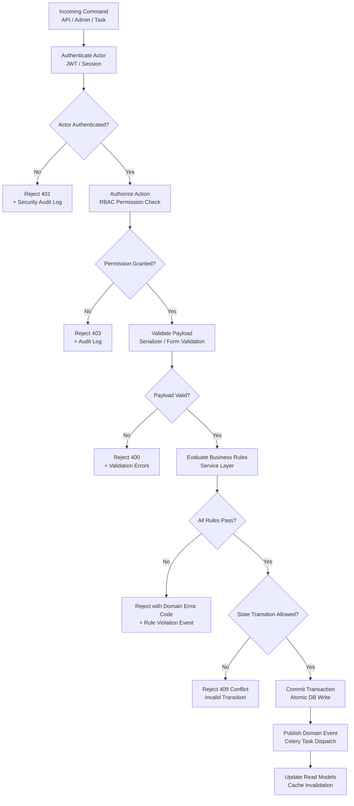

# Business Rules — Education Management Information System

**Version:** 1.0
**Status:** Approved
**Last Updated:** 2026-01-15

---

## Table of Contents

1. [Overview](#1-overview)
2. [Rule Evaluation Pipeline](#2-rule-evaluation-pipeline)
3. [Enforceable Rules by Domain](#3-enforceable-rules-by-domain)
4. [Exception and Override Handling](#4-exception-and-override-handling)
5. [Traceability Table](#5-traceability-table)
6. [Operational Policy Addendum](#6-operational-policy-addendum)

---

## 1. Overview

This document defines the enforceable business rules governing the Education Management Information System. Rules in this document are implemented in the service layer, enforced at every command-processing boundary (API, admin console, background jobs), and tested with dedicated unit/integration test suites.

**Domain focus:** Student academic lifecycle, enrollment, grading, finance, admissions, LMS, and HR workflows.
**Rule categories:** Lifecycle transitions, authorization, compliance, and resilience.
**Enforcement points:** DRF API views, service layer methods, Celery tasks, Django signals, and admin actions.

---

## 2. Rule Evaluation Pipeline

Every state-changing command passes through this pipeline before any database mutation is committed.

---

## 3. Enforceable Rules by Domain

### 3.1 Authentication and Access Control

**BR-AUTH-001:** Every request to a protected resource must carry a valid JWT Bearer token or active session cookie. Requests without valid credentials receive HTTP 401 with error code `UNAUTHENTICATED`.

**BR-AUTH-002:** Role-based access control (RBAC) is enforced at the permission level. Each role has an explicit allowlist of permitted actions; any action not in the allowlist is denied with HTTP 403 and error code `PERMISSION_DENIED`. There is no implicit permission escalation.

**BR-AUTH-003:** Account lockout triggers after 5 consecutive failed login attempts within a 10-minute window. Locked accounts require admin unlock or a 30-minute cooldown before retry. All lockout events are recorded in the security audit log.

**BR-AUTH-004:** JWT access tokens expire after 60 minutes. Refresh tokens expire after 7 days. A refresh token that has been used once is invalidated; the next refresh request must use the newly issued token (token rotation). Refresh tokens are invalidated immediately on password change or admin-forced logout.

**BR-AUTH-005:** API keys for external integrations are scoped to a specific role and resource set, cannot escalate beyond their assigned role, expire after 365 days, and are single-use-per-request (HMAC-signed). Every API key usage is logged.

**BR-AUTH-006:** Parent portal access to a student's records requires explicit student consent (for students over 18). Consent is recorded with timestamp and the consenting student's actor ID. Revoking consent takes effect immediately on the next request.

---

### 3.2 Student Enrollment and Registration

**BR-ENROLL-001:** A student may only register for courses during the open registration window for their current semester. The window is defined in the academic calendar and must be open (`AcademicCalendar.registration_open = True`) before any enrollment is accepted. Registrations submitted outside the window receive error code `REGISTRATION_WINDOW_CLOSED`.

**BR-ENROLL-002:** All prerequisite courses for a section must have been completed (status = `PASSED`) by the student before enrollment is allowed. Completed means a passing grade was recorded and the semester is closed. In-progress concurrent courses do not satisfy prerequisites. Violation returns `PREREQUISITES_NOT_MET` with the list of missing courses.

**BR-ENROLL-003:** A course section has a defined `max_enrollment` capacity. Enrollment is rejected when `current_enrollment >= max_enrollment`. The seat count is updated atomically using a `SELECT FOR UPDATE` lock to prevent race conditions. Violation returns `COURSE_CAPACITY_EXCEEDED`.

**BR-ENROLL-004:** Students may not enroll in two sections whose scheduled time slots overlap. The timetable conflict check runs against all the student's confirmed enrollments in the same semester. Violation returns `TIMETABLE_CONFLICT` with the conflicting section identifier.

**BR-ENROLL-005:** A student may not enroll in more than `program.max_credit_hours_per_semester` credit hours in a single semester, unless an approved credit overload exception is on record. Students may not enroll in fewer than `program.min_credit_hours_per_semester` without an approved underload exception. Violation returns `CREDIT_HOUR_LIMIT_EXCEEDED` or `CREDIT_HOUR_MINIMUM_NOT_MET`.

**BR-ENROLL-006:** A student with an outstanding financial hold (unpaid overdue invoices beyond 30 days) may not register for new courses. The hold is lifted automatically when the outstanding balance is cleared. Violation returns `FINANCIAL_HOLD_ACTIVE`.

**BR-ENROLL-007:** Course add/drop is permitted only during the defined add/drop period (a sub-window of the registration period, typically the first two weeks of a semester). Dropped courses within this window leave no grade record. Courses dropped after the add/drop window but before the late-drop deadline are recorded as `W` (Withdrawn) on the transcript. Drops after the late-drop deadline require department head approval and are recorded as `WF` (Withdrawn Failing).

---

### 3.3 Academic Operations

**BR-ACAD-001:** Faculty may submit grades only during the open grading window, defined per examination event. Once the grading window closes, grades are locked and require a formal grade amendment request (approved by department head) to modify. Grade submissions outside the window return `GRADING_WINDOW_CLOSED`.

**BR-ACAD-002:** GPA is calculated using the institution's configured grading scale (`GradeScale` table). The GPA is recalculated automatically when any grade for the student is published or amended. Cumulative GPA (CGPA) includes all completed semesters. The calculation is deterministic: given the same grades and grading scale, the result is always identical.

**BR-ACAD-003:** A student who falls below the minimum attendance threshold (configurable per program, default 75%) for a course receives an automated academic warning after the first breach, and an academic hold after the second consecutive breach. The hold prevents exam registration for that course. Hold removal requires department head approval with a documented reason.

**BR-ACAD-004:** Exam hall assignment must satisfy: `assigned_students <= hall.seating_capacity`. Room double-booking (same hall, same time slot) is prevented by a uniqueness constraint on `(exam_hall_id, exam_time_slot_id)`. Any exam schedule that would result in a student having two exams at the same time is rejected with `EXAM_SCHEDULE_CONFLICT`.

**BR-ACAD-005:** A transcript may only be issued in `FINAL` status after all enrolled courses for the student's completed semesters have received a grade. Semesters with any `INCOMPLETE` or `PENDING` grade prevent the transcript from being sealed. Students who have not completed all degree requirements receive an unofficial transcript only.

**BR-ACAD-006:** Program curriculum changes do not retroactively affect students who enrolled before the change. Existing students continue under the curriculum version active at their enrollment date. New curriculum versions are date-stamped and applied prospectively.

---

### 3.4 Finance and Payments

**BR-FIN-001:** Fee invoices are generated automatically per student per semester, based on the `FeeStructure` version active at the student's enrollment date for that semester. Fee structure changes after invoice generation do not modify existing invoices; an adjustment invoice must be issued explicitly.

**BR-FIN-002:** All online payments are processed using an idempotency key derived from `(invoice_id, payment_attempt_id)`. Duplicate payment requests with the same idempotency key return the original response without re-charging the payment method. Duplicate detection window is 24 hours.

**BR-FIN-003:** A payment is not considered confirmed until the payment gateway issues a confirmed webhook event. A pending payment (gateway session created but no confirmation) does not reduce the outstanding balance. If no confirmation is received within 30 minutes, the pending payment session expires and the invoice returns to `UNPAID` status.

**BR-FIN-004:** Refunds may only be issued for invoices in `PAID` or `OVERPAID` status. Refund amount may not exceed the amount paid minus any applicable non-refundable fee heads. Refunds require finance officer authorization. All refund transactions are recorded in the audit log with authorizer identity and reason.

**BR-FIN-005:** Installment plans define fixed due dates. A missed installment triggers an automated late payment penalty (configurable percentage) added as a separate invoice line item. Penalties are applied once per overdue installment, not compounding daily.

**BR-FIN-006:** Scholarship and discount application reduces the invoice total on the relevant fee heads only. Scholarships cannot reduce an invoice below zero. If a scholarship is revoked, an adjustment invoice for the difference is issued. Retroactive scholarship application requires finance head approval.

---

### 3.5 Admissions

**BR-ADM-001:** Online applications are accepted only while the application window is open for the target program and intake year. Applications submitted outside the window are rejected with `APPLICATION_WINDOW_CLOSED`. Application window dates are managed via the `AdmissionCycle` model.

**BR-ADM-002:** Merit list generation uses the configured ranking criteria for the program (e.g., weighted score of entrance test, academic grades). All accepted applicants must appear in the merit list with a rank. Manual additions to the merit list require director-level approval and are flagged in the audit log.

**BR-ADM-003:** An accepted applicant has `enrollment_deadline` days from the acceptance date to complete enrollment (pay the admission fee and submit required documents). Failure to enroll by the deadline moves the applicant to `EXPIRED` status and the seat is released for the next merit list candidate.

**BR-ADM-004:** Required documents must be verified (status = `VERIFIED`) before final enrollment is completed. Document verification is performed by the admissions officer. Enrollment with `PENDING` or `REJECTED` documents returns `DOCUMENT_VERIFICATION_PENDING`.

---

### 3.6 Learning Management System (LMS)

**BR-LMS-001:** Assignment submissions are accepted only before the `due_datetime`. After the deadline, submissions are accepted with a `late` flag if the faculty has enabled late submissions for the assignment. The late submission window and penalty (percentage deduction) are configured per assignment. After the late window closes, submissions are rejected with `ASSIGNMENT_SUBMISSION_CLOSED`.

**BR-LMS-002:** Each quiz has a configurable `max_attempts` limit per student. After `max_attempts` is reached, the quiz is locked for that student with status `ATTEMPTS_EXHAUSTED`. The highest or latest attempt score is used for grade calculation, per the assignment configuration.

**BR-LMS-003:** Quiz auto-grading runs immediately upon submission for objective question types (MCQ, True/False). Subjective question types (short answer, essay) are flagged for manual grading by the faculty. Auto-graded scores are marked as `PROVISIONAL` until the faculty confirms or adjusts them.

**BR-LMS-004:** Course content is only visible to students enrolled in the course section. Content marked as `DRAFT` is only visible to the faculty member and course admin. Published content becomes visible to enrolled students immediately upon publish; scheduled content becomes visible at the configured `visible_from` datetime.

---

### 3.7 HR and Payroll

**BR-HR-001:** Leave applications must be submitted before the requested leave start date. Retroactive leave applications (for past dates) require department head approval and are flagged in the audit log.

**BR-HR-002:** An employee's approved leave balance for each leave type (casual, sick, earned) is checked before leave approval. Leave requests that would result in a negative balance are flagged for manager review. Sick leave may be granted in negative balance with HR head approval, up to a configurable limit.

**BR-HR-003:** Payroll processing for a pay period is locked once it enters `PROCESSING` status. No salary component changes, leave adjustments, or new attendance records may affect a payroll that is in processing. The payroll must be rolled back to `DRAFT` status to accept amendments. Payroll in `APPROVED` status is immutable.

**BR-HR-004:** Payslips are generated and delivered to employees only after payroll reaches `APPROVED` status. Payslip PDFs are signed with the HR head's digital signature. Re-issuance of a payslip for an amended payroll generates a new version and notifies the employee.

---

## 4. Exception and Override Handling

Overrides allow authorized actors to bypass specific rules in documented exceptional circumstances. All overrides are subject to the following governance controls:

- **MFA re-authentication required** for any override that affects financial records, grade records, or student status.
- **Mandatory reason code** from an approved classification list must be provided.
- **Supervisor approval token** for high-impact overrides (grade amendments after lock, fee waivers, payroll rollbacks).
- **Automatic expiry**: override authorizations expire after 24 hours if not acted upon.
- **Compliance dashboard surfacing**: all overrides appear in the compliance dashboard within 5 minutes.

**Override Classes:**

| Override Type | Authorized Role | Approval Required | Audit Level |
|---|---|---|---|
| Grade amendment after lock | Department Head | Dean approval | HIGH |
| Fee waiver (full or partial) | Finance Officer | Finance Head approval | HIGH |
| Enrollment outside window | Registrar | Department Head approval | MEDIUM |
| Attendance exception | Department Head | Self-authorized | MEDIUM |
| Payroll rollback | HR Head | Finance Head approval | HIGH |
| Document verification bypass | Admissions Director | Self-authorized | MEDIUM |
| Credit overload exception | Academic Advisor | Department Head approval | LOW |

---

## 5. Traceability Table

| Rule ID | Domain | Enforced In | Test Tag | Error Code |
|---|---|---|---|---|
| BR-AUTH-001 | Auth | `users/middleware.py` | `@br_auth_001` | `UNAUTHENTICATED` |
| BR-AUTH-002 | Auth | `users/api/permissions.py` | `@br_auth_002` | `PERMISSION_DENIED` |
| BR-AUTH-003 | Auth | `users/services.py` | `@br_auth_003` | `ACCOUNT_LOCKED` |
| BR-ENROLL-001 | Enrollment | `courses/services.py` | `@br_enroll_001` | `REGISTRATION_WINDOW_CLOSED` |
| BR-ENROLL-002 | Enrollment | `courses/services.py` | `@br_enroll_002` | `PREREQUISITES_NOT_MET` |
| BR-ENROLL-003 | Enrollment | `courses/services.py` | `@br_enroll_003` | `COURSE_CAPACITY_EXCEEDED` |
| BR-ENROLL-004 | Enrollment | `courses/services.py` | `@br_enroll_004` | `TIMETABLE_CONFLICT` |
| BR-ENROLL-005 | Enrollment | `courses/services.py` | `@br_enroll_005` | `CREDIT_HOUR_LIMIT_EXCEEDED` |
| BR-ENROLL-006 | Enrollment | `courses/services.py` | `@br_enroll_006` | `FINANCIAL_HOLD_ACTIVE` |
| BR-ACAD-001 | Academic | `exams/services.py` | `@br_acad_001` | `GRADING_WINDOW_CLOSED` |
| BR-ACAD-002 | Academic | `exams/services.py` | `@br_acad_002` | N/A (computed) |
| BR-ACAD-003 | Academic | `attendance/tasks.py` | `@br_acad_003` | `ACADEMIC_HOLD_ACTIVE` |
| BR-FIN-001 | Finance | `finance/tasks.py` | `@br_fin_001` | N/A (auto-generated) |
| BR-FIN-002 | Finance | `payment/services.py` | `@br_fin_002` | `DUPLICATE_PAYMENT` |
| BR-FIN-003 | Finance | `payment/services.py` | `@br_fin_003` | `PAYMENT_NOT_CONFIRMED` |
| BR-FIN-004 | Finance | `finance/services.py` | `@br_fin_004` | `REFUND_NOT_ELIGIBLE` |
| BR-ADM-001 | Admissions | `admissions/services.py` | `@br_adm_001` | `APPLICATION_WINDOW_CLOSED` |
| BR-LMS-001 | LMS | `lms/services.py` | `@br_lms_001` | `ASSIGNMENT_SUBMISSION_CLOSED` |
| BR-HR-003 | HR | `hr/services.py` | `@br_hr_003` | `PAYROLL_LOCKED` |

---

## 6. Operational Policy Addendum

### Academic Integrity Policies
- Grades once published (status = `PUBLISHED`) are immutable without a formal grade amendment request logged in the audit trail with approver identity, reason, and timestamp.
- GPA recalculation is triggered automatically on any grade publish or amendment and is never manually edited; the GPA value is always derived from the grade records.
- Transcript generation for a student with any open grade disputes is blocked; the transcript is marked `UNOFFICIAL` until all disputes are resolved.
- Plagiarism flags raised by the LMS are preserved permanently on the submission record; they may be reviewed and dismissed by faculty but never deleted.

### Student Data Privacy Policies
- Student PII (name, date of birth, national ID, contact details, academic records, financial records) is classified as sensitive and must not appear in application logs, error responses, analytics event payloads, or notification message bodies beyond the minimum necessary.
- Access to a student's full academic record requires the accessing actor to be: the student themselves, their assigned academic advisor, their program department head, or an admin/registrar role.
- Parent/guardian access to adult students (18+) requires explicit opt-in consent from the student, renewed annually.
- Bulk exports of student data require finance-head or registrar-level authorization and are permanently logged.

### Fee Collection Policies
- Fee invoices generated for a semester are based on the fee structure version active on the student's semester start date; no retroactive changes.
- Partial payments are accepted and reduce the outstanding balance; the invoice status moves to `PARTIALLY_PAID` until the full amount is cleared.
- Financial holds are applied automatically 30 days after an invoice becomes overdue; holds are lifted automatically within 24 hours of the outstanding balance being cleared.
- All payment gateway transactions are recorded with the gateway's transaction reference, timestamp, and amount; discrepancies between the system record and the gateway statement trigger an automated reconciliation alert.

### System Availability During Academic Calendar
- No planned maintenance or non-emergency deployments during: exam registration week, first week of semester (enrollment peak), fee payment deadline week, and results publication day.
- During partial system outages, the read-only portal (grade viewing, timetable, course catalog) must remain operational; write operations may be queued.
- The system must maintain 99.5% availability during the academic year (September–June) and 99.0% during off-peak periods.
- Incident recovery must prioritize restoration of: authentication, fee payment, grade submission, and exam scheduling — in that order.
