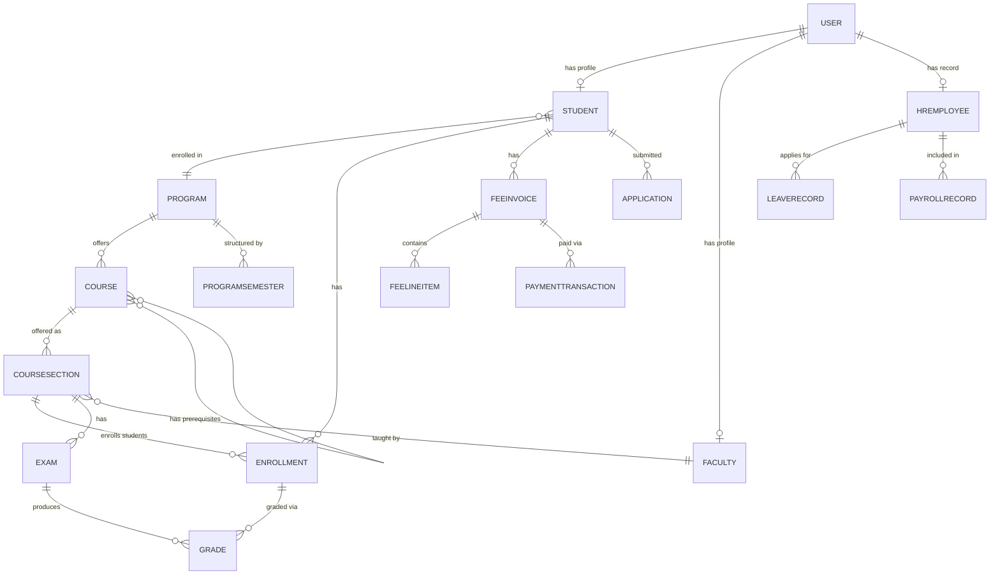

# Data Dictionary — Education Management Information System

**Version:** 1.0
**Status:** Approved
**Last Updated:** 2026-01-15

---

## Table of Contents

1. [Scope and Goals](#1-scope-and-goals)
2. [Core Entities](#2-core-entities)
3. [Canonical Relationship Diagram](#3-canonical-relationship-diagram)
4. [Data Quality Controls](#4-data-quality-controls)
5. [Retention and Audit](#5-retention-and-audit)
6. [Operational Policy Addendum](#6-operational-policy-addendum)
7. [Glossary](#7-glossary)

---

## 1. Scope and Goals

This data dictionary is the canonical reference for all entities, attributes, and relationships in the Education Management Information System. It is the authoritative source for:

- **Architecture teams**: designing new modules and cross-module integrations.
- **API teams**: ensuring consistent field naming and type contracts across all endpoints.
- **Analytics teams**: understanding entity semantics before building reports or dashboards.
- **Operations teams**: understanding data classification for backup, retention, and incident response.

**Goals:**
- Establish a stable vocabulary across all 25 EMIS modules.
- Define minimum required fields for core entities and expected relationship boundaries.
- Document data classification (PII, financial, academic record) for privacy and security controls.
- Enforce retention and audit controls required for accreditation and legal compliance.

---

## 2. Core Entities

### 2.1 User / Actor

| Attribute | Type | Required | Description |
|---|---|---|---|
| `id` | UUID | ✅ | Primary key, auto-generated |
| `username` | varchar(150) | ✅ | Unique login identifier |
| `email` | varchar(254) | ✅ | Unique; used for notifications and password reset |
| `password_hash` | varchar(128) | ✅ | bcrypt hash; never stored in plaintext |
| `role` | enum | ✅ | SUPER_ADMIN, ADMIN, FACULTY, STUDENT, PARENT, HR_STAFF, FINANCE_STAFF, LIBRARY_STAFF, HOSTEL_WARDEN, TRANSPORT_MANAGER |
| `is_active` | boolean | ✅ | Soft-delete flag; inactive users cannot authenticate |
| `last_login` | timestamp | — | UTC timestamp of last successful authentication |
| `created_at` | timestamp | ✅ | Auto-set on creation |
| `updated_at` | timestamp | ✅ | Auto-updated on any change |

**Classification:** PII. `email`, `username` are searchable identifiers. `password_hash` is security-sensitive.

---

### 2.2 Student

| Attribute | Type | Required | Description |
|---|---|---|---|
| `id` | UUID | ✅ | Primary key |
| `student_id` | varchar(20) | ✅ | Unique institutional ID, format `STU-YYYY-XXXXX` |
| `user_id` | UUID FK | ✅ | Links to User; one-to-one |
| `program_id` | UUID FK | ✅ | Enrolled degree program |
| `batch` | varchar(10) | ✅ | Intake year/cohort, e.g., `2024` |
| `status` | enum | ✅ | ACTIVE, ON_LEAVE, GRADUATED, WITHDRAWN, SUSPENDED, EXPELLED |
| `date_of_birth` | date | — | PII; used for age verification and parent consent rules |
| `admission_date` | date | ✅ | Date of formal enrollment |
| `expected_graduation_date` | date | — | Computed from program duration |

**Classification:** Academic record + PII. Student status transitions are audited.

---

### 2.3 Faculty

| Attribute | Type | Required | Description |
|---|---|---|---|
| `id` | UUID | ✅ | Primary key |
| `employee_id` | varchar(20) | ✅ | Unique institutional employee ID |
| `user_id` | UUID FK | ✅ | Links to User; one-to-one |
| `department_id` | UUID FK | ✅ | Primary department assignment |
| `designation` | varchar(100) | ✅ | e.g., Professor, Associate Professor, Lecturer |
| `joining_date` | date | ✅ | Employment start date |
| `qualification` | varchar(200) | — | Highest qualification |
| `specialization` | varchar(200) | — | Research/teaching specialization |
| `is_visiting` | boolean | ✅ | Distinguishes visiting from permanent faculty |

**Classification:** HR record + PII.

---

### 2.4 Program

| Attribute | Type | Required | Description |
|---|---|---|---|
| `id` | UUID | ✅ | Primary key |
| `code` | varchar(20) | ✅ | Unique code, e.g., `BSCS`, `MBA` |
| `name` | varchar(200) | ✅ | Full program name |
| `degree_type` | enum | ✅ | BACHELOR, MASTER, PHD, DIPLOMA, CERTIFICATE |
| `duration_semesters` | int | ✅ | Total number of semesters |
| `total_credits_required` | int | ✅ | Minimum credits for graduation |
| `min_credit_hours_per_semester` | int | ✅ | Minimum credit load per semester |
| `max_credit_hours_per_semester` | int | ✅ | Maximum credit load per semester |
| `department_id` | UUID FK | ✅ | Owning academic department |
| `is_active` | boolean | ✅ | Only active programs accept new admissions |

---

### 2.5 Course

| Attribute | Type | Required | Description |
|---|---|---|---|
| `id` | UUID | ✅ | Primary key |
| `code` | varchar(20) | ✅ | Unique course code, e.g., `CS301` |
| `name` | varchar(200) | ✅ | Full course title |
| `credit_hours` | int | ✅ | Credit weight of the course |
| `course_type` | enum | ✅ | THEORY, LAB, PROJECT, SEMINAR |
| `is_elective` | boolean | ✅ | Whether course is optional or required |
| `max_enrollment` | int | ✅ | Maximum students per section |
| `department_id` | UUID FK | ✅ | Owning department |
| `prerequisites` | M2M → Course | — | Courses that must be completed before enrollment |

---

### 2.6 CourseSection

| Attribute | Type | Required | Description |
|---|---|---|---|
| `id` | UUID | ✅ | Primary key |
| `course_id` | UUID FK | ✅ | Parent course |
| `section_code` | varchar(10) | ✅ | e.g., `A`, `B`, `01` |
| `faculty_id` | UUID FK | ✅ | Assigned faculty member |
| `semester_id` | UUID FK | ✅ | Academic semester |
| `room_id` | UUID FK | — | Assigned classroom |
| `max_enrollment` | int | ✅ | Overrides course-level cap if set |
| `current_enrollment` | int | ✅ | Maintained atomically; never derives from count query in hot paths |

---

### 2.7 Enrollment

| Attribute | Type | Required | Description |
|---|---|---|---|
| `id` | UUID | ✅ | Primary key |
| `student_id` | UUID FK | ✅ | Enrolled student |
| `section_id` | UUID FK | ✅ | Enrolled course section |
| `semester_id` | UUID FK | ✅ | Academic semester |
| `status` | enum | ✅ | ACTIVE, DROPPED, WITHDRAWN, COMPLETED, FAILED, INCOMPLETE |
| `enrolled_at` | timestamp | ✅ | UTC timestamp of enrollment |
| `dropped_at` | timestamp | — | Set when status transitions to DROPPED or WITHDRAWN |
| `grade_id` | UUID FK | — | Set when grade is published |

**Classification:** Academic record. Enrollment status transitions are audited.

---

### 2.8 Exam

| Attribute | Type | Required | Description |
|---|---|---|---|
| `id` | UUID | ✅ | Primary key |
| `name` | varchar(200) | ✅ | e.g., `Mid-Term Exam`, `Final Exam` |
| `exam_type` | enum | ✅ | MIDTERM, FINAL, QUIZ, ASSIGNMENT, PRACTICAL |
| `section_id` | UUID FK | ✅ | Associated course section |
| `semester_id` | UUID FK | ✅ | Academic semester |
| `scheduled_date` | date | — | Scheduled exam date |
| `start_time` | time | — | Exam start time |
| `duration_minutes` | int | — | Exam duration |
| `total_marks` | decimal | ✅ | Maximum achievable marks |
| `passing_marks` | decimal | ✅ | Minimum marks for a passing grade |
| `grading_window_open` | boolean | ✅ | Controls whether grade submission is allowed |

---

### 2.9 Grade

| Attribute | Type | Required | Description |
|---|---|---|---|
| `id` | UUID | ✅ | Primary key |
| `enrollment_id` | UUID FK | ✅ | The enrollment being graded |
| `exam_id` | UUID FK | ✅ | The exam this grade belongs to |
| `marks_obtained` | decimal | ✅ | Raw marks scored |
| `letter_grade` | varchar(5) | — | Computed letter grade (A, B+, B, C+, C, D, F) |
| `grade_points` | decimal | — | Computed grade points per credit hour |
| `status` | enum | ✅ | DRAFT, SUBMITTED, PUBLISHED, AMENDED |
| `submitted_by_id` | UUID FK | ✅ | Faculty who submitted the grade |
| `published_at` | timestamp | — | UTC timestamp when grade was published to students |
| `amended_at` | timestamp | — | Set if grade was formally amended after publish |

**Classification:** Academic record. Immutable after `PUBLISHED`; amendments require audit trail.

---

### 2.10 FeeInvoice

| Attribute | Type | Required | Description |
|---|---|---|---|
| `id` | UUID | ✅ | Primary key |
| `invoice_number` | varchar(30) | ✅ | Unique, human-readable: `INV-2024-001234` |
| `student_id` | UUID FK | ✅ | Student this invoice belongs to |
| `semester_id` | UUID FK | ✅ | Academic semester |
| `fee_structure_version_id` | UUID FK | ✅ | Snapshot of fee structure at invoice generation time |
| `subtotal` | decimal | ✅ | Sum of all line items |
| `discount_amount` | decimal | ✅ | Total scholarship/discount applied |
| `total_amount` | decimal | ✅ | Amount due after discount |
| `amount_paid` | decimal | ✅ | Total confirmed payments received |
| `status` | enum | ✅ | DRAFT, ISSUED, PARTIALLY_PAID, PAID, OVERDUE, WRITTEN_OFF, REFUNDED |
| `due_date` | date | ✅ | Payment deadline |
| `issued_at` | timestamp | ✅ | When invoice was sent to student |

**Classification:** Financial record. Status transitions are audited.

---

### 2.11 PaymentTransaction

| Attribute | Type | Required | Description |
|---|---|---|---|
| `id` | UUID | ✅ | Primary key |
| `invoice_id` | UUID FK | ✅ | Invoice being paid |
| `gateway` | enum | ✅ | STRIPE, RAZORPAY, BANK_TRANSFER, CASH |
| `gateway_transaction_id` | varchar(200) | ✅ | Gateway's unique reference |
| `amount` | decimal | ✅ | Amount charged |
| `currency` | varchar(3) | ✅ | ISO 4217 currency code |
| `status` | enum | ✅ | PENDING, SUCCESS, FAILED, REFUNDED |
| `initiated_at` | timestamp | ✅ | When payment session was created |
| `confirmed_at` | timestamp | — | When gateway confirmed payment success |
| `receipt_url` | varchar(500) | — | URL to generated PDF receipt |
| `idempotency_key` | varchar(100) | ✅ | Client-supplied key for deduplication |

**Classification:** Financial record + PCI-sensitive. Never log card numbers or CVV.

---

### 2.12 HREmployee

| Attribute | Type | Required | Description |
|---|---|---|---|
| `id` | UUID | ✅ | Primary key |
| `employee_id` | varchar(20) | ✅ | Unique institutional HR ID |
| `user_id` | UUID FK | ✅ | Links to User |
| `department_id` | UUID FK | ✅ | Assigned department |
| `designation` | varchar(100) | ✅ | Job title |
| `employment_type` | enum | ✅ | PERMANENT, CONTRACT, VISITING, INTERN |
| `joining_date` | date | ✅ | Employment start date |
| `salary_grade` | varchar(20) | — | Pay grade/band reference |
| `bank_account_number` | varchar(50) | — | For payroll direct deposit; PCI-sensitive |
| `national_id` | varchar(50) | — | Government ID; PII |

**Classification:** HR record + PII + financial. Salary and bank account data are restricted.

---

## 3. Canonical Relationship Diagram

---

## 4. Data Quality Controls

1. **Required-field validation** is enforced at both the serializer layer (API) and the model layer (database NOT NULL constraints). A record cannot be persisted with a missing required field.

2. **Referential integrity** is enforced via database foreign key constraints with `ON DELETE PROTECT` for critical references (e.g., cannot delete a Program that has active students; cannot delete a Course that has Enrollments).

3. **Controlled vocabularies** are enforced for all `status`, `role`, `type`, and `enum` fields using Django `TextChoices`. Unknown values are rejected at the API layer before reaching the database.

4. **Unique constraints** are enforced on natural business keys: `student_id`, `invoice_number`, `course.code`, `program.code`, `username`, `email`, `gateway_transaction_id`.

5. **Duplicate detection** runs on payment transactions using `idempotency_key` before any gateway call. Duplicate submission attempts with the same key return the original response.

6. **Sensitive fields** are classified with a `classification` annotation in the model's `Meta.data_classification` dict. Annotated fields drive: encryption at rest configuration, log masking rules, export authorization checks, and API field filtering by role.

7. **Audit trail completeness**: every write to a table classified as `ACADEMIC_RECORD` or `FINANCIAL_RECORD` inserts a row in `core_audit_log` within the same database transaction.

---

## 5. Retention and Audit

| Data Category | Online Retention | Archive Retention | Deletion Policy |
|---|---|---|---|
| Student academic records (grades, transcripts, enrollments) | Duration of enrollment + 2 years | 10 years after graduation | Never deleted; archived to cold storage |
| Financial records (invoices, payments) | 3 years active | 7 years archived | Compliant with local financial regulations |
| Application records (accepted) | Linked to student record | Same as academic records | N/A |
| Application records (rejected) | 2 years | Purged after 2 years | GDPR/PDPA right-to-erasure eligible |
| HR/payroll records | Duration of employment + 2 years | 7 years archived | Per local labor law |
| Audit logs | 2 years hot | 6 years archived | Immutable; never deleted within retention window |
| Session tokens | 7 days (JWT refresh TTL) | Not archived | Expired tokens purged weekly |
| Uploaded files (LMS content) | Duration of course + 1 year | 3 years if archived | Deleted after archive window on admin action |
| Notification logs | 90 days | 1 year | Purged after 1 year |

**Audit Log Fields (all writes to classified tables):**

| Field | Type | Description |
|---|---|---|
| `id` | UUID | Audit record PK |
| `table_name` | varchar | Target table |
| `record_id` | UUID | Affected record ID |
| `action` | enum | CREATE, UPDATE, DELETE, STATUS_CHANGE |
| `actor_id` | UUID | User who performed the action |
| `actor_role` | varchar | Role at the time of action |
| `old_values` | JSONB | Previous state snapshot |
| `new_values` | JSONB | New state snapshot |
| `reason_code` | varchar | Required for sensitive transitions |
| `ip_address` | varchar | Source IP |
| `occurred_at` | timestamp | UTC timestamp |

---

## 6. Operational Policy Addendum

### Academic Integrity Policies
- Grade values in `core_audit_log` are stored as numeric values (marks), not names, to prevent inadvertent PII exposure while maintaining traceability.
- Transcript data is frozen at the point of official issuance; amendments require a new issuance with a revised version number.
- Grade disputes must reference the original `grade.id` and are resolved through the formal amendment workflow, creating a new audit log entry.

### Student Data Privacy Policies
- `date_of_birth`, `national_id`, and `bank_account_number` are encrypted at rest using AES-256 with a per-tenant encryption key managed by the secrets manager.
- These fields are excluded from all analytics exports and log outputs by automated field-masking middleware.
- Access to these fields via the API requires the requesting role to be in the explicit allowlist defined in `settings.SENSITIVE_FIELD_ROLES`.

### Fee Collection Policies
- `amount_paid` on `FeeInvoice` is never written directly by application code; it is derived from confirmed `PaymentTransaction` records by a dedicated reconciliation service to prevent tampering.
- Any discrepancy between `invoice.amount_paid` and the sum of confirmed transactions triggers an automated reconciliation alert.

### System Availability During Academic Calendar
- Data dictionary changes (new fields, renamed fields, type changes) require a migration review during non-blackout periods. Additive changes (new columns with defaults) are the only changes permitted during academic blackout periods.

---

## 7. Glossary

| Term | Definition |
|---|---|
| **Academic Semester** | A defined time period (typically 16–20 weeks) within an academic year during which courses are offered, attendance is taken, and exams are conducted. |
| **Batch** | The intake cohort of students who begin the same program in the same academic year (e.g., Batch 2024). |
| **Credit Hours** | A unit of measurement representing one hour of classroom instruction per week for a semester. A 3-credit-hour course meets 3 hours per week. |
| **CGPA** | Cumulative Grade Point Average — the weighted average of grade points across all completed semesters. |
| **Course Section** | A specific scheduled instance of a course in a given semester, assigned to a faculty member and (optionally) a room. Multiple sections may exist for the same course. |
| **Enrollment** | The formal registration of a student in a specific course section for a specific semester. |
| **Fee Structure** | The configured set of fee heads (tuition, lab, library, hostel) and their amounts, applicable to a specific program and intake year. |
| **Financial Hold** | A restriction placed on a student's account that prevents certain academic actions (e.g., new enrollments, grade access) due to outstanding unpaid fees. |
| **GPA** | Grade Point Average — the weighted average of grade points earned in a single semester. |
| **Grade Lock** | The state in which a grade record becomes immutable after official publication. Modifications require a formal amendment process. |
| **Idempotency Key** | A client-supplied unique token used to ensure that repeated requests for the same operation (e.g., due to network retry) produce the same result without creating duplicate records. |
| **Merit List** | A ranked list of applicants generated from configured ranking criteria (entrance test score, academic performance) used to determine admission offers. |
| **Program Semester** | A defined curriculum stage within a degree program (e.g., Semester 1, Semester 3), specifying which courses are offered and their sequencing. |
| **Registration Window** | The period during which students are permitted to add or modify course enrollments for the upcoming or current semester. |
| **Soft Delete** | A deletion approach where records are marked `is_active = False` rather than removed from the database, preserving audit history. |
| **Student Status** | The current lifecycle state of a student's enrollment in the institution: ACTIVE, ON_LEAVE, GRADUATED, WITHDRAWN, SUSPENDED, EXPELLED. |
| **Timetable Conflict** | A scheduling collision where a student or faculty member is assigned to two or more classes, exams, or other scheduled events at the same time. |
| **Transcript** | An official academic document listing all courses completed by a student, grades received, GPA per semester, CGPA, and degree awarded (if applicable). |
| **UUID** | Universally Unique Identifier — a 128-bit random identifier used as the primary key for all EMIS entities, ensuring global uniqueness without coordination. |
