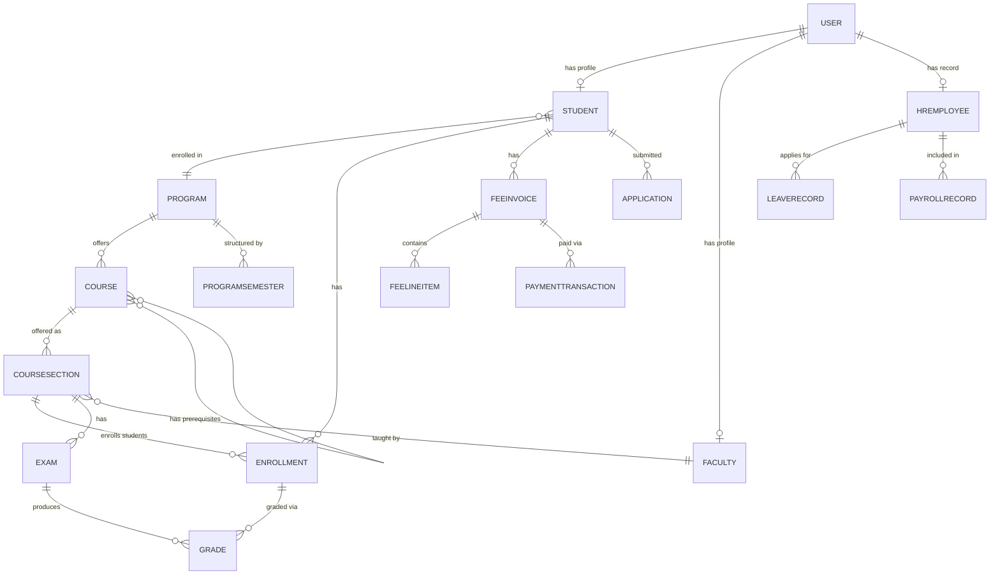

# Data Dictionary — Education Management Information System

**Version:** 1.0
**Status:** Approved
**Last Updated:** 2026-01-15

---

## Table of Contents

1. [Scope and Goals](#1-scope-and-goals)
2. [Core Entities](#2-core-entities)
3. [Canonical Relationship Diagram](#3-canonical-relationship-diagram)
4. [Data Quality Controls](#4-data-quality-controls)
5. [Retention and Audit](#5-retention-and-audit)
6. [Operational Policy Addendum](#6-operational-policy-addendum)
7. [Glossary](#7-glossary)

---

## 1. Scope and Goals

This data dictionary is the canonical reference for all entities, attributes, and relationships in the Education Management Information System. It is the authoritative source for:

- **Architecture teams**: designing new modules and cross-module integrations.
- **API teams**: ensuring consistent field naming and type contracts across all endpoints.
- **Analytics teams**: understanding entity semantics before building reports or dashboards.
- **Operations teams**: understanding data classification for backup, retention, and incident response.

**Goals:**
- Establish a stable vocabulary across all 25 EMIS modules.
- Define minimum required fields for core entities and expected relationship boundaries.
- Document data classification (PII, financial, academic record) for privacy and security controls.
- Enforce retention and audit controls required for accreditation and legal compliance.

---

## 2. Core Entities

### 2.1 User / Actor

| Attribute | Type | Required | Description |
|---|---|---|---|
| `id` | UUID | ✅ | Primary key, auto-generated |
| `username` | varchar(150) | ✅ | Unique login identifier |
| `email` | varchar(254) | ✅ | Unique; used for notifications and password reset |
| `password_hash` | varchar(128) | ✅ | bcrypt hash; never stored in plaintext |
| `role` | enum | ✅ | SUPER_ADMIN, ADMIN, FACULTY, STUDENT, PARENT, HR_STAFF, FINANCE_STAFF, LIBRARY_STAFF, HOSTEL_WARDEN, TRANSPORT_MANAGER |
| `is_active` | boolean | ✅ | Soft-delete flag; inactive users cannot authenticate |
| `last_login` | timestamp | — | UTC timestamp of last successful authentication |
| `created_at` | timestamp | ✅ | Auto-set on creation |
| `updated_at` | timestamp | ✅ | Auto-updated on any change |

**Classification:** PII. `email`, `username` are searchable identifiers. `password_hash` is security-sensitive.

---

### 2.2 Student

| Attribute | Type | Required | Description |
|---|---|---|---|
| `id` | UUID | ✅ | Primary key |
| `student_id` | varchar(20) | ✅ | Unique institutional ID, format `STU-YYYY-XXXXX` |
| `user_id` | UUID FK | ✅ | Links to User; one-to-one |
| `program_id` | UUID FK | ✅ | Enrolled degree program |
| `batch` | varchar(10) | ✅ | Intake year/cohort, e.g., `2024` |
| `status` | enum | ✅ | ACTIVE, ON_LEAVE, GRADUATED, WITHDRAWN, SUSPENDED, EXPELLED |
| `date_of_birth` | date | — | PII; used for age verification and parent consent rules |
| `admission_date` | date | ✅ | Date of formal enrollment |
| `expected_graduation_date` | date | — | Computed from program duration |

**Classification:** Academic record + PII. Student status transitions are audited.

---

### 2.3 Faculty

| Attribute | Type | Required | Description |
|---|---|---|---|
| `id` | UUID | ✅ | Primary key |
| `employee_id` | varchar(20) | ✅ | Unique institutional employee ID |
| `user_id` | UUID FK | ✅ | Links to User; one-to-one |
| `department_id` | UUID FK | ✅ | Primary department assignment |
| `designation` | varchar(100) | ✅ | e.g., Professor, Associate Professor, Lecturer |
| `joining_date` | date | ✅ | Employment start date |
| `qualification` | varchar(200) | — | Highest qualification |
| `specialization` | varchar(200) | — | Research/teaching specialization |
| `is_visiting` | boolean | ✅ | Distinguishes visiting from permanent faculty |

**Classification:** HR record + PII.

---

### 2.4 Program

| Attribute | Type | Required | Description |
|---|---|---|---|
| `id` | UUID | ✅ | Primary key |
| `code` | varchar(20) | ✅ | Unique code, e.g., `BSCS`, `MBA` |
| `name` | varchar(200) | ✅ | Full program name |
| `degree_type` | enum | ✅ | BACHELOR, MASTER, PHD, DIPLOMA, CERTIFICATE |
| `duration_semesters` | int | ✅ | Total number of semesters |
| `total_credits_required` | int | ✅ | Minimum credits for graduation |
| `min_credit_hours_per_semester` | int | ✅ | Minimum credit load per semester |
| `max_credit_hours_per_semester` | int | ✅ | Maximum credit load per semester |
| `department_id` | UUID FK | ✅ | Owning academic department |
| `is_active` | boolean | ✅ | Only active programs accept new admissions |

---

### 2.5 Course

| Attribute | Type | Required | Description |
|---|---|---|---|
| `id` | UUID | ✅ | Primary key |
| `code` | varchar(20) | ✅ | Unique course code, e.g., `CS301` |
| `name` | varchar(200) | ✅ | Full course title |
| `credit_hours` | int | ✅ | Credit weight of the course |
| `course_type` | enum | ✅ | THEORY, LAB, PROJECT, SEMINAR |
| `is_elective` | boolean | ✅ | Whether course is optional or required |
| `max_enrollment` | int | ✅ | Maximum students per section |
| `department_id` | UUID FK | ✅ | Owning department |
| `prerequisites` | M2M → Course | — | Courses that must be completed before enrollment |

---

### 2.6 CourseSection

| Attribute | Type | Required | Description |
|---|---|---|---|
| `id` | UUID | ✅ | Primary key |
| `course_id` | UUID FK | ✅ | Parent course |
| `section_code` | varchar(10) | ✅ | e.g., `A`, `B`, `01` |
| `faculty_id` | UUID FK | ✅ | Assigned faculty member |
| `semester_id` | UUID FK | ✅ | Academic semester |
| `room_id` | UUID FK | — | Assigned classroom |
| `max_enrollment` | int | ✅ | Overrides course-level cap if set |
| `current_enrollment` | int | ✅ | Maintained atomically; never derives from count query in hot paths |

---

### 2.7 Enrollment

| Attribute | Type | Required | Description |
|---|---|---|---|
| `id` | UUID | ✅ | Primary key |
| `student_id` | UUID FK | ✅ | Enrolled student |
| `section_id` | UUID FK | ✅ | Enrolled course section |
| `semester_id` | UUID FK | ✅ | Academic semester |
| `status` | enum | ✅ | ACTIVE, DROPPED, WITHDRAWN, COMPLETED, FAILED, INCOMPLETE |
| `enrolled_at` | timestamp | ✅ | UTC timestamp of enrollment |
| `dropped_at` | timestamp | — | Set when status transitions to DROPPED or WITHDRAWN |
| `grade_id` | UUID FK | — | Set when grade is published |
| `is_repeat` | boolean | — | Whether this is a semester repeat (DEFAULT false) |
| `repeat_of_semester_number` | int | — | Which semester number is being repeated (null if not a repeat) |
| `classroom_id` | UUID FK | — | Assigned classroom |
| `assigned_by` | UUID FK | — | Admin who assigned this enrollment |

**Classification:** Academic record. Enrollment status transitions are audited.

---

### 2.8 Exam

| Attribute | Type | Required | Description |
|---|---|---|---|
| `id` | UUID | ✅ | Primary key |
| `name` | varchar(200) | ✅ | e.g., `Mid-Term Exam`, `Final Exam` |
| `exam_type` | enum | ✅ | MIDTERM, FINAL, QUIZ, ASSIGNMENT, PRACTICAL |
| `section_id` | UUID FK | ✅ | Associated course section |
| `semester_id` | UUID FK | ✅ | Academic semester |
| `scheduled_date` | date | — | Scheduled exam date |
| `start_time` | time | — | Exam start time |
| `duration_minutes` | int | — | Exam duration |
| `total_marks` | decimal | ✅ | Maximum achievable marks |
| `passing_marks` | decimal | ✅ | Minimum marks for a passing grade |
| `grading_window_open` | boolean | ✅ | Controls whether grade submission is allowed |

---

### 2.9 Grade

| Attribute | Type | Required | Description |
|---|---|---|---|
| `id` | UUID | ✅ | Primary key |
| `enrollment_id` | UUID FK | ✅ | The enrollment being graded |
| `exam_id` | UUID FK | ✅ | The exam this grade belongs to |
| `marks_obtained` | decimal | ✅ | Raw marks scored |
| `letter_grade` | varchar(5) | — | Computed letter grade (A, B+, B, C+, C, D, F) |
| `grade_points` | decimal | — | Computed grade points per credit hour |
| `status` | enum | ✅ | DRAFT, SUBMITTED, PUBLISHED, AMENDED |
| `submitted_by_id` | UUID FK | ✅ | Faculty who submitted the grade |
| `published_at` | timestamp | — | UTC timestamp when grade was published to students |
| `amended_at` | timestamp | — | Set if grade was formally amended after publish |

**Classification:** Academic record. Immutable after `PUBLISHED`; amendments require audit trail.

---

### 2.10 FeeInvoice

| Attribute | Type | Required | Description |
|---|---|---|---|
| `id` | UUID | ✅ | Primary key |
| `invoice_number` | varchar(30) | ✅ | Unique, human-readable: `INV-2024-001234` |
| `student_id` | UUID FK | ✅ | Student this invoice belongs to |
| `semester_id` | UUID FK | ✅ | Academic semester |
| `fee_structure_version_id` | UUID FK | ✅ | Snapshot of fee structure at invoice generation time |
| `subtotal` | decimal | ✅ | Sum of all line items |
| `discount_amount` | decimal | ✅ | Total scholarship/discount applied |
| `total_amount` | decimal | ✅ | Amount due after discount |
| `amount_paid` | decimal | ✅ | Total confirmed payments received |
| `status` | enum | ✅ | DRAFT, ISSUED, PARTIALLY_PAID, PAID, OVERDUE, WRITTEN_OFF, REFUNDED |
| `due_date` | date | ✅ | Payment deadline |
| `issued_at` | timestamp | ✅ | When invoice was sent to student |

**Classification:** Financial record. Status transitions are audited.

---

### 2.11 PaymentTransaction

| Attribute | Type | Required | Description |
|---|---|---|---|
| `id` | UUID | ✅ | Primary key |
| `invoice_id` | UUID FK | ✅ | Invoice being paid |
| `gateway` | enum | ✅ | STRIPE, RAZORPAY, BANK_TRANSFER, CASH |
| `gateway_transaction_id` | varchar(200) | ✅ | Gateway's unique reference |
| `amount` | decimal | ✅ | Amount charged |
| `currency` | varchar(3) | ✅ | ISO 4217 currency code |
| `status` | enum | ✅ | PENDING, SUCCESS, FAILED, REFUNDED |
| `initiated_at` | timestamp | ✅ | When payment session was created |
| `confirmed_at` | timestamp | — | When gateway confirmed payment success |
| `receipt_url` | varchar(500) | — | URL to generated PDF receipt |
| `idempotency_key` | varchar(100) | ✅ | Client-supplied key for deduplication |

**Classification:** Financial record + PCI-sensitive. Never log card numbers or CVV.

---

### 2.12 HREmployee

| Attribute | Type | Required | Description |
|---|---|---|---|
| `id` | UUID | ✅ | Primary key |
| `employee_id` | varchar(20) | ✅ | Unique institutional HR ID |
| `user_id` | UUID FK | ✅ | Links to User |
| `department_id` | UUID FK | ✅ | Assigned department |
| `designation` | varchar(100) | ✅ | Job title |
| `employment_type` | enum | ✅ | PERMANENT, CONTRACT, VISITING, INTERN |
| `joining_date` | date | ✅ | Employment start date |
| `salary_grade` | varchar(20) | — | Pay grade/band reference |
| `bank_account_number` | varchar(50) | — | For payroll direct deposit; PCI-sensitive |
| `national_id` | varchar(50) | — | Government ID; PII |

**Classification:** HR record + PII + financial. Salary and bank account data are restricted.

---

## 3. Canonical Relationship Diagram

---

## 4. Data Quality Controls

1. **Required-field validation** is enforced at both the serializer layer (API) and the model layer (database NOT NULL constraints). A record cannot be persisted with a missing required field.

2. **Referential integrity** is enforced via database foreign key constraints with `ON DELETE PROTECT` for critical references (e.g., cannot delete a Program that has active students; cannot delete a Course that has Enrollments).

3. **Controlled vocabularies** are enforced for all `status`, `role`, `type`, and `enum` fields using Django `TextChoices`. Unknown values are rejected at the API layer before reaching the database.

4. **Unique constraints** are enforced on natural business keys: `student_id`, `invoice_number`, `course.code`, `program.code`, `username`, `email`, `gateway_transaction_id`.

5. **Duplicate detection** runs on payment transactions using `idempotency_key` before any gateway call. Duplicate submission attempts with the same key return the original response.

6. **Sensitive fields** are classified with a `classification` annotation in the model's `Meta.data_classification` dict. Annotated fields drive: encryption at rest configuration, log masking rules, export authorization checks, and API field filtering by role.

7. **Audit trail completeness**: every write to a table classified as `ACADEMIC_RECORD` or `FINANCIAL_RECORD` inserts a row in `core_audit_log` within the same database transaction.

---

## 5. Retention and Audit

| Data Category | Online Retention | Archive Retention | Deletion Policy |
|---|---|---|---|
| Student academic records (grades, transcripts, enrollments) | Duration of enrollment + 2 years | 10 years after graduation | Never deleted; archived to cold storage |
| Financial records (invoices, payments) | 3 years active | 7 years archived | Compliant with local financial regulations |
| Application records (accepted) | Linked to student record | Same as academic records | N/A |
| Application records (rejected) | 2 years | Purged after 2 years | GDPR/PDPA right-to-erasure eligible |
| HR/payroll records | Duration of employment + 2 years | 7 years archived | Per local labor law |
| Audit logs | 2 years hot | 6 years archived | Immutable; never deleted within retention window |
| Session tokens | 7 days (JWT refresh TTL) | Not archived | Expired tokens purged weekly |
| Uploaded files (LMS content) | Duration of course + 1 year | 3 years if archived | Deleted after archive window on admin action |
| Notification logs | 90 days | 1 year | Purged after 1 year |

**Audit Log Fields (all writes to classified tables):**

| Field | Type | Description |
|---|---|---|
| `id` | UUID | Audit record PK |
| `table_name` | varchar | Target table |
| `record_id` | UUID | Affected record ID |
| `action` | enum | CREATE, UPDATE, DELETE, STATUS_CHANGE |
| `actor_id` | UUID | User who performed the action |
| `actor_role` | varchar | Role at the time of action |
| `old_values` | JSONB | Previous state snapshot |
| `new_values` | JSONB | New state snapshot |
| `reason_code` | varchar | Required for sensitive transitions |
| `ip_address` | varchar | Source IP |
| `occurred_at` | timestamp | UTC timestamp |

---

## 6. Operational Policy Addendum

### Academic Integrity Policies
- Grade values in `core_audit_log` are stored as numeric values (marks), not names, to prevent inadvertent PII exposure while maintaining traceability.
- Transcript data is frozen at the point of official issuance; amendments require a new issuance with a revised version number.
- Grade disputes must reference the original `grade.id` and are resolved through the formal amendment workflow, creating a new audit log entry.

### Student Data Privacy Policies
- `date_of_birth`, `national_id`, and `bank_account_number` are encrypted at rest using AES-256 with a per-tenant encryption key managed by the secrets manager.
- These fields are excluded from all analytics exports and log outputs by automated field-masking middleware.
- Access to these fields via the API requires the requesting role to be in the explicit allowlist defined in `settings.SENSITIVE_FIELD_ROLES`.

### Fee Collection Policies
- `amount_paid` on `FeeInvoice` is never written directly by application code; it is derived from confirmed `PaymentTransaction` records by a dedicated reconciliation service to prevent tampering.
- Any discrepancy between `invoice.amount_paid` and the sum of confirmed transactions triggers an automated reconciliation alert.

### System Availability During Academic Calendar
- Data dictionary changes (new fields, renamed fields, type changes) require a migration review during non-blackout periods. Additive changes (new columns with defaults) are the only changes permitted during academic blackout periods.

---

### 2.13 AcademicYear

Represents a full academic year cycle, containing one or more semesters. Only one academic year can be marked as current at any time.

| Field | Type | Required | Description |
|---|---|---|---|
| `id` | UUID | PK | Unique identifier |
| `name` | VARCHAR(50) | Yes, UK | Display name (e.g., "2025-2026") |
| `start_date` | DATE | Yes | Academic year start |
| `end_date` | DATE | Yes | Academic year end |
| `status` | ENUM | Yes | PLANNING, ACTIVE, COMPLETED, ARCHIVED |
| `is_current` | BOOLEAN | Yes | Only one year can be current (enforced by unique partial index) |
| `created_by_id` | UUID | FK → User | Admin who created |
| `created_at` | TIMESTAMPTZ | Yes | Creation timestamp |
| `updated_at` | TIMESTAMPTZ | Yes | Last modification |

---

### 2.14 GraduationApplication

A student's formal request to graduate from a degree program. Triggers a degree audit and follows an approval workflow through to degree conferral.

| Field | Type | Required | Description |
|---|---|---|---|
| `id` | UUID | PK | Unique identifier |
| `application_number` | VARCHAR(20) | Yes, UK | Format: GRAD-YYYY-XXXXXX |
| `student_id` | UUID | FK → Student | Applying student |
| `program_id` | UUID | FK → Program | Degree program |
| `expected_graduation_date` | DATE | Yes | Expected conferral date |
| `status` | ENUM | Yes | SUBMITTED, UNDER_REVIEW, AUDIT_PASSED, AUDIT_FAILED, APPROVED, REJECTED, CONFERRED |
| `degree_audit_id` | UUID | FK → DegreeAudit | Linked audit result |
| `honors_classification` | ENUM | No | SUMMA_CUM_LAUDE, MAGNA_CUM_LAUDE, CUM_LAUDE, NONE |
| `diploma_number` | VARCHAR(20) | UK | Format: DIP-YYYY-XXXXXX (assigned on conferral) |
| `applied_at` | TIMESTAMPTZ | Yes | Application timestamp |
| `approved_by_id` | UUID | FK → User | Approving registrar |
| `conferred_at` | TIMESTAMPTZ | No | Degree conferral date |
| `rejection_reason` | TEXT | No | Reason if rejected |
| `created_at` | TIMESTAMPTZ | Yes | Record creation |
| `updated_at` | TIMESTAMPTZ | Yes | Last modification |

**Classification:** Academic record. Status transitions are audited. Diploma number is immutable once assigned.

---

### 2.15 DegreeAudit

An automated or manual check of a student's academic progress against program requirements. Used to verify graduation eligibility.

| Field | Type | Required | Description |
|---|---|---|---|
| `id` | UUID | PK | Unique identifier |
| `student_id` | UUID | FK → Student | Student being audited |
| `program_id` | UUID | FK → Program | Program requirements to check against |
| `audit_type` | ENUM | Yes | AUTOMATED, MANUAL, GRADUATION_CHECK |
| `status` | ENUM | Yes | PASSED, FAILED, IN_PROGRESS |
| `total_credits_required` | INT | Yes | Program requirement |
| `total_credits_completed` | INT | Yes | Student's completed credits |
| `total_credits_transferred` | INT | No | Transfer credits counted |
| `required_courses_met` | BOOLEAN | Yes | All required courses passed |
| `elective_credits_met` | BOOLEAN | Yes | Elective requirement satisfied |
| `cgpa_requirement_met` | BOOLEAN | Yes | CGPA above program minimum |
| `residency_requirement_met` | BOOLEAN | Yes | Minimum in-institution credits met |
| `holds_cleared` | BOOLEAN | Yes | No active financial/disciplinary holds |
| `missing_requirements` | JSONB | No | List of unmet requirements with details |
| `audit_performed_by_id` | UUID | FK → User | User who ran the audit |
| `audited_at` | TIMESTAMPTZ | Yes | Audit execution timestamp |
| `created_at` | TIMESTAMPTZ | Yes | Record creation |

**Classification:** Academic record. Audit results are immutable once completed.

---

### 2.16 DisciplinaryCase

A formal record of a student conduct violation. Tracks the full lifecycle from incident report through investigation, hearing, decision, and appeal.

| Field | Type | Required | Description |
|---|---|---|---|
| `id` | UUID | PK | Unique identifier |
| `case_number` | VARCHAR(20) | Yes, UK | Format: DISC-YYYY-XXXXXX |
| `student_id` | UUID | FK → Student | Accused student |
| `reported_by_id` | UUID | FK → User | Reporter (faculty/staff/student) |
| `incident_date` | DATE | Yes | When the incident occurred |
| `violation_category` | ENUM | Yes | ACADEMIC_INTEGRITY, MISCONDUCT, HARASSMENT, PROPERTY_DAMAGE, SUBSTANCE_ABUSE, OTHER |
| `severity` | ENUM | Yes | MINOR, MAJOR, SEVERE |
| `status` | ENUM | Yes | REPORTED, UNDER_INVESTIGATION, HEARING_SCHEDULED, HEARING_COMPLETED, DECISION_ISSUED, APPEALED, APPEAL_DECIDED, CLOSED |
| `description` | TEXT | Yes | Detailed incident description |
| `evidence_file_ids` | UUID[] | No | Attached evidence files |
| `assigned_committee_id` | UUID | FK → DisciplineCommittee | Hearing committee |
| `sanction` | ENUM | No | WARNING, PROBATION, SUSPENSION, EXPULSION, FINE, COMMUNITY_SERVICE |
| `sanction_details` | JSONB | No | Duration, amount, conditions |
| `decision_date` | DATE | No | When decision was made |
| `decision_rationale` | TEXT | No | Written reasoning |
| `appeal_deadline` | DATE | No | 10 business days from decision notification |
| `is_sealed` | BOOLEAN | Yes | Whether record is sealed (default: false) |
| `created_at` | TIMESTAMPTZ | Yes | Case creation timestamp |
| `updated_at` | TIMESTAMPTZ | Yes | Last modification |

**Classification:** Sensitive academic record + PII. Sealed records are excluded from all queries except authorized administrative access.

---

### 2.17 DisciplinaryAppeal

A student's formal appeal of a disciplinary decision. Must be filed within the appeal deadline and state specific grounds.

| Field | Type | Required | Description |
|---|---|---|---|
| `id` | UUID | PK | Unique identifier |
| `case_id` | UUID | FK → DisciplinaryCase | Original case |
| `student_id` | UUID | FK → Student | Appealing student |
| `grounds` | ENUM | Yes | PROCEDURAL_ERROR, NEW_EVIDENCE, DISPROPORTIONATE_SANCTION, OTHER |
| `appeal_statement` | TEXT | Yes | Student's appeal argument |
| `evidence_file_ids` | UUID[] | No | Supporting evidence |
| `status` | ENUM | Yes | SUBMITTED, UNDER_REVIEW, HEARING_SCHEDULED, DECIDED |
| `outcome` | ENUM | No | UPHELD, MODIFIED, REVERSED, NEW_HEARING_ORDERED |
| `modified_sanction` | ENUM | No | New sanction if modified |
| `decision_rationale` | TEXT | No | Appeal board reasoning |
| `decided_by_id` | UUID | FK → User | Appeal board chair |
| `filed_at` | TIMESTAMPTZ | Yes | Appeal submission time |
| `decided_at` | TIMESTAMPTZ | No | Decision timestamp |

**Classification:** Sensitive academic record. Linked to parent DisciplinaryCase.

---

### 2.18 AcademicStanding

A semester-level evaluation of a student's academic performance, determining their standing (good standing, probation, suspension, etc.) and eligibility for Dean's List.

| Field | Type | Required | Description |
|---|---|---|---|
| `id` | UUID | PK | Unique identifier |
| `student_id` | UUID | FK → Student | Student |
| `semester_id` | UUID | FK → AcademicSemester | Semester of evaluation |
| `semester_gpa` | DECIMAL(3,2) | Yes | GPA for this semester |
| `cumulative_gpa` | DECIMAL(3,2) | Yes | CGPA at end of semester |
| `standing` | ENUM | Yes | GOOD_STANDING, ACADEMIC_WARNING, PROBATION, SUSPENSION, DISMISSAL |
| `previous_standing` | ENUM | No | Standing from previous semester |
| `deans_list` | BOOLEAN | Yes | Whether student made Dean's List |
| `credit_hours_attempted` | INT | Yes | Credits attempted this semester |
| `credit_hours_earned` | INT | Yes | Credits earned (passed) this semester |
| `restrictions` | JSONB | No | Any restrictions applied (credit limit, advisor hold) |
| `determined_at` | TIMESTAMPTZ | Yes | When standing was calculated |
| `created_at` | TIMESTAMPTZ | Yes | Record creation |

**Classification:** Academic record. Standing changes trigger student notifications and may impose enrollment restrictions.

---

### 2.19 GradeAppeal

A student's formal appeal of a grade received on an exam or in an overall course. Follows a multi-level escalation path from faculty to department head to committee.

| Field | Type | Required | Description |
|---|---|---|---|
| `id` | UUID | PK | Unique identifier |
| `appeal_number` | VARCHAR(20) | Yes, UK | Format: GAPP-YYYY-XXXXXX |
| `student_id` | UUID | FK → Student | Appealing student |
| `enrollment_id` | UUID | FK → Enrollment | Course enrollment |
| `exam_id` | UUID | FK → Exam | Specific exam (optional for overall course grade appeal) |
| `original_grade` | VARCHAR(5) | Yes | Grade being appealed (e.g., "C+") |
| `requested_action` | ENUM | Yes | REVALUATION, RE_EXAMINATION, GRADE_CHANGE |
| `justification` | TEXT | Yes | Student's written justification |
| `evidence_file_ids` | UUID[] | No | Supporting evidence |
| `status` | ENUM | Yes | SUBMITTED, FACULTY_REVIEW, DEPT_HEAD_REVIEW, COMMITTEE_REVIEW, RESOLVED |
| `current_level` | ENUM | Yes | FACULTY, DEPARTMENT_HEAD, COMMITTEE |
| `outcome` | ENUM | No | UPHELD, GRADE_MODIFIED, RE_EXAMINATION_ORDERED |
| `new_grade` | VARCHAR(5) | No | Revised grade if changed |
| `resolution_notes` | TEXT | No | Decision reasoning |
| `resolved_by_id` | UUID | FK → User | Who made final decision |
| `filed_at` | TIMESTAMPTZ | Yes | Appeal filing time |
| `deadline` | TIMESTAMPTZ | Yes | Filing deadline (15 days from grade publication) |
| `resolved_at` | TIMESTAMPTZ | No | Resolution timestamp |
| `created_at` | TIMESTAMPTZ | Yes | Record creation |

**Classification:** Academic record. Grade changes resulting from appeals trigger GPA recalculation and audit trail entries.

---

### 2.20 JobPosting

An open position published by a department for faculty or staff recruitment. Supports auto-screening of applicants against configurable criteria.

| Field | Type | Required | Description |
|---|---|---|---|
| `id` | UUID | PK | Unique identifier |
| `position_number` | VARCHAR(20) | Yes, UK | Format: POS-YYYY-XXXXXX |
| `title` | VARCHAR(200) | Yes | Position title |
| `department_id` | UUID | FK → Department | Hiring department |
| `designation` | VARCHAR(100) | Yes | Professor, Associate Professor, Assistant Professor, Lecturer |
| `employment_type` | ENUM | Yes | FULL_TIME, PART_TIME, CONTRACT, VISITING |
| `description` | TEXT | Yes | Job description and responsibilities |
| `qualifications` | JSONB | Yes | Required and preferred qualifications |
| `experience_years_min` | INT | Yes | Minimum years of experience |
| `salary_range_min` | DECIMAL(12,2) | No | Minimum salary offered |
| `salary_range_max` | DECIMAL(12,2) | No | Maximum salary offered |
| `vacancies` | INT | Yes | Number of positions |
| `application_deadline` | TIMESTAMPTZ | Yes | Last date to apply |
| `status` | ENUM | Yes | DRAFT, PUBLISHED, CLOSED, FILLED, CANCELLED |
| `is_internal_only` | BOOLEAN | Yes | Internal applications only |
| `screening_criteria` | JSONB | No | Auto-screening rules |
| `approved_by_id` | UUID | FK → User | Budget/position approval |
| `created_by_id` | UUID | FK → User | HR staff who created |
| `published_at` | TIMESTAMPTZ | No | Publication date |
| `created_at` | TIMESTAMPTZ | Yes | Record creation |
| `updated_at` | TIMESTAMPTZ | Yes | Last modification |

**Classification:** HR record. Salary ranges are restricted to HR and hiring committee roles.

---

### 2.21 JobApplication

An applicant's submission for an open position. Tracks the full hiring pipeline from application through screening, interview, offer, and hire.

| Field | Type | Required | Description |
|---|---|---|---|
| `id` | UUID | PK | Unique identifier |
| `application_number` | VARCHAR(20) | Yes, UK | Format: JAPP-YYYY-XXXXXX |
| `posting_id` | UUID | FK → JobPosting | Position applied for |
| `applicant_name` | VARCHAR(200) | Yes | Full name |
| `applicant_email` | VARCHAR(254) | Yes | Contact email |
| `applicant_phone` | VARCHAR(20) | No | Contact phone |
| `resume_file_id` | UUID | FK → File | Uploaded resume |
| `cover_letter` | TEXT | No | Cover letter text |
| `qualifications` | JSONB | Yes | Education, certifications, experience details |
| `status` | ENUM | Yes | APPLIED, SCREENED, SHORTLISTED, INTERVIEW_SCHEDULED, INTERVIEWED, OFFERED, HIRED, REJECTED, WITHDRAWN |
| `screening_score` | INT | No | Auto-screening score (0-100) |
| `screening_passed` | BOOLEAN | No | Met minimum qualifications |
| `interview_evaluations` | JSONB | No | Array of panel member evaluations |
| `overall_score` | DECIMAL(5,2) | No | Weighted aggregate score |
| `offer_details` | JSONB | No | Salary, benefits, joining date |
| `offer_deadline` | TIMESTAMPTZ | No | Deadline to accept offer |
| `rejection_reason` | TEXT | No | Reason for rejection |
| `applied_at` | TIMESTAMPTZ | Yes | Application timestamp |
| `created_at` | TIMESTAMPTZ | Yes | Record creation |
| `updated_at` | TIMESTAMPTZ | Yes | Last modification |

**Classification:** HR record + PII. Applicant personal data is subject to right-to-erasure after rejection retention window.

---

### 2.22 Room

A physical space within the institution that can be booked for academic classes, exams, meetings, or events.

| Field | Type | Required | Description |
|---|---|---|---|
| `id` | UUID | PK | Unique identifier |
| `room_code` | VARCHAR(20) | Yes, UK | Unique room code (e.g., BLD-A-301) |
| `building` | VARCHAR(100) | Yes | Building name |
| `floor` | INT | Yes | Floor number |
| `room_number` | VARCHAR(20) | Yes | Room number within building |
| `room_type` | ENUM | Yes | CLASSROOM, LAB, AUDITORIUM, CONFERENCE, OFFICE, LIBRARY, EXAM_HALL |
| `capacity` | INT | Yes | Maximum occupancy |
| `amenities` | JSONB | No | List of amenities (projector, whiteboard, AC, computers, etc.) |
| `is_wheelchair_accessible` | BOOLEAN | Yes | ADA/accessibility compliance |
| `status` | ENUM | Yes | AVAILABLE, UNDER_MAINTENANCE, DECOMMISSIONED |
| `is_active` | BOOLEAN | Yes | Soft delete flag |
| `created_at` | TIMESTAMPTZ | Yes | Record creation |
| `updated_at` | TIMESTAMPTZ | Yes | Last modification |

---

### 2.23 RoomBooking

A reservation of a room for a specific date and time window. Supports one-time and recurring bookings, with optional approval workflow for special spaces.

| Field | Type | Required | Description |
|---|---|---|---|
| `id` | UUID | PK | Unique identifier |
| `room_id` | UUID | FK → Room | Booked room |
| `booked_by_id` | UUID | FK → User | User who made the booking |
| `booking_type` | ENUM | Yes | ACADEMIC_CLASS, EXAM, MEETING, EVENT, MAINTENANCE |
| `purpose` | VARCHAR(500) | Yes | Purpose description |
| `date` | DATE | Yes | Booking date |
| `start_time` | TIME | Yes | Start time |
| `end_time` | TIME | Yes | End time |
| `expected_attendees` | INT | No | Number of expected attendees |
| `is_recurring` | BOOLEAN | Yes | Whether this is a recurring booking |
| `recurrence_pattern` | JSONB | No | Recurrence details (weekly, days of week, end date) |
| `status` | ENUM | Yes | PENDING, CONFIRMED, CANCELLED, COMPLETED |
| `approved_by_id` | UUID | FK → User | Approver for special spaces |
| `linked_section_id` | UUID | FK → CourseSection | If academic class scheduling |
| `linked_exam_id` | UUID | FK → Exam | If exam scheduling |
| `created_at` | TIMESTAMPTZ | Yes | Record creation |
| `updated_at` | TIMESTAMPTZ | Yes | Last modification |

---

### 2.24 TransferCredit

A record of academic credit earned at another institution that a student requests to have recognized and applied toward their current program.

| Field | Type | Required | Description |
|---|---|---|---|
| `id` | UUID | PK | Unique identifier |
| `student_id` | UUID | FK → Student | Transfer student |
| `source_institution` | VARCHAR(300) | Yes | Name of source institution |
| `source_course_code` | VARCHAR(20) | Yes | Course code at source |
| `source_course_name` | VARCHAR(200) | Yes | Course name at source |
| `source_credits` | INT | Yes | Credit hours at source |
| `source_grade` | VARCHAR(5) | Yes | Grade achieved at source |
| `equivalent_course_id` | UUID | FK → Course | Mapped internal course (null if no direct equivalent) |
| `credits_awarded` | INT | Yes | Credits awarded in our system |
| `status` | ENUM | Yes | SUBMITTED, UNDER_REVIEW, APPROVED, REJECTED, APPEALED |
| `evaluated_by_id` | UUID | FK → User | Registrar who evaluated |
| `evaluation_notes` | TEXT | No | Justification for decision |
| `counts_toward_gpa` | BOOLEAN | Yes | Whether transfer grade affects GPA (default: false) |
| `counts_toward_graduation` | BOOLEAN | Yes | Whether credits count for graduation |
| `transcript_file_id` | UUID | FK → File | Official transcript |
| `syllabus_file_id` | UUID | FK → File | Course syllabus for comparison |
| `submitted_at` | TIMESTAMPTZ | Yes | Application date |
| `evaluated_at` | TIMESTAMPTZ | No | Evaluation date |
| `created_at` | TIMESTAMPTZ | Yes | Record creation |
| `updated_at` | TIMESTAMPTZ | Yes | Last modification |

**Classification:** Academic record. Transfer evaluations are audited and affect degree audit outcomes.

---

### 2.25 ScholarshipProgram

A configured scholarship or financial aid program with eligibility criteria, funding limits, and award rules. May be auto-awarded or application-based.

| Field | Type | Required | Description |
|---|---|---|---|
| `id` | UUID | PK | Unique identifier |
| `name` | VARCHAR(200) | Yes | Scholarship name |
| `scholarship_type` | ENUM | Yes | MERIT, NEED_BASED, ATHLETIC, DEPARTMENTAL, DONOR, GOVERNMENT |
| `description` | TEXT | Yes | Full description |
| `eligibility_criteria` | JSONB | Yes | GPA threshold, program, year, financial need level |
| `award_amount` | DECIMAL(12,2) | No | Fixed amount (null if percentage-based) |
| `award_percentage` | DECIMAL(5,2) | No | Percentage of fee (null if fixed amount) |
| `max_recipients` | INT | No | Maximum number of recipients per cycle |
| `fund_total` | DECIMAL(14,2) | Yes | Total fund available |
| `fund_utilized` | DECIMAL(14,2) | Yes | Amount already awarded |
| `renewal_criteria` | JSONB | No | Conditions for renewal (GPA, standing) |
| `application_deadline` | TIMESTAMPTZ | No | Application deadline |
| `is_auto_award` | BOOLEAN | Yes | Auto-awarded based on criteria (no application needed) |
| `academic_year_id` | UUID | FK → AcademicYear | Applicable academic year |
| `donor_name` | VARCHAR(200) | No | Donor/sponsor name |
| `is_active` | BOOLEAN | Yes | Whether scholarship is active |
| `created_at` | TIMESTAMPTZ | Yes | Record creation |
| `updated_at` | TIMESTAMPTZ | Yes | Last modification |

**Classification:** Financial record. Fund utilization is tracked to prevent over-allocation.

---

### 2.26 ScholarshipAward

An individual scholarship awarded to a student for a specific semester. Tracks disbursement and renewal status.

| Field | Type | Required | Description |
|---|---|---|---|
| `id` | UUID | PK | Unique identifier |
| `scholarship_id` | UUID | FK → ScholarshipProgram | Scholarship program |
| `student_id` | UUID | FK → Student | Recipient student |
| `semester_id` | UUID | FK → AcademicSemester | Applicable semester |
| `status` | ENUM | Yes | APPLIED, UNDER_REVIEW, AWARDED, REJECTED, DISBURSED, REVOKED, WAITLISTED |
| `award_amount` | DECIMAL(12,2) | Yes | Actual amount awarded |
| `disbursement_method` | ENUM | Yes | FEE_ADJUSTMENT, DIRECT_PAYMENT, STIPEND |
| `linked_invoice_id` | UUID | FK → FeeInvoice | Invoice adjusted (if fee adjustment) |
| `renewal_status` | ENUM | No | ELIGIBLE, WARNING, REVOKED |
| `applied_at` | TIMESTAMPTZ | No | Application date (null if auto-awarded) |
| `awarded_at` | TIMESTAMPTZ | No | Award date |
| `disbursed_at` | TIMESTAMPTZ | No | Disbursement date |
| `revoked_at` | TIMESTAMPTZ | No | Revocation date |
| `revocation_reason` | TEXT | No | Reason for revocation |
| `award_type` | ENUM | No | FIXED_PER_SEMESTER, FULL_COVERAGE — type of scholarship coverage |
| `duration_semesters` | INTEGER | No | Number of semesters the scholarship covers |
| `merit_list_entry_id` | UUID | FK → MeritListEntry | Link to merit list entry (if auto-awarded from merit list) |
| `remaining_semesters` | INTEGER | No | Semesters remaining on the award |
| `created_at` | TIMESTAMPTZ | Yes | Record creation |
| `updated_at` | TIMESTAMPTZ | Yes | Last modification |

**Classification:** Financial record. Disbursements create corresponding finance transactions.

---

### 2.27 Department

An academic department within the institution. Manages faculty, courses, and programs. May belong to a parent faculty or school.

| Field | Type | Required | Description |
|---|---|---|---|
| `id` | UUID | PK | Unique identifier |
| `code` | VARCHAR(10) | Yes, UK | Department code (e.g., CS, EE, ME) |
| `name` | VARCHAR(200) | Yes | Full department name |
| `parent_faculty` | VARCHAR(200) | No | Parent faculty/school (e.g., "Faculty of Engineering") |
| `head_id` | UUID | FK → Faculty | Current department head |
| `head_term_start` | DATE | No | Head appointment start |
| `head_term_end` | DATE | No | Head appointment end |
| `sanctioned_positions` | INT | Yes | Total approved faculty positions |
| `filled_positions` | INT | Yes | Currently filled positions |
| `established_date` | DATE | No | Department establishment date |
| `accreditation_status` | ENUM | No | ACCREDITED, PROVISIONAL, PENDING, NOT_ACCREDITED |
| `accreditation_expiry` | DATE | No | Accreditation expiry date |
| `is_active` | BOOLEAN | Yes | Soft delete flag |
| `created_at` | TIMESTAMPTZ | Yes | Record creation |
| `updated_at` | TIMESTAMPTZ | Yes | Last modification |

---

### 2.28 CurriculumChangeProposal

A formal proposal to modify a program's curriculum (add/remove courses, change prerequisites, restructure). Follows a multi-level approval workflow.

| Field | Type | Required | Description |
|---|---|---|---|
| `id` | UUID | PK | Unique identifier |
| `proposal_number` | VARCHAR(20) | Yes, UK | Format: CCP-YYYY-XXXXXX |
| `program_id` | UUID | FK → Program | Affected program |
| `proposed_by_id` | UUID | FK → User | Proposer (usually department head) |
| `change_type` | ENUM | Yes | ADD_COURSE, REMOVE_COURSE, MODIFY_COURSE, MODIFY_PREREQUISITES, MODIFY_CREDITS, RESTRUCTURE |
| `description` | TEXT | Yes | Detailed change description |
| `justification` | TEXT | Yes | Reason for change |
| `impact_analysis` | JSONB | No | Affected students, prerequisite chains |
| `status` | ENUM | Yes | DRAFT, DEPT_REVIEW, ACADEMIC_BOARD, SENATE, APPROVED, REJECTED |
| `effective_semester_id` | UUID | FK → AcademicSemester | When change takes effect |
| `approved_at` | TIMESTAMPTZ | No | Final approval date |
| `created_at` | TIMESTAMPTZ | Yes | Record creation |
| `updated_at` | TIMESTAMPTZ | Yes | Last modification |

**Classification:** Academic record. Approved proposals trigger curriculum version changes.

---

### 2.29 AdmissionCycle

An admission cycle defines a time-bound window during which applications are accepted for a specific program. Manages the lifecycle from draft through publication, closure, and completion.

| Field | Type | Required | Description |
|---|---|---|---|
| `id` | UUID | PK | Unique identifier |
| `program_id` | UUID | FK → Program | Program this cycle is for |
| `name` | VARCHAR(200) | Yes | Cycle name (e.g., "Fall 2026 Admissions") |
| `open_date` | DATE | Yes | Application window opens |
| `close_date` | DATE | Yes, > open_date | Application window closes |
| `seat_limit` | INTEGER | Yes, > 0 | Maximum seats available |
| `eligibility_criteria` | JSONB | No | Configurable eligibility rules (min GPA, required subjects, etc.) |
| `entrance_exam_required` | BOOLEAN | Yes | Whether entrance exam is required for this cycle (DEFAULT true) |
| `status` | ENUM | Yes | DRAFT, PUBLISHED, CLOSED, COMPLETED |
| `published_at` | TIMESTAMPTZ | No | When cycle was published to the portal |
| `created_by` | UUID | FK → User | Admin who created the cycle |
| `created_at` | TIMESTAMPTZ | Yes | Record creation |
| `updated_at` | TIMESTAMPTZ | Yes | Last modification |

**Classification:** Administrative record. Status transitions are audited. Publishing triggers portal visibility.

---

### 2.30 EntranceExam

Configures and tracks an entrance examination associated with an admission cycle. Supports auto-scoring from a question bank.

| Field | Type | Required | Description |
|---|---|---|---|
| `id` | UUID | PK | Unique identifier |
| `cycle_id` | UUID | FK → AdmissionCycle | Parent admission cycle |
| `title` | VARCHAR(200) | Yes | Exam title (e.g., "Fall 2026 Entrance Exam — BSCS") |
| `duration_minutes` | INTEGER | Yes | Time limit in minutes |
| `total_marks` | DECIMAL(5,2) | Yes | Maximum marks obtainable |
| `passing_marks` | DECIMAL(5,2) | Yes | Minimum marks to qualify |
| `question_bank_id` | UUID | No | FK → QuestionBank (if applicable) |
| `exam_date` | DATE | No | Scheduled examination date |
| `start_time` | TIME | No | Scheduled start time |
| `auto_score` | BOOLEAN | Yes | Whether exam is auto-scored (DEFAULT true) |
| `status` | ENUM | Yes | CONFIGURED, SCHEDULED, IN_PROGRESS, COMPLETED, SCORES_FINALIZED |
| `created_at` | TIMESTAMPTZ | Yes | Record creation |
| `updated_at` | TIMESTAMPTZ | Yes | Last modification |

**Classification:** Administrative record. Score finalization locks all associated ExamResult records.

---

### 2.31 ExamResult

Stores an individual applicant's entrance exam submission and score.

| Field | Type | Required | Description |
|---|---|---|---|
| `id` | UUID | PK | Unique identifier |
| `exam_id` | UUID | FK → EntranceExam | Parent exam |
| `applicant_id` | UUID | FK → Application | Applicant who took the exam |
| `score` | DECIMAL(5,2) | No | Computed or manually entered score |
| `rank` | INTEGER | No | Rank among all applicants (set after finalization) |
| `answers` | JSONB | No | Submitted answers (for audit) |
| `submitted_at` | TIMESTAMPTZ | No | When the exam was submitted |
| `created_at` | TIMESTAMPTZ | Yes | Record creation |

**Classification:** Academic record. Immutable after score finalization.

---

### 2.32 MeritList

A ranked list of applicants generated from composite scores (entrance exam, academic record, interview). Used to determine admission offers and scholarship eligibility.

| Field | Type | Required | Description |
|---|---|---|---|
| `id` | UUID | PK | Unique identifier |
| `cycle_id` | UUID | FK → AdmissionCycle | Parent admission cycle |
| `total_ranked` | INTEGER | Yes | Number of applicants ranked |
| `cutoff_score` | DECIMAL(5,2) | No | Minimum qualifying score based on seat limit |
| `weightage_config` | JSONB | No | Weightage used for generation (e.g., exam: 0.7, academic: 0.2) |
| `status` | ENUM | Yes | DRAFT, PUBLISHED |
| `published_at` | TIMESTAMPTZ | No | When published to applicants |
| `generated_at` | TIMESTAMPTZ | Yes | When the merit list was generated |
| `generated_by` | UUID | FK → User | Admin who generated it |
| `created_at` | TIMESTAMPTZ | Yes | Record creation |
| `updated_at` | TIMESTAMPTZ | Yes | Last modification |

**Classification:** Administrative record. Publishing makes the list visible to applicants on the portal.

---

### 2.33 MeritListEntry

An individual entry in a merit list, representing one applicant's rank and composite score.

| Field | Type | Required | Description |
|---|---|---|---|
| `id` | UUID | PK | Unique identifier |
| `merit_list_id` | UUID | FK → MeritList | Parent merit list |
| `applicant_id` | UUID | FK → Application | Ranked applicant |
| `rank` | INTEGER | Yes | Rank position in the merit list |
| `composite_score` | DECIMAL(5,2) | Yes | Weighted composite score |
| `scholarship_eligible` | BOOLEAN | Yes | Whether the applicant qualifies for scholarship based on rank |
| `created_at` | TIMESTAMPTZ | Yes | Record creation |

**Classification:** Administrative record. Linked to MeritList; immutable after publication.

---

## 7. Glossary

| Term | Definition |
|---|---|
| **Academic Semester** | A defined time period (typically 16–20 weeks) within an academic year during which courses are offered, attendance is taken, and exams are conducted. |
| **Batch** | The intake cohort of students who begin the same program in the same academic year (e.g., Batch 2024). |
| **Credit Hours** | A unit of measurement representing one hour of classroom instruction per week for a semester. A 3-credit-hour course meets 3 hours per week. |
| **CGPA** | Cumulative Grade Point Average — the weighted average of grade points across all completed semesters. |
| **Course Section** | A specific scheduled instance of a course in a given semester, assigned to a faculty member and (optionally) a room. Multiple sections may exist for the same course. |
| **Enrollment** | The formal registration of a student in a specific course section for a specific semester. |
| **Fee Structure** | The configured set of fee heads (tuition, lab, library, hostel) and their amounts, applicable to a specific program and intake year. |
| **Financial Hold** | A restriction placed on a student's account that prevents certain academic actions (e.g., new enrollments, grade access) due to outstanding unpaid fees. |
| **GPA** | Grade Point Average — the weighted average of grade points earned in a single semester. |
| **Grade Lock** | The state in which a grade record becomes immutable after official publication. Modifications require a formal amendment process. |
| **Idempotency Key** | A client-supplied unique token used to ensure that repeated requests for the same operation (e.g., due to network retry) produce the same result without creating duplicate records. |
| **Merit List** | A ranked list of applicants generated from configured ranking criteria (entrance test score, academic performance) used to determine admission offers. |
| **Program Semester** | A defined curriculum stage within a degree program (e.g., Semester 1, Semester 3), specifying which courses are offered and their sequencing. |
| **Registration Window** | The period during which students are permitted to add or modify course enrollments for the upcoming or current semester. |
| **Soft Delete** | A deletion approach where records are marked `is_active = False` rather than removed from the database, preserving audit history. |
| **Student Status** | The current lifecycle state of a student's enrollment in the institution: ACTIVE, ON_LEAVE, GRADUATED, WITHDRAWN, SUSPENDED, EXPELLED. |
| **Timetable Conflict** | A scheduling collision where a student or faculty member is assigned to two or more classes, exams, or other scheduled events at the same time. |
| **Transcript** | An official academic document listing all courses completed by a student, grades received, GPA per semester, CGPA, and degree awarded (if applicable). |
| **Academic Standing** | A semester-level classification of a student's academic performance (Good Standing, Warning, Probation, Suspension, Dismissal) based on GPA thresholds and institutional policies. |
| **Degree Audit** | A systematic review of a student's academic record against program requirements to determine progress toward degree completion. May be automated or manual. |
| **Dean's List** | An academic honor awarded to students who achieve a semester GPA above a defined threshold (typically 3.5+), recognizing exceptional academic performance. |
| **Academic Probation** | A restricted enrollment status imposed on students whose cumulative GPA falls below the institutional minimum, typically accompanied by credit load limits and mandatory advising. |
| **Transfer Credit** | Academic credit earned at another institution that is evaluated and potentially accepted toward a student's current degree program, subject to course equivalency review. |
| **Articulation Agreement** | A formal agreement between two institutions that defines how courses at one institution map to equivalent courses at the other, streamlining transfer credit evaluation. |
| **Disciplinary Case** | A formal record tracking a student conduct violation from incident report through investigation, hearing, decision, and potential appeal. |
| **Sanction** | A penalty imposed as the outcome of a disciplinary case, ranging from warnings and probation to suspension, expulsion, fines, or community service. |
| **Scholarship Award** | An individual grant of financial aid to a student from a scholarship program, tracked through application, approval, disbursement, and renewal lifecycle stages. |
| **Diploma Number** | A unique identifier assigned to a student's diploma upon degree conferral, serving as the official reference for the awarded credential. Format: DIP-YYYY-XXXXXX. |
| **Curriculum Change Proposal** | A formal request to modify a program's curriculum (add/remove courses, change prerequisites, restructure) that follows a multi-level approval workflow through department, academic board, and senate. |
| **UUID** | Universally Unique Identifier — a 128-bit random identifier used as the primary key for all EMIS entities, ensuring global uniqueness without coordination. |
