# EMIS - System Context Diagram

## Overview

The System Context Diagram shows EMIS and its relationship with external systems, users, and services. It defines the system boundary and key interactions.

## System Context Diagram

```mermaid
graph TB
    subgraph External_Users["External Users"]
        Guest[Guest/Prospective Student]
        Parent[Parent/Guardian]
        Alumni[Alumni]
    end
    
    subgraph Internal_Users["Internal Users"]
        Student[Student]
        Faculty[Faculty]
        Admin[Administrator]
        Staff[Staff<br/>HR, Finance, Library, etc.]
        HRStaff[HR Staff]
        DeptHead[Department Head]
        ScholarshipComm[Scholarship Committee]
        FacilitiesMgr[Facilities Manager]
    end
    
    subgraph EMIS_System["EMIS - Education Management Information System"]
        Core[Core System]
    end
    
    subgraph External_Systems["External Systems & Services"]
        PaymentGW[Payment Gateway<br/>Stripe/PayPal/Razorpay]
        EmailService[Email Service<br/>SMTP]
        SMSService[SMS Gateway]
        CloudStorage[Cloud Storage<br/>AWS S3 Optional]
        GovPortal[Government Education Portal]
        BankSystem[Banking System]
    end
    
    subgraph Infrastructure["Infrastructure"]
        Database[(PostgreSQL<br/>Database)]
        Redis[(Redis Cache)]
        FileStorage[File Storage<br/>Local/S3]
    end
    
    %% User interactions
    Guest -->|Submit Application| Core
    Guest -->|Browse Public Content| Core
    
    Parent -->|View Student Progress| Core
    Parent -->|Make Fee Payment| Core
    Parent -->|Receive Notifications| Core
    
    Student -->|Access Portal| Core
    Student -->|Submit Coursework| Core
    Student -->|Register Courses| Core
    Student -->|Pay Fees| Core
    
    Faculty -->|Manage Courses| Core
    Faculty -->|Enter Grades| Core
    Faculty -->|Upload Content| Core
    Faculty -->|Mark Attendance| Core
    
    Admin -->|Configure System| Core
    Admin -->|Manage Users| Core
    Admin -->|Generate Reports| Core
    
    Staff -->|Process Transactions| Core
    Staff -->|Manage Resources| Core
    
    HRStaff -->|Manage Recruitment| Core
    HRStaff -->|Process Onboarding| Core
    DeptHead -->|Administer Programs| Core
    DeptHead -->|Review Academic Standing| Core
    ScholarshipComm -->|Evaluate Applications| Core
    ScholarshipComm -->|Approve Awards| Core
    FacilitiesMgr -->|Manage Rooms| Core
    FacilitiesMgr -->|Schedule Facilities| Core
    Alumni -->|Request Transcripts| Core
    Alumni -->|Verify Degrees| Core
    
    %% Core to users
    Core -->|Send Notifications| Parent
    Core -->|Send Notifications| Student
    Core -->|Send Notifications| Faculty
    Core -->|Provide Dashboard| Student
    Core -->|Provide Dashboard| Faculty
    Core -->|Provide Dashboard| Admin
    Core -->|Provide Dashboard| HRStaff
    Core -->|Provide Dashboard| DeptHead
    Core -->|Provide Dashboard| ScholarshipComm
    Core -->|Provide Dashboard| FacilitiesMgr
    Core -->|Send Notifications| Alumni
    
    %% External system interactions
    Core -->|Process Payment| PaymentGW
    PaymentGW -->|Payment Confirmation| Core
    
    Core -->|Send Emails| EmailService
    EmailService -->|Delivery Status| Core
    
    Core -->|Send SMS| SMSService
    SMSService -->|Delivery Status| Core
    
    Core -->|Upload Files| CloudStorage
    Core -->|Retrieve Files| CloudStorage
    
    Core -->|Submit Reports| GovPortal
    GovPortal -->|Policy Updates| Core
    
    Core -->|Salary Transfer| BankSystem
    BankSystem -->|Transaction Status| Core
    
    %% Infrastructure interactions
    Core -->|Read/Write Data| Database
    Core -->|Cache Operations| Redis
    Core -->|Store/Retrieve Files| FileStorage
    
    style Guest fill:#95A5A6,color:#fff
    style Parent fill:#F39C12,color:#fff
    style Student fill:#4A90E2,color:#fff
    style Faculty fill:#7B68EE,color:#fff
    style Admin fill:#E74C3C,color:#fff
    style Staff fill:#27AE60,color:#fff
    style HRStaff fill:#1ABC9C,color:#fff
    style DeptHead fill:#8E44AD,color:#fff
    style ScholarshipComm fill:#D35400,color:#fff
    style FacilitiesMgr fill:#2980B9,color:#fff
    style Alumni fill:#34495E,color:#fff
    style Core fill:#2C3E50,color:#fff
    style PaymentGW fill:#E8F5E9
    style EmailService fill:#E3F2FD
    style SMSService fill:#E3F2FD
    style CloudStorage fill:#FFF3E0
    style GovPortal fill:#F3E5F5
    style BankSystem fill:#E8F5E9
    style Database fill:#FFE0B2
    style Redis fill:#FFCDD2
    style FileStorage fill:#FFF3E0
```

## C4 Context Diagram (Alternative View)

```mermaid
graph TB
    subgraph boundary ["EMIS Ecosystem"]
        EMIS["EMIS<br/>[Software System]<br/><br/>Education Management<br/>Information System"]
    end
    
    Student["Student<br/>[Person]<br/><br/>Enrolled learner"]
    Faculty["Faculty<br/>[Person]<br/><br/>Teaching staff"]
    Admin["Administrator<br/>[Person]<br/><br/>System manager"]
    Parent["Parent<br/>[Person]<br/><br/>Student guardian"]
    Staff["Staff<br/>[Person]<br/><br/>Support staff"]
    HRStaff["HR Staff<br/>[Person]<br/><br/>Recruitment and onboarding"]
    DeptHead["Department Head<br/>[Person]<br/><br/>Program administrator"]
    ScholarshipComm["Scholarship Committee<br/>[Person]<br/><br/>Aid evaluator"]
    FacilitiesMgr["Facilities Manager<br/>[Person]<br/><br/>Room and facility manager"]
    Alumni["Alumni<br/>[Person]<br/><br/>Graduated student"]
    
    Payment["Payment Gateway<br/>[External System]<br/><br/>Processes online payments"]
    Email["Email System<br/>[External System]<br/><br/>Sends notifications"]
    SMS["SMS Gateway<br/>[External System]<br/><br/>Sends text messages"]
    
    Student -->|"Registers courses,<br/>submits assignments,<br/>views grades"| EMIS
    Faculty -->|"Uploads content,<br/>marks attendance,<br/>enters grades"| EMIS
    Admin -->|"Manages users,<br/>configures system,<br/>generates reports"| EMIS
    Parent -->|"Monitors progress,<br/>pays fees"| EMIS
    Staff -->|"Processes transactions,<br/>manages resources"| EMIS
    HRStaff -->|"Manages recruitment,<br/>processes onboarding"| EMIS
    DeptHead -->|"Administers programs,<br/>reviews academic standing"| EMIS
    ScholarshipComm -->|"Evaluates applications,<br/>approves awards"| EMIS
    FacilitiesMgr -->|"Manages rooms,<br/>schedules facilities"| EMIS
    Alumni -->|"Requests transcripts,<br/>verifies degrees"| EMIS
    
    EMIS -->|"Sends notifications"| Student
    EMIS -->|"Sends notifications"| Faculty
    EMIS -->|"Sends notifications"| Parent
    EMIS -->|"Sends notifications"| HRStaff
    EMIS -->|"Sends notifications"| DeptHead
    EMIS -->|"Sends notifications"| ScholarshipComm
    EMIS -->|"Sends notifications"| FacilitiesMgr
    EMIS -->|"Sends notifications"| Alumni
    
    EMIS -->|"Processes payments via"| Payment
    Payment -->|"Confirms transactions"| EMIS
    
    EMIS -->|"Sends emails via"| Email
    EMIS -->|"Sends SMS via"| SMS
    
    style EMIS fill:#2C3E50,color:#fff,stroke:#34495E,stroke-width:4px
    style Student fill:#4A90E2,color:#fff
    style Faculty fill:#7B68EE,color:#fff
    style Admin fill:#E74C3C,color:#fff
    style Parent fill:#F39C12,color:#fff
    style Staff fill:#27AE60,color:#fff
    style HRStaff fill:#1ABC9C,color:#fff
    style DeptHead fill:#8E44AD,color:#fff
    style ScholarshipComm fill:#D35400,color:#fff
    style FacilitiesMgr fill:#2980B9,color:#fff
    style Alumni fill:#34495E,color:#fff
    style Payment fill:#E8F5E9,stroke:#4CAF50,stroke-width:2px
    style Email fill:#E3F2FD,stroke:#2196F3,stroke-width:2px
    style SMS fill:#E3F2FD,stroke:#2196F3,stroke-width:2px
```

## System Boundary

### Inside the System (EMIS)
The following capabilities are within the EMIS system boundary:

1. **User Management**: Authentication, authorization, role management
2. **Student Management**: Enrollment, profiles, academic tracking
3. **Admissions**: Application processing, merit lists
4. **Academic Operations**: Programs, courses, timetabling, exams, grading
5. **Learning Management**: Content delivery, assignments, quizzes, forums
6. **Attendance**: Tracking, reporting, leave management
7. **Finance**: Fee management, invoicing, financial reporting
8. **HR**: Employee management, payroll, leave tracking
9. **Library**: Catalog, circulation, fines
10. **Hostel**: Room allocation, mess management
11. **Transport**: Route planning, vehicle management
12. **Inventory**: Asset and stock management
13. **Analytics**: Reports, dashboards, analytics
14. **Communication**: Notifications, announcements
15. **CMS**: Website content management
16. **Portal**: Personalized user portals
17. **Academic Session & Semester Management**: Session configuration, semester scheduling, academic calendar
18. **Graduation & Degree Conferral**: Degree audits, convocation management, certificate issuance
19. **Student Discipline & Conduct**: Conduct tracking, disciplinary hearings, sanction management
20. **Academic Standing & Progress**: Probation rules, progress tracking, standing classification
21. **Grade Dispute & Appeal**: Appeal submission, review workflow, resolution tracking
22. **Faculty Recruitment & Onboarding**: Job postings, applicant tracking, onboarding workflows
23. **Department & Program Administration**: Department governance, program lifecycle, curriculum review
24. **Room & Facility Management**: Room booking, facility scheduling, maintenance requests
25. **Transfer Credits & Course Equivalency**: Credit evaluation, equivalency mapping, transfer articulation
26. **Scholarship & Financial Aid**: Aid applications, eligibility evaluation, disbursement management

### Outside the System (External Dependencies)

1. **Payment Gateway**: Third-party payment processing (Stripe, PayPal, Razorpay)
2. **Email Service**: SMTP server for email delivery
3. **SMS Gateway**: SMS service for text notifications
4. **Cloud Storage**: Optional AWS S3 for file storage
5. **Government Portal**: Integration with education authorities
6. **Banking System**: Salary transfers and financial transactions
7. **Database**: PostgreSQL for data persistence
8. **Cache**: Redis for session and data caching
9. **File System**: Local or cloud file storage

## Key Interactions

### Student Interactions
- **Registration & Enrollment**: Submit applications, register for courses
- **Learning**: Access course materials, submit assignments, take quizzes
- **Financial**: View fee statements, make payments
- **Information Access**: Check grades, attendance, timetable
- **Communication**: Receive notifications, participate in forums

### Faculty Interactions
- **Teaching**: Upload content, conduct discussions
- **Assessment**: Create assignments/quizzes, enter grades
- **Attendance**: Mark daily attendance
- **Administration**: Manage course rosters, view analytics

### Administrator Interactions
- **User Management**: Create/manage users, assign roles
- **System Configuration**: Configure fee structures, academic calendar, grading schemes
- **Operations**: Process admissions, allocate resources
- **Reporting**: Generate institutional reports, analytics

### Staff Interactions
- **HR**: Process payroll, manage employee records
- **Finance**: Collect fees, generate invoices, reconcile payments
- **Library**: Manage catalog, issue/return books
- **Hostel**: Allocate rooms, manage mess services
- **Transport**: Plan routes, track vehicles

### HR Staff Interactions
- **Recruitment**: Post job openings, review applications, schedule interviews
- **Onboarding**: Process new hire documentation, assign orientation tasks
- **Records**: Manage faculty and staff employment records

### Department Head Interactions
- **Program Administration**: Manage department programs, review curriculum changes
- **Academic Standing**: Review student progress, approve probation/dismissal actions
- **Faculty Oversight**: Assign teaching loads, evaluate faculty performance

### Scholarship Committee Interactions
- **Application Review**: Evaluate scholarship applications, verify eligibility
- **Award Management**: Approve/deny awards, manage scholarship funds
- **Disbursement**: Authorize aid disbursement, monitor stacking rules

### Facilities Manager Interactions
- **Room Management**: Configure rooms, manage capacity, handle maintenance
- **Scheduling**: Approve facility bookings, resolve scheduling conflicts
- **Reporting**: Track facility utilization, generate usage reports

### Alumni Interactions
- **Transcript Requests**: Request official transcripts and degree verification
- **Degree Verification**: Authorize third-party verification of credentials
- **Communication**: Receive alumni newsletters and event notifications

### External System Interactions
- **Payment Gateway**: Bidirectional - Send payment requests, receive confirmations
- **Email/SMS**: Unidirectional - Send notifications (with optional delivery receipts)
- **Cloud Storage**: Bidirectional - Upload and retrieve files
- **Government Portal**: Bidirectional - Submit reports, receive policy updates
- **Banking**: Unidirectional - Initiate salary transfers

## Data Flows

### Inbound Data
- Student applications (from prospective students)
- Course registrations (from students)
- Grades (from faculty)
- Attendance (from faculty)
- Fee payments (via payment gateway)
- User profiles (from all users)
- Job applications (from faculty/staff candidates)
- Transfer credit requests (from transfer students)
- Scholarship applications (from students)
- Discipline reports (from faculty and staff)
- Grade appeal submissions (from students)
- Room booking requests (from faculty and staff)
- Degree conferral nominations (from departments)

### Outbound Data
- Notifications (to students, faculty, parents)
- Reports (to administrators, government)
- Payment requests (to payment gateway)
- Financial transfers (to banking system)
- Transcripts and certificates (to students)
- Graduation certificates and diplomas (to graduates)
- Recruitment offers and rejection notices (to applicants)
- Scholarship award notifications (to students)
- Discipline hearing notices and sanction letters (to students)
- Grade appeal decisions (to students and faculty)
- Facility booking confirmations (to faculty and staff)
- Degree verification responses (to third parties)
- Academic standing notifications (to students and parents)

## Security Boundary

All communication with external systems is secured:
- **HTTPS/TLS**: All web traffic encrypted
- **API Authentication**: JWT tokens for API access
- **Payment Security**: PCI DSS compliant payment handling
- **Data Encryption**: Sensitive data encrypted at rest and in transit
- **Rate Limiting**: Protection against abuse
- **CORS**: Controlled cross-origin requests

## Scalability Considerations

The system is designed to scale:
- **Horizontal Scaling**: Multiple application servers behind load balancer
- **Database Scaling**: Read replicas, connection pooling
- **Caching Layer**: Redis for frequently accessed data
- **CDN**: Static files served via CDN (optional)
- **Async Processing**: Celery for long-running tasks
