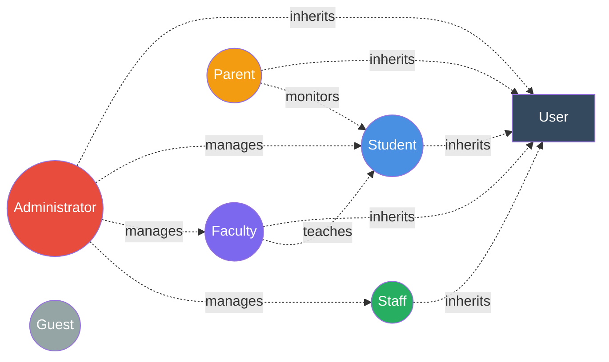

# EMIS - Use Case Diagram

## System Actors

### Primary Actors
- **Student**: Enrolled students using the system
- **Faculty**: Teaching staff and instructors
- **Administrator**: System and institutional administrators
- **Parent/Guardian**: Parents monitoring student progress
- **Staff**: Administrative and support staff (HR, Finance, Library, etc.)

### Secondary Actors
- **Guest**: Prospective students and visitors
- **Payment Gateway**: External payment processing system
- **Email/SMS Service**: External communication services
- **System**: Automated system processes

## Use Case Diagram

```mermaid
graph TB
    subgraph "EMIS - Education Management Information System"
        subgraph "User Management"
            UC1[Login/Logout]
            UC2[Manage Profile]
            UC3[Manage Users]
            UC4[Configure Permissions]
        end
        
        subgraph "Student Management"
            UC5[Enroll Student]
            UC6[View Student Profile]
            UC7[Update Student Status]
            UC8[Track Academic Progress]
        end
        
        subgraph "Admissions"
            UC9[Submit Application]
            UC10[Review Applications]
            UC11[Generate Merit List]
            UC12[Process Admissions]
        end
        
        subgraph "Academic Operations"
            UC13[Manage Programs/Courses]
            UC14[Register for Courses]
            UC15[Create Timetable]
            UC16[Schedule Exams]
            UC17[Enter Grades]
            UC18[Generate Transcript]
        end
        
        subgraph "Attendance"
            UC19[Mark Attendance]
            UC20[Apply for Leave]
            UC21[View Attendance Reports]
        end
        
        subgraph "Learning Management"
            UC22[Upload Course Content]
            UC23[Submit Assignment]
            UC24[Grade Assignment]
            UC25[Participate in Forum]
            UC26[Take Quiz]
        end
        
        subgraph "Finance"
            UC27[Configure Fee Structure]
            UC28[Pay Fees]
            UC29[Generate Invoice]
            UC30[View Financial Reports]
        end
        
        subgraph "Library"
            UC31[Search Catalog]
            UC32[Issue Book]
            UC33[Return Book]
            UC34[Pay Fine]
        end
        
        subgraph "HR Management"
            UC35[Manage Employees]
            UC36[Process Payroll]
            UC37[Apply for Leave]
            UC38[Approve Leave]
        end
        
        subgraph "Hostel Management"
            UC39[Allocate Room]
            UC40[Manage Mess]
            UC41[Pay Hostel Fee]
        end
        
        subgraph "Transport"
            UC42[Manage Routes]
            UC43[Apply for Transport]
            UC44[Track Vehicle]
        end
        
        subgraph "Communication"
            UC45[Send Announcement]
            UC46[Send Notification]
            UC47[View Notifications]
        end
        
        subgraph "Reports & Analytics"
            UC48[Generate Reports]
            UC49[View Dashboard]
            UC50[Export Data]
        end
    end
    
    Student((Student))
    Faculty((Faculty))
    Admin((Administrator))
    Parent((Parent/Guardian))
    Staff((Staff))
    Guest((Guest))
    PaymentGW[/Payment Gateway/]
    EmailSMS[/Email/SMS Service/]
    
    %% Student connections
    Student --> UC1
    Student --> UC2
    Student --> UC6
    Student --> UC9
    Student --> UC14
    Student --> UC18
    Student --> UC20
    Student --> UC21
    Student --> UC23
    Student --> UC25
    Student --> UC26
    Student --> UC28
    Student --> UC31
    Student --> UC34
    Student --> UC41
    Student --> UC43
    Student --> UC47
    Student --> UC49
    
    %% Faculty connections
    Faculty --> UC1
    Faculty --> UC2
    Faculty --> UC6
    Faculty --> UC8
    Faculty --> UC17
    Faculty --> UC19
    Faculty --> UC21
    Faculty --> UC22
    Faculty --> UC24
    Faculty --> UC25
    Faculty --> UC37
    Faculty --> UC49
    
    %% Administrator connections
    Admin --> UC1
    Admin --> UC3
    Admin --> UC4
    Admin --> UC5
    Admin --> UC7
    Admin --> UC10
    Admin --> UC11
    Admin --> UC12
    Admin --> UC13
    Admin --> UC15
    Admin --> UC16
    Admin --> UC27
    Admin --> UC29
    Admin --> UC30
    Admin --> UC35
    Admin --> UC36
    Admin --> UC38
    Admin --> UC39
    Admin --> UC40
    Admin --> UC42
    Admin --> UC45
    Admin --> UC46
    Admin --> UC48
    Admin --> UC50
    
    %% Parent connections
    Parent --> UC1
    Parent --> UC2
    Parent --> UC6
    Parent --> UC21
    Parent --> UC28
    Parent --> UC47
    
    %% Staff connections
    Staff --> UC1
    Staff --> UC2
    Staff --> UC29
    Staff --> UC32
    Staff --> UC33
    Staff --> UC35
    Staff --> UC38
    Staff --> UC39
    Staff --> UC44
    
    %% Guest connections
    Guest --> UC9
    Guest --> UC31
    
    %% External system connections
    UC28 -.->|processes payment| PaymentGW
    UC45 -.->|sends| EmailSMS
    UC46 -.->|sends| EmailSMS
    
    style Student fill:#4A90E2
    style Faculty fill:#7B68EE
    style Admin fill:#E74C3C
    style Parent fill:#F39C12
    style Staff fill:#27AE60
    style Guest fill:#95A5A6
    style PaymentGW fill:#E8F5E9
    style EmailSMS fill:#E8F5E9
```

## Actor Relationships

## Use Case Summary

| ID | Use Case Name | Primary Actor | Description |
|----|---------------|---------------|-------------|
| UC1 | Login/Logout | All Users | Authenticate and access system |
| UC2 | Manage Profile | All Users | Update personal information |
| UC3 | Manage Users | Administrator | Create and manage user accounts |
| UC4 | Configure Permissions | Administrator | Set role-based permissions |
| UC5 | Enroll Student | Administrator | Register new students |
| UC6 | View Student Profile | Student, Faculty, Parent, Admin | Access student information |
| UC7 | Update Student Status | Administrator | Manage student academic status |
| UC8 | Track Academic Progress | Faculty, Admin | Monitor student performance |
| UC9 | Submit Application | Guest, Student | Apply for admission |
| UC10 | Review Applications | Administrator | Evaluate applications |
| UC11 | Generate Merit List | Administrator | Create ranked admission list |
| UC12 | Process Admissions | Administrator | Finalize admissions |
| UC13 | Manage Programs/Courses | Administrator | Define curriculum |
| UC14 | Register for Courses | Student | Enroll in courses |
| UC15 | Create Timetable | Administrator | Schedule classes |
| UC16 | Schedule Exams | Administrator | Plan examination calendar |
| UC17 | Enter Grades | Faculty | Record student grades |
| UC18 | Generate Transcript | Student, Admin | Produce academic transcript |
| UC19 | Mark Attendance | Faculty | Record student attendance |
| UC20 | Apply for Leave | Student, Faculty, Staff | Request absence approval |
| UC21 | View Attendance Reports | Student, Faculty, Parent | Check attendance records |
| UC22 | Upload Course Content | Faculty | Share learning materials |
| UC23 | Submit Assignment | Student | Turn in coursework |
| UC24 | Grade Assignment | Faculty | Evaluate submissions |
| UC25 | Participate in Forum | Student, Faculty | Engage in discussions |
| UC26 | Take Quiz | Student | Complete assessments |
| UC27 | Configure Fee Structure | Administrator | Define fee schedules |
| UC28 | Pay Fees | Student, Parent | Make payments |
| UC29 | Generate Invoice | Administrator, Staff | Create billing documents |
| UC30 | View Financial Reports | Administrator | Analyze finances |
| UC31 | Search Catalog | All | Find library resources |
| UC32 | Issue Book | Staff | Lend library materials |
| UC33 | Return Book | Staff | Process book returns |
| UC34 | Pay Fine | Student | Settle library penalties |
| UC35 | Manage Employees | Administrator, Staff | Handle HR records |
| UC36 | Process Payroll | Administrator | Generate salary payments |
| UC37 | Apply for Leave | Faculty, Staff | Request time off |
| UC38 | Approve Leave | Administrator, Staff | Review leave requests |
| UC39 | Allocate Room | Administrator, Staff | Assign hostel accommodation |
| UC40 | Manage Mess | Administrator, Staff | Oversee dining services |
| UC41 | Pay Hostel Fee | Student | Pay accommodation charges |
| UC42 | Manage Routes | Administrator | Define transport routes |
| UC43 | Apply for Transport | Student | Request bus service |
| UC44 | Track Vehicle | Staff | Monitor vehicle location |
| UC45 | Send Announcement | Administrator | Broadcast messages |
| UC46 | Send Notification | Administrator | Send targeted alerts |
| UC47 | View Notifications | Student, Parent | Read messages |
| UC48 | Generate Reports | Administrator | Create custom reports |
| UC49 | View Dashboard | Student, Faculty, Admin | Access personalized overview |
| UC50 | Export Data | Administrator | Extract system data |
