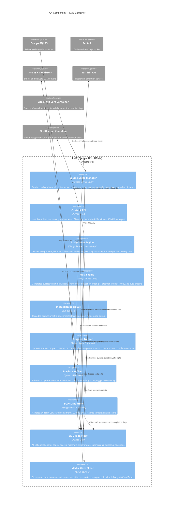
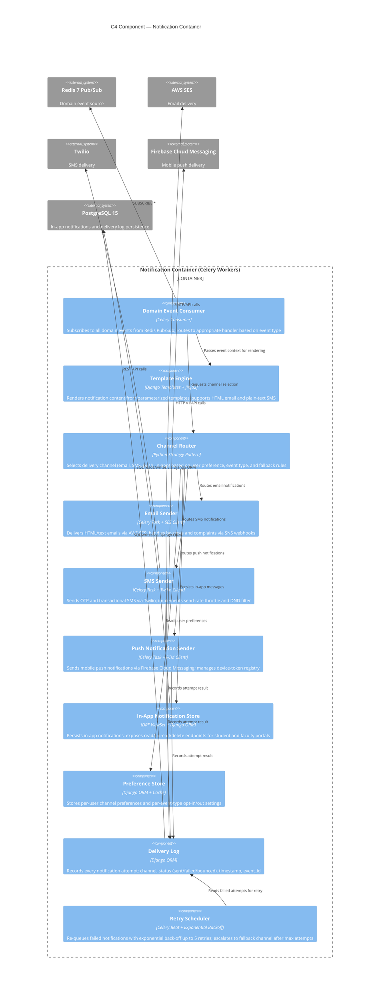
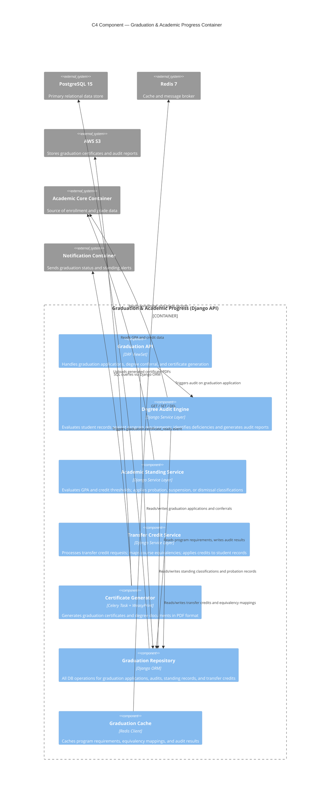
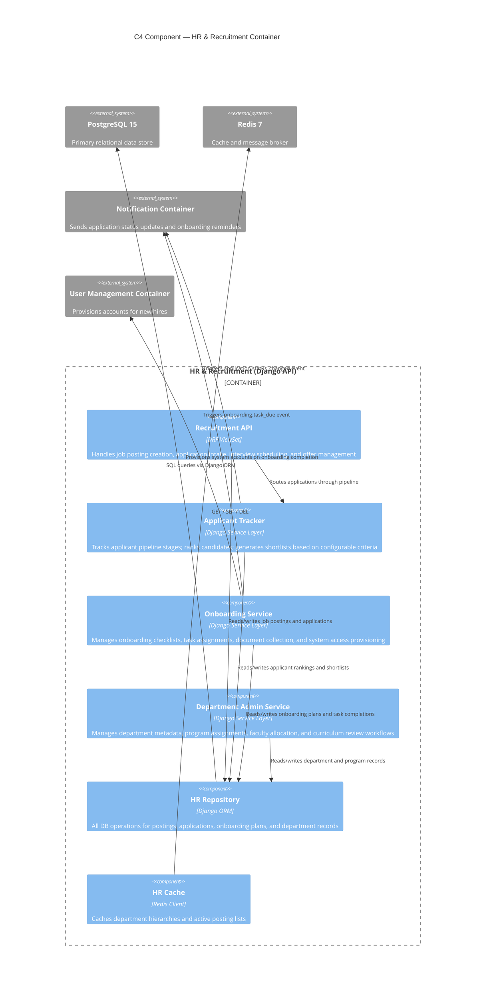
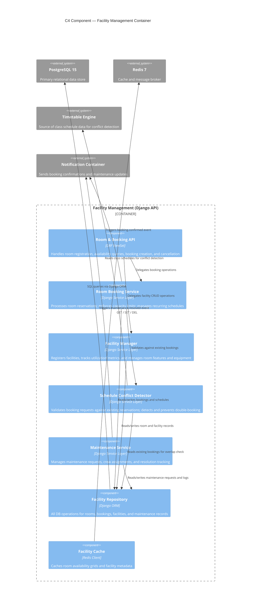
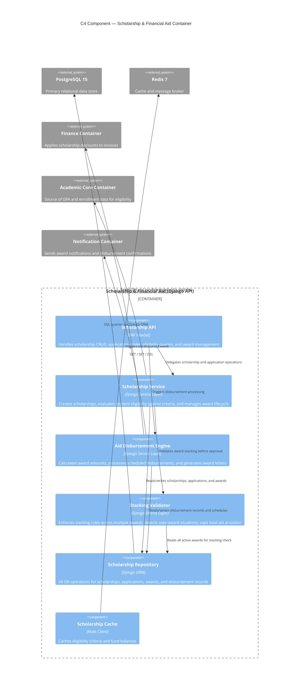
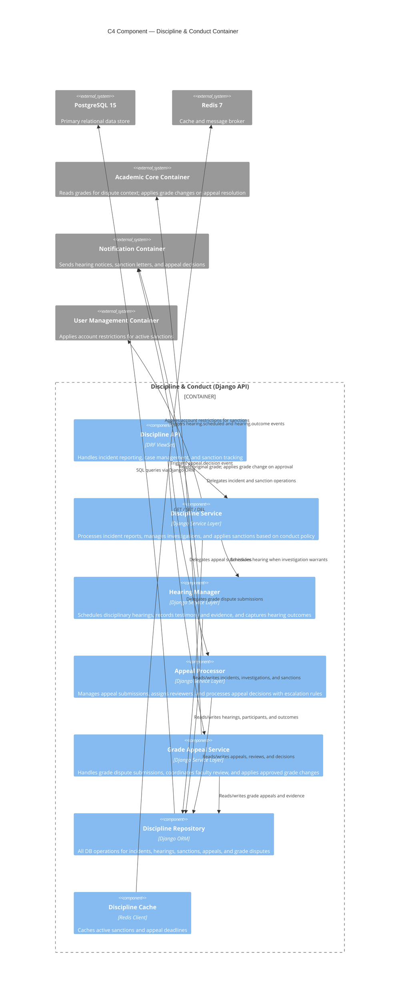

# C4 Component Diagram — Education Management Information System

C4 Level 3 component diagrams for the four primary EMIS containers, showing internal components, their responsibilities, and inbound/outbound communication paths.

---

## 1. Academic Core Container

```mermaid
C4Component
    title C4 Component — Academic Core Container

    Container_Boundary(academic, "Academic Core (Django API)") {
        Component(admissions_api, "Admissions API", "DRF ViewSet", "Handles application submission, document upload, merit-list generation, and offer dispatch")
        Component(enrollment_svc, "Enrollment Service", "Django Service Layer", "Processes course registration, pre-requisite checks, seat-limit enforcement, and add-drop window logic")
        Component(curriculum_mgr, "Curriculum Manager", "Django Service Layer", "Manages programs, courses, sections, and semester configurations")
        Component(timetable_engine, "Timetable Engine", "Django + Celery Task", "Generates and validates conflict-free class schedules; exposes read-only API for student portal")
        Component(attendance_tracker, "Attendance Tracker", "DRF ViewSet + Celery", "Records daily attendance, sends absence-threshold alerts, and aggregates attendance percentages")
        Component(grade_publisher, "Grade Publisher", "Django Service Layer", "Manages grade submission, publishing workflow, dispute handling, and GPA recalculation")
        Component(exam_scheduler, "Exam Scheduler", "Django Service Layer", "Creates exam definitions, assigns halls, generates admit cards, and enforces grading windows")
        Component(repo_layer, "Academic Repository", "Django ORM", "All DB read/write operations via Django ORM models (Program, Course, Section, Enrollment, Grade, Exam)")
        Component(cache_layer, "Academic Cache", "Redis Client", "Caches programme catalogs, timetable grids, and semester metadata")
        Component(event_emitter, "Domain Event Bus", "Celery + Redis", "Publishes events: enrollment.confirmed, grade.published, attendance.threshold_breached")
    }

    System_Ext(db_postgres, "PostgreSQL 15", "Primary relational data store")
    System_Ext(redis_cache, "Redis 7", "Cache and message broker")
    System_Ext(notification_container, "Notification Container", "Sends emails/SMS/push on academic events")
    System_Ext(finance_container, "Finance Container", "Creates fee invoices on admission/enrollment")
    System_Ext(lms_container, "LMS Container", "Mirrors course sections to learning space")
    System_Ext(storage_s3, "AWS S3", "Stores admit cards, transcripts, uploaded documents")

    Rel(admissions_api, repo_layer, "Reads/writes applications, documents, merit lists")
    Rel(enrollment_svc, repo_layer, "Reads/writes enrollments, checks seat counts")
    Rel(enrollment_svc, cache_layer, "Reads timetable and section data")
    Rel(grade_publisher, repo_layer, "Reads/writes grades, GPA records, disputes")
    Rel(exam_scheduler, repo_layer, "Reads/writes exams, hall assignments")
    Rel(timetable_engine, repo_layer, "Reads/writes timetable slots")
    Rel(attendance_tracker, repo_layer, "Reads/writes attendance records")
    Rel(curriculum_mgr, repo_layer, "Reads/writes programs, courses, sections")
    Rel(cache_layer, redis_cache, "GET / SET / DEL")
    Rel(repo_layer, db_postgres, "SQL queries via Django ORM")
    Rel(event_emitter, redis_cache, "PUBLISH domain events")
    Rel(notification_container, event_emitter, "SUBSCRIBE to academic events")
    Rel(finance_container, enrollment_svc, "Listens enrollment.confirmed → creates invoice")
    Rel(lms_container, curriculum_mgr, "Listens section.created → creates course space")
    Rel(exam_scheduler, storage_s3, "Generates and stores admit card PDF")
    Rel(grade_publisher, storage_s3, "Generates and stores transcript PDF")
```

---

## 2. Finance and Payment Container

```mermaid
C4Component
    title C4 Component — Finance & Payment Container

    Container_Boundary(finance, "Finance & Payment (Django API)") {
        Component(invoice_svc, "Invoice Service", "Django Service Layer", "Generates, versions, and manages fee invoices; applies scholarships; triggers overdue workflow")
        Component(payment_api, "Payment API", "DRF ViewSet", "Exposes checkout initiation, Razorpay/Stripe webhook receiver, and payment-status endpoints")
        Component(gateway_client, "Gateway Client", "Python SDK Wrapper", "Abstracts Razorpay and Stripe SDK calls; handles idempotency keys and retries")
        Component(refund_engine, "Refund Engine", "Django Service Layer", "Processes refund requests, validates eligibility, calls gateway reverse API, updates transaction records")
        Component(scholarship_mgr, "Scholarship Manager", "Django Service Layer", "Evaluates student eligibility, applies discount rules, and creates scholarship ledger entries")
        Component(ledger_svc, "Ledger Service", "Django Service Layer", "Maintains double-entry accounting ledger; reconciles payments with invoices")
        Component(receipt_gen, "Receipt Generator", "Celery Task + WeasyPrint", "Generates signed PDF receipts; stores on S3; emails download link to student")
        Component(hold_enforcer, "Financial Hold Enforcer", "Django Middleware/Signal", "Blocks enrollment API if student has unpaid overdue invoice; releases hold on full payment")
        Component(finance_repo, "Finance Repository", "Django ORM", "All DB operations for invoices, transactions, refunds, scholarships, ledger")
        Component(finance_cache, "Finance Cache", "Redis Client", "Caches fee structures, scholarship rules, and student balance summaries")
    }

    System_Ext(razorpay_gw, "Razorpay", "Payment gateway for Indian market")
    System_Ext(stripe_gw, "Stripe", "Payment gateway for international students")
    System_Ext(db_postgres, "PostgreSQL 15", "Primary relational data store")
    System_Ext(redis_cache, "Redis 7", "Cache and message broker")
    System_Ext(storage_s3, "AWS S3", "Stores receipts and refund vouchers")
    System_Ext(notification_container, "Notification Container", "Sends payment confirmation and overdue notices")
    System_Ext(academic_container, "Academic Core Container", "Listens to fee hold to block enrollment")

    Rel(invoice_svc, finance_repo, "Reads/writes invoices, line items, scholarships")
    Rel(invoice_svc, finance_cache, "Caches fee structure lookups")
    Rel(payment_api, gateway_client, "Initiates checkout session / processes webhook")
    Rel(gateway_client, razorpay_gw, "API calls (create order, capture, refund)")
    Rel(gateway_client, stripe_gw, "API calls (create intent, confirm, refund)")
    Rel(refund_engine, gateway_client, "Calls gateway refund API")
    Rel(refund_engine, finance_repo, "Reads/writes refund records")
    Rel(scholarship_mgr, finance_repo, "Reads scholarship rules, writes discount entries")
    Rel(ledger_svc, finance_repo, "Writes debit/credit ledger entries")
    Rel(receipt_gen, storage_s3, "Uploads receipt PDF")
    Rel(receipt_gen, notification_container, "Triggers payment.receipt_ready event")
    Rel(hold_enforcer, finance_repo, "Reads overdue invoices")
    Rel(hold_enforcer, academic_container, "Raises financial hold flag via API")
    Rel(finance_repo, db_postgres, "SQL queries via Django ORM")
    Rel(finance_cache, redis_cache, "GET / SET / DEL")
```

---

## 3. LMS Container

---

## 4. Notification Container

---

## 5. Graduation & Academic Progress Container

---

## 6. HR & Recruitment Container

---

## 7. Facility Management Container

---

## 8. Scholarship & Financial Aid Container

---

## 9. Discipline & Conduct Container

