# Class Diagram — Education Management Information System

This document provides UML class diagrams for the five core EMIS domains, showing key attributes, methods, and inter-class relationships.

---

## 1. User and Authentication Domain

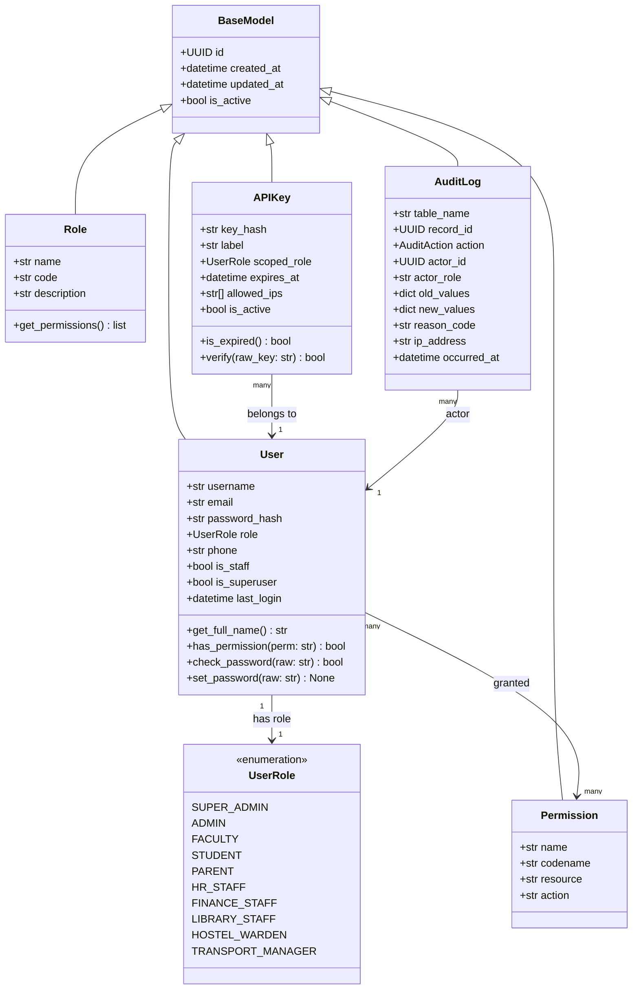

---

## 2. Academic Domain

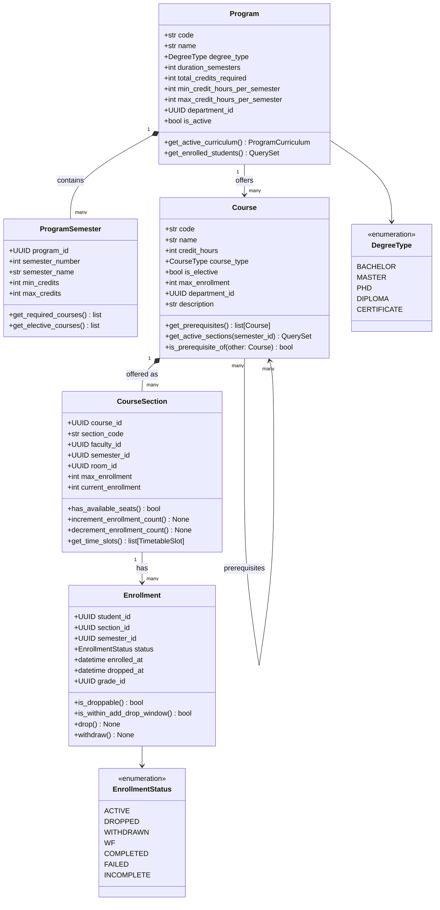

---

## 3. Student and Admissions Domain

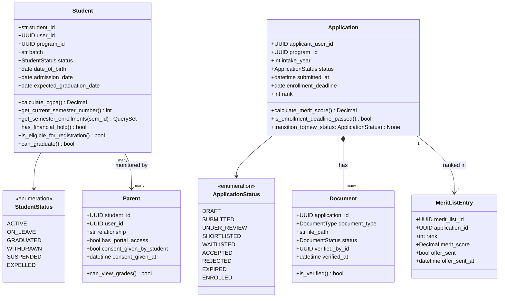

---

## 4. Assessment Domain

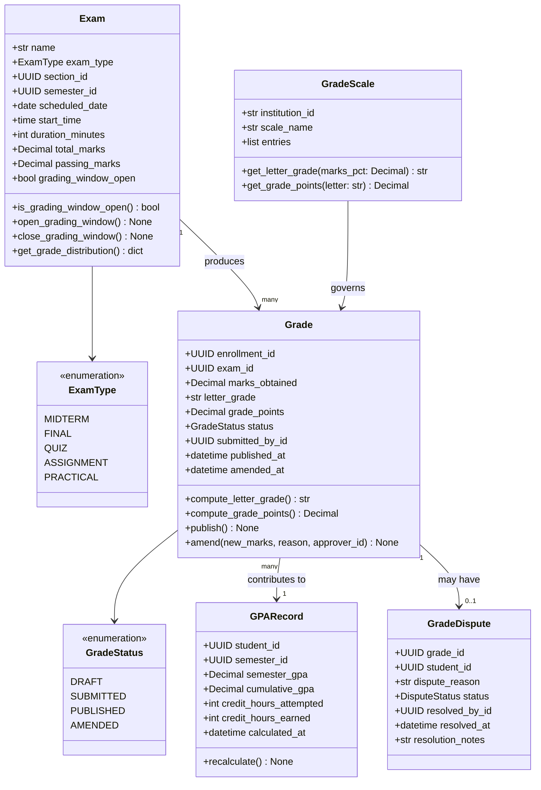

---

## 5. Finance Domain

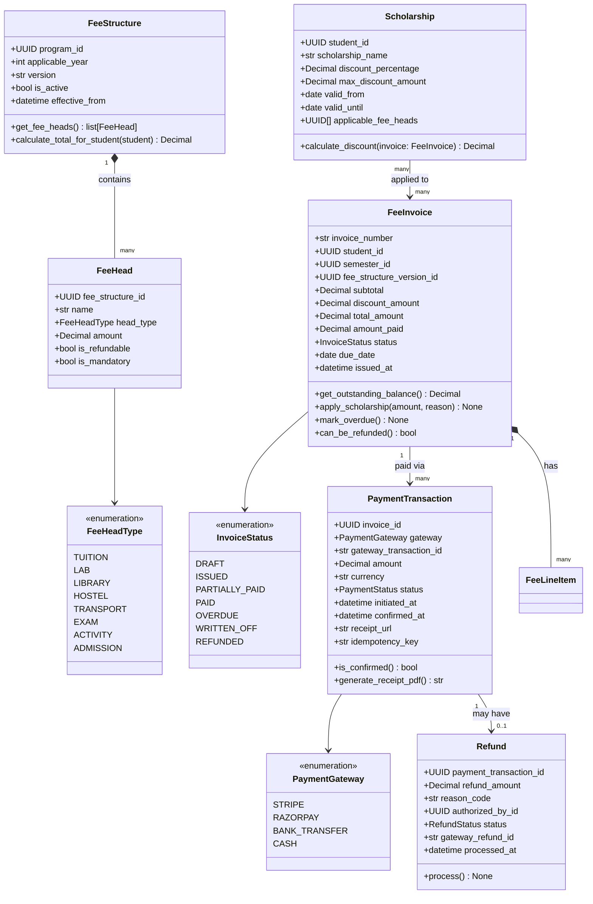

---

### Graduation & Degree Management

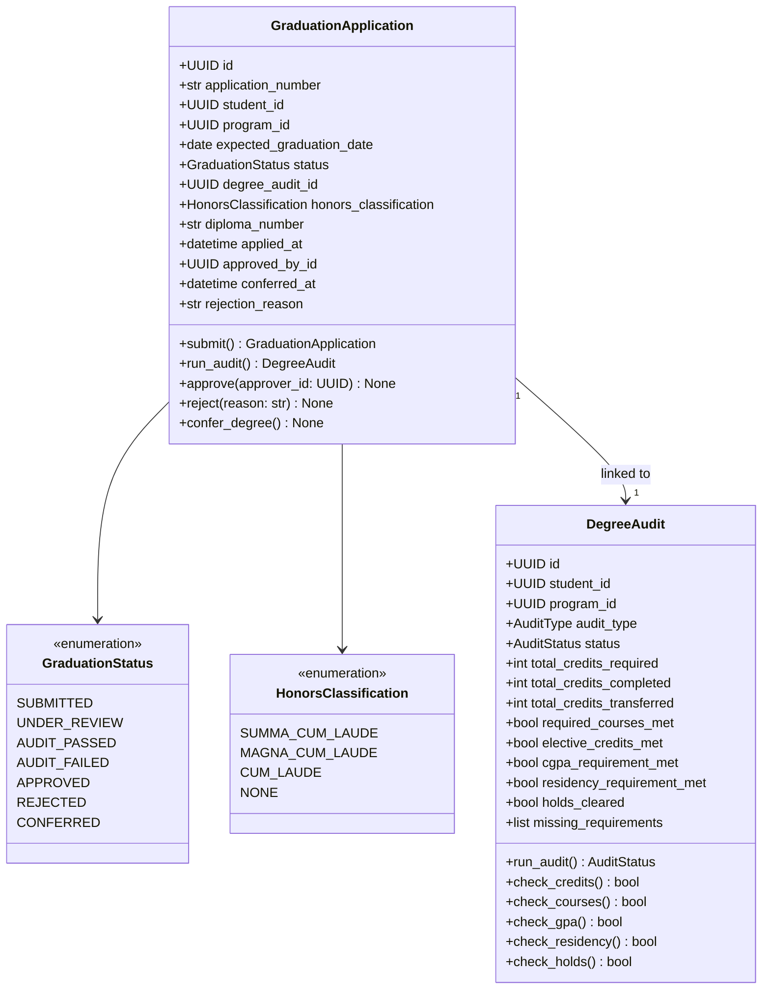

### Student Discipline

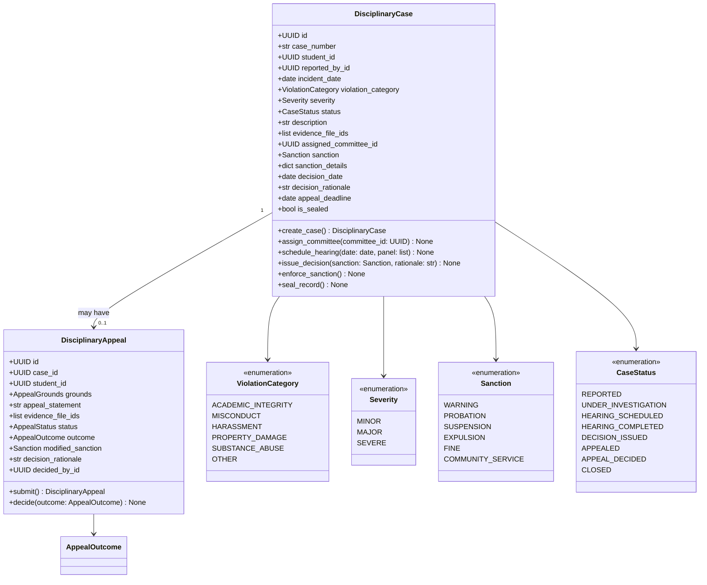

### Academic Standing

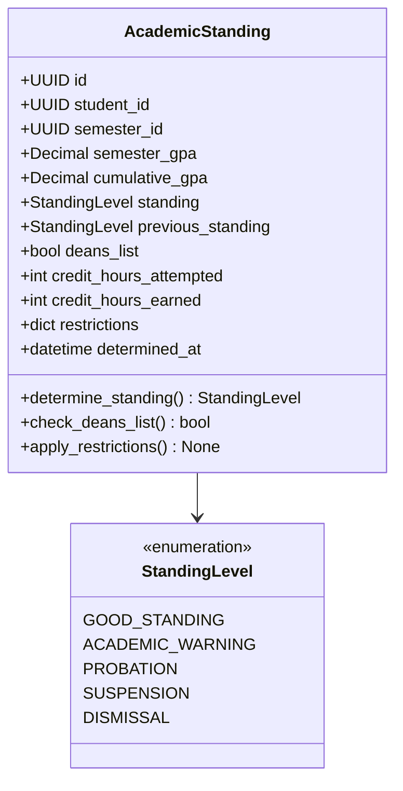

### Grade Appeal

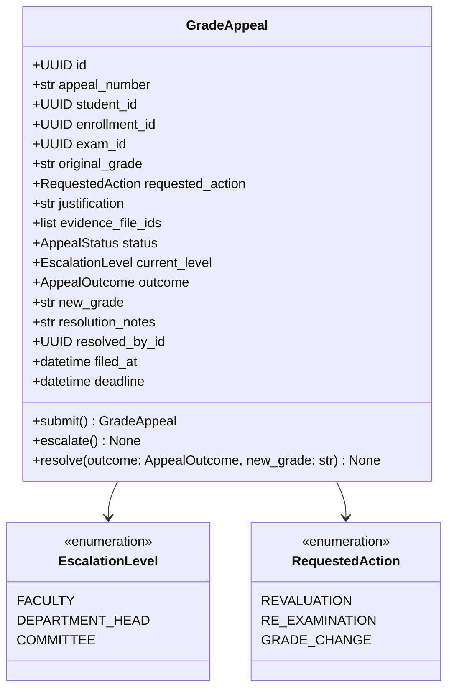

### Faculty Recruitment

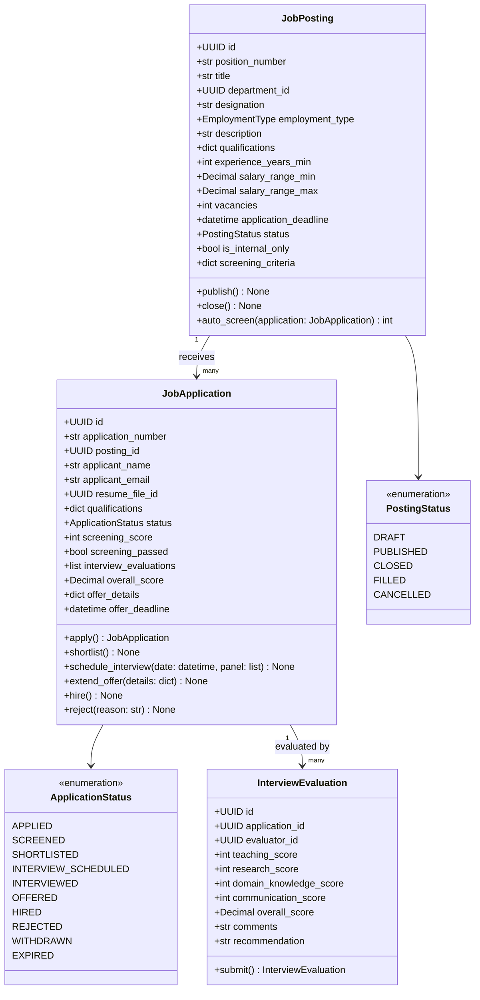

### Room & Facility Management

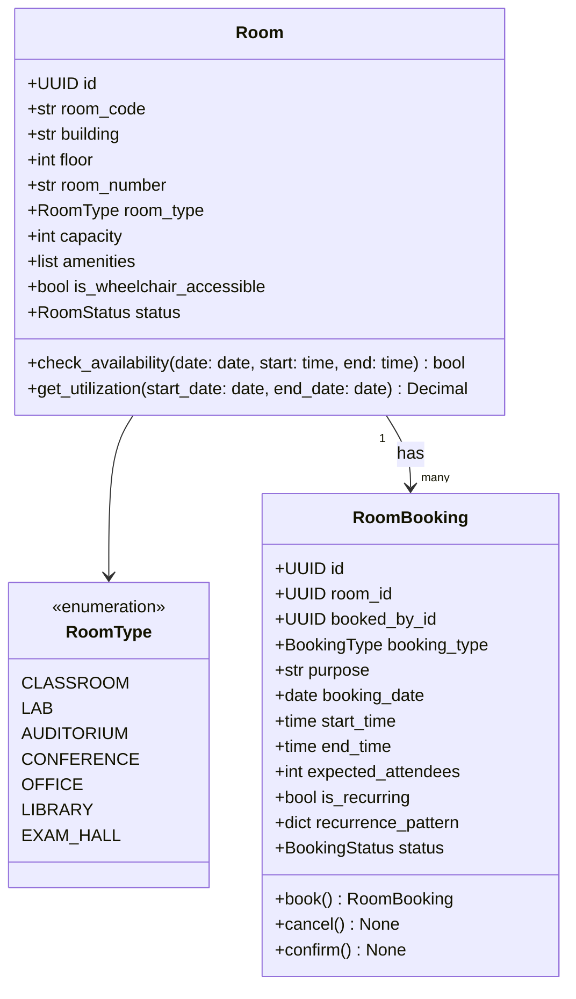

### Transfer Credits

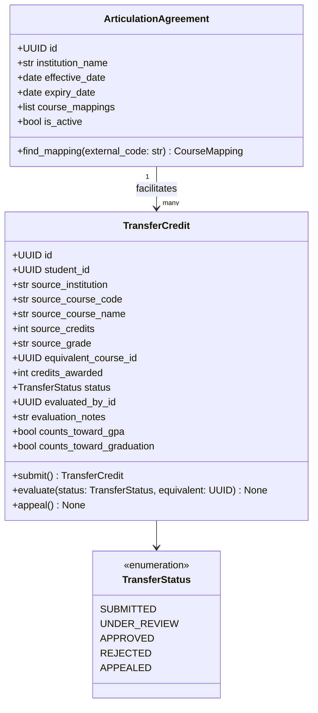

### Scholarship & Financial Aid

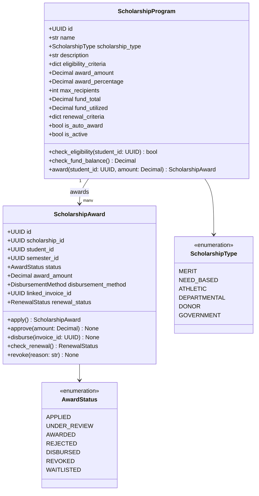

### Department & Curriculum

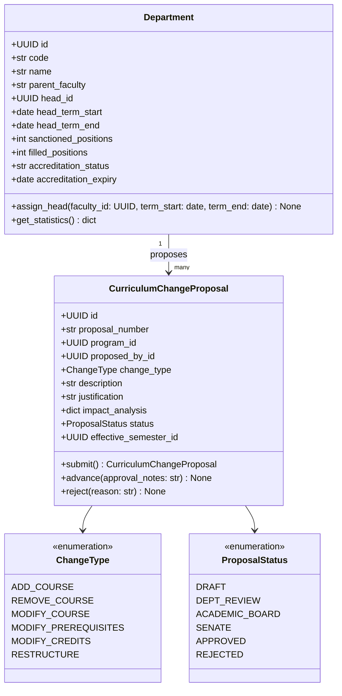

---

### Admission Cycle & Examination Management

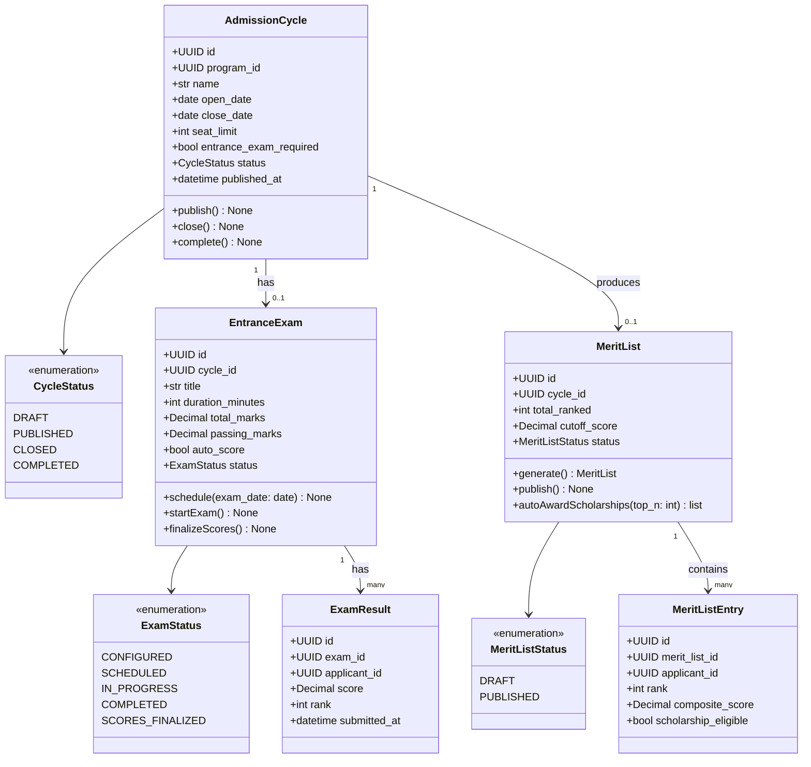

---

### Semester Progression Management

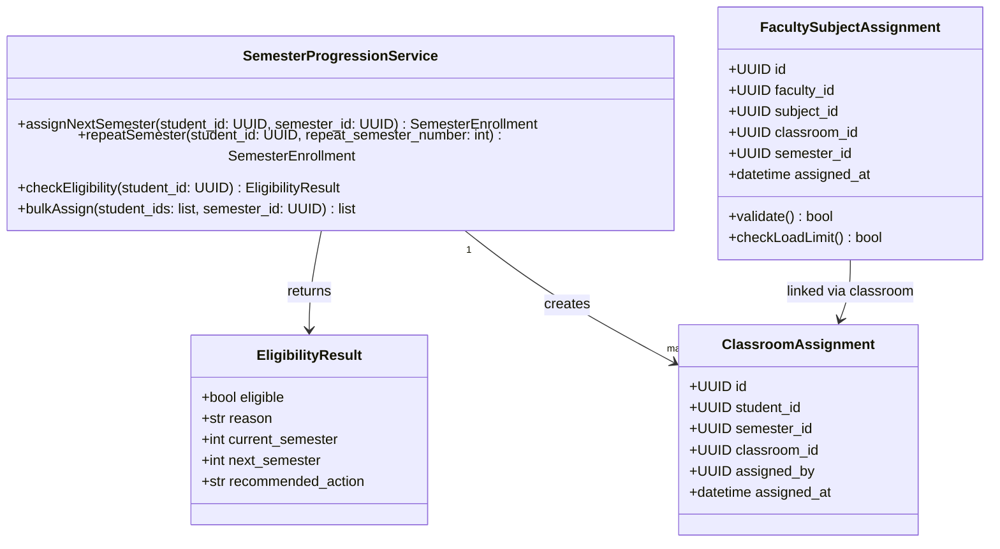
