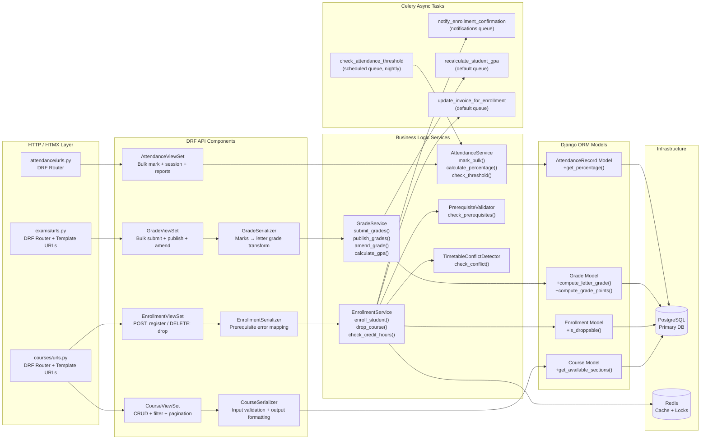
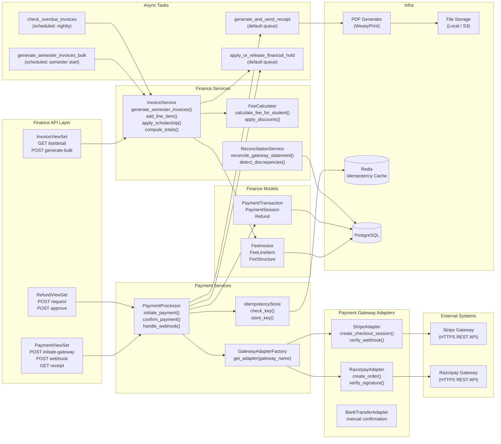
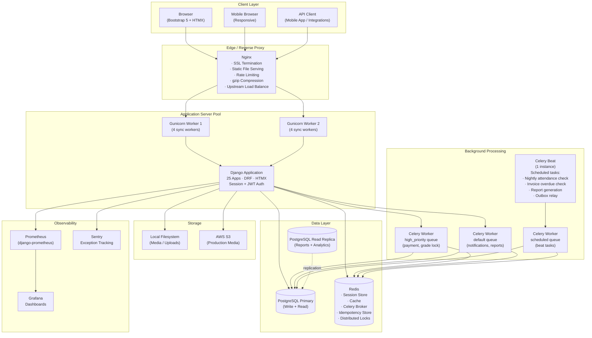
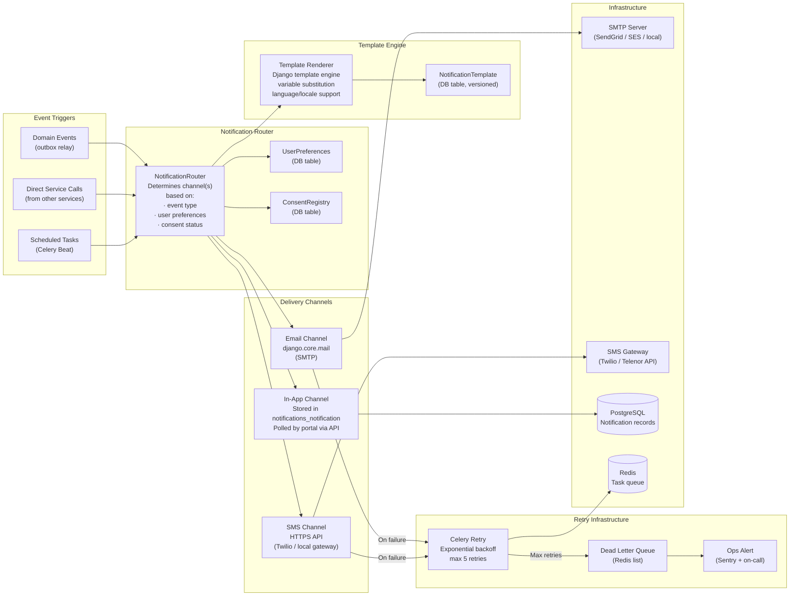
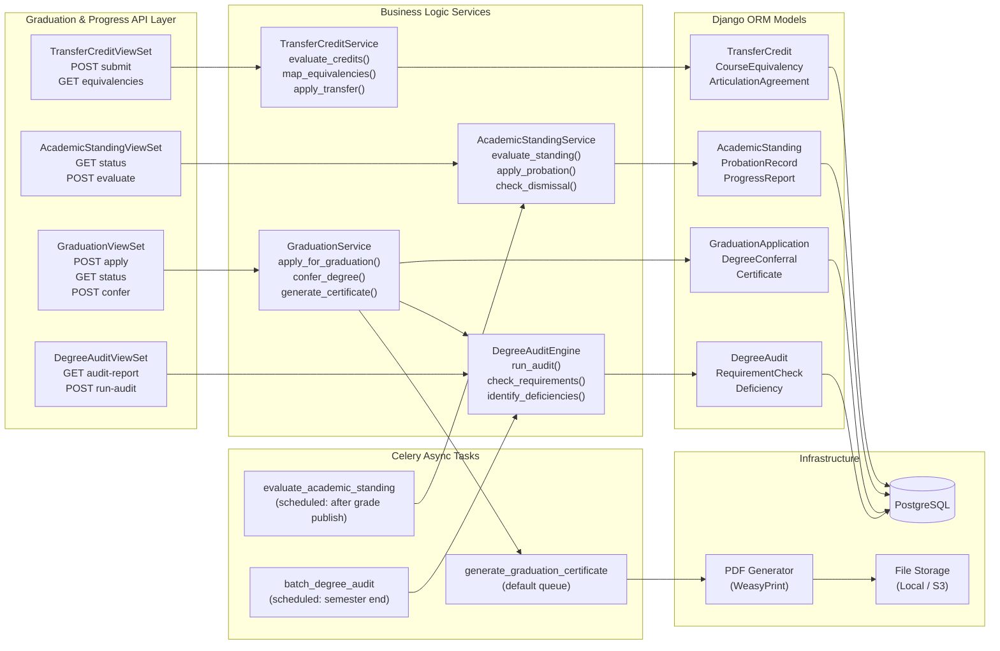
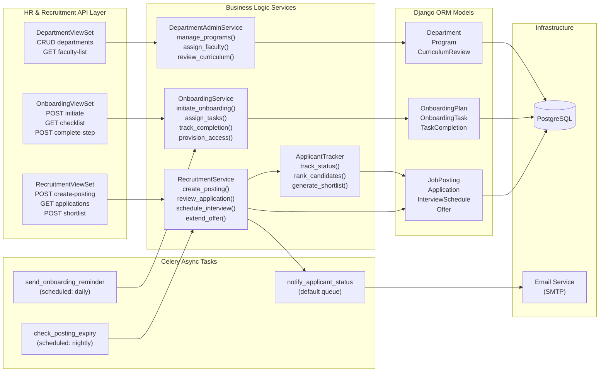
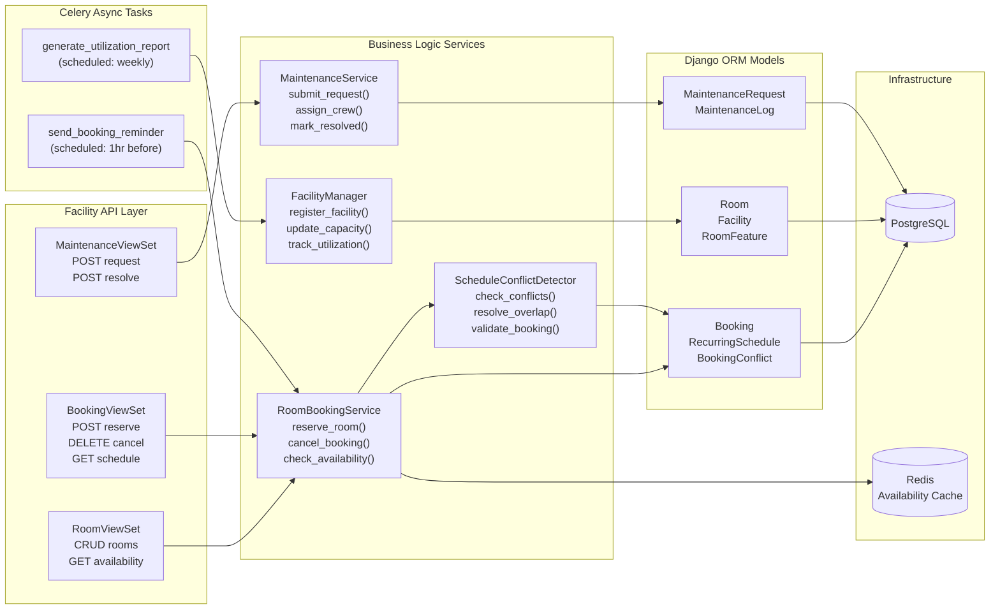
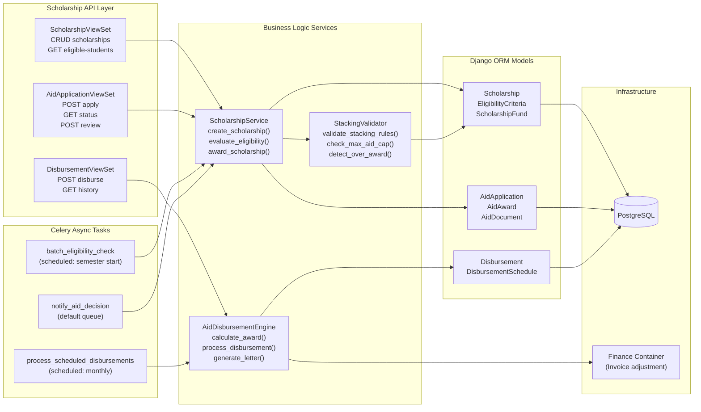
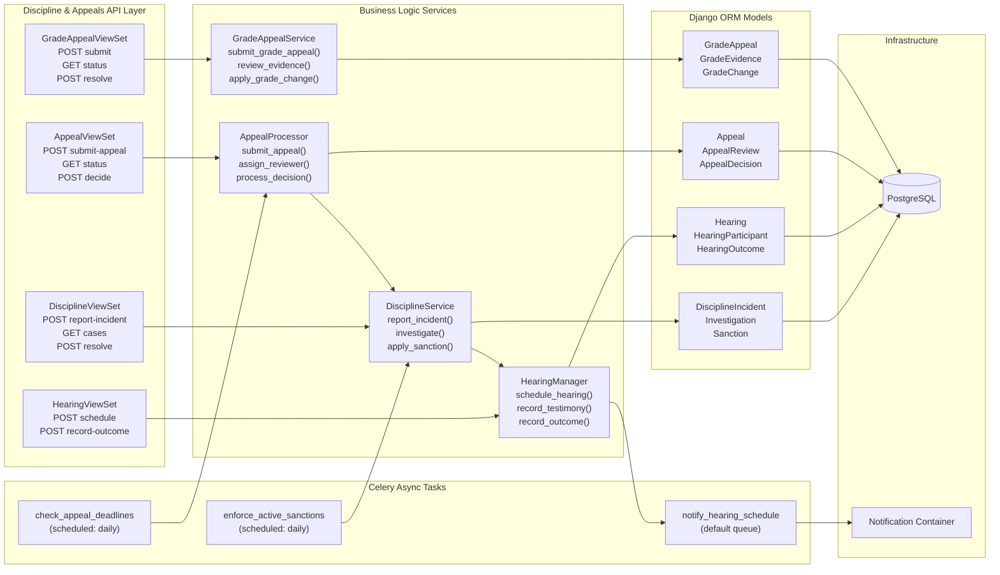

# Component Diagram — Education Management Information System

This document shows internal component structure across EMIS containers, illustrating how Django apps, services, adapters, and infrastructure components interact.

---

## 1. Full Application Component Overview

All 25 Django apps grouped by domain, with inter-component dependencies.

```mermaid
flowchart TB
    subgraph Foundation["Foundation Layer"]
        core["core\nBaseModel · Audit · Middleware"]
        users["users\nAuth · RBAC · JWT · Permissions"]
    end

    subgraph Academic["Academic Layer"]
        admissions["admissions\nApplication · MeritList · Enrollment"]
        students["students\nProfile · Status · Progress"]
        courses["courses\nProgram · Course · Section · Enrollment"]
        faculty["faculty\nProfile · TeachingLoad · Leave"]
        timetable["timetable\nSlot · RoomAllocation · ConflictDetection"]
        exams["exams\nExam · Grade · GPA · Transcript"]
        attendance["attendance\nSession · Record · ThresholdMonitor"]
        lms["lms\nModule · Content · Assignment · Quiz · Certificate"]
    end

    subgraph Admin["Administrative Layer"]
        finance["finance\nFeeStructure · Invoice · Scholarship"]
        payment["payment\nGateway · Transaction · Receipt · Refund"]
        hr["hr\nEmployee · Payroll · Leave · Payslip"]
        inventory["inventory\nAsset · Stock · PurchaseOrder"]
    end

    subgraph Facilities["Facility Layer"]
        library["library\nCatalog · Circulation · Fine"]
        hostel["hostel\nRoom · Allocation · Mess · Complaint"]
        transport["transport\nRoute · Vehicle · Allocation"]
    end

    subgraph Output["Output & Communication Layer"]
        notifications["notifications\nDispatch · Template · Retry"]
        analytics["analytics\nDashboard · KPI · AtRisk"]
        reports["reports\nBuilder · Scheduler · Export"]
        cms["cms\nPage · Article · Media · Menu"]
        seo["seo\nMetaTag · Sitemap · Analytics"]
        calendar["calendar\nAcademicCalendar · Event · Personal"]
        portal["portal\nStudentPortal · FacultyPortal · ParentPortal"]
        files["files\nDocument · Storage · Version"]
    end

    %% Foundation
    users --> core
    admissions --> core & users
    students --> core & users & courses & admissions
    courses --> core & users
    faculty --> core & users
    timetable --> core & courses & faculty
    exams --> core & courses & students
    attendance --> core & courses & students
    lms --> core & courses & students

    finance --> core & students & courses
    payment --> core & finance
    hr --> core & users
    inventory --> core

    library --> core & users
    hostel --> core & students
    transport --> core & students

    notifications --> core & users
    analytics --> core & students & exams & attendance & finance
    reports --> core & students & exams & finance
    portal --> core & students & exams & finance & attendance & lms
    cms --> core
    seo --> core & cms
    calendar --> core
    files --> core
```

---

## 2. Academic Core Components — Detailed View

---

## 3. Finance and Payment Components

---

## 4. Infrastructure Components

---

## 5. Notification System Components

---

## 6. Graduation & Academic Progress Components

---

## 7. HR & Recruitment Components

---

## 8. Facility & Scheduling Components

---

## 9. Scholarship & Aid Components

---

## 10. Discipline & Appeals Components

