# EMIS - Entity-Relationship Diagram & Database Schema

## Overview

This document provides the complete database schema for EMIS system, showing all tables, columns, relationships, and constraints.

## Core Schema - Users & Authentication

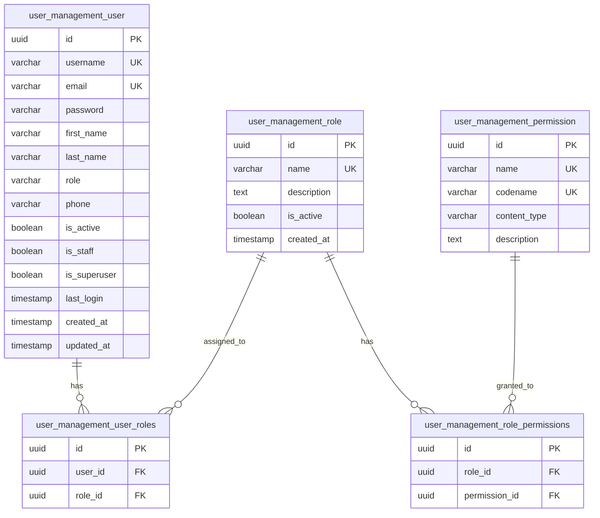
```mermaid
erDiagram
    user_management_user {
        uuid id PK
        varchar username UK
        varchar email UK
        varchar password
        varchar first_name
        varchar last_name
        varchar role
        varchar phone
        boolean is_active
        boolean is_staff
        boolean is_superuser
        timestamp last_login
        timestamp created_at
        timestamp updated_at
    }
    
    user_management_role {
        uuid id PK
        varchar name UK
        text description
        boolean is_active
        timestamp created_at
    }
    
    user_management_permission {
        uuid id PK
        varchar name UK
        varchar codename UK
        varchar content_type
        text description
    }
    
    user_management_user_roles {
        uuid id PK
        uuid user_id FK
        uuid role_id FK
    }
    
    user_management_role_permissions {
        uuid id PK
        uuid role_id FK
        uuid permission_id FK
    }
    
    user_management_user ||--o{ user_management_user_roles : "has"
    user_management_role ||--o{ user_management_user_roles : "assigned_to"
    user_management_role ||--o{ user_management_role_permissions : "has"
    user_management_permission ||--o{ user_management_role_permissions : "granted_to"
```

## Academic Schema - Students & Faculty

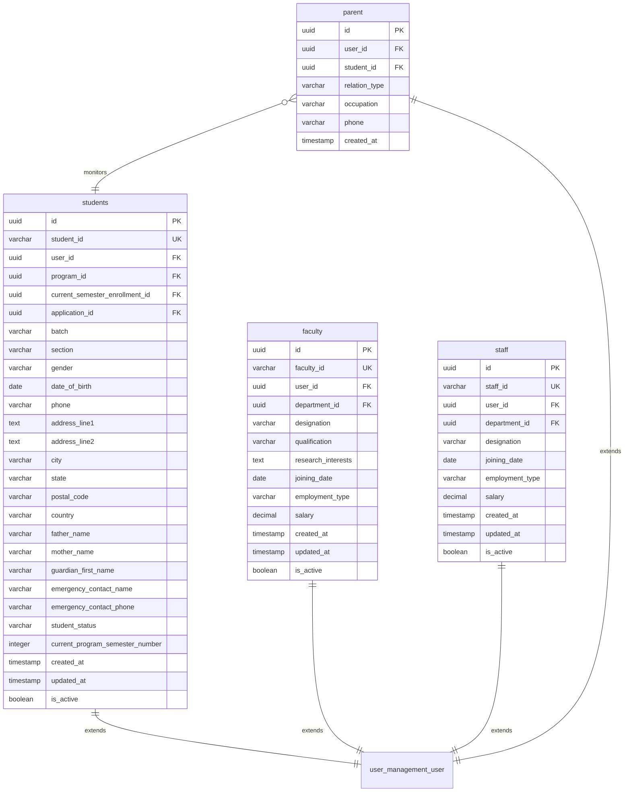
```mermaid
erDiagram
    students {
        uuid id PK
        varchar student_id UK
        uuid user_id FK
        uuid program_id FK
        uuid current_semester_enrollment_id FK
        uuid application_id FK
        varchar batch
        varchar section
        varchar gender
        date date_of_birth
        varchar phone
        text address_line1
        text address_line2
        varchar city
        varchar state
        varchar postal_code
        varchar country
        varchar father_name
        varchar mother_name
        varchar guardian_first_name
        varchar emergency_contact_name
        varchar emergency_contact_phone
        varchar student_status
        integer current_program_semester_number
        timestamp created_at
        timestamp updated_at
        boolean is_active
    }
    
    faculty {
        uuid id PK
        varchar faculty_id UK
        uuid user_id FK
        uuid department_id FK
        varchar designation
        varchar qualification
        text research_interests
        date joining_date
        varchar employment_type
        decimal salary
        timestamp created_at
        timestamp updated_at
        boolean is_active
    }
    
    staff {
        uuid id PK
        varchar staff_id UK
        uuid user_id FK
        uuid department_id FK
        varchar designation
        date joining_date
        varchar employment_type
        decimal salary
        timestamp created_at
        timestamp updated_at
        boolean is_active
    }
    
    parent {
        uuid id PK
        uuid user_id FK
        uuid student_id FK
        varchar relation_type
        varchar occupation
        varchar phone
        timestamp created_at
    }
    
    students ||--|| user_management_user : "extends"
    faculty ||--|| user_management_user : "extends"
    staff ||--|| user_management_user : "extends"
    parent ||--|| user_management_user : "extends"
    parent }o--|| students : "monitors"
```

## Academic Schema - Programs & Courses

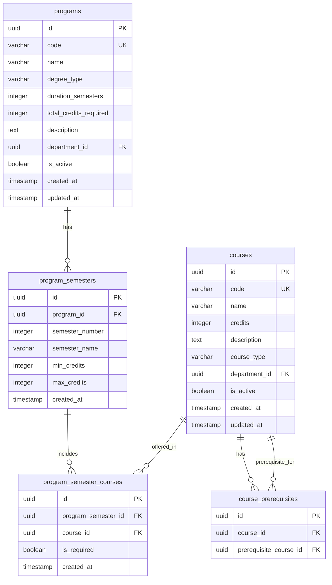
```mermaid
erDiagram
    programs {
        uuid id PK
        varchar code UK
        varchar name
        varchar degree_type
        integer duration_semesters
        integer total_credits_required
        text description
        uuid department_id FK
        boolean is_active
        timestamp created_at
        timestamp updated_at
    }
    
    program_semesters {
        uuid id PK
        uuid program_id FK
        integer semester_number
        varchar semester_name
        integer min_credits
        integer max_credits
        timestamp created_at
    }
    
    courses {
        uuid id PK
        varchar code UK
        varchar name
        integer credits
        text description
        varchar course_type
        uuid department_id FK
        boolean is_active
        timestamp created_at
        timestamp updated_at
    }
    
    course_prerequisites {
        uuid id PK
        uuid course_id FK
        uuid prerequisite_course_id FK
    }
    
    program_semester_courses {
        uuid id PK
        uuid program_semester_id FK
        uuid course_id FK
        boolean is_required
        timestamp created_at
    }
    
    programs ||--o{ program_semesters : "has"
    program_semesters ||--o{ program_semester_courses : "includes"
    courses ||--o{ program_semester_courses : "offered_in"
    courses ||--o{ course_prerequisites : "has"
    courses ||--o{ course_prerequisites : "prerequisite_for"
```

## Academic Schema - Enrollment & Scheduling

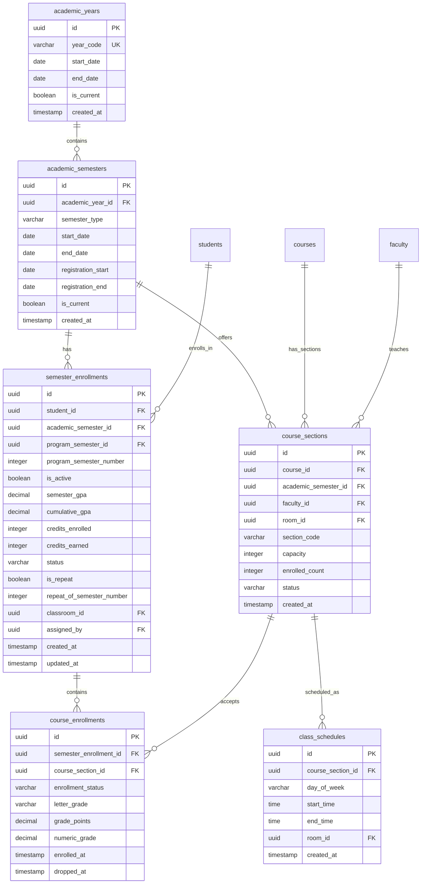
```mermaid
erDiagram
    academic_years {
        uuid id PK
        varchar year_code UK
        date start_date
        date end_date
        boolean is_current
        timestamp created_at
    }
    
    academic_semesters {
        uuid id PK
        uuid academic_year_id FK
        varchar semester_type
        date start_date
        date end_date
        date registration_start
        date registration_end
        boolean is_current
        timestamp created_at
    }
    
    semester_enrollments {
        uuid id PK
        uuid student_id FK
        uuid academic_semester_id FK
        uuid program_semester_id FK
        integer program_semester_number
        boolean is_active
        decimal semester_gpa
        decimal cumulative_gpa
        integer credits_enrolled
        integer credits_earned
        varchar status
        boolean is_repeat
        integer repeat_of_semester_number
        uuid classroom_id FK
        uuid assigned_by FK
        timestamp created_at
        timestamp updated_at
    }
    
    course_sections {
        uuid id PK
        uuid course_id FK
        uuid academic_semester_id FK
        uuid faculty_id FK
        uuid room_id FK
        varchar section_code
        integer capacity
        integer enrolled_count
        varchar status
        timestamp created_at
    }
    
    course_enrollments {
        uuid id PK
        uuid semester_enrollment_id FK
        uuid course_section_id FK
        varchar enrollment_status
        varchar letter_grade
        decimal grade_points
        decimal numeric_grade
        timestamp enrolled_at
        timestamp dropped_at
    }
    
    class_schedules {
        uuid id PK
        uuid course_section_id FK
        varchar day_of_week
        time start_time
        time end_time
        uuid room_id FK
        timestamp created_at
    }
    
    academic_years ||--o{ academic_semesters : "contains"
    academic_semesters ||--o{ semester_enrollments : "has"
    academic_semesters ||--o{ course_sections : "offers"
    students ||--o{ semester_enrollments : "enrolls_in"
    semester_enrollments ||--o{ course_enrollments : "contains"
    course_sections ||--o{ course_enrollments : "accepts"
    courses ||--o{ course_sections : "has_sections"
    faculty ||--o{ course_sections : "teaches"
    course_sections ||--o{ class_schedules : "scheduled_as"
```

## Facilities Schema

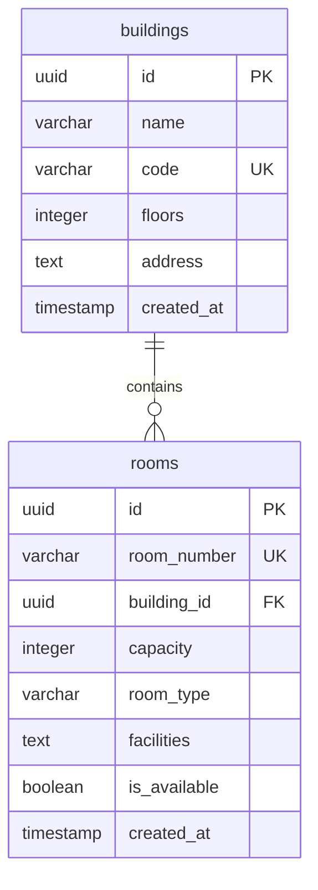
```mermaid
erDiagram
    buildings {
        uuid id PK
        varchar name
        varchar code UK
        integer floors
        text address
        timestamp created_at
    }
    
    rooms {
        uuid id PK
        varchar room_number UK
        uuid building_id FK
        integer capacity
        varchar room_type
        text facilities
        boolean is_available
        timestamp created_at
    }
    
    buildings ||--o{ rooms : "contains"
```

## Admissions Schema

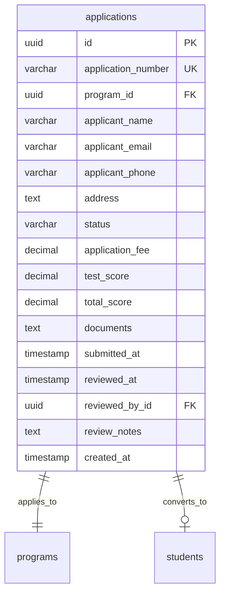
```mermaid
erDiagram
    applications {
        uuid id PK
        varchar application_number UK
        uuid program_id FK
        varchar applicant_name
        varchar applicant_email
        varchar applicant_phone
        text address
        varchar status
        decimal application_fee
        decimal test_score
        decimal total_score
        text documents
        timestamp submitted_at
        timestamp reviewed_at
        uuid reviewed_by_id FK
        text review_notes
        timestamp created_at
    }
    
    applications ||--|| programs : "applies_to"
    applications ||--o| students : "converts_to"
```

## Admission Cycle, Entrance Examination & Merit List Schema

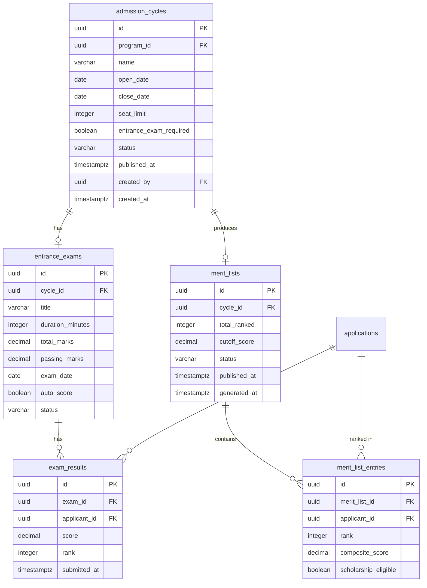
```mermaid
erDiagram
    admission_cycles {
        uuid id PK
        uuid program_id FK
        varchar name
        date open_date
        date close_date
        integer seat_limit
        boolean entrance_exam_required
        varchar status
        timestamptz published_at
        uuid created_by FK
        timestamptz created_at
    }

    entrance_exams {
        uuid id PK
        uuid cycle_id FK
        varchar title
        integer duration_minutes
        decimal total_marks
        decimal passing_marks
        date exam_date
        boolean auto_score
        varchar status
    }

    exam_results {
        uuid id PK
        uuid exam_id FK
        uuid applicant_id FK
        decimal score
        integer rank
        timestamptz submitted_at
    }

    merit_lists {
        uuid id PK
        uuid cycle_id FK
        integer total_ranked
        decimal cutoff_score
        varchar status
        timestamptz published_at
        timestamptz generated_at
    }

    merit_list_entries {
        uuid id PK
        uuid merit_list_id FK
        uuid applicant_id FK
        integer rank
        decimal composite_score
        boolean scholarship_eligible
    }

    admission_cycles ||--o| entrance_exams : "has"
    admission_cycles ||--o| merit_lists : "produces"
    entrance_exams ||--o{ exam_results : "has"
    merit_lists ||--o{ merit_list_entries : "contains"
    applications ||--o{ exam_results : "takes"
    applications ||--o{ merit_list_entries : "ranked in"
```

### admission_cycles

| Column | Type | Constraints | Description |
|--------|------|-------------|-------------|
| id | uuid | PK | Primary key |
| program_id | uuid | FK → programs | Program this cycle admits for |
| name | varchar | NOT NULL | Cycle name (e.g., "Fall 2025 Intake") |
| open_date | date | NOT NULL | Date applications open |
| close_date | date | NOT NULL | Application deadline |
| seat_limit | integer | NOT NULL | Maximum seats available |
| entrance_exam_required | boolean | DEFAULT false | Whether an entrance exam is required |
| status | varchar | NOT NULL | DRAFT, PUBLISHED, CLOSED, COMPLETED |
| published_at | timestamptz | | When cycle was published to portal |
| created_by | uuid | FK → users | Admin who created the cycle |
| created_at | timestamptz | NOT NULL | Record creation timestamp |

### entrance_exams

| Column | Type | Constraints | Description |
|--------|------|-------------|-------------|
| id | uuid | PK | Primary key |
| cycle_id | uuid | FK → admission_cycles | Parent admission cycle |
| title | varchar | NOT NULL | Exam title (e.g., "Engineering Aptitude Test") |
| duration_minutes | integer | NOT NULL | Exam duration in minutes |
| total_marks | decimal | NOT NULL | Maximum possible score |
| passing_marks | decimal | NOT NULL | Minimum score to pass |
| exam_date | date | | Scheduled exam date |
| auto_score | boolean | DEFAULT true | Whether exam is auto-scored |
| status | varchar | NOT NULL | CONFIGURED, SCHEDULED, IN_PROGRESS, COMPLETED, SCORES_FINALIZED |

### exam_results

| Column | Type | Constraints | Description |
|--------|------|-------------|-------------|
| id | uuid | PK | Primary key |
| exam_id | uuid | FK → entrance_exams | Associated exam |
| applicant_id | uuid | FK → applications | Applicant who took the exam |
| score | decimal | NOT NULL | Score obtained |
| rank | integer | | Rank after scoring |
| submitted_at | timestamptz | NOT NULL | When the exam was submitted |

### merit_lists

| Column | Type | Constraints | Description |
|--------|------|-------------|-------------|
| id | uuid | PK | Primary key |
| cycle_id | uuid | FK → admission_cycles | Parent admission cycle |
| total_ranked | integer | NOT NULL | Total applicants ranked |
| cutoff_score | decimal | NOT NULL | Minimum score for admission |
| status | varchar | NOT NULL | DRAFT, PUBLISHED |
| published_at | timestamptz | | When merit list was published |
| generated_at | timestamptz | NOT NULL | When merit list was generated |

### merit_list_entries

| Column | Type | Constraints | Description |
|--------|------|-------------|-------------|
| id | uuid | PK | Primary key |
| merit_list_id | uuid | FK → merit_lists | Parent merit list |
| applicant_id | uuid | FK → applications | Ranked applicant |
| rank | integer | NOT NULL | Position in merit list |
| composite_score | decimal | NOT NULL | Weighted composite score |
| scholarship_eligible | boolean | DEFAULT false | Whether eligible for auto-scholarship |

## Exams & Grading Schema

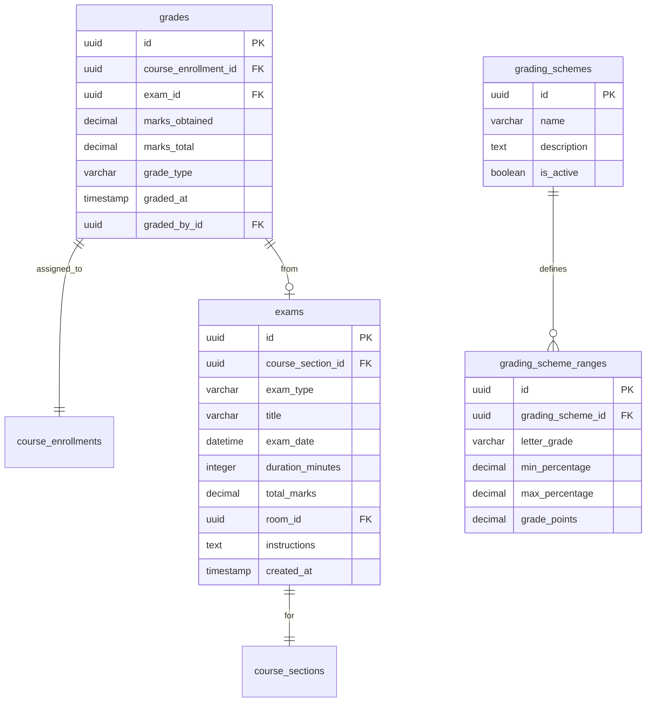
```mermaid
erDiagram
    exams {
        uuid id PK
        uuid course_section_id FK
        varchar exam_type
        varchar title
        datetime exam_date
        integer duration_minutes
        decimal total_marks
        uuid room_id FK
        text instructions
        timestamp created_at
    }
    
    grades {
        uuid id PK
        uuid course_enrollment_id FK
        uuid exam_id FK
        decimal marks_obtained
        decimal marks_total
        varchar grade_type
        timestamp graded_at
        uuid graded_by_id FK
    }
    
    grading_schemes {
        uuid id PK
        varchar name
        text description
        boolean is_active
    }
    
    grading_scheme_ranges {
        uuid id PK
        uuid grading_scheme_id FK
        varchar letter_grade
        decimal min_percentage
        decimal max_percentage
        decimal grade_points
    }
    
    exams ||--|| course_sections : "for"
    grades ||--|| course_enrollments : "assigned_to"
  grades ||--o| exams : "from"
    grading_schemes ||--o{ grading_scheme_ranges : "defines"
```

## Finance Schema

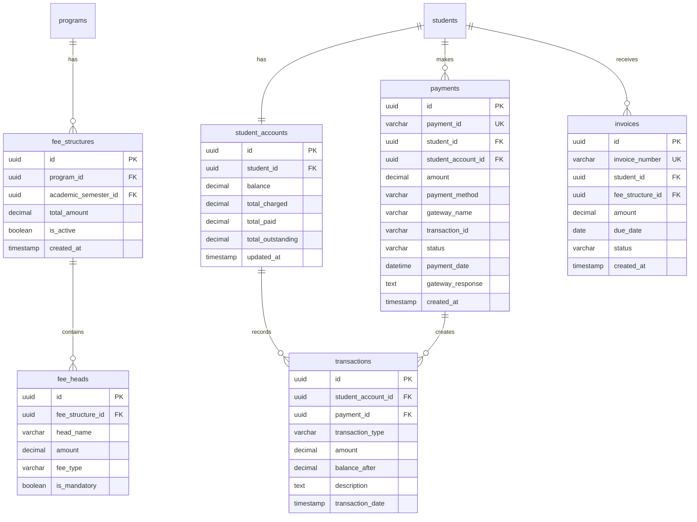
```mermaid
erDiagram
    fee_structures {
        uuid id PK
        uuid program_id FK
        uuid academic_semester_id FK
        decimal total_amount
        boolean is_active
        timestamp created_at
    }
    
    fee_heads {
        uuid id PK
        uuid fee_structure_id FK
        varchar head_name
        decimal amount
        varchar fee_type
        boolean is_mandatory
    }
    
    student_accounts {
        uuid id PK
        uuid student_id FK
        decimal balance
        decimal total_charged
        decimal total_paid
        decimal total_outstanding
        timestamp updated_at
    }
    
    payments {
        uuid id PK
        varchar payment_id UK
        uuid student_id FK
        uuid student_account_id FK
        decimal amount
        varchar payment_method
        varchar gateway_name
        varchar transaction_id
        varchar status
        datetime payment_date
        text gateway_response
        timestamp created_at
    }
    
    transactions {
        uuid id PK
        uuid student_account_id FK
        uuid payment_id FK
        varchar transaction_type
        decimal amount
        decimal balance_after
        text description
        timestamp transaction_date
    }
    
    invoices {
        uuid id PK
        varchar invoice_number UK
        uuid student_id FK
        uuid fee_structure_id FK
        decimal amount
        date due_date
        varchar status
        timestamp created_at
    }
    
    fee_structures ||--o{ fee_heads : "contains"
    programs ||--o{ fee_structures : "has"
    students ||--|| student_accounts : "has"
    student_accounts ||--o{ transactions : "records"
    students ||--o{ payments : "makes"
    payments ||--o{ transactions : "creates"
    students ||--o{ invoices : "receives"
```

## Library Schema

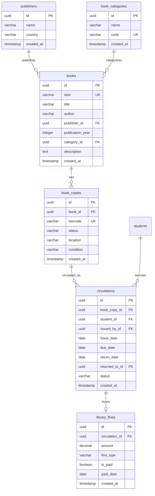
```mermaid
erDiagram
    books {
        uuid id PK
        varchar isbn UK
        varchar title
        varchar author
        uuid publisher_id FK
        integer publication_year
        uuid category_id FK
        text description
        timestamp created_at
    }
    
    book_copies {
        uuid id PK
        uuid book_id FK
        varchar barcode UK
        varchar status
        varchar location
        varchar condition
        timestamp created_at
    }
    
    publishers {
        uuid id PK
        varchar name
        varchar country
        timestamp created_at
    }
    
    book_categories {
        uuid id PK
        varchar name
        varchar code UK
        timestamp created_at
    }
    
    circulations {
        uuid id PK
        uuid book_copy_id FK
        uuid student_id FK
        uuid issued_by_id FK
        date issue_date
        date due_date
        date return_date
        uuid returned_to_id FK
        varchar status
        timestamp created_at
    }
    
    library_fines {
        uuid id PK
        uuid circulation_id FK
        decimal amount
        varchar fine_type
        boolean is_paid
        date paid_date
        timestamp created_at
    }
    
    books ||--o{ book_copies : "has"
    publishers ||--o{ books : "publishes"
    book_categories ||--o{ books : "categorizes"
    book_copies ||--o{ circulations : "circulated_as"
    students ||--o{ circulations : "borrows"
    circulations ||--o| library_fines : "incurs"
```

## LMS Schema

```mermaid
erDiagram
    lms_content {
        uuid id PK
        uuid course_section_id FK
        varchar title
        varchar content_type
        text description
        varchar file_path
        integer module_number
        integer order
        datetime published_at
        uuid created_by_id FK
        timestamp created_at
    }
    
    lms_assignments {
        uuid id PK
        uuid course_section_id FK
        varchar title
        text description
        datetime due_date
        decimal max_marks
        boolean allow_late_submission
        decimal late_penalty_percent
        uuid created_by_id FK
        timestamp created_at
    }
    
    lms_submissions {
        uuid id PK
        uuid assignment_id FK
        uuid student_id FK
        varchar file_path
        text submission_text
        datetime submitted_at
        decimal marks
        text feedback
        varchar status
        uuid graded_by_id FK
        datetime graded_at
    }
    
    lms_quizzes {
        uuid id PK
        uuid course_section_id FK
        varchar title
        text description
        integer duration_minutes
        integer max_attempts
        decimal total_marks
        datetime available_from
        datetime available_until
        boolean shuffle_questions
        uuid created_by_id FK
        timestamp created_at
    }
    
    lms_questions {
        uuid id PK
        uuid quiz_id FK
        text question_text
        varchar question_type
        integer marks
        integer order
        timestamp created_at
    }
    
    lms_answers {
        uuid id PK
        uuid question_id FK
        text answer_text
        boolean is_correct
        integer order
    }
    
    lms_quiz_attempts {
        uuid id PK
        uuid quiz_id FK
        uuid student_id FK
        datetime started_at
        datetime submitted_at
        decimal score
        integer attempt_number
        text answers_json
    }
    
    lms_discussions {
        uuid id PK
        uuid course_section_id FK
        varchar topic
        boolean is_pinned
        uuid created_by_id FK
        timestamp created_at
    }
    
    lms_posts {
        uuid id PK
        uuid discussion_id FK
        uuid user_id FK
        uuid parent_post_id FK
        text content
        timestamp posted_at
    }
    
    course_sections ||--o{ lms_content : "has"
    course_sections ||--o{ lms_assignments : "has"
    lms_assignments ||--o{ lms_submissions : "receives"
    students ||--o{ lms_submissions : "submits"
    course_sections ||--o{ lms_quizzes : "has"
    lms_quizzes ||--o{ lms_questions : "contains"
    lms_questions ||--o{ lms_answers : "has"
    lms_quizzes ||--o{ lms_quiz_attempts : "attempted"
    students ||--o{ lms_quiz_attempts : "attempts"
    course_sections ||--o{ lms_discussions : "has"
    lms_discussions ||--o{ lms_posts : "contains"
    lms_posts ||--o{ lms_posts : "replies_to"
```

## Attendance Schema

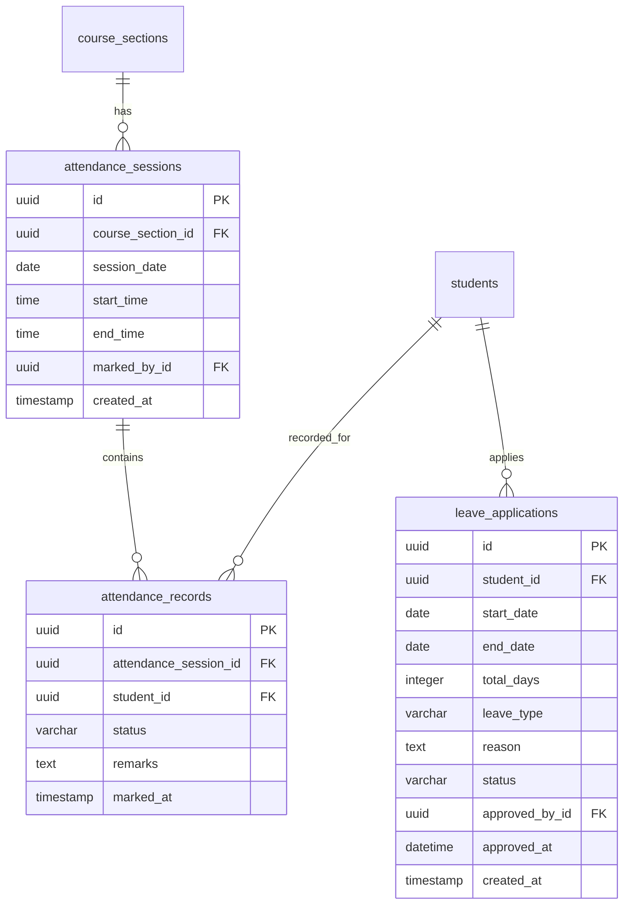
```mermaid
erDiagram
    attendance_sessions {
        uuid id PK
        uuid course_section_id FK
        date session_date
        time start_time
        time end_time
        uuid marked_by_id FK
        timestamp created_at
    }
    
    attendance_records {
        uuid id PK
        uuid attendance_session_id FK
        uuid student_id FK
        varchar status
        text remarks
        timestamp marked_at
    }
    
    leave_applications {
        uuid id PK
        uuid student_id FK
        date start_date
        date end_date
        integer total_days
        varchar leave_type
        text reason
        varchar status
        uuid approved_by_id FK
        datetime approved_at
        timestamp created_at
    }
    
    course_sections ||--o{ attendance_sessions : "has"
    attendance_sessions ||--o{ attendance_records : "contains"
    students ||--o{ attendance_records : "recorded_for"
    students ||--o{ leave_applications : "applies"
```

## HR & Payroll Schema

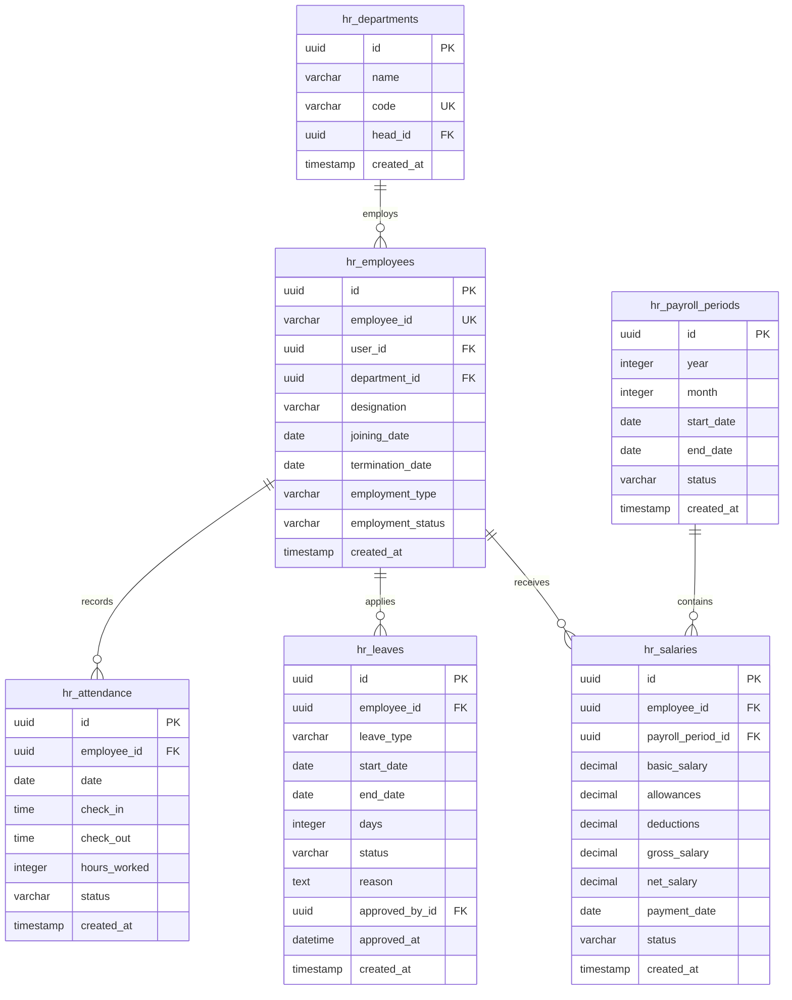
```mermaid
erDiagram
    hr_employees {
        uuid id PK
        varchar employee_id UK
        uuid user_id FK
        uuid department_id FK
        varchar designation
        date joining_date
        date termination_date
        varchar employment_type
        varchar employment_status
        timestamp created_at
    }
    
    hr_departments {
        uuid id PK
        varchar name
        varchar code UK
        uuid head_id FK
        timestamp created_at
    }
    
    hr_payroll_periods {
        uuid id PK
        integer year
        integer month
        date start_date
        date end_date
        varchar status
        timestamp created_at
    }
    
    hr_salaries {
        uuid id PK
        uuid employee_id FK
        uuid payroll_period_id FK
        decimal basic_salary
        decimal allowances
        decimal deductions
        decimal gross_salary
        decimal net_salary
        date payment_date
        varchar status
        timestamp created_at
    }
    
    hr_leaves {
        uuid id PK
        uuid employee_id FK
        varchar leave_type
        date start_date
        date end_date
        integer days
        varchar status
        text reason
        uuid approved_by_id FK
        datetime approved_at
        timestamp created_at
    }
    
    hr_attendance {
        uuid id PK
        uuid employee_id FK
        date date
        time check_in
        time check_out
        integer hours_worked
        varchar status
        timestamp created_at
    }
    
    hr_departments ||--o{ hr_employees : "employs"
    hr_employees ||--o{ hr_salaries : "receives"
    hr_payroll_periods ||--o{ hr_salaries : "contains"
    hr_employees ||--o{ hr_leaves : "applies"
    hr_employees ||--o{ hr_attendance : "records"
```

## Hostel & Transport Schema

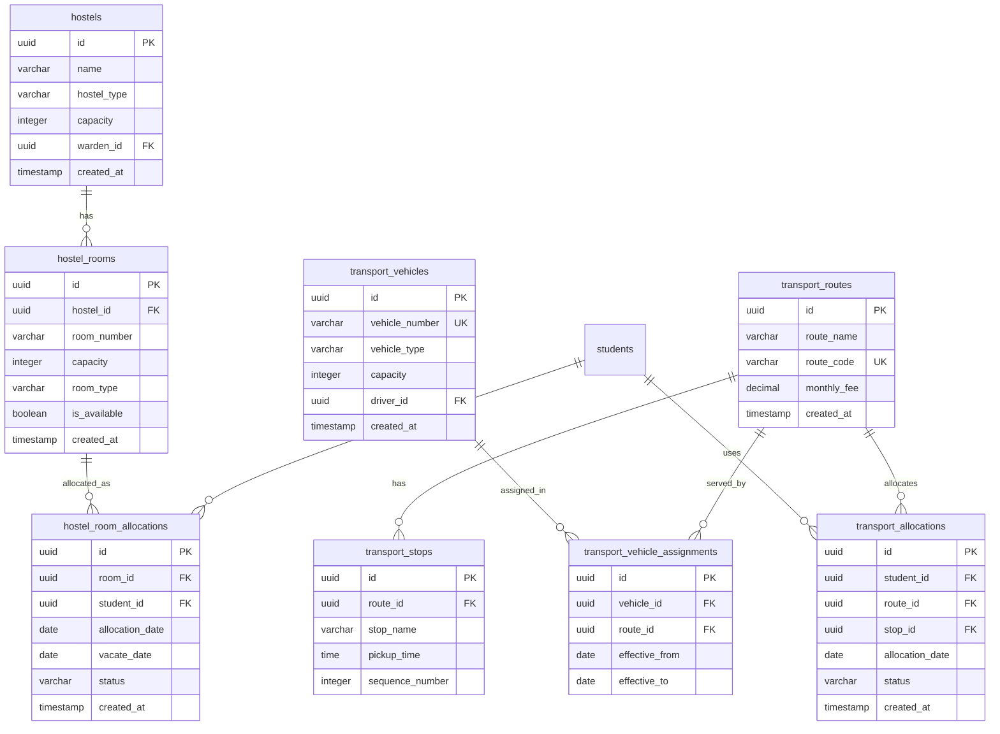
```mermaid
erDiagram
    hostels {
        uuid id PK
        varchar name
        varchar hostel_type
        integer capacity
        uuid warden_id FK
        timestamp created_at
    }
    
    hostel_rooms {
        uuid id PK
        uuid hostel_id FK
        varchar room_number
        integer capacity
        varchar room_type
        boolean is_available
        timestamp created_at
    }
    
    hostel_room_allocations {
        uuid id PK
        uuid room_id FK
        uuid student_id FK
        date allocation_date
        date vacate_date
        varchar status
        timestamp created_at
    }
    
    transport_routes {
        uuid id PK
        varchar route_name
        varchar route_code UK
        decimal monthly_fee
        timestamp created_at
    }
    
    transport_stops {
        uuid id PK
        uuid route_id FK
        varchar stop_name
        time pickup_time
        integer sequence_number
    }
    
    transport_vehicles {
        uuid id PK
        varchar vehicle_number UK
        varchar vehicle_type
        integer capacity
        uuid driver_id FK
        timestamp created_at
    }
    
    transport_vehicle_assignments {
        uuid id PK
        uuid vehicle_id FK
        uuid route_id FK
        date effective_from
        date effective_to
    }
    
    transport_allocations {
        uuid id PK
        uuid student_id FK
        uuid route_id FK
        uuid stop_id FK
        date allocation_date
        varchar status
        timestamp created_at
    }
    
    hostels ||--o{ hostel_rooms : "has"
    hostel_rooms ||--o{ hostel_room_allocations : "allocated_as"
    students ||--o{ hostel_room_allocations : "assigned_to"
    transport_routes ||--o{ transport_stops : "has"
    transport_vehicles ||--o{ transport_vehicle_assignments : "assigned_in"
    transport_routes ||--o{ transport_vehicle_assignments : "served_by"
    students ||--o{ transport_allocations : "uses"
    transport_routes ||--o{ transport_allocations : "allocates"
```

## Inventory Schema

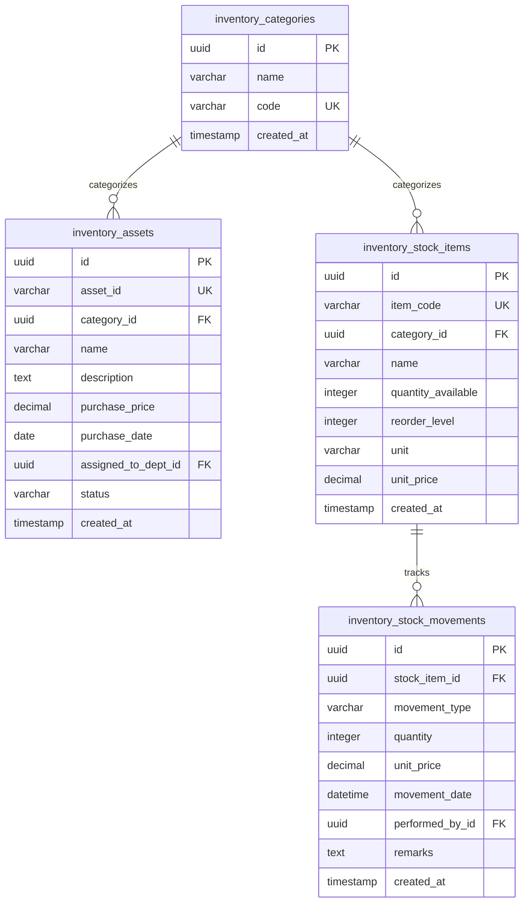
```mermaid
erDiagram
    inventory_categories {
        uuid id PK
        varchar name
        varchar code UK
        timestamp created_at
    }
    
    inventory_assets {
        uuid id PK
        varchar asset_id UK
        uuid category_id FK
        varchar name
        text description
        decimal purchase_price
        date purchase_date
        uuid assigned_to_dept_id FK
        varchar status
        timestamp created_at
    }
    
    inventory_stock_items {
        uuid id PK
        varchar item_code UK
        uuid category_id FK
        varchar name
        integer quantity_available
        integer reorder_level
        varchar unit
        decimal unit_price
        timestamp created_at
    }
    
    inventory_stock_movements {
        uuid id PK
        uuid stock_item_id FK
        varchar movement_type
        integer quantity
        decimal unit_price
        datetime movement_date
        uuid performed_by_id FK
        text remarks
        timestamp created_at
    }
    
    inventory_categories ||--o{ inventory_assets : "categorizes"
    inventory_categories ||--o{ inventory_stock_items : "categorizes"
    inventory_stock_items ||--o{ inventory_stock_movements : "tracks"
```

## Notifications Schema

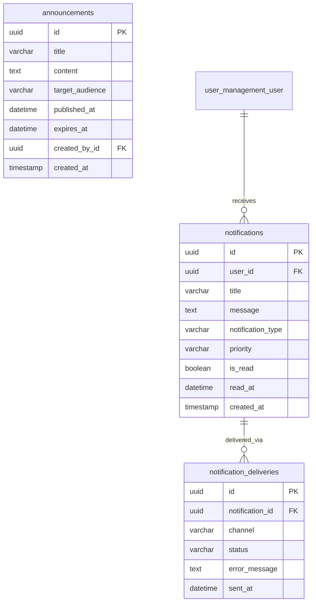
```mermaid
erDiagram
    notifications {
        uuid id PK
        uuid user_id FK
        varchar title
        text message
        varchar notification_type
        varchar priority
        boolean is_read
        datetime read_at
        timestamp created_at
    }
    
    notification_deliveries {
        uuid id PK
        uuid notification_id FK
        varchar channel
        varchar status
        text error_message
        datetime sent_at
    }
    
    announcements {
        uuid id PK
        varchar title
        text content
        varchar target_audience
        datetime published_at
        datetime expires_at
        uuid created_by_id FK
        timestamp created_at
    }
    
    user_management_user ||--o{ notifications : "receives"
    notifications ||--o{ notification_deliveries : "delivered_via"
```

## Academic Session Management

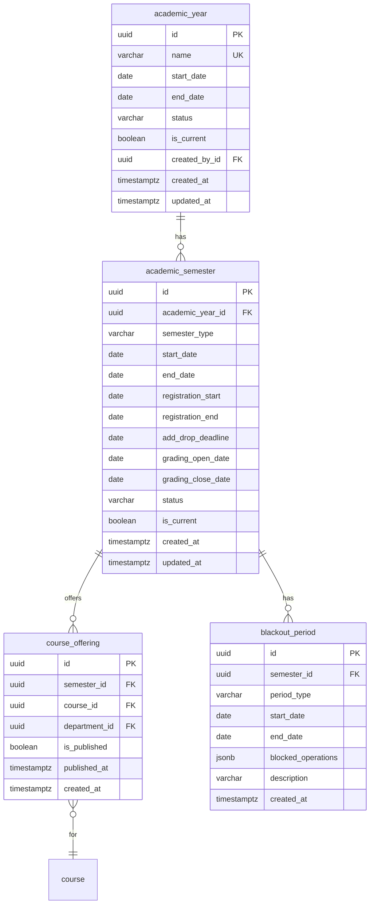
```mermaid
erDiagram
    academic_year {
        uuid id PK
        varchar name UK
        date start_date
        date end_date
        varchar status
        boolean is_current
        uuid created_by_id FK
        timestamptz created_at
        timestamptz updated_at
    }

    academic_semester {
        uuid id PK
        uuid academic_year_id FK
        varchar semester_type
        date start_date
        date end_date
        date registration_start
        date registration_end
        date add_drop_deadline
        date grading_open_date
        date grading_close_date
        varchar status
        boolean is_current
        timestamptz created_at
        timestamptz updated_at
    }

    course_offering {
        uuid id PK
        uuid semester_id FK
        uuid course_id FK
        uuid department_id FK
        boolean is_published
        timestamptz published_at
        timestamptz created_at
    }

    blackout_period {
        uuid id PK
        uuid semester_id FK
        varchar period_type
        date start_date
        date end_date
        jsonb blocked_operations
        varchar description
        timestamptz created_at
    }

    academic_year ||--o{ academic_semester : "has"
    academic_semester ||--o{ course_offering : "offers"
    academic_semester ||--o{ blackout_period : "has"
    course_offering }o--|| course : "for"
```

### academic_year

| Column | Type | Constraints | Description |
|--------|------|-------------|-------------|
| id | uuid | PK | Primary key |
| name | varchar | UNIQUE, NOT NULL | Academic year name (e.g., "2024-2025") |
| start_date | date | NOT NULL | Year start date |
| end_date | date | NOT NULL | Year end date |
| status | varchar | NOT NULL | PLANNING, ACTIVE, COMPLETED, ARCHIVED |
| is_current | boolean | DEFAULT false | Whether this is the current academic year |
| created_by_id | uuid | FK → users | Admin who created this year |
| created_at | timestamptz | NOT NULL | Record creation timestamp |
| updated_at | timestamptz | NOT NULL | Last update timestamp |

### academic_semester

| Column | Type | Constraints | Description |
|--------|------|-------------|-------------|
| id | uuid | PK | Primary key |
| academic_year_id | uuid | FK → academic_year | Parent academic year |
| semester_type | varchar | NOT NULL | FALL, SPRING, SUMMER |
| start_date | date | NOT NULL | Semester start date |
| end_date | date | NOT NULL | Semester end date |
| registration_start | date | | Registration window open date |
| registration_end | date | | Registration window close date |
| add_drop_deadline | date | | Last date for add/drop |
| grading_open_date | date | | When grading opens |
| grading_close_date | date | | When grading closes |
| status | varchar | NOT NULL | PLANNING, REGISTRATION_OPEN, ACTIVE, EXAM_PERIOD, GRADING, COMPLETED |
| is_current | boolean | DEFAULT false | Whether this is the current semester |
| created_at | timestamptz | NOT NULL | Record creation timestamp |
| updated_at | timestamptz | NOT NULL | Last update timestamp |

### course_offering

| Column | Type | Constraints | Description |
|--------|------|-------------|-------------|
| id | uuid | PK | Primary key |
| semester_id | uuid | FK → academic_semester | Semester this offering belongs to |
| course_id | uuid | FK → course | Course being offered |
| department_id | uuid | FK → department | Offering department |
| is_published | boolean | DEFAULT false | Whether visible to students |
| published_at | timestamptz | | When the offering was published |
| created_at | timestamptz | NOT NULL | Record creation timestamp |

### blackout_period

| Column | Type | Constraints | Description |
|--------|------|-------------|-------------|
| id | uuid | PK | Primary key |
| semester_id | uuid | FK → academic_semester | Associated semester |
| period_type | varchar | NOT NULL | EXAM, HOLIDAY, MAINTENANCE |
| start_date | date | NOT NULL | Period start date |
| end_date | date | NOT NULL | Period end date |
| blocked_operations | jsonb | | Operations blocked during this period |
| description | varchar | | Description of the blackout period |
| created_at | timestamptz | NOT NULL | Record creation timestamp |

## Graduation & Degree Conferral

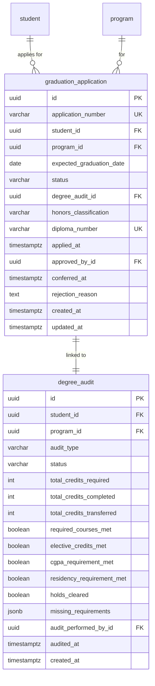
```mermaid
erDiagram
    graduation_application {
        uuid id PK
        varchar application_number UK
        uuid student_id FK
        uuid program_id FK
        date expected_graduation_date
        varchar status
        uuid degree_audit_id FK
        varchar honors_classification
        varchar diploma_number UK
        timestamptz applied_at
        uuid approved_by_id FK
        timestamptz conferred_at
        text rejection_reason
        timestamptz created_at
        timestamptz updated_at
    }

    degree_audit {
        uuid id PK
        uuid student_id FK
        uuid program_id FK
        varchar audit_type
        varchar status
        int total_credits_required
        int total_credits_completed
        int total_credits_transferred
        boolean required_courses_met
        boolean elective_credits_met
        boolean cgpa_requirement_met
        boolean residency_requirement_met
        boolean holds_cleared
        jsonb missing_requirements
        uuid audit_performed_by_id FK
        timestamptz audited_at
        timestamptz created_at
    }

    student ||--o{ graduation_application : "applies for"
    graduation_application ||--|| degree_audit : "linked to"
    program ||--o{ graduation_application : "for"
```

### graduation_application

| Column | Type | Constraints | Description |
|--------|------|-------------|-------------|
| id | uuid | PK | Primary key |
| application_number | varchar | UNIQUE, NOT NULL | Auto-generated application number |
| student_id | uuid | FK → students | Applicant student |
| program_id | uuid | FK → program | Program for graduation |
| expected_graduation_date | date | NOT NULL | Expected graduation ceremony date |
| status | varchar | NOT NULL | SUBMITTED, UNDER_REVIEW, APPROVED, CONFERRED, REJECTED |
| degree_audit_id | uuid | FK → degree_audit | Linked degree audit |
| honors_classification | varchar | | SUMMA_CUM_LAUDE, MAGNA_CUM_LAUDE, CUM_LAUDE, NONE |
| diploma_number | varchar | UNIQUE | Unique diploma number (DIP-YYYY-XXXXXX) |
| applied_at | timestamptz | NOT NULL | When the student applied |
| approved_by_id | uuid | FK → users | Registrar who approved |
| conferred_at | timestamptz | | When degree was conferred |
| rejection_reason | text | | Reason if rejected |
| created_at | timestamptz | NOT NULL | Record creation timestamp |
| updated_at | timestamptz | NOT NULL | Last update timestamp |

### degree_audit

| Column | Type | Constraints | Description |
|--------|------|-------------|-------------|
| id | uuid | PK | Primary key |
| student_id | uuid | FK → students | Student being audited |
| program_id | uuid | FK → program | Program being audited against |
| audit_type | varchar | NOT NULL | GRADUATION, PROGRESS, MANUAL |
| status | varchar | NOT NULL | PASSED, FAILED, IN_PROGRESS |
| total_credits_required | int | NOT NULL | Credits required by program |
| total_credits_completed | int | NOT NULL | Credits completed by student |
| total_credits_transferred | int | DEFAULT 0 | Credits from transfer |
| required_courses_met | boolean | NOT NULL | Whether all required courses are completed |
| elective_credits_met | boolean | NOT NULL | Whether elective credit requirement is met |
| cgpa_requirement_met | boolean | NOT NULL | Whether minimum CGPA is met |
| residency_requirement_met | boolean | NOT NULL | Whether residency credits are met |
| holds_cleared | boolean | NOT NULL | Whether all holds are cleared |
| missing_requirements | jsonb | | Details of unmet requirements |
| audit_performed_by_id | uuid | FK → users | Who performed the audit |
| audited_at | timestamptz | NOT NULL | When the audit was performed |
| created_at | timestamptz | NOT NULL | Record creation timestamp |

## Student Discipline

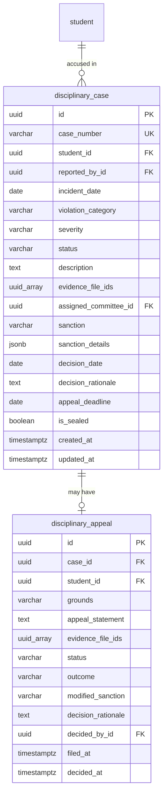
```mermaid
erDiagram
    disciplinary_case {
        uuid id PK
        varchar case_number UK
        uuid student_id FK
        uuid reported_by_id FK
        date incident_date
        varchar violation_category
        varchar severity
        varchar status
        text description
        uuid_array evidence_file_ids
        uuid assigned_committee_id FK
        varchar sanction
        jsonb sanction_details
        date decision_date
        text decision_rationale
        date appeal_deadline
        boolean is_sealed
        timestamptz created_at
        timestamptz updated_at
    }

    disciplinary_appeal {
        uuid id PK
        uuid case_id FK
        uuid student_id FK
        varchar grounds
        text appeal_statement
        uuid_array evidence_file_ids
        varchar status
        varchar outcome
        varchar modified_sanction
        text decision_rationale
        uuid decided_by_id FK
        timestamptz filed_at
        timestamptz decided_at
    }

    student ||--o{ disciplinary_case : "accused in"
    disciplinary_case ||--o| disciplinary_appeal : "may have"
```

### disciplinary_case

| Column | Type | Constraints | Description |
|--------|------|-------------|-------------|
| id | uuid | PK | Primary key |
| case_number | varchar | UNIQUE, NOT NULL | Auto-generated case number |
| student_id | uuid | FK → students | Accused student |
| reported_by_id | uuid | FK → users | Faculty/staff who reported |
| incident_date | date | NOT NULL | Date of the incident |
| violation_category | varchar | NOT NULL | ACADEMIC_DISHONESTY, MISCONDUCT, HARASSMENT, etc. |
| severity | varchar | NOT NULL | MINOR, MAJOR, SEVERE |
| status | varchar | NOT NULL | REPORTED, UNDER_INVESTIGATION, HEARING_SCHEDULED, DECISION_ISSUED, CLOSED |
| description | text | NOT NULL | Incident description |
| evidence_file_ids | uuid[] | | Array of file IDs for evidence |
| assigned_committee_id | uuid | FK → committee | Assigned discipline committee |
| sanction | varchar | | WARNING, PROBATION, SUSPENSION, EXPULSION |
| sanction_details | jsonb | | Duration, conditions, etc. |
| decision_date | date | | Date of committee decision |
| decision_rationale | text | | Reasoning for the decision |
| appeal_deadline | date | | Deadline for filing an appeal |
| is_sealed | boolean | DEFAULT false | Whether the record is sealed |
| created_at | timestamptz | NOT NULL | Record creation timestamp |
| updated_at | timestamptz | NOT NULL | Last update timestamp |

### disciplinary_appeal

| Column | Type | Constraints | Description |
|--------|------|-------------|-------------|
| id | uuid | PK | Primary key |
| case_id | uuid | FK → disciplinary_case | Original case |
| student_id | uuid | FK → students | Appealing student |
| grounds | varchar | NOT NULL | NEW_EVIDENCE, PROCEDURAL_ERROR, DISPROPORTIONATE_SANCTION |
| appeal_statement | text | NOT NULL | Student's appeal statement |
| evidence_file_ids | uuid[] | | Additional evidence |
| status | varchar | NOT NULL | FILED, UNDER_REVIEW, DECIDED |
| outcome | varchar | | UPHELD, MODIFIED, REVERSED |
| modified_sanction | varchar | | New sanction if modified |
| decision_rationale | text | | Appeal board's reasoning |
| decided_by_id | uuid | FK → users | Appeals board chair |
| filed_at | timestamptz | NOT NULL | When the appeal was filed |
| decided_at | timestamptz | | When the appeal was decided |

## Academic Standing

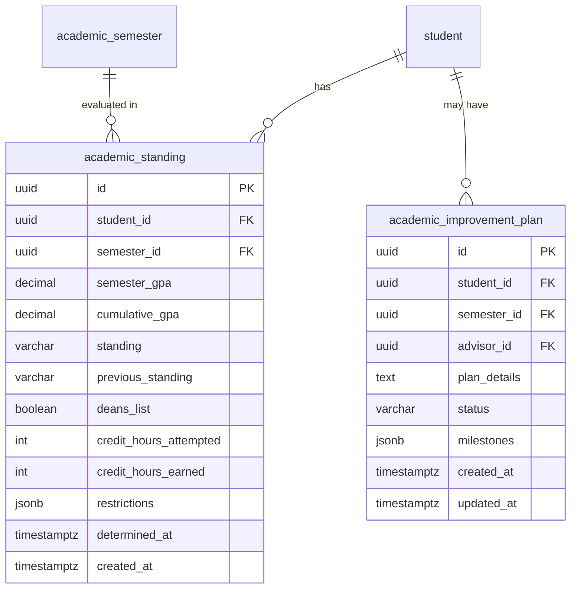
```mermaid
erDiagram
    academic_standing {
        uuid id PK
        uuid student_id FK
        uuid semester_id FK
        decimal semester_gpa
        decimal cumulative_gpa
        varchar standing
        varchar previous_standing
        boolean deans_list
        int credit_hours_attempted
        int credit_hours_earned
        jsonb restrictions
        timestamptz determined_at
        timestamptz created_at
    }

    academic_improvement_plan {
        uuid id PK
        uuid student_id FK
        uuid semester_id FK
        uuid advisor_id FK
        text plan_details
        varchar status
        jsonb milestones
        timestamptz created_at
        timestamptz updated_at
    }

    student ||--o{ academic_standing : "has"
    academic_semester ||--o{ academic_standing : "evaluated in"
    student ||--o{ academic_improvement_plan : "may have"
```

### academic_standing

| Column | Type | Constraints | Description |
|--------|------|-------------|-------------|
| id | uuid | PK | Primary key |
| student_id | uuid | FK → students | Student being evaluated |
| semester_id | uuid | FK → academic_semester | Semester of evaluation |
| semester_gpa | decimal(3,2) | NOT NULL, CHECK (0.0-4.0) | GPA for the semester |
| cumulative_gpa | decimal(3,2) | NOT NULL, CHECK (0.0-4.0) | Cumulative GPA |
| standing | varchar | NOT NULL | GOOD_STANDING, PROBATION, ACADEMIC_WARNING, SUSPENSION, DISMISSAL |
| previous_standing | varchar | | Standing from prior semester |
| deans_list | boolean | DEFAULT false | Whether student qualifies for Dean's List |
| credit_hours_attempted | int | NOT NULL | Credits attempted this semester |
| credit_hours_earned | int | NOT NULL | Credits earned this semester |
| restrictions | jsonb | | Any registration or activity restrictions |
| determined_at | timestamptz | NOT NULL | When standing was determined |
| created_at | timestamptz | NOT NULL | Record creation timestamp |

### academic_improvement_plan

| Column | Type | Constraints | Description |
|--------|------|-------------|-------------|
| id | uuid | PK | Primary key |
| student_id | uuid | FK → students | Student on the plan |
| semester_id | uuid | FK → academic_semester | Semester the plan applies to |
| advisor_id | uuid | FK → faculty | Assigned academic advisor |
| plan_details | text | NOT NULL | Improvement plan description |
| status | varchar | NOT NULL | ACTIVE, COMPLETED, FAILED |
| milestones | jsonb | | Milestone checkpoints with deadlines |
| created_at | timestamptz | NOT NULL | Record creation timestamp |
| updated_at | timestamptz | NOT NULL | Last update timestamp |

## Grade Appeal

```mermaid
erDiagram
    grade_appeal {
        uuid id PK
        varchar appeal_number UK
        uuid student_id FK
        uuid enrollment_id FK
        uuid exam_id FK
        varchar original_grade
        varchar requested_action
        text justification
        uuid_array evidence_file_ids
        varchar status
        varchar current_level
        varchar outcome
        varchar new_grade
        text resolution_notes
        uuid resolved_by_id FK
        timestamptz filed_at
        timestamptz deadline
        timestamptz resolved_at
        timestamptz created_at
    }

    student ||--o{ grade_appeal : "files"
    enrollment ||--o{ grade_appeal : "for"
```

### grade_appeal

| Column | Type | Constraints | Description |
|--------|------|-------------|-------------|
| id | uuid | PK | Primary key |
| appeal_number | varchar | UNIQUE, NOT NULL | Auto-generated appeal number |
| student_id | uuid | FK → students | Student filing the appeal |
| enrollment_id | uuid | FK → enrollment | Course enrollment being appealed |
| exam_id | uuid | FK → exam | Specific exam being appealed |
| original_grade | varchar | NOT NULL | Original grade received |
| requested_action | varchar | NOT NULL | REGRADE, RE_EVALUATION, REVIEW |
| justification | text | NOT NULL | Student's justification |
| evidence_file_ids | uuid[] | | Supporting evidence files |
| status | varchar | NOT NULL | SUBMITTED, FACULTY_REVIEW, DEPT_HEAD_REVIEW, COMMITTEE_REVIEW, RESOLVED |
| current_level | varchar | NOT NULL | FACULTY, DEPT_HEAD, COMMITTEE |
| outcome | varchar | | GRADE_MODIFIED, UPHELD |
| new_grade | varchar | | New grade if modified |
| resolution_notes | text | | Resolution details |
| resolved_by_id | uuid | FK → users | Person who resolved |
| filed_at | timestamptz | NOT NULL | When appeal was filed |
| deadline | timestamptz | NOT NULL | Response deadline |
| resolved_at | timestamptz | | When appeal was resolved |
| created_at | timestamptz | NOT NULL | Record creation timestamp |

## Faculty Recruitment

```mermaid
erDiagram
    job_posting {
        uuid id PK
        varchar position_number UK
        varchar title
        uuid department_id FK
        varchar designation
        varchar employment_type
        text description
        jsonb qualifications
        int experience_years_min
        decimal salary_range_min
        decimal salary_range_max
        int vacancies
        timestamptz application_deadline
        varchar status
        boolean is_internal_only
        jsonb screening_criteria
        uuid approved_by_id FK
        uuid created_by_id FK
        timestamptz published_at
        timestamptz created_at
        timestamptz updated_at
    }

    job_application {
        uuid id PK
        varchar application_number UK
        uuid posting_id FK
        varchar applicant_name
        varchar applicant_email
        varchar applicant_phone
        uuid resume_file_id FK
        text cover_letter
        jsonb qualifications
        varchar status
        int screening_score
        boolean screening_passed
        jsonb interview_evaluations
        decimal overall_score
        jsonb offer_details
        timestamptz offer_deadline
        text rejection_reason
        timestamptz applied_at
        timestamptz created_at
        timestamptz updated_at
    }

    interview_evaluation {
        uuid id PK
        uuid application_id FK
        uuid evaluator_id FK
        int teaching_score
        int research_score
        int domain_knowledge_score
        int communication_score
        decimal overall_score
        text comments
        varchar recommendation
        timestamptz evaluated_at
    }

    department ||--o{ job_posting : "has"
    job_posting ||--o{ job_application : "receives"
    job_application ||--o{ interview_evaluation : "evaluated by"
```

### job_posting

| Column | Type | Constraints | Description |
|--------|------|-------------|-------------|
| id | uuid | PK | Primary key |
| position_number | varchar | UNIQUE, NOT NULL | Auto-generated position number |
| title | varchar | NOT NULL | Job title |
| department_id | uuid | FK → department | Hiring department |
| designation | varchar | NOT NULL | Professor, Associate Professor, etc. |
| employment_type | varchar | NOT NULL | FULL_TIME, PART_TIME, CONTRACT |
| description | text | NOT NULL | Job description |
| qualifications | jsonb | NOT NULL | Required qualifications |
| experience_years_min | int | | Minimum years of experience |
| salary_range_min | decimal | | Minimum salary offered |
| salary_range_max | decimal | | Maximum salary offered |
| vacancies | int | NOT NULL, CHECK > 0 | Number of open positions |
| application_deadline | timestamptz | NOT NULL | Application deadline |
| status | varchar | NOT NULL | DRAFT, PUBLISHED, CLOSED, CANCELLED |
| is_internal_only | boolean | DEFAULT false | Whether posting is internal only |
| screening_criteria | jsonb | | Auto-screening rules |
| approved_by_id | uuid | FK → users | Authority who approved the posting |
| created_by_id | uuid | FK → users | HR admin who created |
| published_at | timestamptz | | When the posting was published |
| created_at | timestamptz | NOT NULL | Record creation timestamp |
| updated_at | timestamptz | NOT NULL | Last update timestamp |

### job_application

| Column | Type | Constraints | Description |
|--------|------|-------------|-------------|
| id | uuid | PK | Primary key |
| application_number | varchar | UNIQUE, NOT NULL | Auto-generated application number |
| posting_id | uuid | FK → job_posting | Associated job posting |
| applicant_name | varchar | NOT NULL | Full name of applicant |
| applicant_email | varchar | NOT NULL | Applicant email |
| applicant_phone | varchar | | Applicant phone number |
| resume_file_id | uuid | FK → files | Uploaded resume |
| cover_letter | text | | Cover letter text |
| qualifications | jsonb | | Applicant's qualifications |
| status | varchar | NOT NULL | SUBMITTED, SCREENING, SHORTLISTED, INTERVIEW_SCHEDULED, OFFERED, HIRED, REJECTED |
| screening_score | int | | Auto-screening score |
| screening_passed | boolean | | Whether auto-screening passed |
| interview_evaluations | jsonb | | Aggregated interview data |
| overall_score | decimal | | Final composite score |
| offer_details | jsonb | | Salary, start date, terms |
| offer_deadline | timestamptz | | Deadline to accept offer |
| rejection_reason | text | | Reason if rejected |
| applied_at | timestamptz | NOT NULL | When the candidate applied |
| created_at | timestamptz | NOT NULL | Record creation timestamp |
| updated_at | timestamptz | NOT NULL | Last update timestamp |

### interview_evaluation

| Column | Type | Constraints | Description |
|--------|------|-------------|-------------|
| id | uuid | PK | Primary key |
| application_id | uuid | FK → job_application | Application being evaluated |
| evaluator_id | uuid | FK → users | Panel member |
| teaching_score | int | CHECK (1-10) | Teaching demo score |
| research_score | int | CHECK (1-10) | Research presentation score |
| domain_knowledge_score | int | CHECK (1-10) | Domain expertise score |
| communication_score | int | CHECK (1-10) | Communication skills score |
| overall_score | decimal | | Weighted overall score |
| comments | text | | Evaluator's comments |
| recommendation | varchar | NOT NULL | STRONGLY_RECOMMEND, RECOMMEND, NEUTRAL, NOT_RECOMMEND |
| evaluated_at | timestamptz | NOT NULL | Evaluation timestamp |

## Room & Facility Management

```mermaid
erDiagram
    room {
        uuid id PK
        varchar room_code UK
        varchar building
        int floor
        varchar room_number
        varchar room_type
        int capacity
        jsonb amenities
        boolean is_wheelchair_accessible
        varchar status
        boolean is_active
        timestamptz created_at
        timestamptz updated_at
    }

    room_booking {
        uuid id PK
        uuid room_id FK
        uuid booked_by_id FK
        varchar booking_type
        varchar purpose
        date booking_date
        time start_time
        time end_time
        int expected_attendees
        boolean is_recurring
        jsonb recurrence_pattern
        varchar status
        uuid approved_by_id FK
        uuid linked_section_id FK
        uuid linked_exam_id FK
        timestamptz created_at
        timestamptz updated_at
    }

    room ||--o{ room_booking : "booked for"
```

### room

| Column | Type | Constraints | Description |
|--------|------|-------------|-------------|
| id | uuid | PK | Primary key |
| room_code | varchar | UNIQUE, NOT NULL | Unique room code (e.g., "BLK-A-301") |
| building | varchar | NOT NULL | Building name |
| floor | int | NOT NULL | Floor number |
| room_number | varchar | NOT NULL | Room number on the floor |
| room_type | varchar | NOT NULL | CLASSROOM, LAB, AUDITORIUM, SEMINAR_HALL, OFFICE |
| capacity | int | NOT NULL, CHECK > 0 | Maximum occupancy |
| amenities | jsonb | | Projector, whiteboard, AC, etc. |
| is_wheelchair_accessible | boolean | DEFAULT false | Wheelchair accessibility |
| status | varchar | NOT NULL | AVAILABLE, OCCUPIED, UNDER_MAINTENANCE |
| is_active | boolean | DEFAULT true | Soft delete flag |
| created_at | timestamptz | NOT NULL | Record creation timestamp |
| updated_at | timestamptz | NOT NULL | Last update timestamp |

### room_booking

| Column | Type | Constraints | Description |
|--------|------|-------------|-------------|
| id | uuid | PK | Primary key |
| room_id | uuid | FK → room | Room being booked |
| booked_by_id | uuid | FK → users | Person who booked |
| booking_type | varchar | NOT NULL | CLASS, EXAM, EVENT, MEETING, MAINTENANCE |
| purpose | varchar | NOT NULL | Description of purpose |
| booking_date | date | NOT NULL | Date of booking |
| start_time | time | NOT NULL | Start time |
| end_time | time | NOT NULL | End time |
| expected_attendees | int | | Expected number of attendees |
| is_recurring | boolean | DEFAULT false | Whether booking recurs |
| recurrence_pattern | jsonb | | Recurrence rules (weekly, etc.) |
| status | varchar | NOT NULL | PENDING, APPROVED, REJECTED, CANCELLED |
| approved_by_id | uuid | FK → users | Approving authority |
| linked_section_id | uuid | FK → section | Linked class section (if CLASS) |
| linked_exam_id | uuid | FK → exam | Linked exam (if EXAM) |
| created_at | timestamptz | NOT NULL | Record creation timestamp |
| updated_at | timestamptz | NOT NULL | Last update timestamp |

## Transfer Credits

```mermaid
erDiagram
    transfer_credit {
        uuid id PK
        uuid student_id FK
        varchar source_institution
        varchar source_course_code
        varchar source_course_name
        int source_credits
        varchar source_grade
        uuid equivalent_course_id FK
        int credits_awarded
        varchar status
        uuid evaluated_by_id FK
        text evaluation_notes
        boolean counts_toward_gpa
        boolean counts_toward_graduation
        uuid transcript_file_id FK
        uuid syllabus_file_id FK
        timestamptz submitted_at
        timestamptz evaluated_at
        timestamptz created_at
        timestamptz updated_at
    }

    articulation_agreement {
        uuid id PK
        varchar institution_name
        date effective_date
        date expiry_date
        jsonb course_mappings
        boolean is_active
        timestamptz created_at
        timestamptz updated_at
    }

    student ||--o{ transfer_credit : "submits"
    course |o--o{ transfer_credit : "equivalent to"
```

### transfer_credit

| Column | Type | Constraints | Description |
|--------|------|-------------|-------------|
| id | uuid | PK | Primary key |
| student_id | uuid | FK → students | Student submitting transfer |
| source_institution | varchar | NOT NULL | Name of source institution |
| source_course_code | varchar | NOT NULL | Course code at source institution |
| source_course_name | varchar | NOT NULL | Course name at source institution |
| source_credits | int | NOT NULL | Credits at source institution |
| source_grade | varchar | NOT NULL | Grade received at source |
| equivalent_course_id | uuid | FK → course | Mapped equivalent course |
| credits_awarded | int | | Credits awarded after evaluation |
| status | varchar | NOT NULL | SUBMITTED, UNDER_REVIEW, APPROVED, REJECTED |
| evaluated_by_id | uuid | FK → users | Registrar who evaluated |
| evaluation_notes | text | | Notes from evaluation |
| counts_toward_gpa | boolean | DEFAULT false | Whether credits count toward GPA |
| counts_toward_graduation | boolean | DEFAULT true | Whether credits count toward graduation |
| transcript_file_id | uuid | FK → files | Uploaded transcript document |
| syllabus_file_id | uuid | FK → files | Uploaded syllabus for comparison |
| submitted_at | timestamptz | NOT NULL | When the student submitted |
| evaluated_at | timestamptz | | When evaluation was completed |
| created_at | timestamptz | NOT NULL | Record creation timestamp |
| updated_at | timestamptz | NOT NULL | Last update timestamp |

### articulation_agreement

| Column | Type | Constraints | Description |
|--------|------|-------------|-------------|
| id | uuid | PK | Primary key |
| institution_name | varchar | NOT NULL | Partner institution name |
| effective_date | date | NOT NULL | Agreement start date |
| expiry_date | date | NOT NULL | Agreement end date |
| course_mappings | jsonb | NOT NULL | Pre-approved course equivalency mappings |
| is_active | boolean | DEFAULT true | Whether agreement is active |
| created_at | timestamptz | NOT NULL | Record creation timestamp |
| updated_at | timestamptz | NOT NULL | Last update timestamp |

## Scholarship & Financial Aid

```mermaid
erDiagram
    scholarship_program {
        uuid id PK
        varchar name
        varchar scholarship_type
        text description
        jsonb eligibility_criteria
        decimal award_amount
        decimal award_percentage
        int max_recipients
        decimal fund_total
        decimal fund_utilized
        jsonb renewal_criteria
        timestamptz application_deadline
        boolean is_auto_award
        uuid academic_year_id FK
        varchar donor_name
        boolean is_active
        timestamptz created_at
        timestamptz updated_at
    }

    scholarship_award {
        uuid id PK
        uuid scholarship_id FK
        uuid student_id FK
        uuid semester_id FK
        varchar status
        decimal award_amount
        varchar disbursement_method
        uuid linked_invoice_id FK
        varchar renewal_status
        timestamptz applied_at
        timestamptz awarded_at
        timestamptz disbursed_at
        timestamptz revoked_at
        text revocation_reason
        varchar award_type
        integer duration_semesters
        integer remaining_semesters
        uuid merit_list_entry_id FK
        timestamptz created_at
        timestamptz updated_at
    }

    scholarship_program ||--o{ scholarship_award : "awarded as"
    student ||--o{ scholarship_award : "receives"
```

### scholarship_program

| Column | Type | Constraints | Description |
|--------|------|-------------|-------------|
| id | uuid | PK | Primary key |
| name | varchar | NOT NULL | Scholarship name |
| scholarship_type | varchar | NOT NULL | MERIT, NEED_BASED, ATHLETIC, DONOR_FUNDED |
| description | text | | Scholarship description |
| eligibility_criteria | jsonb | NOT NULL | GPA, program, income level criteria |
| award_amount | decimal | | Fixed award amount |
| award_percentage | decimal | | Percentage of tuition covered |
| max_recipients | int | | Maximum number of awardees |
| fund_total | decimal | NOT NULL | Total fund allocated |
| fund_utilized | decimal | DEFAULT 0 | Amount disbursed so far |
| renewal_criteria | jsonb | | GPA and standing requirements for renewal |
| application_deadline | timestamptz | | Deadline for applications |
| is_auto_award | boolean | DEFAULT false | Whether auto-awarded based on criteria |
| academic_year_id | uuid | FK → academic_year | Applicable academic year |
| donor_name | varchar | | Name of donor (if donor-funded) |
| is_active | boolean | DEFAULT true | Whether scholarship is active |
| created_at | timestamptz | NOT NULL | Record creation timestamp |
| updated_at | timestamptz | NOT NULL | Last update timestamp |

### scholarship_award

| Column | Type | Constraints | Description |
|--------|------|-------------|-------------|
| id | uuid | PK | Primary key |
| scholarship_id | uuid | FK → scholarship_program | Associated scholarship |
| student_id | uuid | FK → students | Awarded student |
| semester_id | uuid | FK → academic_semester | Semester of award |
| status | varchar | NOT NULL | APPLIED, AWARDED, DISBURSED, REVOKED, WAITLISTED |
| award_amount | decimal | NOT NULL | Amount awarded |
| disbursement_method | varchar | | FEE_WAIVER, DIRECT_DEPOSIT, CHECK |
| linked_invoice_id | uuid | FK → invoice | Linked fee invoice |
| renewal_status | varchar | | ELIGIBLE, WARNING, NOT_ELIGIBLE |
| applied_at | timestamptz | NOT NULL | When student applied |
| awarded_at | timestamptz | | When scholarship was awarded |
| disbursed_at | timestamptz | | When funds were disbursed |
| revoked_at | timestamptz | | When scholarship was revoked |
| revocation_reason | text | | Reason for revocation |
| award_type | varchar | | FIXED_PER_SEMESTER, FULL_COVERAGE |
| duration_semesters | integer | | Total semesters scholarship covers |
| remaining_semesters | integer | | Semesters remaining |
| merit_list_entry_id | uuid | FK → merit_list_entries, NULL | Link to merit list entry (for auto-awarded) |
| created_at | timestamptz | NOT NULL | Record creation timestamp |
| updated_at | timestamptz | NOT NULL | Last update timestamp |

## Department Management

```mermaid
erDiagram
    department {
        uuid id PK
        varchar code UK
        varchar name
        varchar parent_faculty
        uuid head_id FK
        date head_term_start
        date head_term_end
        int sanctioned_positions
        int filled_positions
        date established_date
        varchar accreditation_status
        date accreditation_expiry
        boolean is_active
        timestamptz created_at
        timestamptz updated_at
    }

    curriculum_change_proposal {
        uuid id PK
        varchar proposal_number UK
        uuid program_id FK
        uuid proposed_by_id FK
        varchar change_type
        text description
        text justification
        jsonb impact_analysis
        varchar status
        uuid effective_semester_id FK
        timestamptz approved_at
        timestamptz created_at
        timestamptz updated_at
    }

    department ||--o{ curriculum_change_proposal : "proposes"
    department ||--o{ program : "offers"
```

### department

| Column | Type | Constraints | Description |
|--------|------|-------------|-------------|
| id | uuid | PK | Primary key |
| code | varchar | UNIQUE, NOT NULL | Department code (e.g., "CSE", "ECE") |
| name | varchar | NOT NULL | Department name |
| parent_faculty | varchar | | Parent faculty/school |
| head_id | uuid | FK → faculty | Current department head |
| head_term_start | date | | Head's term start date |
| head_term_end | date | | Head's term end date |
| sanctioned_positions | int | | Total sanctioned faculty positions |
| filled_positions | int | | Currently filled positions |
| established_date | date | | Date department was established |
| accreditation_status | varchar | | ACCREDITED, PENDING, EXPIRED |
| accreditation_expiry | date | | When accreditation expires |
| is_active | boolean | DEFAULT true | Soft delete flag |
| created_at | timestamptz | NOT NULL | Record creation timestamp |
| updated_at | timestamptz | NOT NULL | Last update timestamp |

### curriculum_change_proposal

| Column | Type | Constraints | Description |
|--------|------|-------------|-------------|
| id | uuid | PK | Primary key |
| proposal_number | varchar | UNIQUE, NOT NULL | Auto-generated proposal number |
| program_id | uuid | FK → program | Program being modified |
| proposed_by_id | uuid | FK → users | Person who proposed the change |
| change_type | varchar | NOT NULL | ADD_COURSE, REMOVE_COURSE, MODIFY_CREDITS, RESTRUCTURE |
| description | text | NOT NULL | Description of proposed change |
| justification | text | NOT NULL | Justification for the change |
| impact_analysis | jsonb | | Analysis of impact on students, faculty |
| status | varchar | NOT NULL | DRAFT, SUBMITTED, UNDER_REVIEW, APPROVED, REJECTED |
| effective_semester_id | uuid | FK → academic_semester | When change takes effect |
| approved_at | timestamptz | | When proposal was approved |
| created_at | timestamptz | NOT NULL | Record creation timestamp |
| updated_at | timestamptz | NOT NULL | Last update timestamp |

## Key Database Constraints & Indexes

### Primary Keys
- All tables use UUID as primary key
- UUIDs provide globally unique identifiers
- Better for distributed systems and security

### Unique Constraints
- `username`, `email` (users table)
- `student_id` (students)
- `faculty_id` (faculty)
- `course_code` (courses)
- `program_code` (programs)
- Application numbers, payment IDs, ISBNs, etc.

### Foreign Key Constraints
- ON DELETE CASCADE: For dependent records (e.g., enrollments when student deleted)
- ON DELETE SET NULL: For optional references
- ON DELETE PROTECT: For critical references (e.g., cannot delete program with students)

### Indexes
Performance-critical indexes:
- `student_id`, `faculty_id`, `employee_id` (frequently queried)
- `email`, `username` (for login)
- Foreign keys (automatic in PostgreSQL)
- `created_at`, `updated_at` (for sorting/filtering)
- Composite indexes on (`student_id`, `academic_semester_id`)
- Full-text search indexes on `title`, `description` fields

### Check Constraints
- GPA between 0.0 and 4.0
- Credits > 0
- Enrollment dates logical (start before end)
- Amounts >= 0 for financial fields

## Database Statistics

- **Total Tables**: ~75+ tables
- **Core Modules**: 25 Django apps
- **Relationships**: Hundreds of foreign key relationships
- **Estimated Size**: Varies by institution (10GB - 100GB+)

## Summary

This comprehensive database schema supports all EMIS modules with:
- Proper normalization (3NF)
- Clear relationships and constraints
- Performance indexes
- Audit trails (created_at, updated_at)
- Soft deletes (is_active flags)
- UUID primary keys for security and scalability
