# EMIS - Entity-Relationship Diagram & Database Schema

## Overview

This document provides the complete database schema for EMIS system, showing all tables, columns, relationships, and constraints.

## Core Schema - Users & Authentication

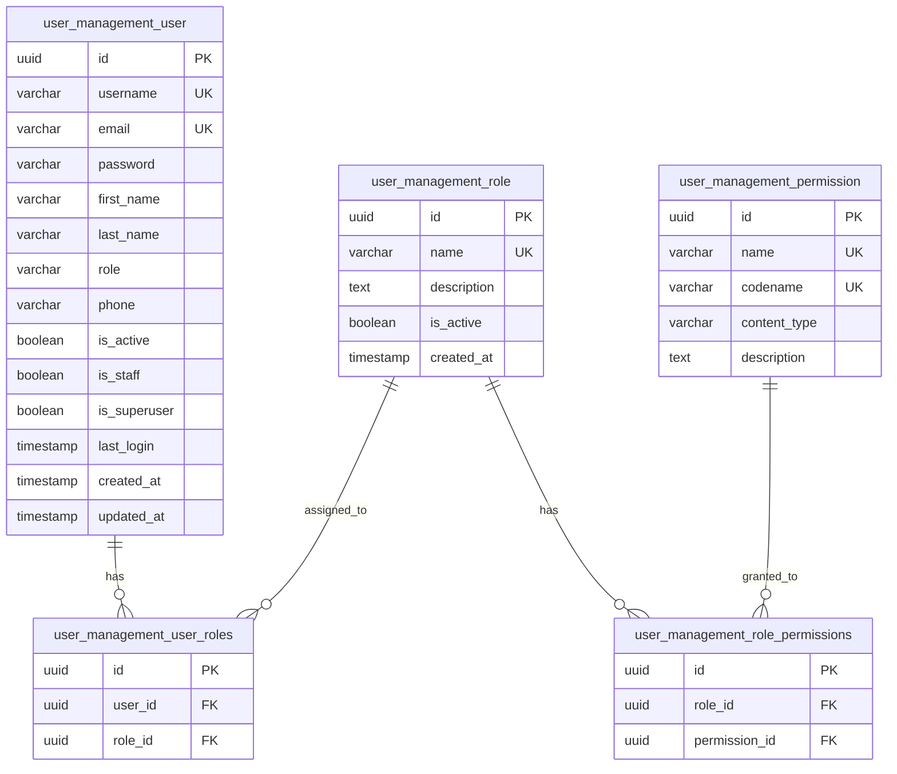

## Academic Schema - Students & Faculty

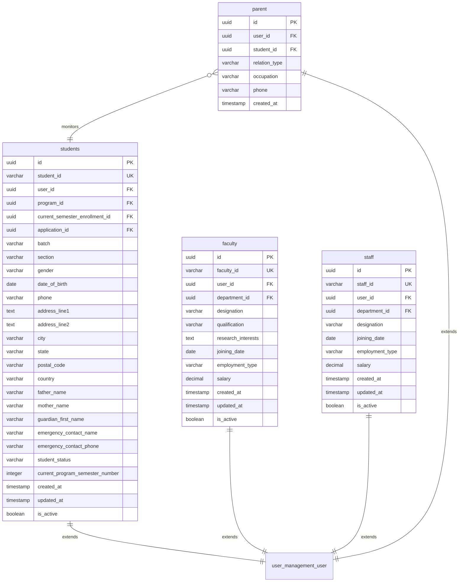

## Academic Schema - Programs & Courses

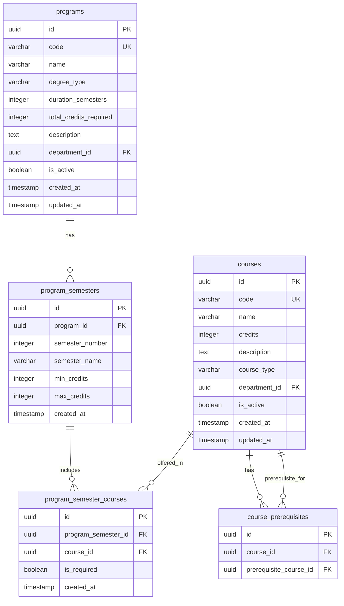

## Academic Schema - Enrollment & Scheduling

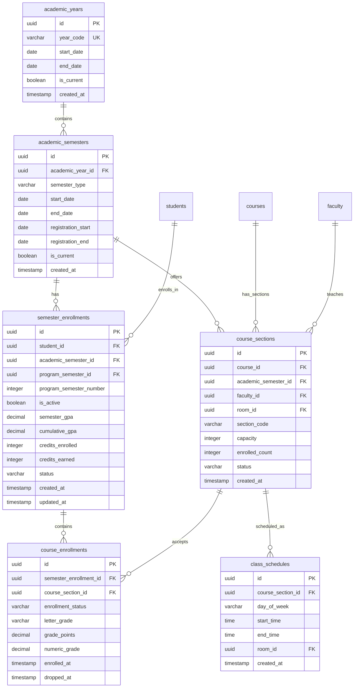

## Facilities Schema

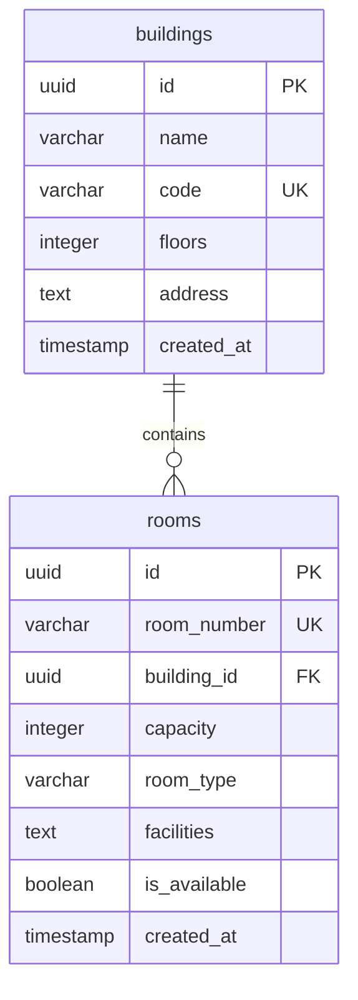

## Admissions Schema

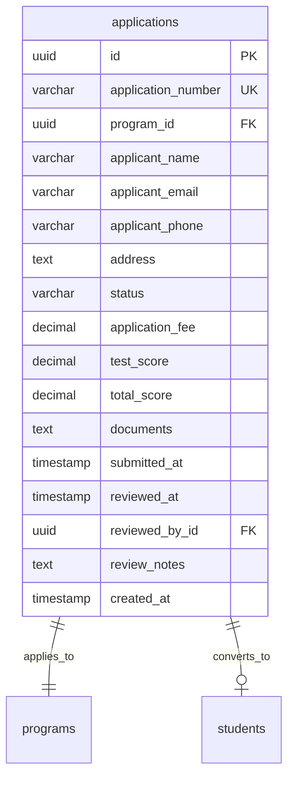

## Exams & Grading Schema

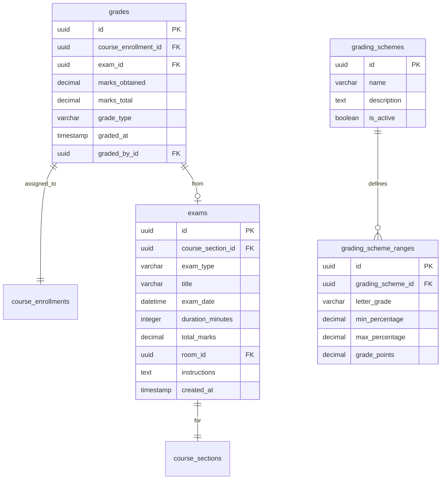

## Finance Schema

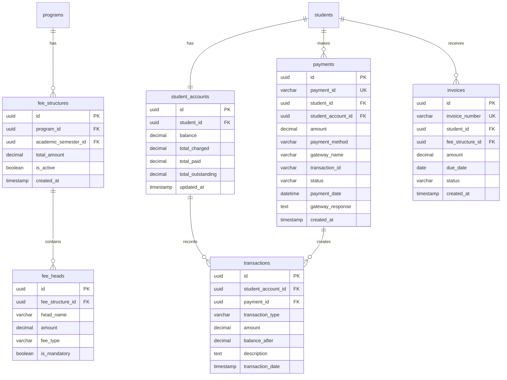

## Library Schema

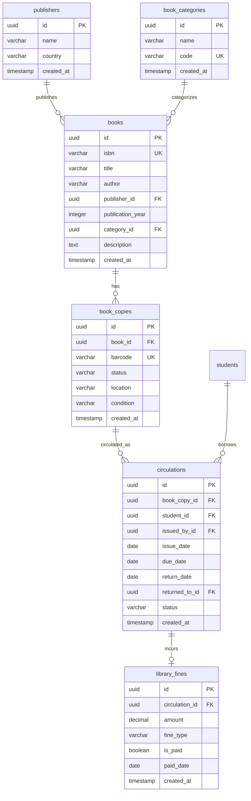

## LMS Schema

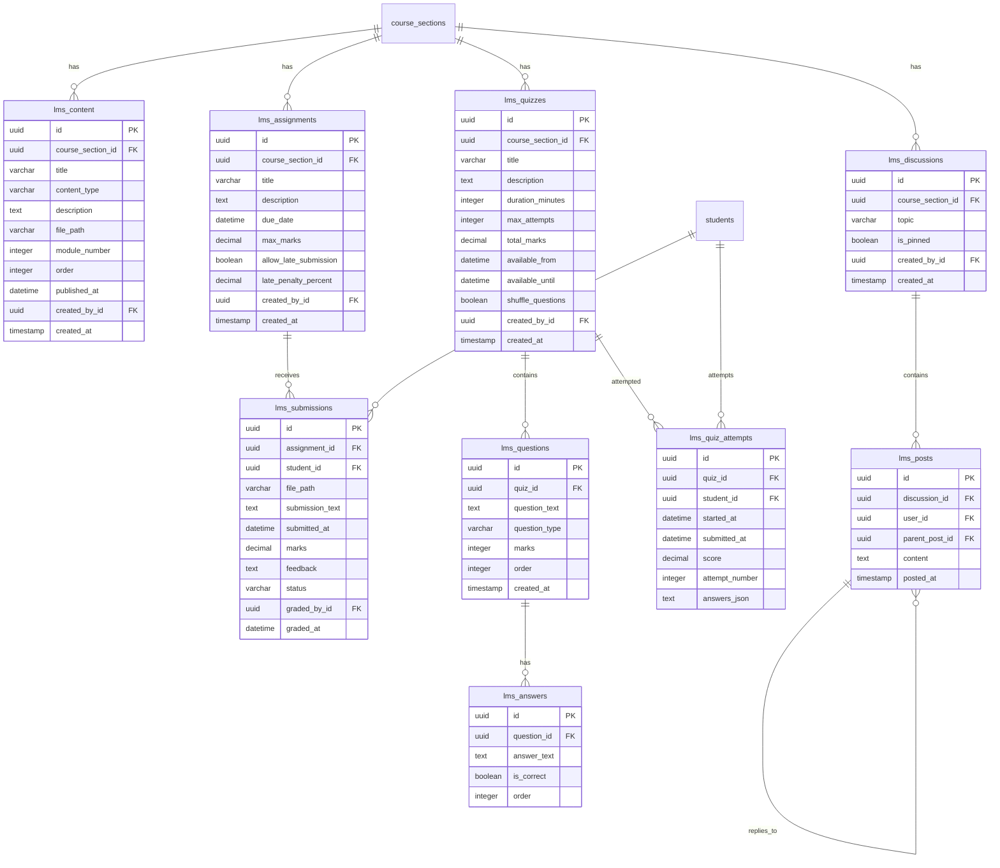

## Attendance Schema

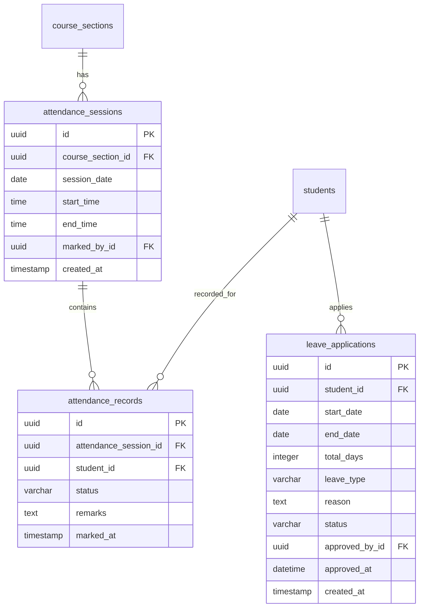

## HR & Payroll Schema

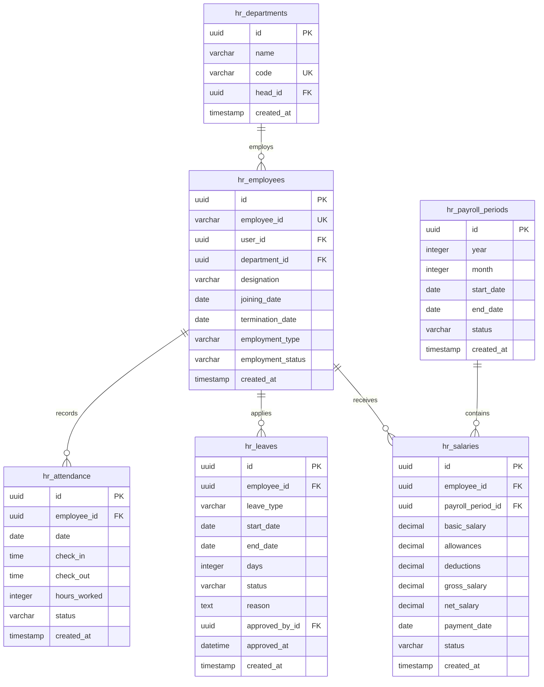

## Hostel & Transport Schema

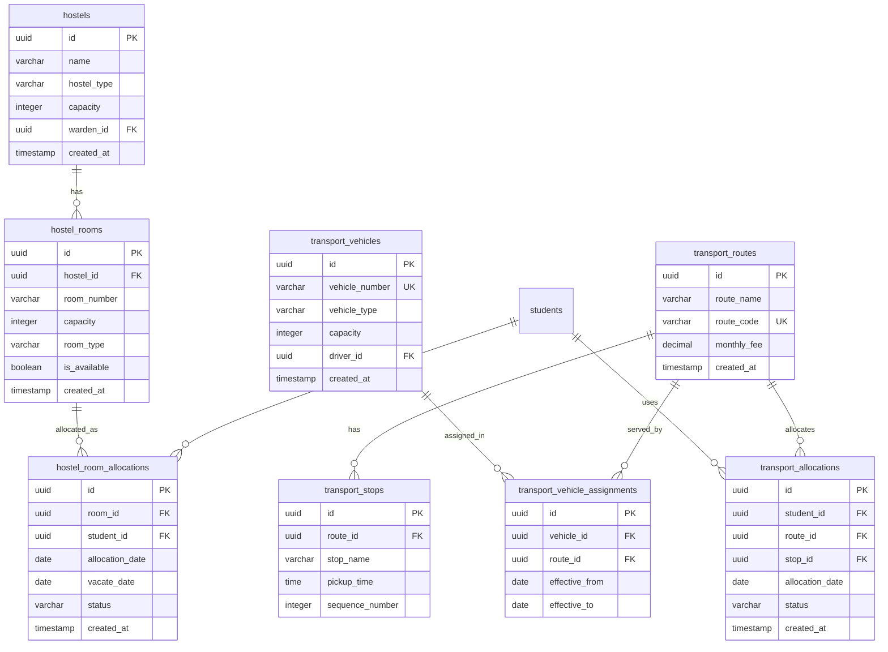

## Inventory Schema

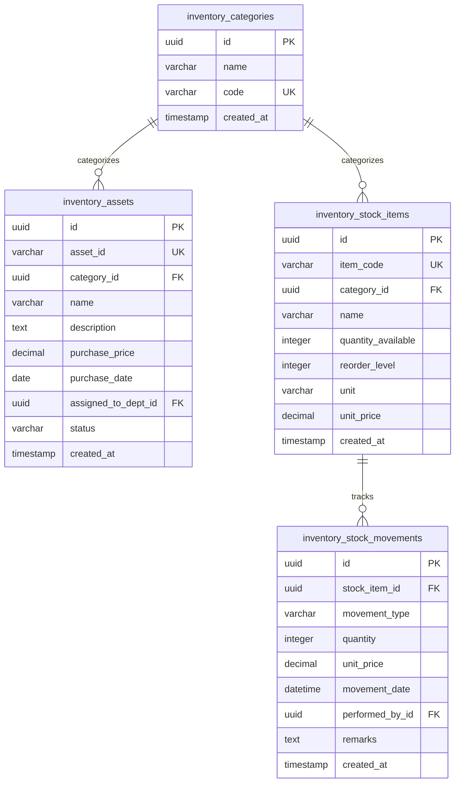

## Notifications Schema

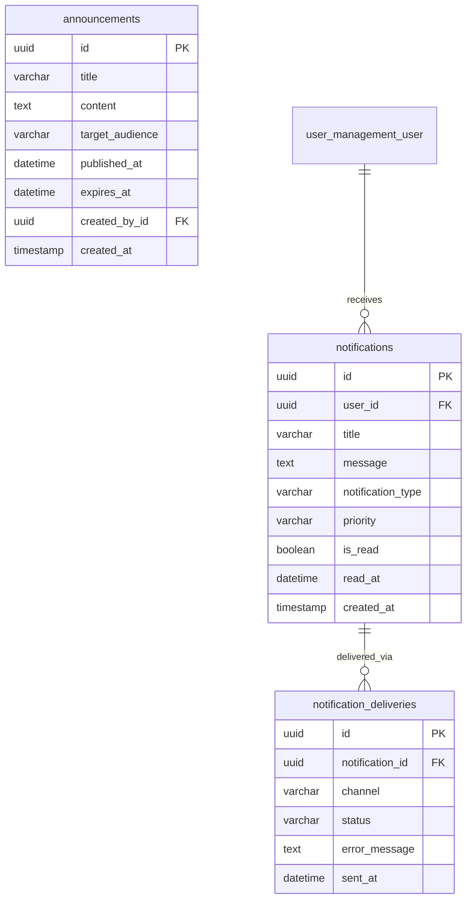

## Key Database Constraints & Indexes

### Primary Keys
- All tables use UUID as primary key
- UUIDs provide globally unique identifiers
- Better for distributed systems and security

### Unique Constraints
- `username`, `email` (users table)
- `student_id` (students)
- `faculty_id` (faculty)
- `course_code` (courses)
- `program_code` (programs)
- Application numbers, payment IDs, ISBNs, etc.

### Foreign Key Constraints
- ON DELETE CASCADE: For dependent records (e.g., enrollments when student deleted)
- ON DELETE SET NULL: For optional references
- ON DELETE PROTECT: For critical references (e.g., cannot delete program with students)

### Indexes
Performance-critical indexes:
- `student_id`, `faculty_id`, `employee_id` (frequently queried)
- `email`, `username` (for login)
- Foreign keys (automatic in PostgreSQL)
- `created_at`, `updated_at` (for sorting/filtering)
- Composite indexes on (`student_id`, `academic_semester_id`)
- Full-text search indexes on `title`, `description` fields

### Check Constraints
- GPA between 0.0 and 4.0
- Credits > 0
- Enrollment dates logical (start before end)
- Amounts >= 0 for financial fields

## Database Statistics

- **Total Tables**: ~75+ tables
- **Core Modules**: 25 Django apps
- **Relationships**: Hundreds of foreign key relationships
- **Estimated Size**: Varies by institution (10GB - 100GB+)

## Summary

This comprehensive database schema supports all EMIS modules with:
- Proper normalization (3NF)
- Clear relationships and constraints
- Performance indexes
- Audit trails (created_at, updated_at)
- Soft deletes (is_active flags)
- UUID primary keys for security and scalability
