# Sequence Diagrams — Education Management Information System

Consolidated sequence diagrams covering the critical flows across all 20 EMIS modules. Each section captures the two most important workflows per domain. Original per-module detail was maintained in the `sequence_diagram/` folder during development; this file supersedes it.

---

## 1. User Management

### 1.1 Login with JWT and MFA

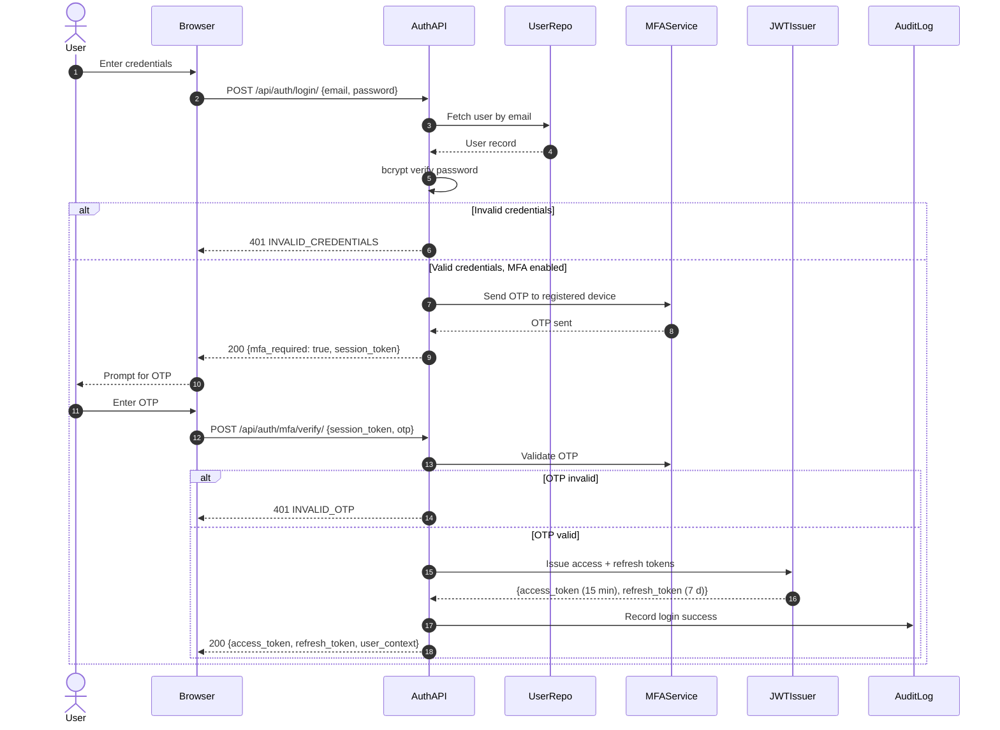
```mermaid
sequenceDiagram
    autonumber
    actor User
    participant Browser
    participant AuthAPI
    participant UserRepo
    participant MFAService
    participant JWTIssuer
    participant AuditLog

    User->>Browser: Enter credentials
    Browser->>AuthAPI: POST /api/auth/login/ {email, password}
    AuthAPI->>UserRepo: Fetch user by email
    UserRepo-->>AuthAPI: User record
    AuthAPI->>AuthAPI: bcrypt verify password
    alt Invalid credentials
        AuthAPI-->>Browser: 401 INVALID_CREDENTIALS
    else Valid credentials, MFA enabled
        AuthAPI->>MFAService: Send OTP to registered device
        MFAService-->>AuthAPI: OTP sent
        AuthAPI-->>Browser: 200 {mfa_required: true, session_token}
        Browser-->>User: Prompt for OTP
        User->>Browser: Enter OTP
        Browser->>AuthAPI: POST /api/auth/mfa/verify/ {session_token, otp}
        AuthAPI->>MFAService: Validate OTP
        alt OTP invalid
            AuthAPI-->>Browser: 401 INVALID_OTP
        else OTP valid
            AuthAPI->>JWTIssuer: Issue access + refresh tokens
            JWTIssuer-->>AuthAPI: {access_token (15 min), refresh_token (7 d)}
            AuthAPI->>AuditLog: Record login success
            AuthAPI-->>Browser: 200 {access_token, refresh_token, user_context}
        end
    end
```

### 1.2 Token Refresh and Logout

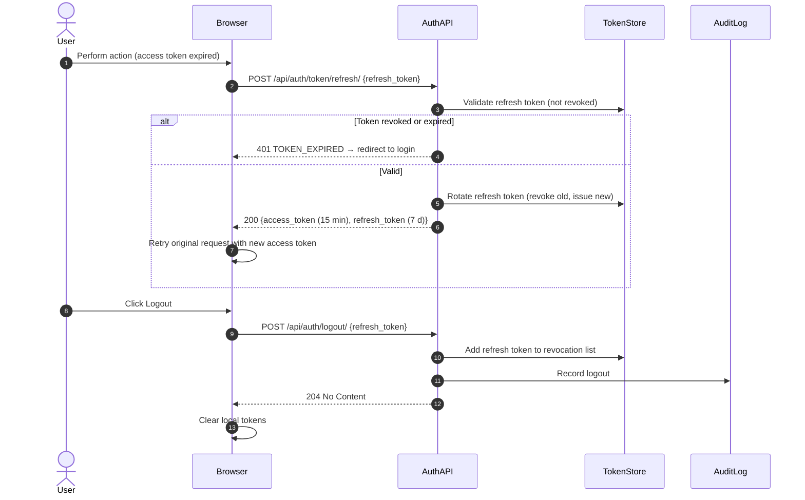
```mermaid
sequenceDiagram
    autonumber
    actor User
    participant Browser
    participant AuthAPI
    participant TokenStore
    participant AuditLog

    User->>Browser: Perform action (access token expired)
    Browser->>AuthAPI: POST /api/auth/token/refresh/ {refresh_token}
    AuthAPI->>TokenStore: Validate refresh token (not revoked)
    alt Token revoked or expired
        AuthAPI-->>Browser: 401 TOKEN_EXPIRED → redirect to login
    else Valid
        AuthAPI->>TokenStore: Rotate refresh token (revoke old, issue new)
        AuthAPI-->>Browser: 200 {access_token (15 min), refresh_token (7 d)}
        Browser->>Browser: Retry original request with new access token
    end

    User->>Browser: Click Logout
    Browser->>AuthAPI: POST /api/auth/logout/ {refresh_token}
    AuthAPI->>TokenStore: Add refresh token to revocation list
    AuthAPI->>AuditLog: Record logout
    AuthAPI-->>Browser: 204 No Content
    Browser->>Browser: Clear local tokens
```

---

## 2. Admissions

### 2.1 Multi-Step Application Submission

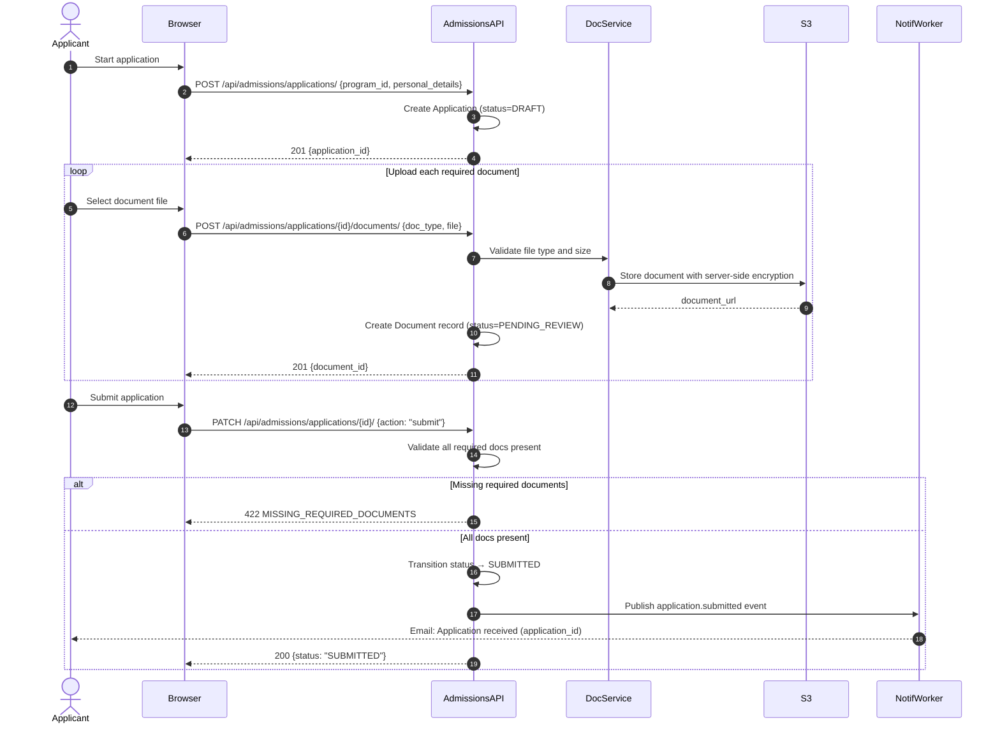
```mermaid
sequenceDiagram
    autonumber
    actor Applicant
    participant Browser
    participant AdmissionsAPI
    participant DocService
    participant S3
    participant NotifWorker

    Applicant->>Browser: Start application
    Browser->>AdmissionsAPI: POST /api/admissions/applications/ {program_id, personal_details}
    AdmissionsAPI->>AdmissionsAPI: Create Application (status=DRAFT)
    AdmissionsAPI-->>Browser: 201 {application_id}

    loop Upload each required document
        Applicant->>Browser: Select document file
        Browser->>AdmissionsAPI: POST /api/admissions/applications/{id}/documents/ {doc_type, file}
        AdmissionsAPI->>DocService: Validate file type and size
        DocService->>S3: Store document with server-side encryption
        S3-->>DocService: document_url
        AdmissionsAPI->>AdmissionsAPI: Create Document record (status=PENDING_REVIEW)
        AdmissionsAPI-->>Browser: 201 {document_id}
    end

    Applicant->>Browser: Submit application
    Browser->>AdmissionsAPI: PATCH /api/admissions/applications/{id}/ {action: "submit"}
    AdmissionsAPI->>AdmissionsAPI: Validate all required docs present
    alt Missing required documents
        AdmissionsAPI-->>Browser: 422 MISSING_REQUIRED_DOCUMENTS
    else All docs present
        AdmissionsAPI->>AdmissionsAPI: Transition status → SUBMITTED
        AdmissionsAPI->>NotifWorker: Publish application.submitted event
        NotifWorker-->>Applicant: Email: Application received (application_id)
        AdmissionsAPI-->>Browser: 200 {status: "SUBMITTED"}
    end
```

### 2.2 Merit List Generation and Offer Dispatch

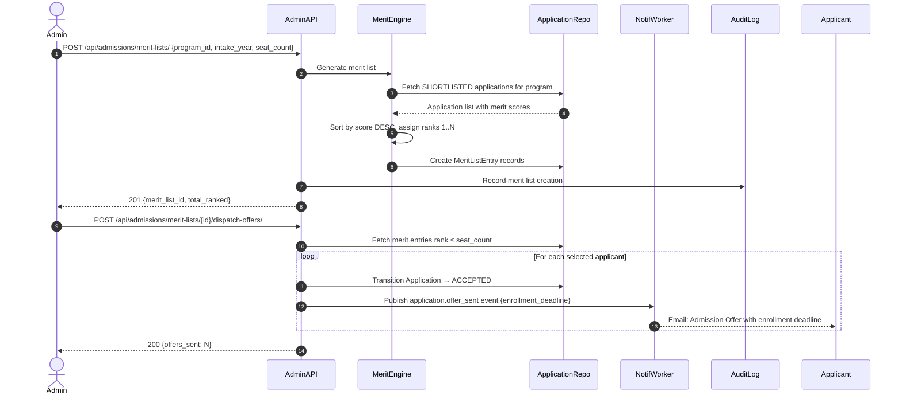
```mermaid
sequenceDiagram
    autonumber
    actor Admin
    participant AdminAPI
    participant MeritEngine
    participant ApplicationRepo
    participant NotifWorker
    participant AuditLog

    Admin->>AdminAPI: POST /api/admissions/merit-lists/ {program_id, intake_year, seat_count}
    AdminAPI->>MeritEngine: Generate merit list
    MeritEngine->>ApplicationRepo: Fetch SHORTLISTED applications for program
    ApplicationRepo-->>MeritEngine: Application list with merit scores
    MeritEngine->>MeritEngine: Sort by score DESC, assign ranks 1..N
    MeritEngine->>ApplicationRepo: Create MeritListEntry records
    AdminAPI->>AuditLog: Record merit list creation
    AdminAPI-->>Admin: 201 {merit_list_id, total_ranked}

    Admin->>AdminAPI: POST /api/admissions/merit-lists/{id}/dispatch-offers/
    AdminAPI->>ApplicationRepo: Fetch merit entries rank ≤ seat_count
    loop For each selected applicant
        AdminAPI->>ApplicationRepo: Transition Application → ACCEPTED
        AdminAPI->>NotifWorker: Publish application.offer_sent event {enrollment_deadline}
        NotifWorker-->>Applicant: Email: Admission Offer with enrollment deadline
    end
    AdminAPI-->>Admin: 200 {offers_sent: N}
```

---

## 3. Students

### 3.1 Student Registration and Profile Setup

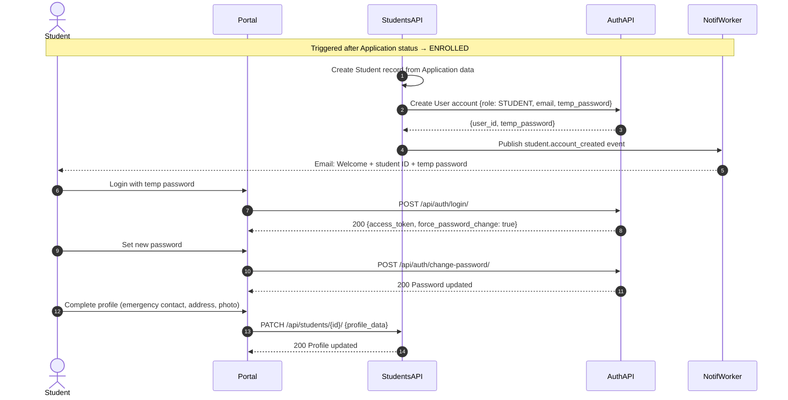
```mermaid
sequenceDiagram
    autonumber
    actor Student
    participant Portal
    participant StudentsAPI
    participant AuthAPI
    participant NotifWorker

    Note over Student,NotifWorker: Triggered after Application status → ENROLLED

    StudentsAPI->>StudentsAPI: Create Student record from Application data
    StudentsAPI->>AuthAPI: Create User account {role: STUDENT, email, temp_password}
    AuthAPI-->>StudentsAPI: {user_id, temp_password}
    StudentsAPI->>NotifWorker: Publish student.account_created event
    NotifWorker-->>Student: Email: Welcome + student ID + temp password

    Student->>Portal: Login with temp password
    Portal->>AuthAPI: POST /api/auth/login/
    AuthAPI-->>Portal: 200 {access_token, force_password_change: true}
    Student->>Portal: Set new password
    Portal->>AuthAPI: POST /api/auth/change-password/
    AuthAPI-->>Portal: 200 Password updated

    Student->>Portal: Complete profile (emergency contact, address, photo)
    Portal->>StudentsAPI: PATCH /api/students/{id}/ {profile_data}
    StudentsAPI-->>Portal: 200 Profile updated
```

### 3.2 Parent Portal Access with Student Consent

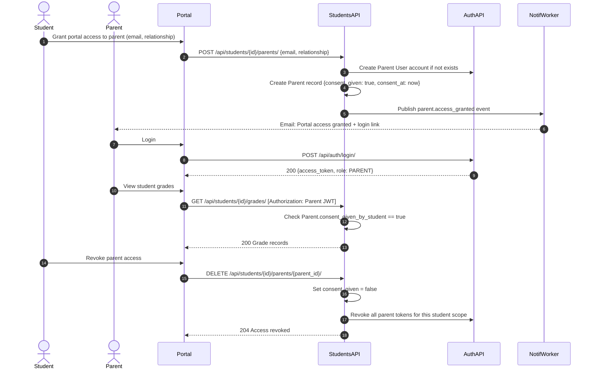
```mermaid
sequenceDiagram
    autonumber
    actor Student
    actor Parent
    participant Portal
    participant StudentsAPI
    participant AuthAPI
    participant NotifWorker

    Student->>Portal: Grant portal access to parent (email, relationship)
    Portal->>StudentsAPI: POST /api/students/{id}/parents/ {email, relationship}
    StudentsAPI->>AuthAPI: Create Parent User account if not exists
    StudentsAPI->>StudentsAPI: Create Parent record {consent_given: true, consent_at: now}
    StudentsAPI->>NotifWorker: Publish parent.access_granted event
    NotifWorker-->>Parent: Email: Portal access granted + login link

    Parent->>Portal: Login
    Portal->>AuthAPI: POST /api/auth/login/
    AuthAPI-->>Portal: 200 {access_token, role: PARENT}

    Parent->>Portal: View student grades
    Portal->>StudentsAPI: GET /api/students/{id}/grades/ [Authorization: Parent JWT]
    StudentsAPI->>StudentsAPI: Check Parent.consent_given_by_student == true
    StudentsAPI-->>Portal: 200 Grade records

    Student->>Portal: Revoke parent access
    Portal->>StudentsAPI: DELETE /api/students/{id}/parents/{parent_id}/
    StudentsAPI->>StudentsAPI: Set consent_given = false
    StudentsAPI->>AuthAPI: Revoke all parent tokens for this student scope
    StudentsAPI-->>Portal: 204 Access revoked
```

---

## 4. Faculty

### 4.1 Faculty Onboarding

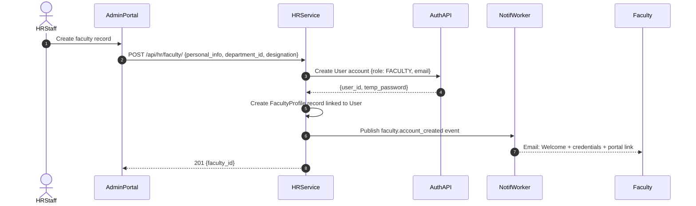
```mermaid
sequenceDiagram
    autonumber
    actor HRStaff
    participant AdminPortal
    participant HRService
    participant AuthAPI
    participant NotifWorker

    HRStaff->>AdminPortal: Create faculty record
    AdminPortal->>HRService: POST /api/hr/faculty/ {personal_info, department_id, designation}
    HRService->>AuthAPI: Create User account {role: FACULTY, email}
    AuthAPI-->>HRService: {user_id, temp_password}
    HRService->>HRService: Create FacultyProfile record linked to User
    HRService->>NotifWorker: Publish faculty.account_created event
    NotifWorker-->>Faculty: Email: Welcome + credentials + portal link
    HRService-->>AdminPortal: 201 {faculty_id}
```

### 4.2 Course Assignment and Teaching Load Verification

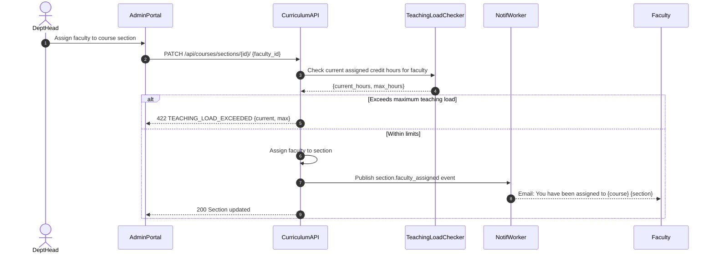
```mermaid
sequenceDiagram
    autonumber
    actor DeptHead
    participant AdminPortal
    participant CurriculumAPI
    participant TeachingLoadChecker
    participant NotifWorker

    DeptHead->>AdminPortal: Assign faculty to course section
    AdminPortal->>CurriculumAPI: PATCH /api/courses/sections/{id}/ {faculty_id}
    CurriculumAPI->>TeachingLoadChecker: Check current assigned credit hours for faculty
    TeachingLoadChecker-->>CurriculumAPI: {current_hours, max_hours}
    alt Exceeds maximum teaching load
        CurriculumAPI-->>AdminPortal: 422 TEACHING_LOAD_EXCEEDED {current, max}
    else Within limits
        CurriculumAPI->>CurriculumAPI: Assign faculty to section
        CurriculumAPI->>NotifWorker: Publish section.faculty_assigned event
        NotifWorker-->>Faculty: Email: You have been assigned to {course} {section}
        CurriculumAPI-->>AdminPortal: 200 Section updated
    end
```

---

## 5. Courses and Enrollment

### 5.1 Student Course Registration

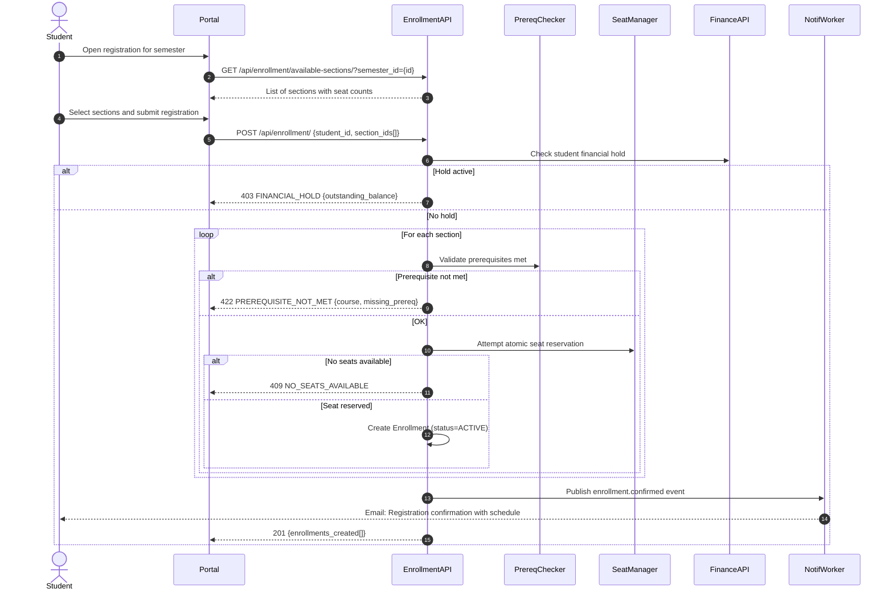
```mermaid
sequenceDiagram
    autonumber
    actor Student
    participant Portal
    participant EnrollmentAPI
    participant PrereqChecker
    participant SeatManager
    participant FinanceAPI
    participant NotifWorker

    Student->>Portal: Open registration for semester
    Portal->>EnrollmentAPI: GET /api/enrollment/available-sections/?semester_id={id}
    EnrollmentAPI-->>Portal: List of sections with seat counts

    Student->>Portal: Select sections and submit registration
    Portal->>EnrollmentAPI: POST /api/enrollment/ {student_id, section_ids[]}
    EnrollmentAPI->>FinanceAPI: Check student financial hold
    alt Hold active
        EnrollmentAPI-->>Portal: 403 FINANCIAL_HOLD {outstanding_balance}
    else No hold
        loop For each section
            EnrollmentAPI->>PrereqChecker: Validate prerequisites met
            alt Prerequisite not met
                EnrollmentAPI-->>Portal: 422 PREREQUISITE_NOT_MET {course, missing_prereq}
            else OK
                EnrollmentAPI->>SeatManager: Attempt atomic seat reservation
                alt No seats available
                    EnrollmentAPI-->>Portal: 409 NO_SEATS_AVAILABLE
                else Seat reserved
                    EnrollmentAPI->>EnrollmentAPI: Create Enrollment (status=ACTIVE)
                end
            end
        end
        EnrollmentAPI->>NotifWorker: Publish enrollment.confirmed event
        NotifWorker-->>Student: Email: Registration confirmation with schedule
        EnrollmentAPI-->>Portal: 201 {enrollments_created[]}
    end
```

### 5.2 Course Add-Drop Window

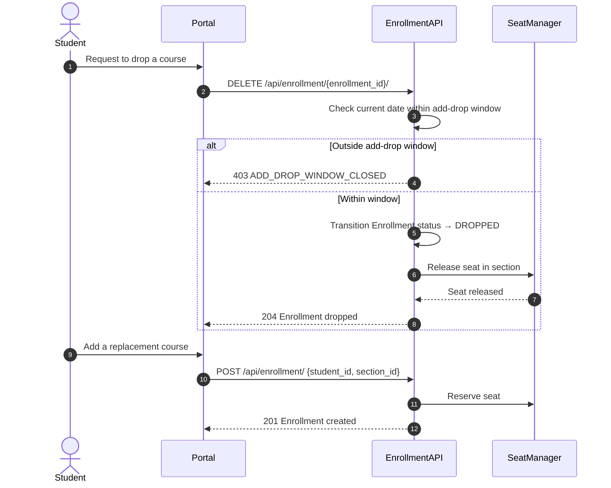
```mermaid
sequenceDiagram
    autonumber
    actor Student
    participant Portal
    participant EnrollmentAPI
    participant SeatManager

    Student->>Portal: Request to drop a course
    Portal->>EnrollmentAPI: DELETE /api/enrollment/{enrollment_id}/
    EnrollmentAPI->>EnrollmentAPI: Check current date within add-drop window
    alt Outside add-drop window
        EnrollmentAPI-->>Portal: 403 ADD_DROP_WINDOW_CLOSED
    else Within window
        EnrollmentAPI->>EnrollmentAPI: Transition Enrollment status → DROPPED
        EnrollmentAPI->>SeatManager: Release seat in section
        SeatManager-->>EnrollmentAPI: Seat released
        EnrollmentAPI-->>Portal: 204 Enrollment dropped
    end

    Student->>Portal: Add a replacement course
    Portal->>EnrollmentAPI: POST /api/enrollment/ {student_id, section_id}
    EnrollmentAPI->>SeatManager: Reserve seat
    EnrollmentAPI-->>Portal: 201 Enrollment created
```

---

## 6. Timetable

### 6.1 Automated Schedule Generation

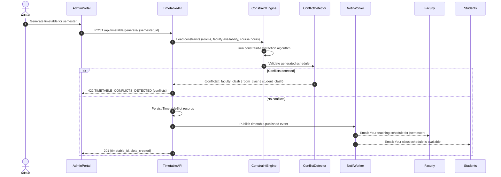
```mermaid
sequenceDiagram
    autonumber
    actor Admin
    participant AdminPortal
    participant TimetableAPI
    participant ConstraintEngine
    participant ConflictDetector
    participant NotifWorker

    Admin->>AdminPortal: Generate timetable for semester
    AdminPortal->>TimetableAPI: POST /api/timetable/generate/ {semester_id}
    TimetableAPI->>ConstraintEngine: Load constraints (rooms, faculty availability, course hours)
    ConstraintEngine->>ConstraintEngine: Run constraint-satisfaction algorithm
    ConstraintEngine->>ConflictDetector: Validate generated schedule
    alt Conflicts detected
        ConflictDetector-->>TimetableAPI: {conflicts[]: faculty_clash | room_clash | student_clash}
        TimetableAPI-->>AdminPortal: 422 TIMETABLE_CONFLICTS_DETECTED {conflicts}
    else No conflicts
        TimetableAPI->>TimetableAPI: Persist TimetableSlot records
        TimetableAPI->>NotifWorker: Publish timetable.published event
        NotifWorker-->>Faculty: Email: Your teaching schedule for {semester}
        NotifWorker-->>Students: Email: Your class schedule is available
        TimetableAPI-->>AdminPortal: 201 {timetable_id, slots_created}
    end
```

### 6.2 Room Booking for Special Event

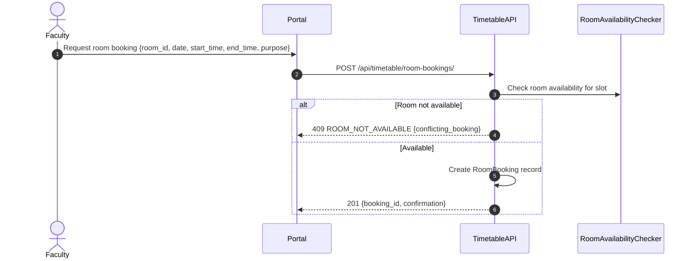
```mermaid
sequenceDiagram
    autonumber
    actor Faculty
    participant Portal
    participant TimetableAPI
    participant RoomAvailabilityChecker

    Faculty->>Portal: Request room booking {room_id, date, start_time, end_time, purpose}
    Portal->>TimetableAPI: POST /api/timetable/room-bookings/
    TimetableAPI->>RoomAvailabilityChecker: Check room availability for slot
    alt Room not available
        TimetableAPI-->>Portal: 409 ROOM_NOT_AVAILABLE {conflicting_booking}
    else Available
        TimetableAPI->>TimetableAPI: Create RoomBooking record
        TimetableAPI-->>Portal: 201 {booking_id, confirmation}
    end
```

---

## 7. Attendance

### 7.1 Marking Attendance

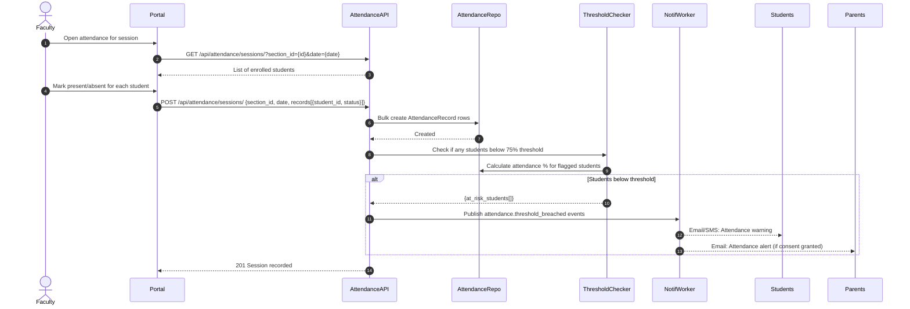
```mermaid
sequenceDiagram
    autonumber
    actor Faculty
    participant Portal
    participant AttendanceAPI
    participant AttendanceRepo
    participant ThresholdChecker
    participant NotifWorker

    Faculty->>Portal: Open attendance for session
    Portal->>AttendanceAPI: GET /api/attendance/sessions/?section_id={id}&date={date}
    AttendanceAPI-->>Portal: List of enrolled students

    Faculty->>Portal: Mark present/absent for each student
    Portal->>AttendanceAPI: POST /api/attendance/sessions/ {section_id, date, records[{student_id, status}]}
    AttendanceAPI->>AttendanceRepo: Bulk create AttendanceRecord rows
    AttendanceRepo-->>AttendanceAPI: Created

    AttendanceAPI->>ThresholdChecker: Check if any students below 75% threshold
    ThresholdChecker->>AttendanceRepo: Calculate attendance % for flagged students
    alt Students below threshold
        ThresholdChecker-->>AttendanceAPI: {at_risk_students[]}
        AttendanceAPI->>NotifWorker: Publish attendance.threshold_breached events
        NotifWorker-->>Students: Email/SMS: Attendance warning
        NotifWorker-->>Parents: Email: Attendance alert (if consent granted)
    end
    AttendanceAPI-->>Portal: 201 Session recorded
```

### 7.2 Attendance Correction Request

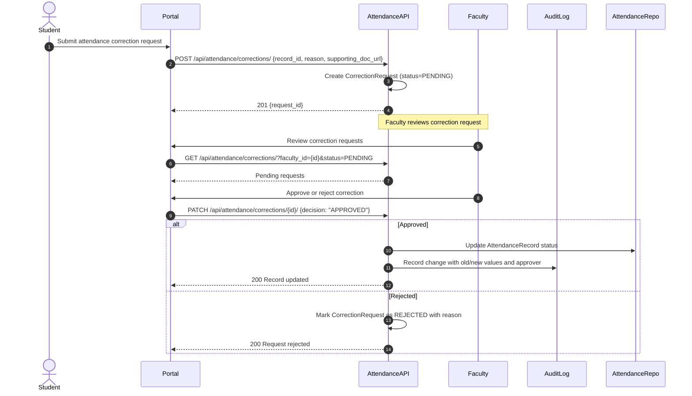
```mermaid
sequenceDiagram
    autonumber
    actor Student
    participant Portal
    participant AttendanceAPI
    participant Faculty
    participant AuditLog

    Student->>Portal: Submit attendance correction request
    Portal->>AttendanceAPI: POST /api/attendance/corrections/ {record_id, reason, supporting_doc_url}
    AttendanceAPI->>AttendanceAPI: Create CorrectionRequest (status=PENDING)
    AttendanceAPI-->>Portal: 201 {request_id}

    Note over AttendanceAPI,Faculty: Faculty reviews correction request

    Faculty->>Portal: Review correction requests
    Portal->>AttendanceAPI: GET /api/attendance/corrections/?faculty_id={id}&status=PENDING
    AttendanceAPI-->>Portal: Pending requests

    Faculty->>Portal: Approve or reject correction
    Portal->>AttendanceAPI: PATCH /api/attendance/corrections/{id}/ {decision: "APPROVED"}
    alt Approved
        AttendanceAPI->>AttendanceRepo: Update AttendanceRecord status
        AttendanceAPI->>AuditLog: Record change with old/new values and approver
        AttendanceAPI-->>Portal: 200 Record updated
    else Rejected
        AttendanceAPI->>AttendanceAPI: Mark CorrectionRequest as REJECTED with reason
        AttendanceAPI-->>Portal: 200 Request rejected
    end
```

---

## 8. Exams

### 8.1 Exam Scheduling and Admit Card Generation

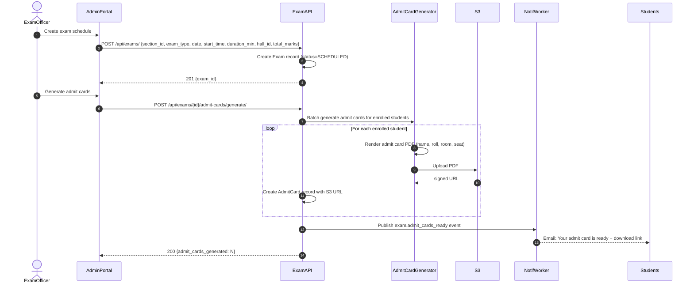
```mermaid
sequenceDiagram
    autonumber
    actor ExamOfficer
    participant AdminPortal
    participant ExamAPI
    participant AdmitCardGenerator
    participant S3
    participant NotifWorker

    ExamOfficer->>AdminPortal: Create exam schedule
    AdminPortal->>ExamAPI: POST /api/exams/ {section_id, exam_type, date, start_time, duration_min, hall_id, total_marks}
    ExamAPI->>ExamAPI: Create Exam record (status=SCHEDULED)
    ExamAPI-->>AdminPortal: 201 {exam_id}

    ExamOfficer->>AdminPortal: Generate admit cards
    AdminPortal->>ExamAPI: POST /api/exams/{id}/admit-cards/generate/
    ExamAPI->>AdmitCardGenerator: Batch generate admit cards for enrolled students
    loop For each enrolled student
        AdmitCardGenerator->>AdmitCardGenerator: Render admit card PDF (name, roll, room, seat)
        AdmitCardGenerator->>S3: Upload PDF
        S3-->>AdmitCardGenerator: signed URL
        ExamAPI->>ExamAPI: Create AdmitCard record with S3 URL
    end
    ExamAPI->>NotifWorker: Publish exam.admit_cards_ready event
    NotifWorker-->>Students: Email: Your admit card is ready + download link
    ExamAPI-->>AdminPortal: 200 {admit_cards_generated: N}
```

### 8.2 Grade Submission and Publishing

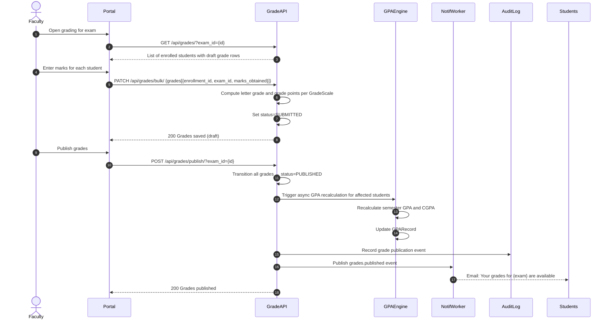
```mermaid
sequenceDiagram
    autonumber
    actor Faculty
    participant Portal
    participant GradeAPI
    participant GPAEngine
    participant NotifWorker
    participant AuditLog

    Faculty->>Portal: Open grading for exam
    Portal->>GradeAPI: GET /api/grades/?exam_id={id}
    GradeAPI-->>Portal: List of enrolled students with draft grade rows

    Faculty->>Portal: Enter marks for each student
    Portal->>GradeAPI: PATCH /api/grades/bulk/ {grades[{enrollment_id, exam_id, marks_obtained}]}
    GradeAPI->>GradeAPI: Compute letter grade and grade points per GradeScale
    GradeAPI->>GradeAPI: Set status=SUBMITTED
    GradeAPI-->>Portal: 200 Grades saved (draft)

    Faculty->>Portal: Publish grades
    Portal->>GradeAPI: POST /api/grades/publish/?exam_id={id}
    GradeAPI->>GradeAPI: Transition all grades → status=PUBLISHED
    GradeAPI->>GPAEngine: Trigger async GPA recalculation for affected students
    GPAEngine->>GPAEngine: Recalculate semester GPA and CGPA
    GPAEngine->>GPAEngine: Update GPARecord
    GradeAPI->>AuditLog: Record grade publication event
    GradeAPI->>NotifWorker: Publish grades.published event
    NotifWorker-->>Students: Email: Your grades for {exam} are available
    GradeAPI-->>Portal: 200 Grades published
```

---

## 9. LMS

### 9.1 Assignment Submission with Plagiarism Check

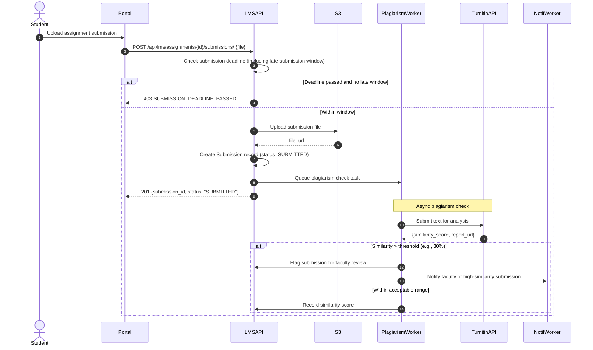
```mermaid
sequenceDiagram
    autonumber
    actor Student
    participant Portal
    participant LMSAPI
    participant S3
    participant PlagiarismWorker
    participant TurnitinAPI
    participant NotifWorker

    Student->>Portal: Upload assignment submission
    Portal->>LMSAPI: POST /api/lms/assignments/{id}/submissions/ {file}
    LMSAPI->>LMSAPI: Check submission deadline (including late-submission window)
    alt Deadline passed and no late window
        LMSAPI-->>Portal: 403 SUBMISSION_DEADLINE_PASSED
    else Within window
        LMSAPI->>S3: Upload submission file
        S3-->>LMSAPI: file_url
        LMSAPI->>LMSAPI: Create Submission record (status=SUBMITTED)
        LMSAPI->>PlagiarismWorker: Queue plagiarism check task
        LMSAPI-->>Portal: 201 {submission_id, status: "SUBMITTED"}

        Note over PlagiarismWorker,TurnitinAPI: Async plagiarism check
        PlagiarismWorker->>TurnitinAPI: Submit text for analysis
        TurnitinAPI-->>PlagiarismWorker: {similarity_score, report_url}
        alt Similarity > threshold (e.g., 30%)
            PlagiarismWorker->>LMSAPI: Flag submission for faculty review
            PlagiarismWorker->>NotifWorker: Notify faculty of high-similarity submission
        else Within acceptable range
            PlagiarismWorker->>LMSAPI: Record similarity score
        end
    end
```

### 9.2 Quiz Attempt and Auto-Grading

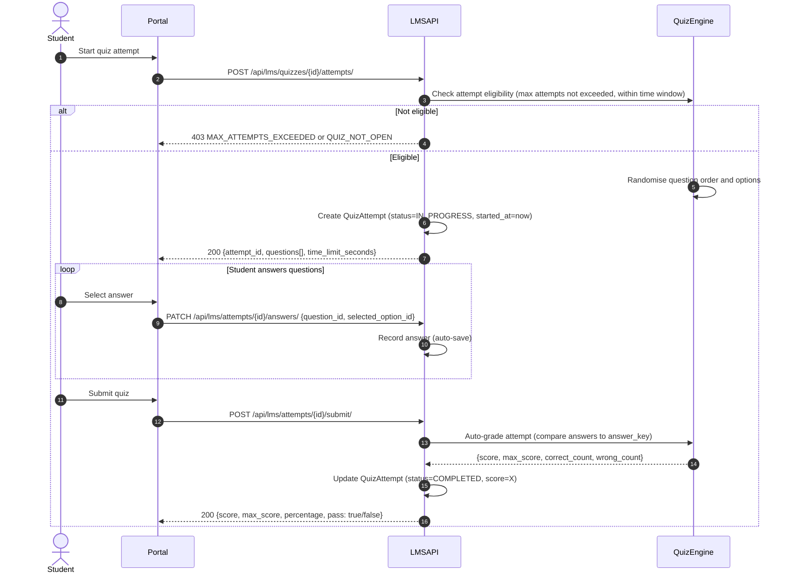
```mermaid
sequenceDiagram
    autonumber
    actor Student
    participant Portal
    participant LMSAPI
    participant QuizEngine

    Student->>Portal: Start quiz attempt
    Portal->>LMSAPI: POST /api/lms/quizzes/{id}/attempts/
    LMSAPI->>QuizEngine: Check attempt eligibility (max attempts not exceeded, within time window)
    alt Not eligible
        LMSAPI-->>Portal: 403 MAX_ATTEMPTS_EXCEEDED or QUIZ_NOT_OPEN
    else Eligible
        QuizEngine->>QuizEngine: Randomise question order and options
        LMSAPI->>LMSAPI: Create QuizAttempt (status=IN_PROGRESS, started_at=now)
        LMSAPI-->>Portal: 200 {attempt_id, questions[], time_limit_seconds}

        loop Student answers questions
            Student->>Portal: Select answer
            Portal->>LMSAPI: PATCH /api/lms/attempts/{id}/answers/ {question_id, selected_option_id}
            LMSAPI->>LMSAPI: Record answer (auto-save)
        end

        Student->>Portal: Submit quiz
        Portal->>LMSAPI: POST /api/lms/attempts/{id}/submit/
        LMSAPI->>QuizEngine: Auto-grade attempt (compare answers to answer_key)
        QuizEngine-->>LMSAPI: {score, max_score, correct_count, wrong_count}
        LMSAPI->>LMSAPI: Update QuizAttempt (status=COMPLETED, score=X)
        LMSAPI-->>Portal: 200 {score, max_score, percentage, pass: true/false}
    end
```

---

## 10. Finance

### 10.1 Fee Invoice Generation

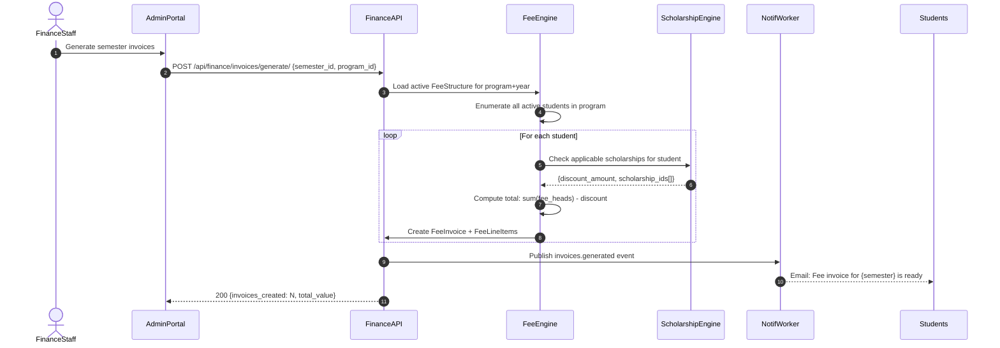
```mermaid
sequenceDiagram
    autonumber
    actor FinanceStaff
    participant AdminPortal
    participant FinanceAPI
    participant FeeEngine
    participant ScholarshipEngine
    participant NotifWorker

    FinanceStaff->>AdminPortal: Generate semester invoices
    AdminPortal->>FinanceAPI: POST /api/finance/invoices/generate/ {semester_id, program_id}
    FinanceAPI->>FeeEngine: Load active FeeStructure for program+year
    FeeEngine->>FeeEngine: Enumerate all active students in program
    loop For each student
        FeeEngine->>ScholarshipEngine: Check applicable scholarships for student
        ScholarshipEngine-->>FeeEngine: {discount_amount, scholarship_ids[]}
        FeeEngine->>FeeEngine: Compute total: sum(fee_heads) - discount
        FeeEngine->>FinanceAPI: Create FeeInvoice + FeeLineItems
    end
    FinanceAPI->>NotifWorker: Publish invoices.generated event
    NotifWorker-->>Students: Email: Fee invoice for {semester} is ready
    FinanceAPI-->>AdminPortal: 200 {invoices_created: N, total_value}
```

### 10.2 Online Payment via Gateway

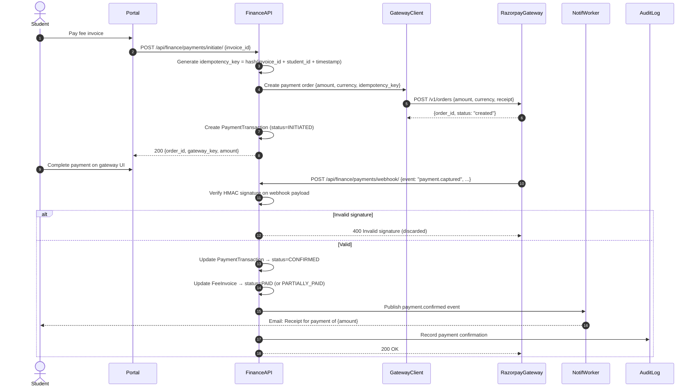
```mermaid
sequenceDiagram
    autonumber
    actor Student
    participant Portal
    participant FinanceAPI
    participant GatewayClient
    participant RazorpayGateway
    participant NotifWorker
    participant AuditLog

    Student->>Portal: Pay fee invoice
    Portal->>FinanceAPI: POST /api/finance/payments/initiate/ {invoice_id}
    FinanceAPI->>FinanceAPI: Generate idempotency_key = hash(invoice_id + student_id + timestamp)
    FinanceAPI->>GatewayClient: Create payment order {amount, currency, idempotency_key}
    GatewayClient->>RazorpayGateway: POST /v1/orders {amount, currency, receipt}
    RazorpayGateway-->>GatewayClient: {order_id, status: "created"}
    FinanceAPI->>FinanceAPI: Create PaymentTransaction (status=INITIATED)
    FinanceAPI-->>Portal: 200 {order_id, gateway_key, amount}

    Student->>Portal: Complete payment on gateway UI
    RazorpayGateway->>FinanceAPI: POST /api/finance/payments/webhook/ {event: "payment.captured", ...}
    FinanceAPI->>FinanceAPI: Verify HMAC signature on webhook payload
    alt Invalid signature
        FinanceAPI-->>RazorpayGateway: 400 Invalid signature (discarded)
    else Valid
        FinanceAPI->>FinanceAPI: Update PaymentTransaction → status=CONFIRMED
        FinanceAPI->>FinanceAPI: Update FeeInvoice → status=PAID (or PARTIALLY_PAID)
        FinanceAPI->>NotifWorker: Publish payment.confirmed event
        NotifWorker-->>Student: Email: Receipt for payment of {amount}
        FinanceAPI->>AuditLog: Record payment confirmation
        FinanceAPI-->>RazorpayGateway: 200 OK
    end
```

---

## 11. Library

### 11.1 Book Issue and Return

```mermaid
sequenceDiagram
    autonumber
    actor LibraryStaff
    participant LibraryPortal
    participant LibraryAPI
    participant FineCalculator

    LibraryStaff->>LibraryPortal: Issue book to student
    LibraryPortal->>LibraryAPI: POST /api/library/issues/ {student_id, book_copy_id}
    LibraryAPI->>LibraryAPI: Check BookCopy status == AVAILABLE
    alt Not available
        LibraryAPI-->>LibraryPortal: 409 COPY_NOT_AVAILABLE
    else Available
        LibraryAPI->>LibraryAPI: Create BookIssue (status=ISSUED, due_date=now+14d)
        LibraryAPI->>LibraryAPI: Update BookCopy status → ISSUED
        LibraryAPI-->>LibraryPortal: 201 {issue_id, due_date}
    end

    LibraryStaff->>LibraryPortal: Process book return
    LibraryPortal->>LibraryAPI: POST /api/library/returns/ {issue_id}
    LibraryAPI->>FineCalculator: Calculate overdue fine (days_late × rate_per_day)
    alt Fine > 0
        FineCalculator-->>LibraryAPI: {fine_amount}
        LibraryAPI->>LibraryAPI: Create FineLedgerEntry for student
        LibraryAPI->>LibraryAPI: Update BookIssue status → RETURNED_WITH_FINE
    else Returned on time
        LibraryAPI->>LibraryAPI: Update BookIssue status → RETURNED
    end
    LibraryAPI->>LibraryAPI: Update BookCopy status → AVAILABLE
    LibraryAPI-->>LibraryPortal: 200 {return_processed, fine_amount}
```

---

## 12. HR

### 12.1 Leave Application Workflow

```mermaid
sequenceDiagram
    autonumber
    actor Faculty
    participant Portal
    participant HRAPI
    participant LeaveBalanceChecker
    participant DeptHead
    participant NotifWorker

    Faculty->>Portal: Apply for leave
    Portal->>HRAPI: POST /api/hr/leave-requests/ {leave_type, start_date, end_date, reason}
    HRAPI->>LeaveBalanceChecker: Check available leave balance
    alt Insufficient balance
        HRAPI-->>Portal: 422 INSUFFICIENT_LEAVE_BALANCE {available, requested}
    else Sufficient balance
        HRAPI->>HRAPI: Create LeaveRequest (status=PENDING)
        HRAPI->>NotifWorker: Notify department head of pending request
        NotifWorker-->>DeptHead: Email: Leave request from {faculty} awaiting approval
        HRAPI-->>Portal: 201 {request_id, status: "PENDING"}
    end

    DeptHead->>Portal: Review leave request
    Portal->>HRAPI: PATCH /api/hr/leave-requests/{id}/ {action: "APPROVE"}
    HRAPI->>HRAPI: Transition LeaveRequest → APPROVED
    HRAPI->>LeaveBalanceChecker: Deduct leave days from balance
    HRAPI->>NotifWorker: Notify faculty of approval
    NotifWorker-->>Faculty: Email: Leave request approved for {start_date} to {end_date}
    HRAPI-->>Portal: 200 Leave approved
```

---

## 13. Hostel

### 13.1 Room Allocation

```mermaid
sequenceDiagram
    autonumber
    actor Student
    participant Portal
    participant HostelAPI
    participant RoomAllocator
    participant FinanceAPI

    Student->>Portal: Apply for hostel accommodation
    Portal->>HostelAPI: POST /api/hostel/applications/ {hostel_preference, room_type}
    HostelAPI->>RoomAllocator: Find available room matching preference
    alt No rooms available
        HostelAPI-->>Portal: 409 NO_ROOMS_AVAILABLE {waitlist_position}
    else Room available
        HostelAPI->>HostelAPI: Create HostelAllocation record
        HostelAPI->>FinanceAPI: Add hostel fee to student invoice
        HostelAPI-->>Portal: 201 {allocation_id, room_number, block, floor}
    end
```

---

## 14. Transport

### 14.1 Route Assignment

```mermaid
sequenceDiagram
    autonumber
    actor Student
    participant Portal
    participant TransportAPI

    Student->>Portal: Register for bus transport
    Portal->>TransportAPI: POST /api/transport/registrations/ {pickup_stop_id}
    TransportAPI->>TransportAPI: Check seat capacity on route for stop
    alt Route full
        TransportAPI-->>Portal: 409 ROUTE_FULL
    else Seats available
        TransportAPI->>TransportAPI: Create TransportRegistration
        TransportAPI-->>Portal: 201 {registration_id, route, bus_number, pickup_time}
    end
```

---

## 15. Inventory

### 15.1 Purchase Request Workflow

```mermaid
sequenceDiagram
    autonumber
    actor DeptUser
    participant Portal
    participant InventoryAPI
    participant Approver

    DeptUser->>Portal: Create purchase request
    Portal->>InventoryAPI: POST /api/inventory/purchase-requests/ {item, quantity, estimated_cost, justification}
    InventoryAPI->>InventoryAPI: Create PurchaseRequest (status=PENDING_APPROVAL)
    InventoryAPI-->>Portal: 201 {request_id}

    Approver->>Portal: Approve purchase request
    Portal->>InventoryAPI: PATCH /api/inventory/purchase-requests/{id}/ {action: "APPROVE"}
    InventoryAPI->>InventoryAPI: Transition → APPROVED
    InventoryAPI-->>Portal: 200 Approved, proceed to vendor selection
```

---

## 16. Analytics

### 16.1 Report Generation

```mermaid
sequenceDiagram
    autonumber
    actor Admin
    participant AdminPortal
    participant AnalyticsAPI
    participant ReportEngine
    participant S3

    Admin->>AdminPortal: Request enrollment analytics report
    AdminPortal->>AnalyticsAPI: POST /api/analytics/reports/ {report_type: "enrollment_summary", filters}
    AnalyticsAPI->>ReportEngine: Queue async report generation task
    AnalyticsAPI-->>AdminPortal: 202 {report_job_id, status: "QUEUED"}

    Note over ReportEngine,S3: Async execution (Celery)
    ReportEngine->>ReportEngine: Execute data aggregation queries
    ReportEngine->>ReportEngine: Render report (CSV/PDF/XLSX)
    ReportEngine->>S3: Upload report file
    S3-->>ReportEngine: signed URL (expires 1 hour)
    ReportEngine->>AnalyticsAPI: Update report job status → COMPLETED

    Admin->>AdminPortal: Check report status
    AdminPortal->>AnalyticsAPI: GET /api/analytics/reports/{job_id}/
    AnalyticsAPI-->>AdminPortal: 200 {status: "COMPLETED", download_url}
    Admin->>Browser: Download report
```

---

## 17. Notifications

### 17.1 Multi-Channel Notification Dispatch

```mermaid
sequenceDiagram
    autonumber
    participant DomainService
    participant RedisEventBus
    participant EventConsumer
    participant TemplateEngine
    participant ChannelRouter
    participant EmailSender
    participant SMSSender
    participant InAppStore

    DomainService->>RedisEventBus: PUBLISH enrollment.confirmed {student_id, section_ids, semester}
    RedisEventBus->>EventConsumer: Deliver event

    EventConsumer->>TemplateEngine: Render notification content from event context
    TemplateEngine-->>EventConsumer: {subject, html_body, sms_text, push_title}

    EventConsumer->>ChannelRouter: Route to user channels (based on preferences)
    ChannelRouter->>EmailSender: Queue email task
    ChannelRouter->>SMSSender: Queue SMS task
    ChannelRouter->>InAppStore: Persist in-app message

    EmailSender->>AWSSES: SendEmail API
    AWSSES-->>EmailSender: MessageId
    SMSSender->>Twilio: SendMessage API
    Twilio-->>SMSSender: SID

    EmailSender->>DeliveryLog: Record sent status
    SMSSender->>DeliveryLog: Record sent status
```

---

## 18. CMS

### 18.1 Notice/Announcement Publication

```mermaid
sequenceDiagram
    autonumber
    actor Admin
    participant Portal
    participant CMSAPI
    participant NotifWorker

    Admin->>Portal: Create new announcement
    Portal->>CMSAPI: POST /api/cms/announcements/ {title, content, audience, publish_at}
    CMSAPI->>CMSAPI: Create Announcement (status=DRAFT)
    CMSAPI-->>Portal: 201 {announcement_id}

    Admin->>Portal: Publish announcement
    Portal->>CMSAPI: PATCH /api/cms/announcements/{id}/ {action: "publish"}
    CMSAPI->>CMSAPI: Transition → PUBLISHED, set published_at
    CMSAPI->>NotifWorker: Publish cms.announcement_published event
    NotifWorker-->>TargetAudience: Email + In-App: New announcement: {title}
    CMSAPI-->>Portal: 200 Published
```

---

## 19. Calendar

### 19.1 Academic Calendar Event Management

```mermaid
sequenceDiagram
    autonumber
    actor Admin
    participant Portal
    participant CalendarAPI

    Admin->>Portal: Create academic calendar event
    Portal->>CalendarAPI: POST /api/calendar/events/ {name, event_type, start_date, end_date, affects_enrollment}
    CalendarAPI->>CalendarAPI: Check for overlapping events of same type
    alt Overlap detected
        CalendarAPI-->>Portal: 409 EVENT_OVERLAP {conflicting_event}
    else No overlap
        CalendarAPI->>CalendarAPI: Create CalendarEvent record
        CalendarAPI-->>Portal: 201 {event_id}
    end
```

---

## 20. SEO / Portal

### 20.1 Public Programme Listing

```mermaid
sequenceDiagram
    autonumber
    actor Visitor
    participant Browser
    participant SEOAPI
    participant CacheLayer
    participant ProgramDB

    Visitor->>Browser: Visit programme listing page
    Browser->>SEOAPI: GET /api/seo/programs/?category=engineering
    SEOAPI->>CacheLayer: GET cached programme listing
    alt Cache hit
        CacheLayer-->>SEOAPI: Cached JSON response
    else Cache miss
        SEOAPI->>ProgramDB: Query active programs with metadata
        ProgramDB-->>SEOAPI: Program list
        SEOAPI->>CacheLayer: SET cache (TTL 1 hour)
    end
    SEOAPI-->>Browser: 200 {programs[], meta: {canonical_url, og_tags}}
```
