# Sequence Diagrams — Education Management Information System

Consolidated sequence diagrams covering the critical flows across all 20 EMIS modules. Each section captures the two most important workflows per domain. Original per-module detail was maintained in the `sequence_diagram/` folder during development; this file supersedes it.

---

## 1. User Management

### 1.1 Login with JWT and MFA

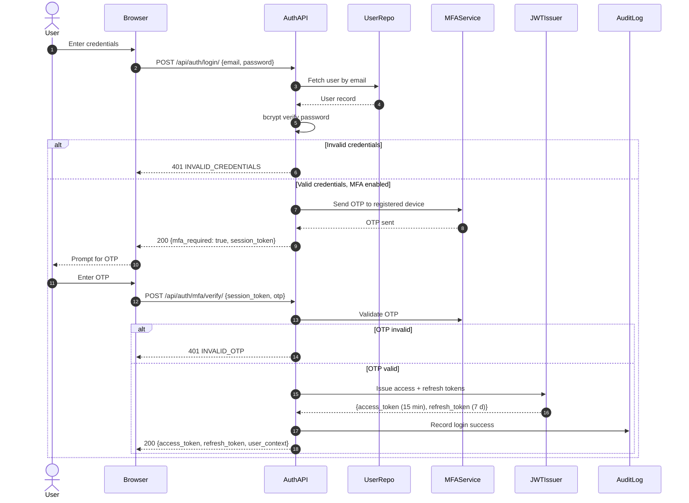
```mermaid
sequenceDiagram
    autonumber
    actor User
    participant Browser
    participant AuthAPI
    participant UserRepo
    participant MFAService
    participant JWTIssuer
    participant AuditLog

    User->>Browser: Enter credentials
    Browser->>AuthAPI: POST /api/auth/login/ {email, password}
    AuthAPI->>UserRepo: Fetch user by email
    UserRepo-->>AuthAPI: User record
    AuthAPI->>AuthAPI: bcrypt verify password
    alt Invalid credentials
        AuthAPI-->>Browser: 401 INVALID_CREDENTIALS
    else Valid credentials, MFA enabled
        AuthAPI->>MFAService: Send OTP to registered device
        MFAService-->>AuthAPI: OTP sent
        AuthAPI-->>Browser: 200 {mfa_required: true, session_token}
        Browser-->>User: Prompt for OTP
        User->>Browser: Enter OTP
        Browser->>AuthAPI: POST /api/auth/mfa/verify/ {session_token, otp}
        AuthAPI->>MFAService: Validate OTP
        alt OTP invalid
            AuthAPI-->>Browser: 401 INVALID_OTP
        else OTP valid
            AuthAPI->>JWTIssuer: Issue access + refresh tokens
            JWTIssuer-->>AuthAPI: {access_token (15 min), refresh_token (7 d)}
            AuthAPI->>AuditLog: Record login success
            AuthAPI-->>Browser: 200 {access_token, refresh_token, user_context}
        end
    end
```

### 1.2 Token Refresh and Logout

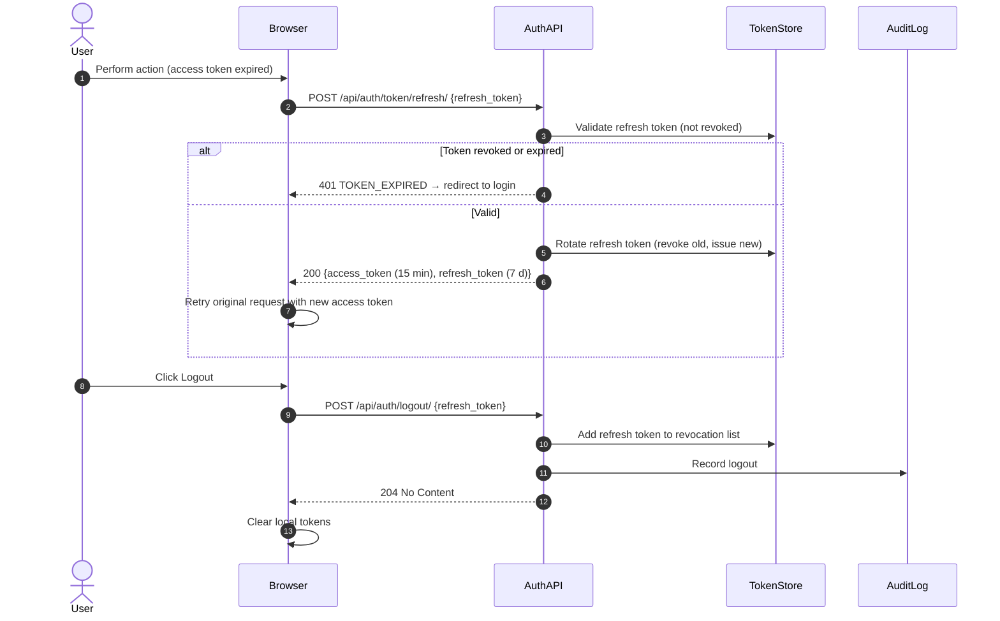
```mermaid
sequenceDiagram
    autonumber
    actor User
    participant Browser
    participant AuthAPI
    participant TokenStore
    participant AuditLog

    User->>Browser: Perform action (access token expired)
    Browser->>AuthAPI: POST /api/auth/token/refresh/ {refresh_token}
    AuthAPI->>TokenStore: Validate refresh token (not revoked)
    alt Token revoked or expired
        AuthAPI-->>Browser: 401 TOKEN_EXPIRED → redirect to login
    else Valid
        AuthAPI->>TokenStore: Rotate refresh token (revoke old, issue new)
        AuthAPI-->>Browser: 200 {access_token (15 min), refresh_token (7 d)}
        Browser->>Browser: Retry original request with new access token
    end

    User->>Browser: Click Logout
    Browser->>AuthAPI: POST /api/auth/logout/ {refresh_token}
    AuthAPI->>TokenStore: Add refresh token to revocation list
    AuthAPI->>AuditLog: Record logout
    AuthAPI-->>Browser: 204 No Content
    Browser->>Browser: Clear local tokens
```

---

## 2. Admissions

### 2.1 Multi-Step Application Submission

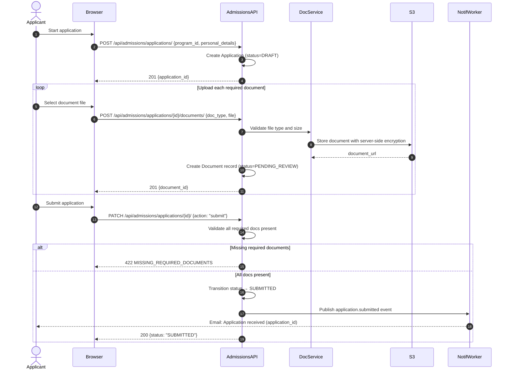
```mermaid
sequenceDiagram
    autonumber
    actor Applicant
    participant Browser
    participant AdmissionsAPI
    participant DocService
    participant S3
    participant NotifWorker

    Applicant->>Browser: Start application
    Browser->>AdmissionsAPI: POST /api/admissions/applications/ {program_id, personal_details}
    AdmissionsAPI->>AdmissionsAPI: Create Application (status=DRAFT)
    AdmissionsAPI-->>Browser: 201 {application_id}

    loop Upload each required document
        Applicant->>Browser: Select document file
        Browser->>AdmissionsAPI: POST /api/admissions/applications/{id}/documents/ {doc_type, file}
        AdmissionsAPI->>DocService: Validate file type and size
        DocService->>S3: Store document with server-side encryption
        S3-->>DocService: document_url
        AdmissionsAPI->>AdmissionsAPI: Create Document record (status=PENDING_REVIEW)
        AdmissionsAPI-->>Browser: 201 {document_id}
    end

    Applicant->>Browser: Submit application
    Browser->>AdmissionsAPI: PATCH /api/admissions/applications/{id}/ {action: "submit"}
    AdmissionsAPI->>AdmissionsAPI: Validate all required docs present
    alt Missing required documents
        AdmissionsAPI-->>Browser: 422 MISSING_REQUIRED_DOCUMENTS
    else All docs present
        AdmissionsAPI->>AdmissionsAPI: Transition status → SUBMITTED
        AdmissionsAPI->>NotifWorker: Publish application.submitted event
        NotifWorker-->>Applicant: Email: Application received (application_id)
        AdmissionsAPI-->>Browser: 200 {status: "SUBMITTED"}
    end
```

### 2.2 Merit List Generation and Offer Dispatch

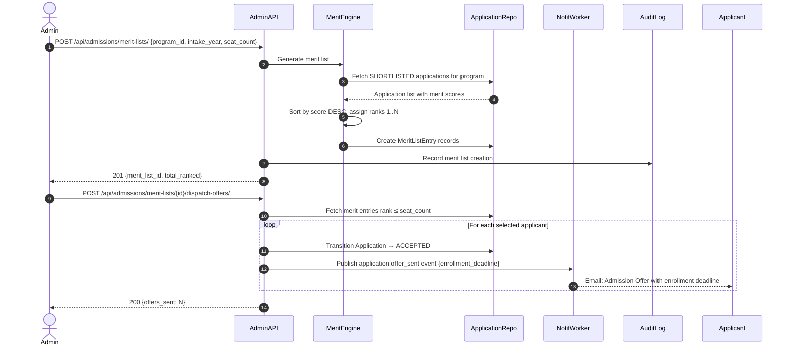
```mermaid
sequenceDiagram
    autonumber
    actor Admin
    participant AdminAPI
    participant MeritEngine
    participant ApplicationRepo
    participant NotifWorker
    participant AuditLog

    Admin->>AdminAPI: POST /api/admissions/merit-lists/ {program_id, intake_year, seat_count}
    AdminAPI->>MeritEngine: Generate merit list
    MeritEngine->>ApplicationRepo: Fetch SHORTLISTED applications for program
    ApplicationRepo-->>MeritEngine: Application list with merit scores
    MeritEngine->>MeritEngine: Sort by score DESC, assign ranks 1..N
    MeritEngine->>ApplicationRepo: Create MeritListEntry records
    AdminAPI->>AuditLog: Record merit list creation
    AdminAPI-->>Admin: 201 {merit_list_id, total_ranked}

    Admin->>AdminAPI: POST /api/admissions/merit-lists/{id}/dispatch-offers/
    AdminAPI->>ApplicationRepo: Fetch merit entries rank ≤ seat_count
    loop For each selected applicant
        AdminAPI->>ApplicationRepo: Transition Application → ACCEPTED
        AdminAPI->>NotifWorker: Publish application.offer_sent event {enrollment_deadline}
        NotifWorker-->>Applicant: Email: Admission Offer with enrollment deadline
    end
    AdminAPI-->>Admin: 200 {offers_sent: N}
```

---

## 3. Students

### 3.1 Student Registration and Profile Setup

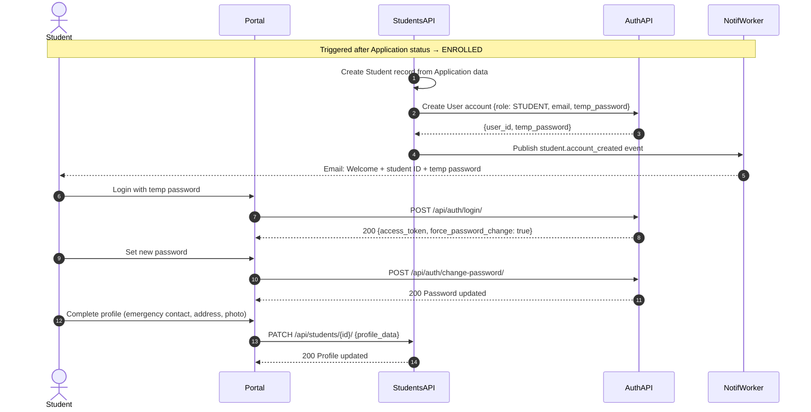
```mermaid
sequenceDiagram
    autonumber
    actor Student
    participant Portal
    participant StudentsAPI
    participant AuthAPI
    participant NotifWorker

    Note over Student,NotifWorker: Triggered after Application status → ENROLLED

    StudentsAPI->>StudentsAPI: Create Student record from Application data
    StudentsAPI->>AuthAPI: Create User account {role: STUDENT, email, temp_password}
    AuthAPI-->>StudentsAPI: {user_id, temp_password}
    StudentsAPI->>NotifWorker: Publish student.account_created event
    NotifWorker-->>Student: Email: Welcome + student ID + temp password

    Student->>Portal: Login with temp password
    Portal->>AuthAPI: POST /api/auth/login/
    AuthAPI-->>Portal: 200 {access_token, force_password_change: true}
    Student->>Portal: Set new password
    Portal->>AuthAPI: POST /api/auth/change-password/
    AuthAPI-->>Portal: 200 Password updated

    Student->>Portal: Complete profile (emergency contact, address, photo)
    Portal->>StudentsAPI: PATCH /api/students/{id}/ {profile_data}
    StudentsAPI-->>Portal: 200 Profile updated
```

### 3.2 Parent Portal Access with Student Consent

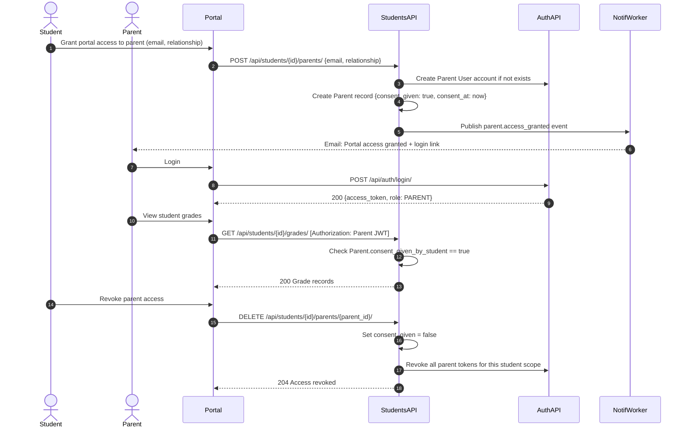
```mermaid
sequenceDiagram
    autonumber
    actor Student
    actor Parent
    participant Portal
    participant StudentsAPI
    participant AuthAPI
    participant NotifWorker

    Student->>Portal: Grant portal access to parent (email, relationship)
    Portal->>StudentsAPI: POST /api/students/{id}/parents/ {email, relationship}
    StudentsAPI->>AuthAPI: Create Parent User account if not exists
    StudentsAPI->>StudentsAPI: Create Parent record {consent_given: true, consent_at: now}
    StudentsAPI->>NotifWorker: Publish parent.access_granted event
    NotifWorker-->>Parent: Email: Portal access granted + login link

    Parent->>Portal: Login
    Portal->>AuthAPI: POST /api/auth/login/
    AuthAPI-->>Portal: 200 {access_token, role: PARENT}

    Parent->>Portal: View student grades
    Portal->>StudentsAPI: GET /api/students/{id}/grades/ [Authorization: Parent JWT]
    StudentsAPI->>StudentsAPI: Check Parent.consent_given_by_student == true
    StudentsAPI-->>Portal: 200 Grade records

    Student->>Portal: Revoke parent access
    Portal->>StudentsAPI: DELETE /api/students/{id}/parents/{parent_id}/
    StudentsAPI->>StudentsAPI: Set consent_given = false
    StudentsAPI->>AuthAPI: Revoke all parent tokens for this student scope
    StudentsAPI-->>Portal: 204 Access revoked
```

---

## 4. Faculty

### 4.1 Faculty Onboarding

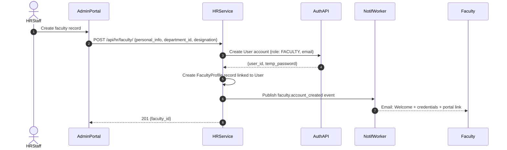
```mermaid
sequenceDiagram
    autonumber
    actor HRStaff
    participant AdminPortal
    participant HRService
    participant AuthAPI
    participant NotifWorker

    HRStaff->>AdminPortal: Create faculty record
    AdminPortal->>HRService: POST /api/hr/faculty/ {personal_info, department_id, designation}
    HRService->>AuthAPI: Create User account {role: FACULTY, email}
    AuthAPI-->>HRService: {user_id, temp_password}
    HRService->>HRService: Create FacultyProfile record linked to User
    HRService->>NotifWorker: Publish faculty.account_created event
    NotifWorker-->>Faculty: Email: Welcome + credentials + portal link
    HRService-->>AdminPortal: 201 {faculty_id}
```

### 4.2 Course Assignment and Teaching Load Verification

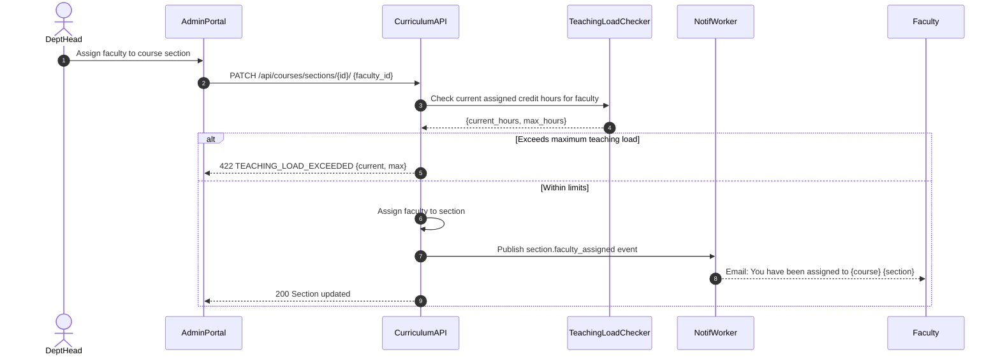
```mermaid
sequenceDiagram
    autonumber
    actor DeptHead
    participant AdminPortal
    participant CurriculumAPI
    participant TeachingLoadChecker
    participant NotifWorker

    DeptHead->>AdminPortal: Assign faculty to course section
    AdminPortal->>CurriculumAPI: PATCH /api/courses/sections/{id}/ {faculty_id}
    CurriculumAPI->>TeachingLoadChecker: Check current assigned credit hours for faculty
    TeachingLoadChecker-->>CurriculumAPI: {current_hours, max_hours}
    alt Exceeds maximum teaching load
        CurriculumAPI-->>AdminPortal: 422 TEACHING_LOAD_EXCEEDED {current, max}
    else Within limits
        CurriculumAPI->>CurriculumAPI: Assign faculty to section
        CurriculumAPI->>NotifWorker: Publish section.faculty_assigned event
        NotifWorker-->>Faculty: Email: You have been assigned to {course} {section}
        CurriculumAPI-->>AdminPortal: 200 Section updated
    end
```

---

## 5. Courses and Enrollment

### 5.1 Student Course Registration

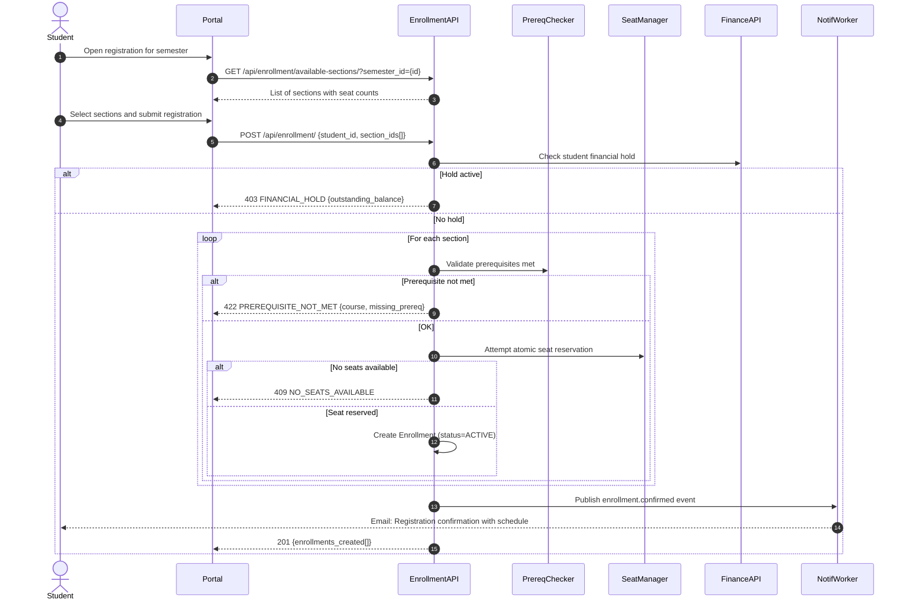
```mermaid
sequenceDiagram
    autonumber
    actor Student
    participant Portal
    participant EnrollmentAPI
    participant PrereqChecker
    participant SeatManager
    participant FinanceAPI
    participant NotifWorker

    Student->>Portal: Open registration for semester
    Portal->>EnrollmentAPI: GET /api/enrollment/available-sections/?semester_id={id}
    EnrollmentAPI-->>Portal: List of sections with seat counts

    Student->>Portal: Select sections and submit registration
    Portal->>EnrollmentAPI: POST /api/enrollment/ {student_id, section_ids[]}
    EnrollmentAPI->>FinanceAPI: Check student financial hold
    alt Hold active
        EnrollmentAPI-->>Portal: 403 FINANCIAL_HOLD {outstanding_balance}
    else No hold
        loop For each section
            EnrollmentAPI->>PrereqChecker: Validate prerequisites met
            alt Prerequisite not met
                EnrollmentAPI-->>Portal: 422 PREREQUISITE_NOT_MET {course, missing_prereq}
            else OK
                EnrollmentAPI->>SeatManager: Attempt atomic seat reservation
                alt No seats available
                    EnrollmentAPI-->>Portal: 409 NO_SEATS_AVAILABLE
                else Seat reserved
                    EnrollmentAPI->>EnrollmentAPI: Create Enrollment (status=ACTIVE)
                end
            end
        end
        EnrollmentAPI->>NotifWorker: Publish enrollment.confirmed event
        NotifWorker-->>Student: Email: Registration confirmation with schedule
        EnrollmentAPI-->>Portal: 201 {enrollments_created[]}
    end
```

### 5.2 Course Add-Drop Window

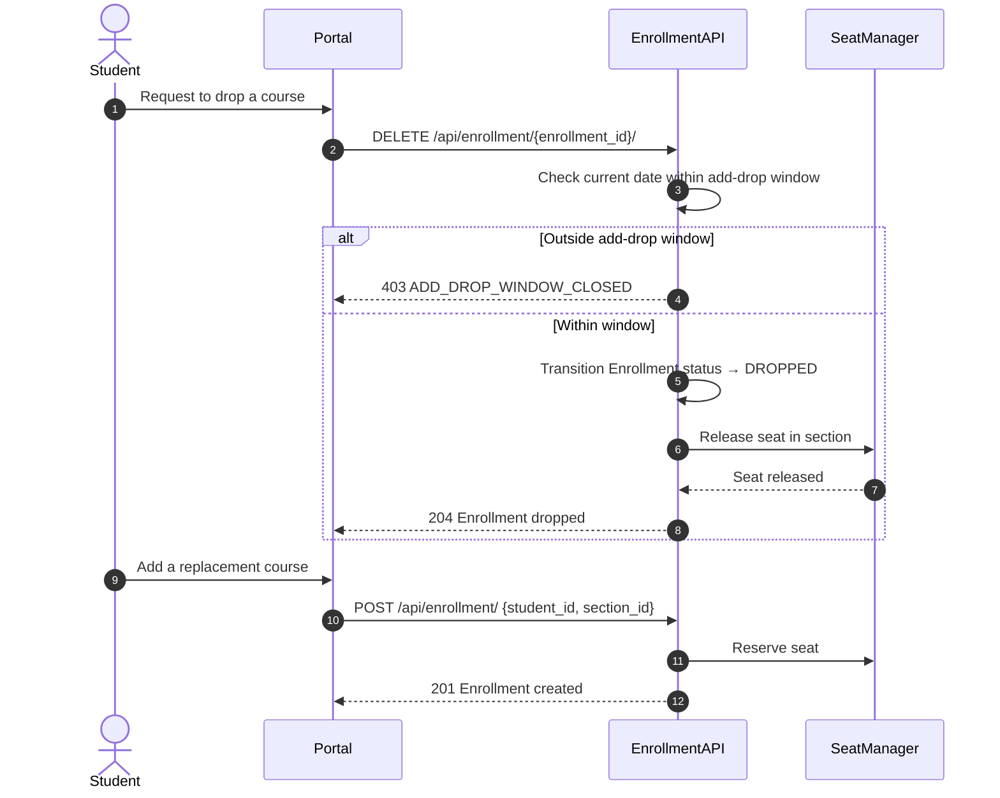
```mermaid
sequenceDiagram
    autonumber
    actor Student
    participant Portal
    participant EnrollmentAPI
    participant SeatManager

    Student->>Portal: Request to drop a course
    Portal->>EnrollmentAPI: DELETE /api/enrollment/{enrollment_id}/
    EnrollmentAPI->>EnrollmentAPI: Check current date within add-drop window
    alt Outside add-drop window
        EnrollmentAPI-->>Portal: 403 ADD_DROP_WINDOW_CLOSED
    else Within window
        EnrollmentAPI->>EnrollmentAPI: Transition Enrollment status → DROPPED
        EnrollmentAPI->>SeatManager: Release seat in section
        SeatManager-->>EnrollmentAPI: Seat released
        EnrollmentAPI-->>Portal: 204 Enrollment dropped
    end

    Student->>Portal: Add a replacement course
    Portal->>EnrollmentAPI: POST /api/enrollment/ {student_id, section_id}
    EnrollmentAPI->>SeatManager: Reserve seat
    EnrollmentAPI-->>Portal: 201 Enrollment created
```

---

## 6. Timetable

### 6.1 Automated Schedule Generation

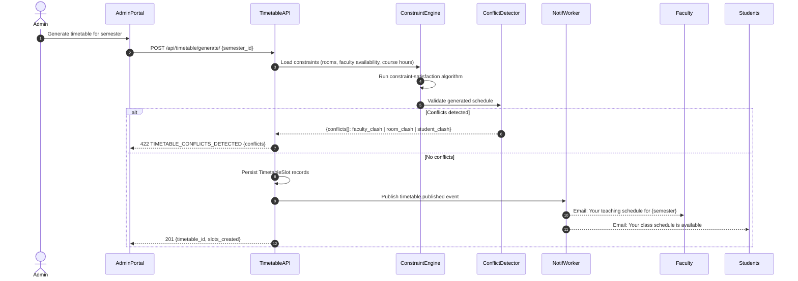
```mermaid
sequenceDiagram
    autonumber
    actor Admin
    participant AdminPortal
    participant TimetableAPI
    participant ConstraintEngine
    participant ConflictDetector
    participant NotifWorker

    Admin->>AdminPortal: Generate timetable for semester
    AdminPortal->>TimetableAPI: POST /api/timetable/generate/ {semester_id}
    TimetableAPI->>ConstraintEngine: Load constraints (rooms, faculty availability, course hours)
    ConstraintEngine->>ConstraintEngine: Run constraint-satisfaction algorithm
    ConstraintEngine->>ConflictDetector: Validate generated schedule
    alt Conflicts detected
        ConflictDetector-->>TimetableAPI: {conflicts[]: faculty_clash | room_clash | student_clash}
        TimetableAPI-->>AdminPortal: 422 TIMETABLE_CONFLICTS_DETECTED {conflicts}
    else No conflicts
        TimetableAPI->>TimetableAPI: Persist TimetableSlot records
        TimetableAPI->>NotifWorker: Publish timetable.published event
        NotifWorker-->>Faculty: Email: Your teaching schedule for {semester}
        NotifWorker-->>Students: Email: Your class schedule is available
        TimetableAPI-->>AdminPortal: 201 {timetable_id, slots_created}
    end
```

### 6.2 Room Booking for Special Event

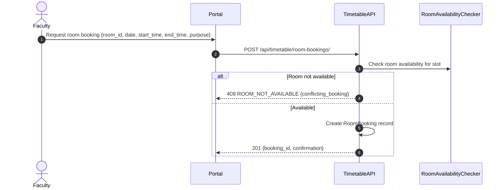
```mermaid
sequenceDiagram
    autonumber
    actor Faculty
    participant Portal
    participant TimetableAPI
    participant RoomAvailabilityChecker

    Faculty->>Portal: Request room booking {room_id, date, start_time, end_time, purpose}
    Portal->>TimetableAPI: POST /api/timetable/room-bookings/
    TimetableAPI->>RoomAvailabilityChecker: Check room availability for slot
    alt Room not available
        TimetableAPI-->>Portal: 409 ROOM_NOT_AVAILABLE {conflicting_booking}
    else Available
        TimetableAPI->>TimetableAPI: Create RoomBooking record
        TimetableAPI-->>Portal: 201 {booking_id, confirmation}
    end
```

---

## 7. Attendance

### 7.1 Marking Attendance

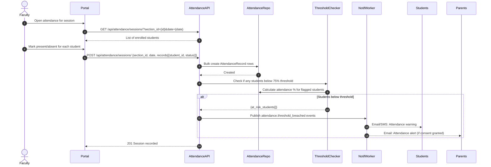
```mermaid
sequenceDiagram
    autonumber
    actor Faculty
    participant Portal
    participant AttendanceAPI
    participant AttendanceRepo
    participant ThresholdChecker
    participant NotifWorker

    Faculty->>Portal: Open attendance for session
    Portal->>AttendanceAPI: GET /api/attendance/sessions/?section_id={id}&date={date}
    AttendanceAPI-->>Portal: List of enrolled students

    Faculty->>Portal: Mark present/absent for each student
    Portal->>AttendanceAPI: POST /api/attendance/sessions/ {section_id, date, records[{student_id, status}]}
    AttendanceAPI->>AttendanceRepo: Bulk create AttendanceRecord rows
    AttendanceRepo-->>AttendanceAPI: Created

    AttendanceAPI->>ThresholdChecker: Check if any students below 75% threshold
    ThresholdChecker->>AttendanceRepo: Calculate attendance % for flagged students
    alt Students below threshold
        ThresholdChecker-->>AttendanceAPI: {at_risk_students[]}
        AttendanceAPI->>NotifWorker: Publish attendance.threshold_breached events
        NotifWorker-->>Students: Email/SMS: Attendance warning
        NotifWorker-->>Parents: Email: Attendance alert (if consent granted)
    end
    AttendanceAPI-->>Portal: 201 Session recorded
```

### 7.2 Attendance Correction Request

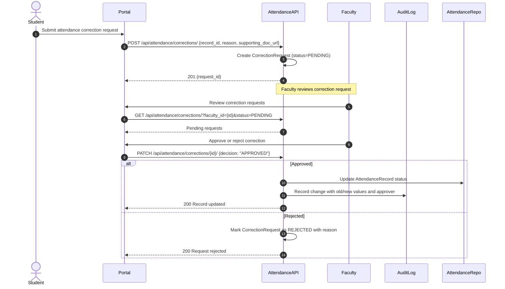
```mermaid
sequenceDiagram
    autonumber
    actor Student
    participant Portal
    participant AttendanceAPI
    participant Faculty
    participant AuditLog

    Student->>Portal: Submit attendance correction request
    Portal->>AttendanceAPI: POST /api/attendance/corrections/ {record_id, reason, supporting_doc_url}
    AttendanceAPI->>AttendanceAPI: Create CorrectionRequest (status=PENDING)
    AttendanceAPI-->>Portal: 201 {request_id}

    Note over AttendanceAPI,Faculty: Faculty reviews correction request

    Faculty->>Portal: Review correction requests
    Portal->>AttendanceAPI: GET /api/attendance/corrections/?faculty_id={id}&status=PENDING
    AttendanceAPI-->>Portal: Pending requests

    Faculty->>Portal: Approve or reject correction
    Portal->>AttendanceAPI: PATCH /api/attendance/corrections/{id}/ {decision: "APPROVED"}
    alt Approved
        AttendanceAPI->>AttendanceRepo: Update AttendanceRecord status
        AttendanceAPI->>AuditLog: Record change with old/new values and approver
        AttendanceAPI-->>Portal: 200 Record updated
    else Rejected
        AttendanceAPI->>AttendanceAPI: Mark CorrectionRequest as REJECTED with reason
        AttendanceAPI-->>Portal: 200 Request rejected
    end
```

---

## 8. Exams

### 8.1 Exam Scheduling and Admit Card Generation

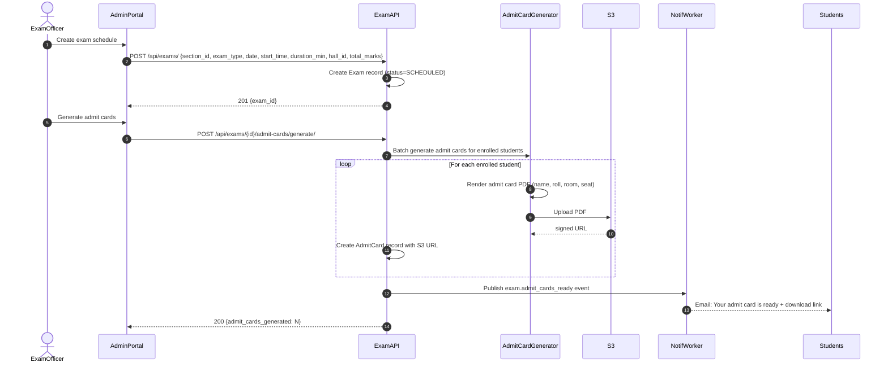
```mermaid
sequenceDiagram
    autonumber
    actor ExamOfficer
    participant AdminPortal
    participant ExamAPI
    participant AdmitCardGenerator
    participant S3
    participant NotifWorker

    ExamOfficer->>AdminPortal: Create exam schedule
    AdminPortal->>ExamAPI: POST /api/exams/ {section_id, exam_type, date, start_time, duration_min, hall_id, total_marks}
    ExamAPI->>ExamAPI: Create Exam record (status=SCHEDULED)
    ExamAPI-->>AdminPortal: 201 {exam_id}

    ExamOfficer->>AdminPortal: Generate admit cards
    AdminPortal->>ExamAPI: POST /api/exams/{id}/admit-cards/generate/
    ExamAPI->>AdmitCardGenerator: Batch generate admit cards for enrolled students
    loop For each enrolled student
        AdmitCardGenerator->>AdmitCardGenerator: Render admit card PDF (name, roll, room, seat)
        AdmitCardGenerator->>S3: Upload PDF
        S3-->>AdmitCardGenerator: signed URL
        ExamAPI->>ExamAPI: Create AdmitCard record with S3 URL
    end
    ExamAPI->>NotifWorker: Publish exam.admit_cards_ready event
    NotifWorker-->>Students: Email: Your admit card is ready + download link
    ExamAPI-->>AdminPortal: 200 {admit_cards_generated: N}
```

### 8.2 Grade Submission and Publishing

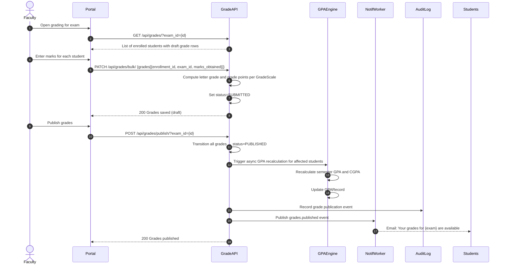
```mermaid
sequenceDiagram
    autonumber
    actor Faculty
    participant Portal
    participant GradeAPI
    participant GPAEngine
    participant NotifWorker
    participant AuditLog

    Faculty->>Portal: Open grading for exam
    Portal->>GradeAPI: GET /api/grades/?exam_id={id}
    GradeAPI-->>Portal: List of enrolled students with draft grade rows

    Faculty->>Portal: Enter marks for each student
    Portal->>GradeAPI: PATCH /api/grades/bulk/ {grades[{enrollment_id, exam_id, marks_obtained}]}
    GradeAPI->>GradeAPI: Compute letter grade and grade points per GradeScale
    GradeAPI->>GradeAPI: Set status=SUBMITTED
    GradeAPI-->>Portal: 200 Grades saved (draft)

    Faculty->>Portal: Publish grades
    Portal->>GradeAPI: POST /api/grades/publish/?exam_id={id}
    GradeAPI->>GradeAPI: Transition all grades → status=PUBLISHED
    GradeAPI->>GPAEngine: Trigger async GPA recalculation for affected students
    GPAEngine->>GPAEngine: Recalculate semester GPA and CGPA
    GPAEngine->>GPAEngine: Update GPARecord
    GradeAPI->>AuditLog: Record grade publication event
    GradeAPI->>NotifWorker: Publish grades.published event
    NotifWorker-->>Students: Email: Your grades for {exam} are available
    GradeAPI-->>Portal: 200 Grades published
```

---

## 9. LMS

### 9.1 Assignment Submission with Plagiarism Check

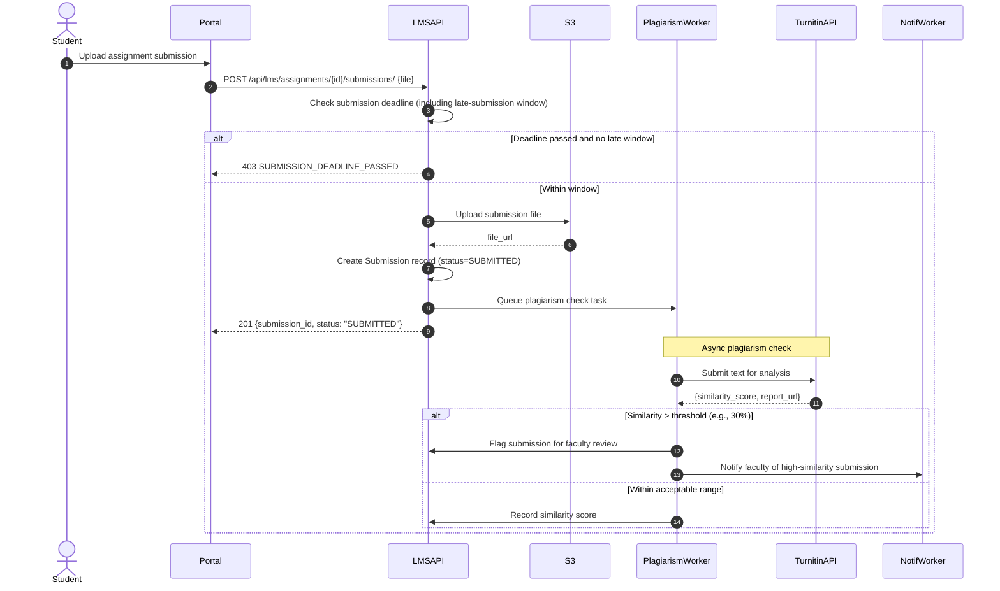
```mermaid
sequenceDiagram
    autonumber
    actor Student
    participant Portal
    participant LMSAPI
    participant S3
    participant PlagiarismWorker
    participant TurnitinAPI
    participant NotifWorker

    Student->>Portal: Upload assignment submission
    Portal->>LMSAPI: POST /api/lms/assignments/{id}/submissions/ {file}
    LMSAPI->>LMSAPI: Check submission deadline (including late-submission window)
    alt Deadline passed and no late window
        LMSAPI-->>Portal: 403 SUBMISSION_DEADLINE_PASSED
    else Within window
        LMSAPI->>S3: Upload submission file
        S3-->>LMSAPI: file_url
        LMSAPI->>LMSAPI: Create Submission record (status=SUBMITTED)
        LMSAPI->>PlagiarismWorker: Queue plagiarism check task
        LMSAPI-->>Portal: 201 {submission_id, status: "SUBMITTED"}

        Note over PlagiarismWorker,TurnitinAPI: Async plagiarism check
        PlagiarismWorker->>TurnitinAPI: Submit text for analysis
        TurnitinAPI-->>PlagiarismWorker: {similarity_score, report_url}
        alt Similarity > threshold (e.g., 30%)
            PlagiarismWorker->>LMSAPI: Flag submission for faculty review
            PlagiarismWorker->>NotifWorker: Notify faculty of high-similarity submission
        else Within acceptable range
            PlagiarismWorker->>LMSAPI: Record similarity score
        end
    end
```

### 9.2 Quiz Attempt and Auto-Grading

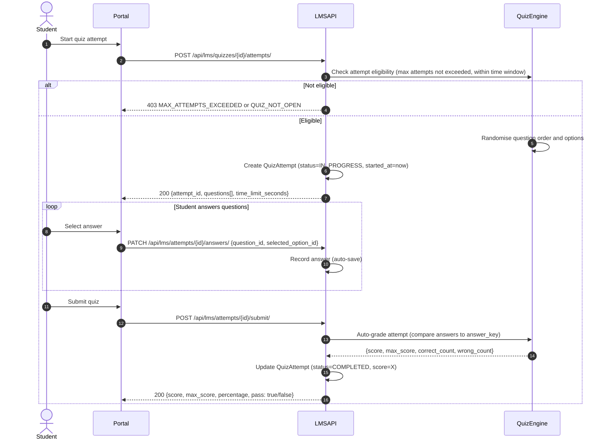
```mermaid
sequenceDiagram
    autonumber
    actor Student
    participant Portal
    participant LMSAPI
    participant QuizEngine

    Student->>Portal: Start quiz attempt
    Portal->>LMSAPI: POST /api/lms/quizzes/{id}/attempts/
    LMSAPI->>QuizEngine: Check attempt eligibility (max attempts not exceeded, within time window)
    alt Not eligible
        LMSAPI-->>Portal: 403 MAX_ATTEMPTS_EXCEEDED or QUIZ_NOT_OPEN
    else Eligible
        QuizEngine->>QuizEngine: Randomise question order and options
        LMSAPI->>LMSAPI: Create QuizAttempt (status=IN_PROGRESS, started_at=now)
        LMSAPI-->>Portal: 200 {attempt_id, questions[], time_limit_seconds}

        loop Student answers questions
            Student->>Portal: Select answer
            Portal->>LMSAPI: PATCH /api/lms/attempts/{id}/answers/ {question_id, selected_option_id}
            LMSAPI->>LMSAPI: Record answer (auto-save)
        end

        Student->>Portal: Submit quiz
        Portal->>LMSAPI: POST /api/lms/attempts/{id}/submit/
        LMSAPI->>QuizEngine: Auto-grade attempt (compare answers to answer_key)
        QuizEngine-->>LMSAPI: {score, max_score, correct_count, wrong_count}
        LMSAPI->>LMSAPI: Update QuizAttempt (status=COMPLETED, score=X)
        LMSAPI-->>Portal: 200 {score, max_score, percentage, pass: true/false}
    end
```

---

## 10. Finance

### 10.1 Fee Invoice Generation

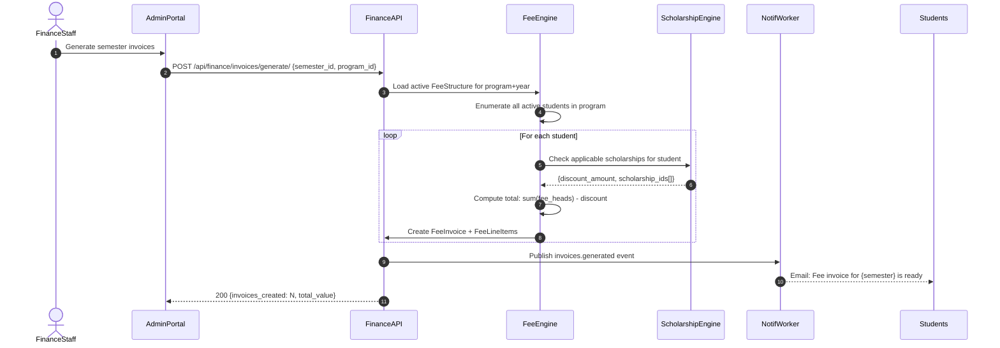
```mermaid
sequenceDiagram
    autonumber
    actor FinanceStaff
    participant AdminPortal
    participant FinanceAPI
    participant FeeEngine
    participant ScholarshipEngine
    participant NotifWorker

    FinanceStaff->>AdminPortal: Generate semester invoices
    AdminPortal->>FinanceAPI: POST /api/finance/invoices/generate/ {semester_id, program_id}
    FinanceAPI->>FeeEngine: Load active FeeStructure for program+year
    FeeEngine->>FeeEngine: Enumerate all active students in program
    loop For each student
        FeeEngine->>ScholarshipEngine: Check applicable scholarships for student
        ScholarshipEngine-->>FeeEngine: {discount_amount, scholarship_ids[]}
        FeeEngine->>FeeEngine: Compute total: sum(fee_heads) - discount
        FeeEngine->>FinanceAPI: Create FeeInvoice + FeeLineItems
    end
    FinanceAPI->>NotifWorker: Publish invoices.generated event
    NotifWorker-->>Students: Email: Fee invoice for {semester} is ready
    FinanceAPI-->>AdminPortal: 200 {invoices_created: N, total_value}
```

### 10.2 Online Payment via Gateway

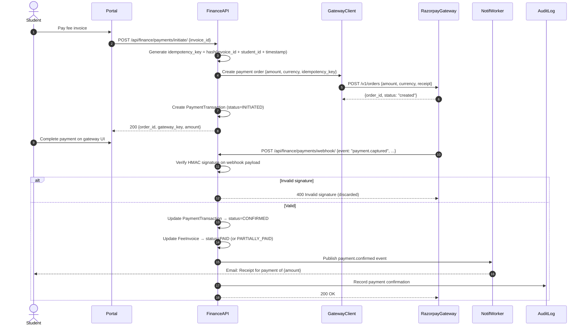
```mermaid
sequenceDiagram
    autonumber
    actor Student
    participant Portal
    participant FinanceAPI
    participant GatewayClient
    participant RazorpayGateway
    participant NotifWorker
    participant AuditLog

    Student->>Portal: Pay fee invoice
    Portal->>FinanceAPI: POST /api/finance/payments/initiate/ {invoice_id}
    FinanceAPI->>FinanceAPI: Generate idempotency_key = hash(invoice_id + student_id + timestamp)
    FinanceAPI->>GatewayClient: Create payment order {amount, currency, idempotency_key}
    GatewayClient->>RazorpayGateway: POST /v1/orders {amount, currency, receipt}
    RazorpayGateway-->>GatewayClient: {order_id, status: "created"}
    FinanceAPI->>FinanceAPI: Create PaymentTransaction (status=INITIATED)
    FinanceAPI-->>Portal: 200 {order_id, gateway_key, amount}

    Student->>Portal: Complete payment on gateway UI
    RazorpayGateway->>FinanceAPI: POST /api/finance/payments/webhook/ {event: "payment.captured", ...}
    FinanceAPI->>FinanceAPI: Verify HMAC signature on webhook payload
    alt Invalid signature
        FinanceAPI-->>RazorpayGateway: 400 Invalid signature (discarded)
    else Valid
        FinanceAPI->>FinanceAPI: Update PaymentTransaction → status=CONFIRMED
        FinanceAPI->>FinanceAPI: Update FeeInvoice → status=PAID (or PARTIALLY_PAID)
        FinanceAPI->>NotifWorker: Publish payment.confirmed event
        NotifWorker-->>Student: Email: Receipt for payment of {amount}
        FinanceAPI->>AuditLog: Record payment confirmation
        FinanceAPI-->>RazorpayGateway: 200 OK
    end
```

---

## 11. Library

### 11.1 Book Issue and Return

```mermaid
sequenceDiagram
    autonumber
    actor LibraryStaff
    participant LibraryPortal
    participant LibraryAPI
    participant FineCalculator

    LibraryStaff->>LibraryPortal: Issue book to student
    LibraryPortal->>LibraryAPI: POST /api/library/issues/ {student_id, book_copy_id}
    LibraryAPI->>LibraryAPI: Check BookCopy status == AVAILABLE
    alt Not available
        LibraryAPI-->>LibraryPortal: 409 COPY_NOT_AVAILABLE
    else Available
        LibraryAPI->>LibraryAPI: Create BookIssue (status=ISSUED, due_date=now+14d)
        LibraryAPI->>LibraryAPI: Update BookCopy status → ISSUED
        LibraryAPI-->>LibraryPortal: 201 {issue_id, due_date}
    end

    LibraryStaff->>LibraryPortal: Process book return
    LibraryPortal->>LibraryAPI: POST /api/library/returns/ {issue_id}
    LibraryAPI->>FineCalculator: Calculate overdue fine (days_late × rate_per_day)
    alt Fine > 0
        FineCalculator-->>LibraryAPI: {fine_amount}
        LibraryAPI->>LibraryAPI: Create FineLedgerEntry for student
        LibraryAPI->>LibraryAPI: Update BookIssue status → RETURNED_WITH_FINE
    else Returned on time
        LibraryAPI->>LibraryAPI: Update BookIssue status → RETURNED
    end
    LibraryAPI->>LibraryAPI: Update BookCopy status → AVAILABLE
    LibraryAPI-->>LibraryPortal: 200 {return_processed, fine_amount}
```

---

## 12. HR

### 12.1 Leave Application Workflow

```mermaid
sequenceDiagram
    autonumber
    actor Faculty
    participant Portal
    participant HRAPI
    participant LeaveBalanceChecker
    participant DeptHead
    participant NotifWorker

    Faculty->>Portal: Apply for leave
    Portal->>HRAPI: POST /api/hr/leave-requests/ {leave_type, start_date, end_date, reason}
    HRAPI->>LeaveBalanceChecker: Check available leave balance
    alt Insufficient balance
        HRAPI-->>Portal: 422 INSUFFICIENT_LEAVE_BALANCE {available, requested}
    else Sufficient balance
        HRAPI->>HRAPI: Create LeaveRequest (status=PENDING)
        HRAPI->>NotifWorker: Notify department head of pending request
        NotifWorker-->>DeptHead: Email: Leave request from {faculty} awaiting approval
        HRAPI-->>Portal: 201 {request_id, status: "PENDING"}
    end

    DeptHead->>Portal: Review leave request
    Portal->>HRAPI: PATCH /api/hr/leave-requests/{id}/ {action: "APPROVE"}
    HRAPI->>HRAPI: Transition LeaveRequest → APPROVED
    HRAPI->>LeaveBalanceChecker: Deduct leave days from balance
    HRAPI->>NotifWorker: Notify faculty of approval
    NotifWorker-->>Faculty: Email: Leave request approved for {start_date} to {end_date}
    HRAPI-->>Portal: 200 Leave approved
```

---

## 13. Hostel

### 13.1 Room Allocation

```mermaid
sequenceDiagram
    autonumber
    actor Student
    participant Portal
    participant HostelAPI
    participant RoomAllocator
    participant FinanceAPI

    Student->>Portal: Apply for hostel accommodation
    Portal->>HostelAPI: POST /api/hostel/applications/ {hostel_preference, room_type}
    HostelAPI->>RoomAllocator: Find available room matching preference
    alt No rooms available
        HostelAPI-->>Portal: 409 NO_ROOMS_AVAILABLE {waitlist_position}
    else Room available
        HostelAPI->>HostelAPI: Create HostelAllocation record
        HostelAPI->>FinanceAPI: Add hostel fee to student invoice
        HostelAPI-->>Portal: 201 {allocation_id, room_number, block, floor}
    end
```

---

## 14. Transport

### 14.1 Route Assignment

```mermaid
sequenceDiagram
    autonumber
    actor Student
    participant Portal
    participant TransportAPI

    Student->>Portal: Register for bus transport
    Portal->>TransportAPI: POST /api/transport/registrations/ {pickup_stop_id}
    TransportAPI->>TransportAPI: Check seat capacity on route for stop
    alt Route full
        TransportAPI-->>Portal: 409 ROUTE_FULL
    else Seats available
        TransportAPI->>TransportAPI: Create TransportRegistration
        TransportAPI-->>Portal: 201 {registration_id, route, bus_number, pickup_time}
    end
```

---

## 15. Inventory

### 15.1 Purchase Request Workflow

```mermaid
sequenceDiagram
    autonumber
    actor DeptUser
    participant Portal
    participant InventoryAPI
    participant Approver

    DeptUser->>Portal: Create purchase request
    Portal->>InventoryAPI: POST /api/inventory/purchase-requests/ {item, quantity, estimated_cost, justification}
    InventoryAPI->>InventoryAPI: Create PurchaseRequest (status=PENDING_APPROVAL)
    InventoryAPI-->>Portal: 201 {request_id}

    Approver->>Portal: Approve purchase request
    Portal->>InventoryAPI: PATCH /api/inventory/purchase-requests/{id}/ {action: "APPROVE"}
    InventoryAPI->>InventoryAPI: Transition → APPROVED
    InventoryAPI-->>Portal: 200 Approved, proceed to vendor selection
```

---

## 16. Analytics

### 16.1 Report Generation

```mermaid
sequenceDiagram
    autonumber
    actor Admin
    participant AdminPortal
    participant AnalyticsAPI
    participant ReportEngine
    participant S3

    Admin->>AdminPortal: Request enrollment analytics report
    AdminPortal->>AnalyticsAPI: POST /api/analytics/reports/ {report_type: "enrollment_summary", filters}
    AnalyticsAPI->>ReportEngine: Queue async report generation task
    AnalyticsAPI-->>AdminPortal: 202 {report_job_id, status: "QUEUED"}

    Note over ReportEngine,S3: Async execution (Celery)
    ReportEngine->>ReportEngine: Execute data aggregation queries
    ReportEngine->>ReportEngine: Render report (CSV/PDF/XLSX)
    ReportEngine->>S3: Upload report file
    S3-->>ReportEngine: signed URL (expires 1 hour)
    ReportEngine->>AnalyticsAPI: Update report job status → COMPLETED

    Admin->>AdminPortal: Check report status
    AdminPortal->>AnalyticsAPI: GET /api/analytics/reports/{job_id}/
    AnalyticsAPI-->>AdminPortal: 200 {status: "COMPLETED", download_url}
    Admin->>Browser: Download report
```

---

## 17. Notifications

### 17.1 Multi-Channel Notification Dispatch

```mermaid
sequenceDiagram
    autonumber
    participant DomainService
    participant RedisEventBus
    participant EventConsumer
    participant TemplateEngine
    participant ChannelRouter
    participant EmailSender
    participant SMSSender
    participant InAppStore

    DomainService->>RedisEventBus: PUBLISH enrollment.confirmed {student_id, section_ids, semester}
    RedisEventBus->>EventConsumer: Deliver event

    EventConsumer->>TemplateEngine: Render notification content from event context
    TemplateEngine-->>EventConsumer: {subject, html_body, sms_text, push_title}

    EventConsumer->>ChannelRouter: Route to user channels (based on preferences)
    ChannelRouter->>EmailSender: Queue email task
    ChannelRouter->>SMSSender: Queue SMS task
    ChannelRouter->>InAppStore: Persist in-app message

    EmailSender->>AWSSES: SendEmail API
    AWSSES-->>EmailSender: MessageId
    SMSSender->>Twilio: SendMessage API
    Twilio-->>SMSSender: SID

    EmailSender->>DeliveryLog: Record sent status
    SMSSender->>DeliveryLog: Record sent status
```

---

## 18. CMS

### 18.1 Notice/Announcement Publication

```mermaid
sequenceDiagram
    autonumber
    actor Admin
    participant Portal
    participant CMSAPI
    participant NotifWorker

    Admin->>Portal: Create new announcement
    Portal->>CMSAPI: POST /api/cms/announcements/ {title, content, audience, publish_at}
    CMSAPI->>CMSAPI: Create Announcement (status=DRAFT)
    CMSAPI-->>Portal: 201 {announcement_id}

    Admin->>Portal: Publish announcement
    Portal->>CMSAPI: PATCH /api/cms/announcements/{id}/ {action: "publish"}
    CMSAPI->>CMSAPI: Transition → PUBLISHED, set published_at
    CMSAPI->>NotifWorker: Publish cms.announcement_published event
    NotifWorker-->>TargetAudience: Email + In-App: New announcement: {title}
    CMSAPI-->>Portal: 200 Published
```

---

## 19. Calendar

### 19.1 Academic Calendar Event Management

```mermaid
sequenceDiagram
    autonumber
    actor Admin
    participant Portal
    participant CalendarAPI

    Admin->>Portal: Create academic calendar event
    Portal->>CalendarAPI: POST /api/calendar/events/ {name, event_type, start_date, end_date, affects_enrollment}
    CalendarAPI->>CalendarAPI: Check for overlapping events of same type
    alt Overlap detected
        CalendarAPI-->>Portal: 409 EVENT_OVERLAP {conflicting_event}
    else No overlap
        CalendarAPI->>CalendarAPI: Create CalendarEvent record
        CalendarAPI-->>Portal: 201 {event_id}
    end
```

---

## 20. SEO / Portal

### 20.1 Public Programme Listing

```mermaid
sequenceDiagram
    autonumber
    actor Visitor
    participant Browser
    participant SEOAPI
    participant CacheLayer
    participant ProgramDB

    Visitor->>Browser: Visit programme listing page
    Browser->>SEOAPI: GET /api/seo/programs/?category=engineering
    SEOAPI->>CacheLayer: GET cached programme listing
    alt Cache hit
        CacheLayer-->>SEOAPI: Cached JSON response
    else Cache miss
        SEOAPI->>ProgramDB: Query active programs with metadata
        ProgramDB-->>SEOAPI: Program list
        SEOAPI->>CacheLayer: SET cache (TTL 1 hour)
    end
    SEOAPI-->>Browser: 200 {programs[], meta: {canonical_url, og_tags}}
```

## 21. Graduation

### 21.1 Graduation Application & Degree Audit

```mermaid
sequenceDiagram
    autonumber
    actor Student
    participant Portal as Student Portal
    participant GradAPI as Graduation API
    participant AuditSvc as Degree Audit Service
    participant EnrollDB as Enrollment DB
    participant FinSvc as Finance Service
    participant DiscSvc as Discipline Service
    participant NotifSvc as Notification Service
    participant DiplomaSvc as Diploma Service

    Student->>Portal: Click "Apply for Graduation"
    Portal->>GradAPI: GET /graduation/eligibility-check
    GradAPI->>AuditSvc: Run degree audit
    AuditSvc->>EnrollDB: Query all completed courses, credits, GPA
    EnrollDB-->>AuditSvc: Academic record
    AuditSvc->>AuditSvc: Check: credits, required courses, CGPA, residency
    AuditSvc->>FinSvc: Check financial holds
    FinSvc-->>AuditSvc: No holds / Hold exists
    AuditSvc->>DiscSvc: Check disciplinary holds
    DiscSvc-->>AuditSvc: No holds / Hold exists
    AuditSvc-->>GradAPI: Audit result (PASSED/FAILED)
    
    alt Audit PASSED
        GradAPI-->>Portal: Eligible — show application form
        Student->>Portal: Submit graduation application
        Portal->>GradAPI: POST /graduation/applications/
        GradAPI->>GradAPI: Create application (SUBMITTED)
        GradAPI->>NotifSvc: Notify registrar
        GradAPI-->>Portal: 201 {application_number, status: SUBMITTED}
        
        Note over GradAPI: Registrar reviews
        GradAPI->>GradAPI: Approve application
        GradAPI->>GradAPI: Determine honors (CGPA-based)
        GradAPI->>DiplomaSvc: Generate diploma
        DiplomaSvc->>DiplomaSvc: Assign diploma number (DIP-YYYY-XXXXXX)
        DiplomaSvc-->>GradAPI: Diploma generated
        GradAPI->>GradAPI: Status → CONFERRED
        GradAPI->>NotifSvc: Notify student of graduation
    else Audit FAILED
        GradAPI-->>Portal: Not eligible — show missing requirements
    end
```

## 22. Student Discipline

### 22.1 Disciplinary Case Processing

```mermaid
sequenceDiagram
    autonumber
    actor Faculty
    actor Student
    participant DiscAPI as Discipline API
    participant CaseSvc as Case Service
    participant CommSvc as Committee Service
    participant EnrollSvc as Enrollment Service
    participant NotifSvc as Notification Service
    participant AuditLog as Audit Log

    Faculty->>DiscAPI: POST /discipline/cases/ (report incident)
    DiscAPI->>CaseSvc: Create case (REPORTED)
    CaseSvc->>AuditLog: Log case creation
    CaseSvc->>NotifSvc: Notify student of report
    CaseSvc->>NotifSvc: Notify discipline committee
    DiscAPI-->>Faculty: 201 {case_number}

    Note over CaseSvc: Investigation phase
    CaseSvc->>CaseSvc: Status → UNDER_INVESTIGATION

    CaseSvc->>CommSvc: Assign panel (conflict check)
    CommSvc->>CommSvc: Verify no conflicts of interest
    CommSvc-->>CaseSvc: Panel assigned

    CaseSvc->>CaseSvc: Status → HEARING_SCHEDULED
    CaseSvc->>NotifSvc: Notify student (≥5 business days notice)

    Note over CaseSvc: Hearing conducted
    CaseSvc->>CaseSvc: Record hearing notes, evidence
    CaseSvc->>CaseSvc: Status → DECISION_ISSUED
    CaseSvc->>CaseSvc: Set sanction (e.g., SUSPENSION)

    alt Sanction is SUSPENSION or EXPULSION
        CaseSvc->>EnrollSvc: Withdraw from courses (grade: W)
        CaseSvc->>EnrollSvc: Block future registration
    end

    CaseSvc->>NotifSvc: Notify student of decision
    CaseSvc->>AuditLog: Log decision

    Note over Student: Appeal window (10 business days)
    
    alt Student Appeals
        Student->>DiscAPI: POST /discipline/cases/{id}/appeals/
        DiscAPI->>CaseSvc: Create appeal
        CaseSvc->>CommSvc: Assign appeals board (different panel)
        CommSvc-->>CaseSvc: Appeals board assigned
        CaseSvc->>CaseSvc: Review appeal
        CaseSvc->>CaseSvc: Decision: UPHELD / MODIFIED / REVERSED
        CaseSvc->>NotifSvc: Notify student of appeal outcome
        CaseSvc->>AuditLog: Log appeal decision
    end
```

## 23. Grade Appeal

### 23.1 Grade Appeal Escalation

```mermaid
sequenceDiagram
    autonumber
    actor Student
    actor Faculty
    actor DeptHead as Department Head
    actor Committee as Appeals Committee
    participant AppealAPI as Grade Appeal API
    participant GradeSvc as Grade Service
    participant NotifSvc as Notification Service

    Student->>AppealAPI: POST /grade-appeals/ (within 15 days)
    AppealAPI->>AppealAPI: Validate deadline
    AppealAPI->>AppealAPI: Create appeal (SUBMITTED, level: FACULTY)
    AppealAPI->>NotifSvc: Notify faculty
    AppealAPI-->>Student: 201 {appeal_number}

    Note over Faculty: Faculty review (7 days)
    Faculty->>AppealAPI: PATCH /grade-appeals/{id}/ (review)

    alt Faculty Agrees
        AppealAPI->>GradeSvc: Update grade (preserve original)
        GradeSvc->>GradeSvc: Recalculate GPA/CGPA
        AppealAPI->>AppealAPI: Status → RESOLVED
        AppealAPI->>NotifSvc: Notify student (grade modified)
    else Faculty Upholds
        AppealAPI->>AppealAPI: Escalate to DEPT_HEAD_REVIEW
        AppealAPI->>NotifSvc: Notify department head

        Note over DeptHead: Dept Head review (7 days)
        DeptHead->>AppealAPI: PATCH /grade-appeals/{id}/

        alt Dept Head Modifies
            AppealAPI->>GradeSvc: Update grade
            GradeSvc->>GradeSvc: Recalculate GPA/CGPA
            AppealAPI->>AppealAPI: Status → RESOLVED
        else Dept Head Upholds
            AppealAPI->>AppealAPI: Escalate to COMMITTEE_REVIEW
            AppealAPI->>NotifSvc: Notify committee

            Note over Committee: Committee review (14 days)
            Committee->>AppealAPI: PATCH /grade-appeals/{id}/
            AppealAPI->>AppealAPI: Final decision (binding)
            
            alt Grade Modified
                AppealAPI->>GradeSvc: Update grade
                GradeSvc->>GradeSvc: Recalculate GPA/CGPA
            end
            AppealAPI->>AppealAPI: Status → RESOLVED
            AppealAPI->>NotifSvc: Notify student (final decision)
        end
    end
```

## 24. Faculty Recruitment

### 24.1 Recruitment Pipeline

```mermaid
sequenceDiagram
    autonumber
    actor HR as HR Admin
    actor Candidate
    actor Panel as Interview Panel
    participant RecruitAPI as Recruitment API
    participant ScreenSvc as Screening Service
    participant RoomSvc as Room Booking
    participant NotifSvc as Notification Service
    participant HRSvc as HR/Onboarding Service

    HR->>RecruitAPI: POST /recruitment/postings/ (create position)
    RecruitAPI-->>HR: 201 {position_number, status: DRAFT}
    
    HR->>RecruitAPI: PATCH /recruitment/postings/{id}/publish/
    RecruitAPI->>RecruitAPI: Verify budget approval
    RecruitAPI-->>HR: 200 {status: PUBLISHED}

    Candidate->>RecruitAPI: POST /recruitment/postings/{id}/applications/
    RecruitAPI->>ScreenSvc: Auto-screen (qualifications check)
    ScreenSvc-->>RecruitAPI: {screening_passed: true, score: 82}
    RecruitAPI-->>Candidate: 201 {application_number}

    HR->>RecruitAPI: PATCH /recruitment/applications/{id}/ (shortlist)
    RecruitAPI->>RecruitAPI: Status → SHORTLISTED

    HR->>RecruitAPI: Schedule interview
    RecruitAPI->>RecruitAPI: Validate panel (≥3 members, dept + external + HR)
    RecruitAPI->>RoomSvc: Book interview room
    RoomSvc-->>RecruitAPI: Room confirmed
    RecruitAPI->>NotifSvc: Notify candidate and panel
    RecruitAPI->>RecruitAPI: Status → INTERVIEW_SCHEDULED

    Note over Panel: Interview conducted
    Panel->>RecruitAPI: POST evaluations (each panel member)
    RecruitAPI->>RecruitAPI: Aggregate scores

    HR->>RecruitAPI: PATCH /recruitment/applications/{id}/ (extend offer)
    RecruitAPI->>NotifSvc: Send offer letter to candidate

    alt Candidate Accepts
        Candidate->>RecruitAPI: Accept offer
        RecruitAPI->>HRSvc: Initiate onboarding
        HRSvc->>HRSvc: Create employee record, user account
        HRSvc->>NotifSvc: Send onboarding checklist
        RecruitAPI->>RecruitAPI: Status → HIRED
    else Candidate Rejects or Offer Expires
        RecruitAPI->>RecruitAPI: Status → REJECTED / EXPIRED
        HR->>RecruitAPI: Consider next candidate
    end
```

## 25. Academic Session Management

### 25.1 Semester Lifecycle

```mermaid
sequenceDiagram
    autonumber
    actor Admin
    actor DeptHead as Department Head
    participant SessionAPI as Session API
    participant SemSvc as Semester Service
    participant CourseSvc as Course Offering Service
    participant EnrollSvc as Enrollment Service
    participant GradeSvc as Grade Service
    participant StandingSvc as Standing Service
    participant NotifSvc as Notification Service

    Admin->>SessionAPI: POST /academic-years/ (create year)
    SessionAPI-->>Admin: 201 {status: PLANNING}
    
    Admin->>SessionAPI: POST /semesters/ (create semester)
    SessionAPI-->>Admin: 201 {status: PLANNING}
    
    DeptHead->>SessionAPI: POST /semesters/{id}/course-offerings/
    SessionAPI->>CourseSvc: Configure courses, sections, faculty
    CourseSvc-->>SessionAPI: Offerings created

    Admin->>SessionAPI: PATCH /semesters/{id}/status/ → REGISTRATION_OPEN
    SessionAPI->>NotifSvc: Notify all students
    SessionAPI->>EnrollSvc: Open registration

    Note over EnrollSvc: Students register for courses

    Admin->>SessionAPI: PATCH /semesters/{id}/status/ → ACTIVE
    Note over SemSvc: Semester in progress (classes, attendance, assignments)

    Admin->>SessionAPI: PATCH /semesters/{id}/status/ → EXAM_PERIOD
    SessionAPI->>EnrollSvc: Block enrollment changes

    Admin->>SessionAPI: PATCH /semesters/{id}/status/ → GRADING
    SessionAPI->>GradeSvc: Open grading window

    Note over GradeSvc: Faculty submit grades

    Admin->>SessionAPI: PATCH /semesters/{id}/status/ → COMPLETED
    SessionAPI->>SemSvc: Verify all grades submitted
    alt All Grades Submitted
        SessionAPI->>GradeSvc: Finalize GPA calculations
        SessionAPI->>StandingSvc: Calculate academic standings
        SessionAPI->>StandingSvc: Determine Dean's List
        SessionAPI->>NotifSvc: Publish results to students
        SessionAPI-->>Admin: 200 {status: COMPLETED}
    else Missing Grades
        SessionAPI-->>Admin: 422 SEMESTER_CLOSURE_BLOCKED
    end
```

## 26. Transfer Credit Evaluation

### 26.1 Transfer Credit Processing

```mermaid
sequenceDiagram
    autonumber
    actor Student as Transfer Student
    actor Registrar
    participant TransferAPI as Transfer Credit API
    participant ArtSvc as Articulation Service
    participant AuditSvc as Degree Audit Service
    participant NotifSvc as Notification Service

    Student->>TransferAPI: POST /transfer-credits/ (with transcripts)
    TransferAPI-->>Student: 201 {status: SUBMITTED}
    TransferAPI->>NotifSvc: Notify registrar

    Registrar->>TransferAPI: GET /transfer-credits/{id}/
    Registrar->>TransferAPI: Review course details

    TransferAPI->>ArtSvc: Check articulation agreements
    ArtSvc-->>TransferAPI: Pre-approved mapping found / not found

    alt Pre-approved Mapping Exists
        TransferAPI->>TransferAPI: Auto-map to equivalent course
    else No Mapping
        Registrar->>TransferAPI: Manual equivalency evaluation
    end

    Registrar->>TransferAPI: PATCH /transfer-credits/{id}/ (approve/reject)
    TransferAPI->>TransferAPI: Validate: ≤40% total, grade ≥ B, residency OK
    
    alt Approved
        TransferAPI->>AuditSvc: Update degree audit
        TransferAPI->>NotifSvc: Notify student (approved)
    else Rejected
        TransferAPI->>NotifSvc: Notify student (rejected with reason)
    end
```

## 27. Scholarship Processing

### 27.1 Scholarship Application & Disbursement

```mermaid
sequenceDiagram
    autonumber
    actor Student
    actor FinAid as Financial Aid Admin
    participant ScholAPI as Scholarship API
    participant EligSvc as Eligibility Service
    participant FinSvc as Finance Service
    participant NotifSvc as Notification Service

    Student->>ScholAPI: GET /scholarships/ (browse available)
    ScholAPI-->>Student: List of scholarships with criteria

    Student->>ScholAPI: POST /scholarships/{id}/apply/
    ScholAPI->>EligSvc: Validate eligibility (GPA, program, need)
    
    alt Eligible
        ScholAPI-->>Student: 201 {status: APPLIED}
        ScholAPI->>NotifSvc: Notify financial aid office
    else Not Eligible
        ScholAPI-->>Student: 422 ELIGIBILITY_CRITERIA_NOT_MET
    end

    FinAid->>ScholAPI: Review application, score applicant
    FinAid->>ScholAPI: PATCH /scholarship-awards/{id}/ (award)
    ScholAPI->>ScholAPI: Check fund balance
    
    alt Fund Available
        ScholAPI->>ScholAPI: Status → AWARDED
        ScholAPI->>NotifSvc: Notify student of award
        
        Note over FinAid: Disbursement
        FinAid->>ScholAPI: PATCH /scholarship-awards/{id}/ (disburse)
        ScholAPI->>FinSvc: Apply fee adjustment to invoice
        FinSvc-->>ScholAPI: Invoice updated
        ScholAPI->>ScholAPI: Status → DISBURSED

        Note over ScholAPI: Semester end — renewal check
        ScholAPI->>EligSvc: Check renewal criteria (GPA, standing)
        alt Renewal Criteria Met
            ScholAPI->>ScholAPI: renewal_status → ELIGIBLE
        else GPA Below Threshold (Grace Period)
            ScholAPI->>ScholAPI: renewal_status → WARNING
            ScholAPI->>NotifSvc: Warn student
        else Second Consecutive Failure
            ScholAPI->>ScholAPI: Status → REVOKED
            ScholAPI->>FinSvc: Reverse fee adjustment (next semester)
            ScholAPI->>NotifSvc: Notify student of revocation
        end
    else Fund Depleted
        ScholAPI->>ScholAPI: Status → WAITLISTED
        ScholAPI->>NotifSvc: Notify student (waitlisted)
    end
```

---

## 28. Admission Cycle & Entrance Examination

### 28.1 Admission Cycle & Entrance Examination Sequence

```mermaid
sequenceDiagram
    autonumber
    actor Admin
    participant CycleAPI as Admission Cycle API
    participant ExamAPI as Entrance Exam API
    participant MeritAPI as Merit List API
    participant ScholSvc as Scholarship Service
    participant PortalSvc as Portal Service
    participant NotifWorker as Notification Service

    Admin->>CycleAPI: POST /api/admissions/cycles/ {program_id, name, dates, seat_limit}
    CycleAPI->>CycleAPI: Create AdmissionCycle (status=DRAFT)
    CycleAPI-->>Admin: 201 {cycle_id, status: DRAFT}

    Admin->>CycleAPI: PATCH /api/admissions/cycles/{id}/publish/
    CycleAPI->>CycleAPI: Validate dates and seat_limit
    CycleAPI->>CycleAPI: Status → PUBLISHED
    CycleAPI->>PortalSvc: Publish cycle to external portal
    PortalSvc-->>CycleAPI: Published
    CycleAPI->>NotifWorker: Publish admission.cycle.published event
    CycleAPI-->>Admin: 200 {status: PUBLISHED, published_at}

    Note over Applicant: Applicants apply during open window
    actor Applicant
    Applicant->>CycleAPI: POST /api/admissions/applications/ {cycle_id, personal_details, documents}
    CycleAPI->>CycleAPI: Validate cycle is PUBLISHED and within dates
    CycleAPI-->>Applicant: 201 {application_id, status: SUBMITTED}

    Note over Admin: Configure entrance exam
    Admin->>ExamAPI: POST /api/admissions/entrance-exams/ {cycle_id, title, duration, total_marks, passing_marks}
    ExamAPI->>ExamAPI: Create EntranceExam (status=CONFIGURED)
    ExamAPI-->>Admin: 201 {exam_id}

    Admin->>ExamAPI: PATCH /api/admissions/entrance-exams/{id}/schedule/ {exam_date}
    ExamAPI->>ExamAPI: Status → SCHEDULED
    ExamAPI->>NotifWorker: Notify all applicants of exam date
    ExamAPI-->>Admin: 200 {status: SCHEDULED}

    Note over ExamAPI: Exam day
    Admin->>ExamAPI: PATCH /api/admissions/entrance-exams/{id}/start/
    ExamAPI->>ExamAPI: Status → IN_PROGRESS

    Applicant->>ExamAPI: POST /api/admissions/entrance-exams/{id}/submit/ {answers}
    ExamAPI->>ExamAPI: Record submission

    Admin->>ExamAPI: PATCH /api/admissions/entrance-exams/{id}/complete/
    ExamAPI->>ExamAPI: Status → COMPLETED
    alt Auto-score enabled
        ExamAPI->>ExamAPI: Calculate scores for all submissions
        ExamAPI->>ExamAPI: Status → SCORES_FINALIZED
    else Manual scoring
        Admin->>ExamAPI: POST /api/admissions/entrance-exams/{id}/finalize-scores/
        ExamAPI->>ExamAPI: Status → SCORES_FINALIZED
    end
    ExamAPI-->>Admin: 200 {status: SCORES_FINALIZED}

    Note over Admin: Generate merit list
    Admin->>MeritAPI: POST /api/admissions/merit-lists/ {cycle_id}
    MeritAPI->>ExamAPI: Fetch all exam results for cycle
    MeritAPI->>MeritAPI: Sort by score DESC, assign ranks
    MeritAPI->>MeritAPI: Calculate cutoff based on seat_limit
    MeritAPI->>MeritAPI: Create merit_list and merit_list_entries
    MeritAPI-->>Admin: 201 {merit_list_id, total_ranked, cutoff_score}

    Admin->>MeritAPI: PATCH /api/admissions/merit-lists/{id}/publish/
    MeritAPI->>MeritAPI: Status → PUBLISHED
    MeritAPI->>PortalSvc: Publish merit list to portal
    MeritAPI->>NotifWorker: Notify all ranked applicants
    MeritAPI-->>Admin: 200 {status: PUBLISHED}

    Note over MeritAPI: Auto-award scholarships to top N
    MeritAPI->>ScholSvc: Auto-award scholarships (top_n entries with scholarship_eligible=true)
    ScholSvc->>ScholSvc: Create scholarship_award records
    ScholSvc->>NotifWorker: Notify scholarship recipients
    ScholSvc-->>MeritAPI: Scholarships awarded
```

---

## 29. Applicant to Student Conversion

### 29.1 Applicant to Student Conversion Sequence

```mermaid
sequenceDiagram
    autonumber
    actor Staff as Admissions Staff
    participant ConvAPI as Conversion API
    participant AppRepo as Application Repository
    participant FinSvc as Finance Service
    participant DocSvc as Document Service
    participant StudentSvc as Student Service
    participant EnrollSvc as Enrollment Service
    participant ClassSvc as Classroom Service
    participant NotifWorker as Notification Service

    Staff->>ConvAPI: POST /api/admissions/applications/{id}/convert/
    ConvAPI->>AppRepo: Fetch application details
    AppRepo-->>ConvAPI: Application (status=ACCEPTED)

    alt Application not ACCEPTED
        ConvAPI-->>Staff: 422 APPLICATION_NOT_IN_ACCEPTED_STATE
    end

    ConvAPI->>FinSvc: Check all bills cleared for applicant
    alt Outstanding bills exist
        FinSvc-->>ConvAPI: {cleared: false, outstanding_amount}
        ConvAPI-->>Staff: 422 OUTSTANDING_BILLS {amount, invoice_ids}
    end

    ConvAPI->>DocSvc: Check all required documents verified
    alt Documents not verified
        DocSvc-->>ConvAPI: {verified: false, pending_docs}
        ConvAPI-->>Staff: 422 DOCUMENTS_NOT_VERIFIED {pending_docs}
    end

    ConvAPI->>AppRepo: Check offer accepted
    alt Offer not accepted
        ConvAPI-->>Staff: 422 OFFER_NOT_ACCEPTED
    end

    Note over ConvAPI: All validations passed — begin conversion
    ConvAPI->>AppRepo: Transition Application → CONVERTING
    ConvAPI->>StudentSvc: POST /api/students/ {from_application_id}
    StudentSvc->>StudentSvc: Create Student record, generate student_id
    StudentSvc-->>ConvAPI: {student_id, student_record}

    ConvAPI->>EnrollSvc: POST /api/enrollment/semester-enrollments/ {student_id, semester_id, program_semester_number: 1}
    EnrollSvc->>EnrollSvc: Create SemesterEnrollment (is_repeat=false)
    EnrollSvc-->>ConvAPI: {enrollment_id}

    ConvAPI->>ClassSvc: POST /api/academic/classroom-assignments/ {student_id, semester_id}
    ClassSvc->>ClassSvc: Assign to classroom based on program and capacity
    ClassSvc-->>ConvAPI: {classroom_id}

    ConvAPI->>AppRepo: Transition Application → ENROLLED
    ConvAPI->>NotifWorker: Publish student.created event
    NotifWorker-->>Applicant: Email: Welcome — Student ID and portal credentials
    ConvAPI-->>Staff: 200 {student_id, enrollment_id, classroom_id}
```

---

## 30. Semester Progression & Repeat

### 30.1 Semester Progression & Repeat Sequence

```mermaid
sequenceDiagram
    autonumber
    actor Admin
    participant ProgAPI as Progression API
    participant StudentRepo as Student Repository
    participant EnrollSvc as Enrollment Service
    participant AcademicSvc as Academic Standing Service
    participant ClassSvc as Classroom Service
    participant FinSvc as Finance Service
    participant NotifWorker as Notification Service

    Admin->>ProgAPI: GET /api/academic/students/{id}/progression-status/
    ProgAPI->>StudentRepo: Fetch student academic record
    ProgAPI->>AcademicSvc: Check progression eligibility
    AcademicSvc->>AcademicSvc: Evaluate GPA, credits earned, holds
    AcademicSvc-->>ProgAPI: {eligible: true/false, reason, current_semester, next_semester}
    ProgAPI-->>Admin: 200 {student_id, eligible, current_semester, recommended_action}

    alt Assign Next Semester
        Admin->>ProgAPI: POST /api/academic/students/{id}/assign-semester/ {action: "progress", semester_id}
        ProgAPI->>FinSvc: Check no financial holds
        alt Financial hold exists
            ProgAPI-->>Admin: 422 FINANCIAL_HOLD_ACTIVE
        end
        ProgAPI->>AcademicSvc: Validate academic standing is OK
        alt Academic standing not OK
            ProgAPI-->>Admin: 422 ACADEMIC_STANDING_INSUFFICIENT
        end
        ProgAPI->>EnrollSvc: Create SemesterEnrollment (is_repeat=false, next program_semester_number)
        EnrollSvc-->>ProgAPI: {enrollment_id}
        ProgAPI->>ClassSvc: Assign classroom for new semester
        ClassSvc-->>ProgAPI: {classroom_id}
        ProgAPI->>NotifWorker: Notify student of new semester assignment
        ProgAPI-->>Admin: 200 {enrollment_id, semester, classroom_id}

    else Assign Repeat Semester
        Admin->>ProgAPI: POST /api/academic/students/{id}/assign-semester/ {action: "repeat", repeat_semester_number}
        ProgAPI->>EnrollSvc: Create SemesterEnrollment (is_repeat=true, repeat_of_semester_number)
        EnrollSvc-->>ProgAPI: {enrollment_id}
        ProgAPI->>ClassSvc: Assign classroom for repeat semester
        ClassSvc-->>ProgAPI: {classroom_id}
        ProgAPI->>NotifWorker: Notify student of repeat semester assignment
        ProgAPI-->>Admin: 200 {enrollment_id, semester, is_repeat: true, classroom_id}
    end
```

---

## 31. Faculty-Subject Assignment

### 31.1 Faculty-Subject Assignment Sequence

```mermaid
sequenceDiagram
    autonumber
    actor DeptHead as Dept Head / Admin
    participant AssignAPI as Assignment API
    participant SubjectRepo as Subject Repository
    participant FacultySvc as Faculty Service
    participant TimetableSvc as Timetable Service
    participant NotifWorker as Notification Service

    DeptHead->>AssignAPI: GET /api/academic/classrooms/{id}/subjects/?semester_id={id}
    AssignAPI->>SubjectRepo: Fetch subjects for classroom's semester
    SubjectRepo-->>AssignAPI: List of subjects with assigned/unassigned status
    AssignAPI-->>DeptHead: 200 {subjects: [{id, name, faculty_assigned: null}, ...]}

    loop For each subject needing faculty
        DeptHead->>AssignAPI: POST /api/academic/faculty-subject-assignments/ {faculty_id, subject_id, classroom_id, semester_id}

        AssignAPI->>FacultySvc: Check faculty teaching load limit
        alt Load limit exceeded
            AssignAPI-->>DeptHead: 422 FACULTY_LOAD_LIMIT_EXCEEDED {current_load, max_load}
        end

        AssignAPI->>TimetableSvc: Check timetable conflicts
        alt Timetable conflict detected
            AssignAPI-->>DeptHead: 409 TIMETABLE_CONFLICT {conflicting_slot}
        end

        AssignAPI->>FacultySvc: Validate faculty qualifications for subject
        alt Qualification mismatch
            AssignAPI-->>DeptHead: 422 QUALIFICATION_MISMATCH {required, faculty_qualifications}
        end

        AssignAPI->>AssignAPI: Create FacultySubjectAssignment
        AssignAPI->>NotifWorker: Notify faculty of assignment
        AssignAPI-->>DeptHead: 201 {assignment_id}
    end

    AssignAPI->>NotifWorker: Publish faculty.assignments.finalized event
    NotifWorker-->>Faculty: Email: Teaching assignments for the semester
    AssignAPI-->>DeptHead: 200 {all_subjects_assigned: true}
```
