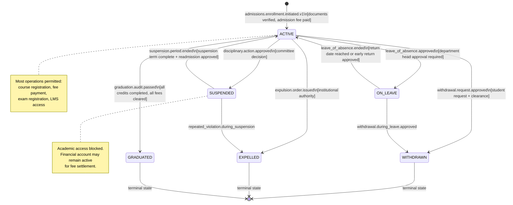
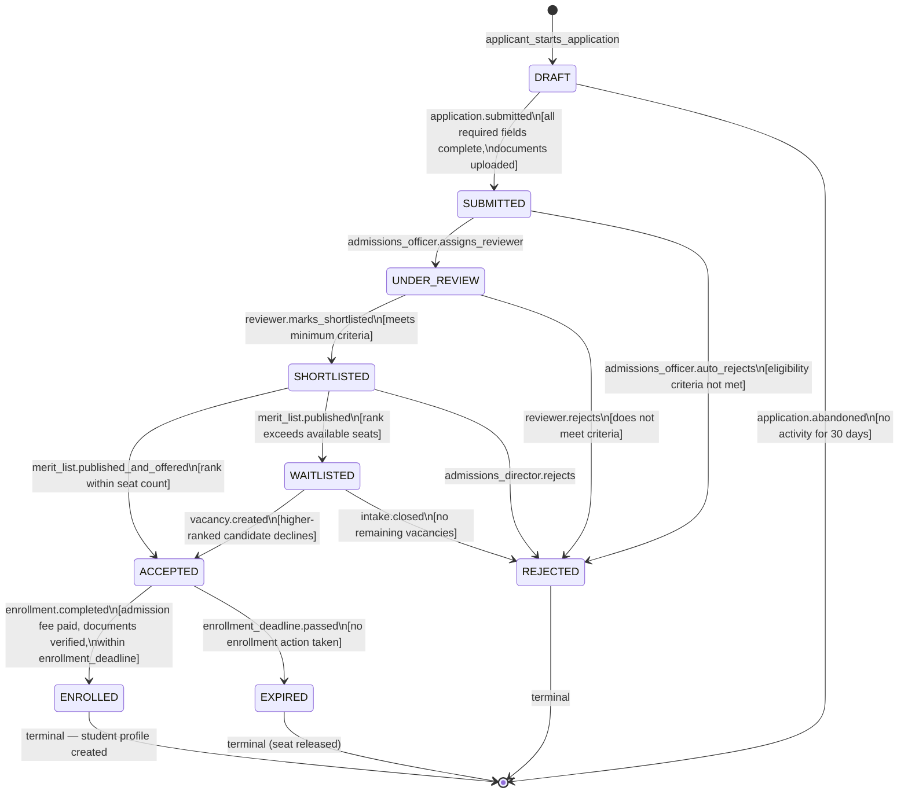

# State Machine Diagrams — Education Management Information System

This document defines the lifecycle state machines for key EMIS entities. Each state machine governs valid transitions, guard conditions, and triggering events.

---

## 1. Student Academic Status

The student status lifecycle tracks a learner's standing within the institution from initial enrollment through to graduation or departure.

---

## 2. Application Status

The admissions application lifecycle from submission through enrollment or rejection.

---

## 3. Course Enrollment Status

The lifecycle of an individual course enrollment record throughout the semester.

```mermaid
stateDiagram-v2
    [*] --> ACTIVE : enrollment.created\n[all business rules passed]

    ACTIVE --> DROPPED : student.drops_course\n[within add/drop window]
    ACTIVE --> WITHDRAWN : student.withdraws\n[after add/drop, before late-drop deadline]
    ACTIVE --> WF : student.withdraws_failing\n[after late-drop deadline,\nrequires dept head approval]
    ACTIVE --> COMPLETED : semester.grades_published\n[letter grade in {A,B+,B,C+,C,D}]
    ACTIVE --> FAILED : semester.grades_published\n[letter grade = F]
    ACTIVE --> INCOMPLETE : faculty.marks_incomplete\n[extenuating circumstances,\napproved exception]

    INCOMPLETE --> COMPLETED : incomplete.resolved\n[make-up work submitted and graded,\nwithin incomplete resolution window]
    INCOMPLETE --> FAILED : incomplete_resolution_window.expired

    DROPPED --> [*] : no grade record; fee adjustment processed
    WITHDRAWN --> [*] : W appears on transcript; no GPA impact
    WF --> [*] : WF appears on transcript; counts as F for GPA
    COMPLETED --> [*] : terminal; grade and GPA recorded
    FAILED --> [*] : terminal; F recorded; may repeat course
```

---

## 4. Fee Invoice Status

The lifecycle of a student fee invoice from draft generation to final settlement.

```mermaid
stateDiagram-v2
    [*] --> DRAFT : invoice.auto_generated\n[on semester enrollment]

    DRAFT --> ISSUED : invoice.published\n[sent to student portal and email]

    ISSUED --> PARTIALLY_PAID : payment.confirmed\n[amount < total_amount]
    ISSUED --> PAID : payment.confirmed\n[amount >= total_amount]
    ISSUED --> OVERDUE : due_date.passed\n[nightly batch job; no payment received]

    PARTIALLY_PAID --> PAID : payment.confirmed\n[remaining balance cleared]
    PARTIALLY_PAID --> OVERDUE : due_date.passed\n[balance still outstanding]

    OVERDUE --> PARTIALLY_PAID : payment.confirmed\n[partial payment on overdue invoice]
    OVERDUE --> PAID : payment.confirmed\n[full balance cleared]
    OVERDUE --> WRITTEN_OFF : finance_head.writes_off\n[irrecoverable debt, approval required]

    PAID --> REFUNDED : refund.issued\n[finance officer authorization,\nwithin refund eligibility window]

    REFUNDED --> [*] : terminal
    WRITTEN_OFF --> [*] : terminal
    PAID --> [*] : terminal (no refund)

    note right of OVERDUE
        Financial hold applied to student account
        30 days after invoice becomes OVERDUE.
        Hold blocks new course enrollments.
    end note
```

---

## 5. Assignment Submission Status

The lifecycle of a student assignment submission from creation through grading and feedback.

```mermaid
stateDiagram-v2
    [*] --> NOT_SUBMITTED : assignment.published\n[student enrolled in section]

    NOT_SUBMITTED --> DRAFT : student.starts_submission\n[auto-save in progress]
    NOT_SUBMITTED --> SUBMITTED : student.submits\n[before due_datetime]
    NOT_SUBMITTED --> LATE_SUBMITTED : student.submits\n[after due_datetime,\nwithin late_submission_window,\nlate submissions enabled]
    NOT_SUBMITTED --> CLOSED : late_submission_window.expired\n[student did not submit]

    DRAFT --> SUBMITTED : student.confirms_submission\n[before due_datetime]
    DRAFT --> LATE_SUBMITTED : student.confirms_submission\n[after due_datetime]

    SUBMITTED --> PLAGIARISM_FLAGGED : plagiarism_check.flag_raised\n[similarity above threshold]
    SUBMITTED --> UNDER_REVIEW : faculty.opens_submission
    LATE_SUBMITTED --> UNDER_REVIEW : faculty.opens_submission

    PLAGIARISM_FLAGGED --> UNDER_REVIEW : faculty.reviews_flag\n[dismissed or noted]
    PLAGIARISM_FLAGGED --> REJECTED : faculty.rejects_for_plagiarism\n[with dept head approval]

    UNDER_REVIEW --> GRADED : faculty.submits_grade\n[marks_obtained entered]
    UNDER_REVIEW --> RETURNED_FOR_REVISION : faculty.requests_revision\n[if policy allows resubmission]

    RETURNED_FOR_REVISION --> SUBMITTED : student.resubmits\n[within revision window]

    GRADED --> [*] : terminal; grade synced to exam module
    REJECTED --> [*] : terminal; zero marks recorded
    CLOSED --> [*] : terminal; zero marks recorded
```

---

## 6. Library Book Status

The lifecycle of a library book item from cataloging through circulation and disposal.

```mermaid
stateDiagram-v2
    [*] --> AVAILABLE : book.catalogued\n[added to library inventory]

    AVAILABLE --> RESERVED : member.reserves_online\n[reservation window: 24 hours]
    AVAILABLE --> ISSUED : librarian.issues_book\n[member presents ID, due date set]
    AVAILABLE --> UNDER_MAINTENANCE : librarian.marks_maintenance\n[repair, rebinding, etc.]

    RESERVED --> ISSUED : librarian.issues_to_reserver\n[member collects within window]
    RESERVED --> AVAILABLE : reservation.expired\n[member did not collect in 24 hours]

    ISSUED --> RETURNED : librarian.records_return\n[on or before due_date]
    ISSUED --> OVERDUE : due_date.passed\n[nightly batch; fine starts accruing]

    OVERDUE --> RETURNED : librarian.records_return\n[fine calculated and added to member account]
    OVERDUE --> LOST : librarian.marks_lost\n[after 30 days overdue,\nreplacement cost charged]

    RETURNED --> AVAILABLE : book.condition_check_passed
    RETURNED --> UNDER_MAINTENANCE : book.condition_check_failed\n[damage detected on return]

    UNDER_MAINTENANCE --> AVAILABLE : maintenance.completed
    UNDER_MAINTENANCE --> DISPOSED : maintenance.assessment\n[irreparable damage]

    LOST --> DISPOSED : lost.confirmed\n[replacement copy ordered separately]

    DISPOSED --> [*] : terminal; removed from active catalog
```

