# State Machine Diagrams — Education Management Information System

This document defines the lifecycle state machines for key EMIS entities. Each state machine governs valid transitions, guard conditions, and triggering events.

---

## 1. Student Academic Status

The student status lifecycle tracks a learner's standing within the institution from initial enrollment through to graduation or departure.

```mermaid
stateDiagram-v2
    [*] --> ACTIVE : admissions.enrollment.initiated.v1\n[documents verified, admission fee paid]

    ACTIVE --> ON_LEAVE : leave_of_absence.approved\n[department head approval required]
    ACTIVE --> SUSPENDED : disciplinary.action.approved\n[committee decision]
    ACTIVE --> WITHDRAWN : withdrawal.request.approved\n[student request + clearance]
    ACTIVE --> EXPELLED : expulsion.order.issued\n[institutional authority]
    ACTIVE --> GRADUATED : graduation.audit.passed\n[all credits completed, all fees cleared]

    ON_LEAVE --> ACTIVE : leave_of_absence.ended\n[return date reached or early return approved]
    ON_LEAVE --> WITHDRAWN : withdrawal.during_leave.approved

    SUSPENDED --> ACTIVE : suspension.period.ended\n[suspension term complete + readmission approved]
    SUSPENDED --> EXPELLED : repeated_violation.during_suspension

    WITHDRAWN --> [*] : terminal state
    EXPELLED --> [*] : terminal state
    GRADUATED --> [*] : terminal state

    note right of ACTIVE
        Most operations permitted:
        course registration, fee payment,
        exam registration, LMS access
    end note

    note right of SUSPENDED
        Academic access blocked.
        Financial account may remain active
        for fee settlement.
    end note
```

---

## 2. Application Status

The admissions application lifecycle from submission through enrollment or rejection.

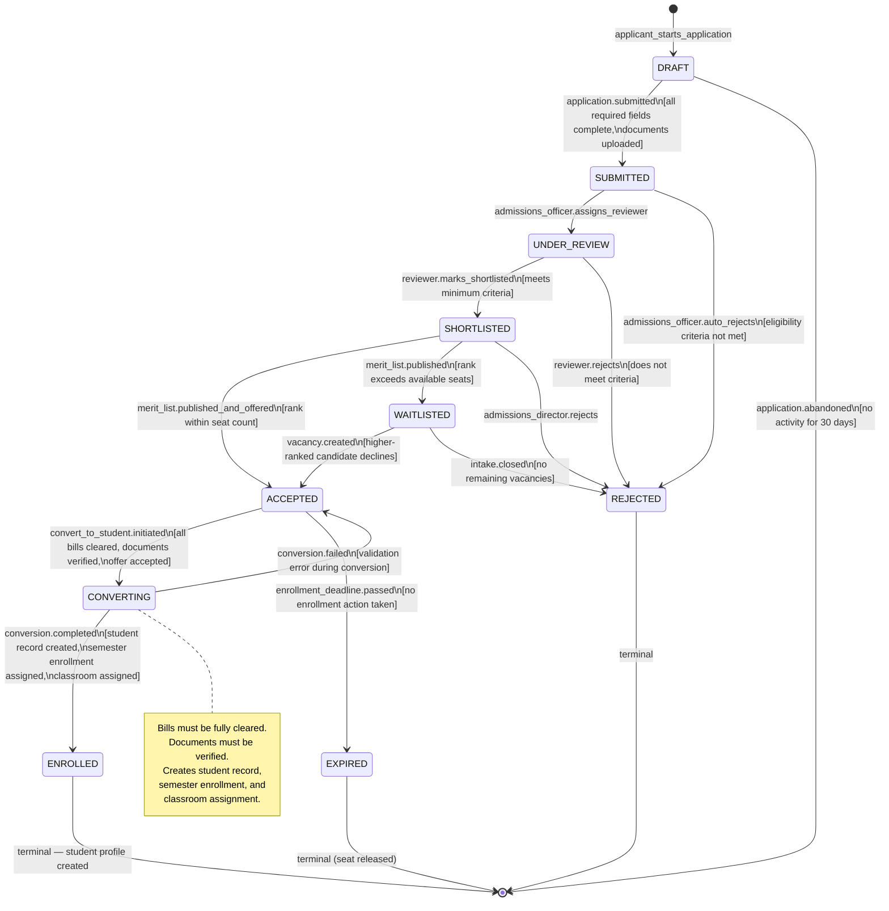
```mermaid
stateDiagram-v2
    [*] --> DRAFT : applicant_starts_application

    DRAFT --> SUBMITTED : application.submitted\n[all required fields complete,\ndocuments uploaded]
    DRAFT --> [*] : application.abandoned\n[no activity for 30 days]

    SUBMITTED --> UNDER_REVIEW : admissions_officer.assigns_reviewer
    SUBMITTED --> REJECTED : admissions_officer.auto_rejects\n[eligibility criteria not met]

    UNDER_REVIEW --> SHORTLISTED : reviewer.marks_shortlisted\n[meets minimum criteria]
    UNDER_REVIEW --> REJECTED : reviewer.rejects\n[does not meet criteria]

    SHORTLISTED --> ACCEPTED : merit_list.published_and_offered\n[rank within seat count]
    SHORTLISTED --> WAITLISTED : merit_list.published\n[rank exceeds available seats]
    SHORTLISTED --> REJECTED : admissions_director.rejects

    WAITLISTED --> ACCEPTED : vacancy.created\n[higher-ranked candidate declines]
    WAITLISTED --> REJECTED : intake.closed\n[no remaining vacancies]

    ACCEPTED --> CONVERTING : convert_to_student.initiated\n[all bills cleared, documents verified,\noffer accepted]
    ACCEPTED --> EXPIRED : enrollment_deadline.passed\n[no enrollment action taken]

    CONVERTING --> ENROLLED : conversion.completed\n[student record created,\nsemester enrollment assigned,\nclassroom assigned]
    CONVERTING --> ACCEPTED : conversion.failed\n[validation error during conversion]

    ENROLLED --> [*] : terminal — student profile created
    REJECTED --> [*] : terminal
    EXPIRED --> [*] : terminal (seat released)

    note right of CONVERTING
        Bills must be fully cleared.
        Documents must be verified.
        Creates student record,
        semester enrollment, and
        classroom assignment.
    end note
```

---

## 3. Course Enrollment Status

The lifecycle of an individual course enrollment record throughout the semester.

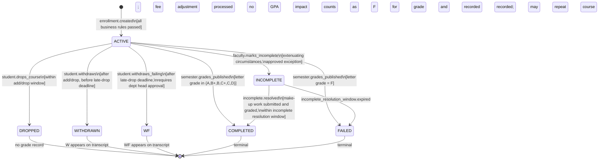
```mermaid
stateDiagram-v2
    [*] --> ACTIVE : enrollment.created\n[all business rules passed]

    ACTIVE --> DROPPED : student.drops_course\n[within add/drop window]
    ACTIVE --> WITHDRAWN : student.withdraws\n[after add/drop, before late-drop deadline]
    ACTIVE --> WF : student.withdraws_failing\n[after late-drop deadline,\nrequires dept head approval]
    ACTIVE --> COMPLETED : semester.grades_published\n[letter grade in {A,B+,B,C+,C,D}]
    ACTIVE --> FAILED : semester.grades_published\n[letter grade = F]
    ACTIVE --> INCOMPLETE : faculty.marks_incomplete\n[extenuating circumstances,\napproved exception]

    INCOMPLETE --> COMPLETED : incomplete.resolved\n[make-up work submitted and graded,\nwithin incomplete resolution window]
    INCOMPLETE --> FAILED : incomplete_resolution_window.expired

    DROPPED --> [*] : no grade record; fee adjustment processed
    WITHDRAWN --> [*] : W appears on transcript; no GPA impact
    WF --> [*] : WF appears on transcript; counts as F for GPA
    COMPLETED --> [*] : terminal; grade and GPA recorded
    FAILED --> [*] : terminal; F recorded; may repeat course
```

---

## 4. Fee Invoice Status

The lifecycle of a student fee invoice from draft generation to final settlement.

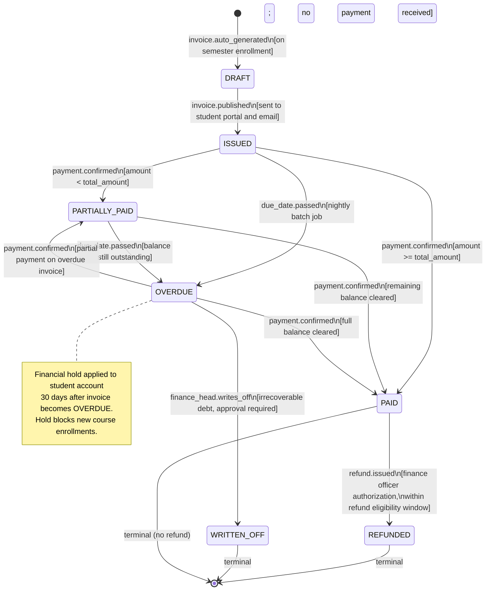
```mermaid
stateDiagram-v2
    [*] --> DRAFT : invoice.auto_generated\n[on semester enrollment]

    DRAFT --> ISSUED : invoice.published\n[sent to student portal and email]

    ISSUED --> PARTIALLY_PAID : payment.confirmed\n[amount < total_amount]
    ISSUED --> PAID : payment.confirmed\n[amount >= total_amount]
    ISSUED --> OVERDUE : due_date.passed\n[nightly batch job; no payment received]

    PARTIALLY_PAID --> PAID : payment.confirmed\n[remaining balance cleared]
    PARTIALLY_PAID --> OVERDUE : due_date.passed\n[balance still outstanding]

    OVERDUE --> PARTIALLY_PAID : payment.confirmed\n[partial payment on overdue invoice]
    OVERDUE --> PAID : payment.confirmed\n[full balance cleared]
    OVERDUE --> WRITTEN_OFF : finance_head.writes_off\n[irrecoverable debt, approval required]

    PAID --> REFUNDED : refund.issued\n[finance officer authorization,\nwithin refund eligibility window]

    REFUNDED --> [*] : terminal
    WRITTEN_OFF --> [*] : terminal
    PAID --> [*] : terminal (no refund)

    note right of OVERDUE
        Financial hold applied to student account
        30 days after invoice becomes OVERDUE.
        Hold blocks new course enrollments.
    end note
```

---

## 5. Assignment Submission Status

The lifecycle of a student assignment submission from creation through grading and feedback.

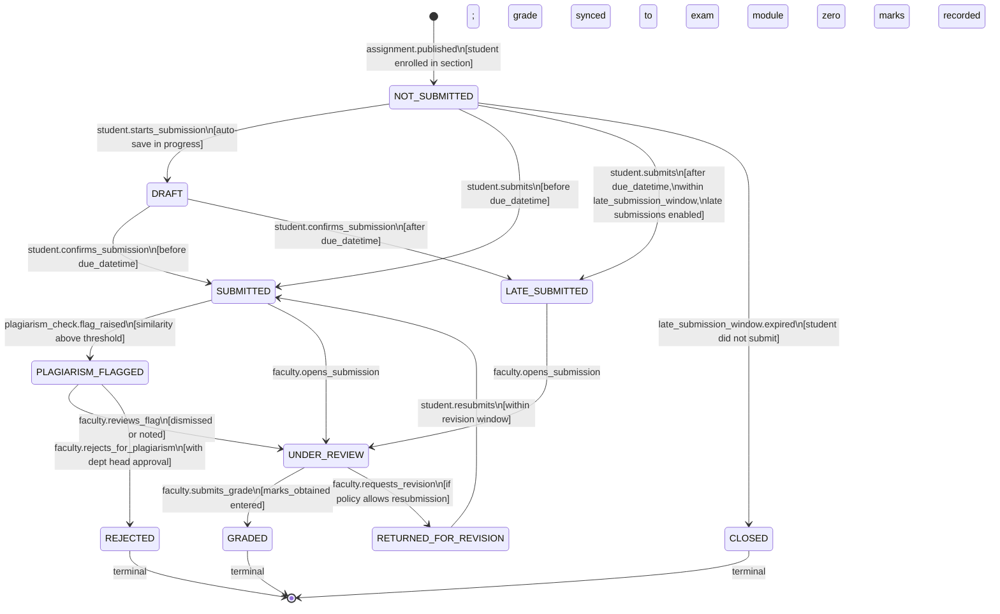
```mermaid
stateDiagram-v2
    [*] --> NOT_SUBMITTED : assignment.published\n[student enrolled in section]

    NOT_SUBMITTED --> DRAFT : student.starts_submission\n[auto-save in progress]
    NOT_SUBMITTED --> SUBMITTED : student.submits\n[before due_datetime]
    NOT_SUBMITTED --> LATE_SUBMITTED : student.submits\n[after due_datetime,\nwithin late_submission_window,\nlate submissions enabled]
    NOT_SUBMITTED --> CLOSED : late_submission_window.expired\n[student did not submit]

    DRAFT --> SUBMITTED : student.confirms_submission\n[before due_datetime]
    DRAFT --> LATE_SUBMITTED : student.confirms_submission\n[after due_datetime]

    SUBMITTED --> PLAGIARISM_FLAGGED : plagiarism_check.flag_raised\n[similarity above threshold]
    SUBMITTED --> UNDER_REVIEW : faculty.opens_submission
    LATE_SUBMITTED --> UNDER_REVIEW : faculty.opens_submission

    PLAGIARISM_FLAGGED --> UNDER_REVIEW : faculty.reviews_flag\n[dismissed or noted]
    PLAGIARISM_FLAGGED --> REJECTED : faculty.rejects_for_plagiarism\n[with dept head approval]

    UNDER_REVIEW --> GRADED : faculty.submits_grade\n[marks_obtained entered]
    UNDER_REVIEW --> RETURNED_FOR_REVISION : faculty.requests_revision\n[if policy allows resubmission]

    RETURNED_FOR_REVISION --> SUBMITTED : student.resubmits\n[within revision window]

    GRADED --> [*] : terminal; grade synced to exam module
    REJECTED --> [*] : terminal; zero marks recorded
    CLOSED --> [*] : terminal; zero marks recorded
```

---

## 6. Library Book Status

The lifecycle of a library book item from cataloging through circulation and disposal.

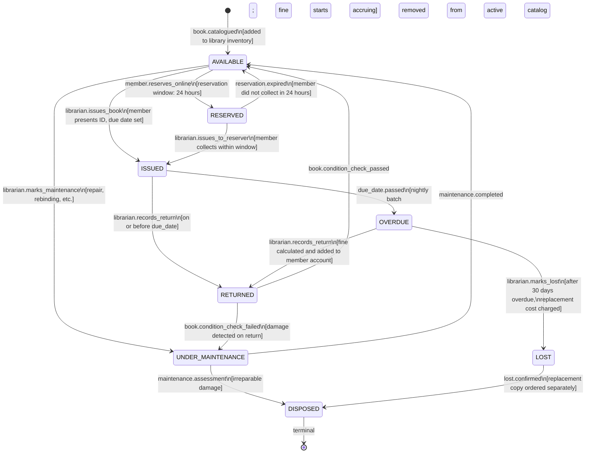
```mermaid
stateDiagram-v2
    [*] --> AVAILABLE : book.catalogued\n[added to library inventory]

    AVAILABLE --> RESERVED : member.reserves_online\n[reservation window: 24 hours]
    AVAILABLE --> ISSUED : librarian.issues_book\n[member presents ID, due date set]
    AVAILABLE --> UNDER_MAINTENANCE : librarian.marks_maintenance\n[repair, rebinding, etc.]

    RESERVED --> ISSUED : librarian.issues_to_reserver\n[member collects within window]
    RESERVED --> AVAILABLE : reservation.expired\n[member did not collect in 24 hours]

    ISSUED --> RETURNED : librarian.records_return\n[on or before due_date]
    ISSUED --> OVERDUE : due_date.passed\n[nightly batch; fine starts accruing]

    OVERDUE --> RETURNED : librarian.records_return\n[fine calculated and added to member account]
    OVERDUE --> LOST : librarian.marks_lost\n[after 30 days overdue,\nreplacement cost charged]

    RETURNED --> AVAILABLE : book.condition_check_passed
    RETURNED --> UNDER_MAINTENANCE : book.condition_check_failed\n[damage detected on return]

    UNDER_MAINTENANCE --> AVAILABLE : maintenance.completed
    UNDER_MAINTENANCE --> DISPOSED : maintenance.assessment\n[irreparable damage]

    LOST --> DISPOSED : lost.confirmed\n[replacement copy ordered separately]

    DISPOSED --> [*] : terminal; removed from active catalog
```

---

## Academic Year Lifecycle

The lifecycle of an academic year from creation through archival.

```mermaid
stateDiagram-v2
    [*] --> PLANNING : admin.creates_academic_year

    PLANNING --> ACTIVE : admin.activates\n[previous year COMPLETED,\nno other ACTIVE year]
    
    ACTIVE --> COMPLETED : admin.completes\n[all semesters COMPLETED]

    COMPLETED --> ARCHIVED : system.archives\n[after 2 years,\nall data backed up]

    ARCHIVED --> [*] : terminal; read-only historical record

    note right of PLANNING
        Configure semesters,
        set dates, assign calendars
    end note

    note right of ACTIVE
        Only one academic year
        can be ACTIVE at a time
    end note
```

---

## Semester Lifecycle

The lifecycle of an academic semester with strict state transitions.

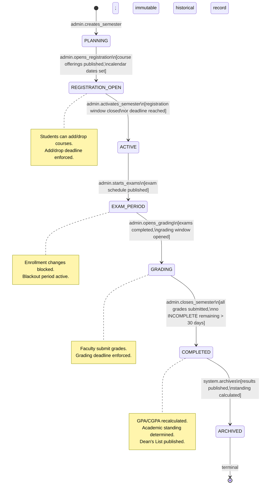
```mermaid
stateDiagram-v2
    [*] --> PLANNING : admin.creates_semester

    PLANNING --> REGISTRATION_OPEN : admin.opens_registration\n[course offerings published,\ncalendar dates set]

    REGISTRATION_OPEN --> ACTIVE : admin.activates_semester\n[registration window closed\nor deadline reached]

    ACTIVE --> EXAM_PERIOD : admin.starts_exams\n[exam schedule published]

    EXAM_PERIOD --> GRADING : admin.opens_grading\n[exams completed,\ngrading window opened]

    GRADING --> COMPLETED : admin.closes_semester\n[all grades submitted,\nno INCOMPLETE remaining > 30 days]

    COMPLETED --> ARCHIVED : system.archives\n[results published,\nstanding calculated]

    ARCHIVED --> [*] : terminal; immutable historical record

    note right of REGISTRATION_OPEN
        Students can add/drop courses.
        Add/drop deadline enforced.
    end note

    note right of EXAM_PERIOD
        Enrollment changes blocked.
        Blackout period active.
    end note

    note right of GRADING
        Faculty submit grades.
        Grading deadline enforced.
    end note

    note right of COMPLETED
        GPA/CGPA recalculated.
        Academic standing determined.
        Dean's List published.
    end note
```

---

## Graduation Application Lifecycle

The lifecycle of a graduation application from submission through degree conferral.

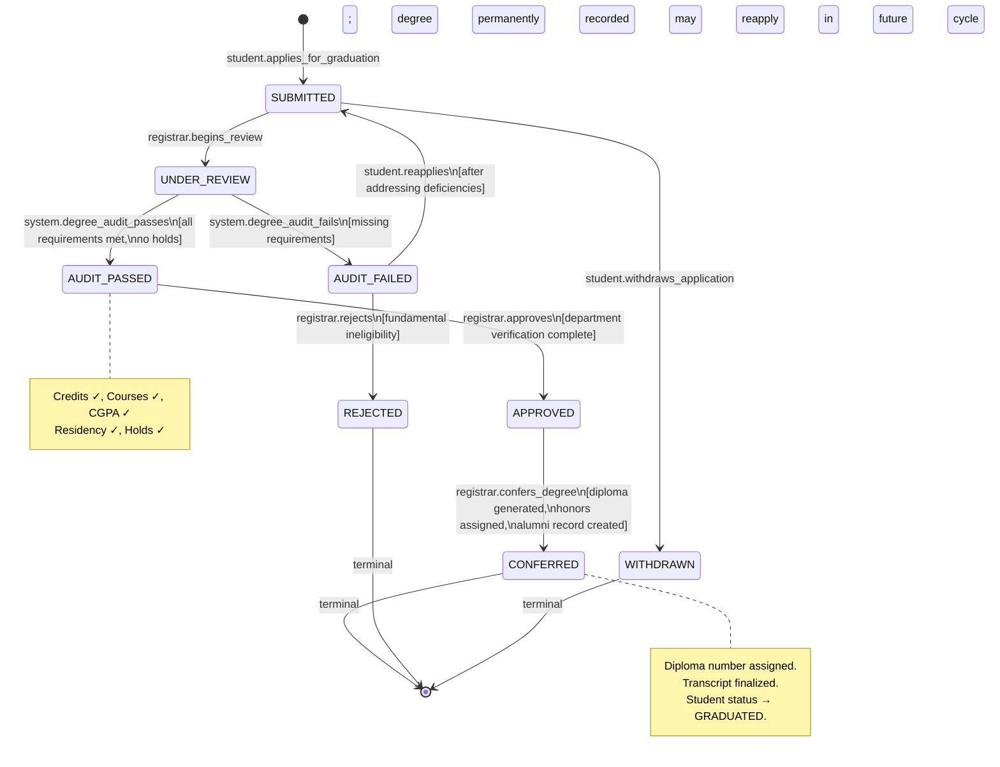
```mermaid
stateDiagram-v2
    [*] --> SUBMITTED : student.applies_for_graduation

    SUBMITTED --> UNDER_REVIEW : registrar.begins_review

    UNDER_REVIEW --> AUDIT_PASSED : system.degree_audit_passes\n[all requirements met,\nno holds]
    UNDER_REVIEW --> AUDIT_FAILED : system.degree_audit_fails\n[missing requirements]

    AUDIT_FAILED --> SUBMITTED : student.reapplies\n[after addressing deficiencies]
    AUDIT_FAILED --> REJECTED : registrar.rejects\n[fundamental ineligibility]

    AUDIT_PASSED --> APPROVED : registrar.approves\n[department verification complete]

    APPROVED --> CONFERRED : registrar.confers_degree\n[diploma generated,\nhonors assigned,\nalumni record created]

    SUBMITTED --> WITHDRAWN : student.withdraws_application

    CONFERRED --> [*] : terminal; degree permanently recorded

    REJECTED --> [*] : terminal; may reapply in future cycle

    WITHDRAWN --> [*] : terminal; may reapply

    note right of AUDIT_PASSED
        Credits ✓, Courses ✓, CGPA ✓
        Residency ✓, Holds ✓
    end note

    note right of CONFERRED
        Diploma number assigned.
        Transcript finalized.
        Student status → GRADUATED.
    end note
```

---

## Disciplinary Case Lifecycle

The lifecycle of a student disciplinary case from report through resolution.

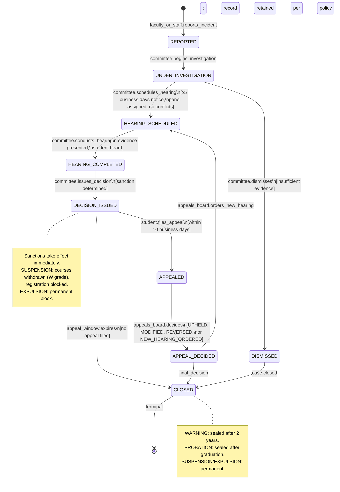
```mermaid
stateDiagram-v2
    [*] --> REPORTED : faculty_or_staff.reports_incident

    REPORTED --> UNDER_INVESTIGATION : committee.begins_investigation

    UNDER_INVESTIGATION --> HEARING_SCHEDULED : committee.schedules_hearing\n[≥5 business days notice,\npanel assigned, no conflicts]

    UNDER_INVESTIGATION --> DISMISSED : committee.dismisses\n[insufficient evidence]

    HEARING_SCHEDULED --> HEARING_COMPLETED : committee.conducts_hearing\n[evidence presented,\nstudent heard]

    HEARING_COMPLETED --> DECISION_ISSUED : committee.issues_decision\n[sanction determined]

    DECISION_ISSUED --> APPEALED : student.files_appeal\n[within 10 business days]

    DECISION_ISSUED --> CLOSED : appeal_window.expires\n[no appeal filed]

    APPEALED --> APPEAL_DECIDED : appeals_board.decides\n[UPHELD, MODIFIED, REVERSED,\nor NEW_HEARING_ORDERED]

    APPEAL_DECIDED --> CLOSED : final_decision

    APPEAL_DECIDED --> HEARING_SCHEDULED : appeals_board.orders_new_hearing

    DISMISSED --> CLOSED : case.closed

    CLOSED --> [*] : terminal; record retained per policy

    note right of DECISION_ISSUED
        Sanctions take effect immediately.
        SUSPENSION: courses withdrawn (W grade),
        registration blocked.
        EXPULSION: permanent block.
    end note

    note right of CLOSED
        WARNING: sealed after 2 years.
        PROBATION: sealed after graduation.
        SUSPENSION/EXPULSION: permanent.
    end note
```

---

## Grade Appeal Lifecycle

The lifecycle of a student grade appeal with mandatory escalation path.

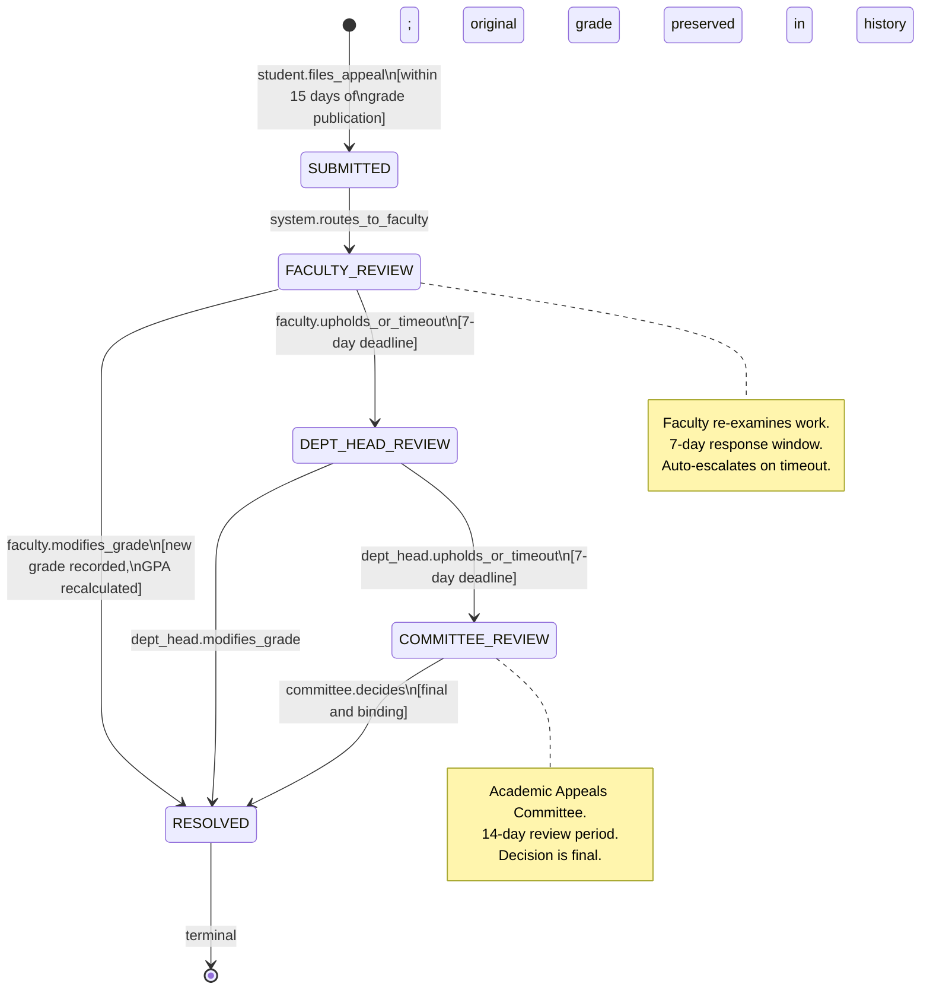
```mermaid
stateDiagram-v2
    [*] --> SUBMITTED : student.files_appeal\n[within 15 days of\ngrade publication]

    SUBMITTED --> FACULTY_REVIEW : system.routes_to_faculty

    FACULTY_REVIEW --> RESOLVED : faculty.modifies_grade\n[new grade recorded,\nGPA recalculated]
    FACULTY_REVIEW --> DEPT_HEAD_REVIEW : faculty.upholds_or_timeout\n[7-day deadline]

    DEPT_HEAD_REVIEW --> RESOLVED : dept_head.modifies_grade
    DEPT_HEAD_REVIEW --> COMMITTEE_REVIEW : dept_head.upholds_or_timeout\n[7-day deadline]

    COMMITTEE_REVIEW --> RESOLVED : committee.decides\n[final and binding]

    RESOLVED --> [*] : terminal; original grade preserved in history

    note right of FACULTY_REVIEW
        Faculty re-examines work.
        7-day response window.
        Auto-escalates on timeout.
    end note

    note right of COMMITTEE_REVIEW
        Academic Appeals Committee.
        14-day review period.
        Decision is final.
    end note
```

---

## Job Application Lifecycle

The lifecycle of a faculty job application from submission through hire.

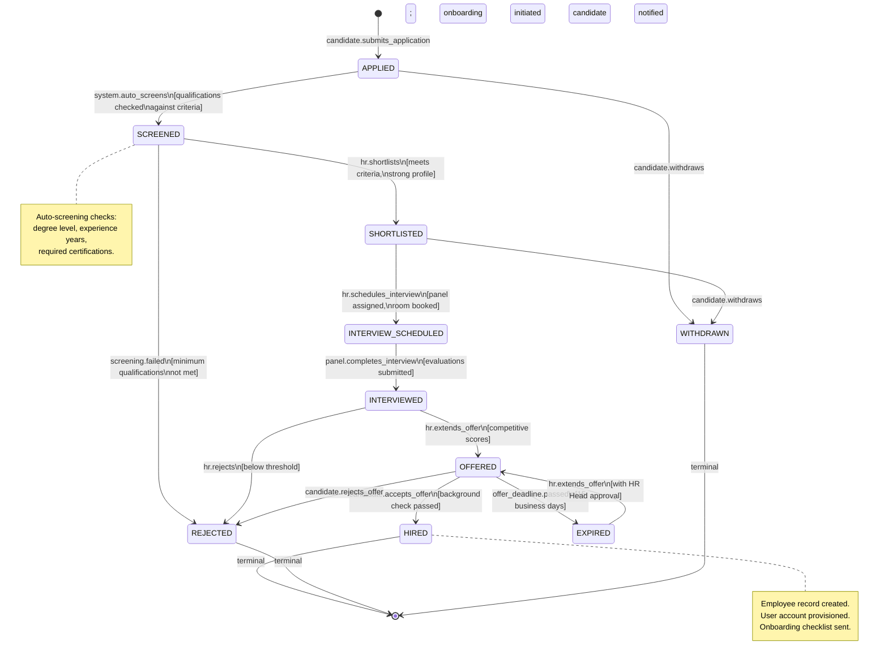
```mermaid
stateDiagram-v2
    [*] --> APPLIED : candidate.submits_application

    APPLIED --> SCREENED : system.auto_screens\n[qualifications checked\nagainst criteria]

    SCREENED --> REJECTED : screening.failed\n[minimum qualifications\nnot met]

    SCREENED --> SHORTLISTED : hr.shortlists\n[meets criteria,\nstrong profile]

    SHORTLISTED --> INTERVIEW_SCHEDULED : hr.schedules_interview\n[panel assigned,\nroom booked]

    INTERVIEW_SCHEDULED --> INTERVIEWED : panel.completes_interview\n[evaluations submitted]

    INTERVIEWED --> OFFERED : hr.extends_offer\n[competitive scores]
    INTERVIEWED --> REJECTED : hr.rejects\n[below threshold]

    OFFERED --> HIRED : candidate.accepts_offer\n[background check passed]
    OFFERED --> REJECTED : candidate.rejects_offer
    OFFERED --> EXPIRED : offer_deadline.passed\n[15 business days]

    EXPIRED --> OFFERED : hr.extends_offer\n[with HR Head approval]

    HIRED --> [*] : terminal; onboarding initiated

    REJECTED --> [*] : terminal; candidate notified

    WITHDRAWN --> [*] : terminal

    APPLIED --> WITHDRAWN : candidate.withdraws
    SHORTLISTED --> WITHDRAWN : candidate.withdraws

    note right of SCREENED
        Auto-screening checks:
        degree level, experience years,
        required certifications.
    end note

    note right of HIRED
        Employee record created.
        User account provisioned.
        Onboarding checklist sent.
    end note
```

---

## Transfer Credit Lifecycle

The lifecycle of a transfer credit application from submission through approval.

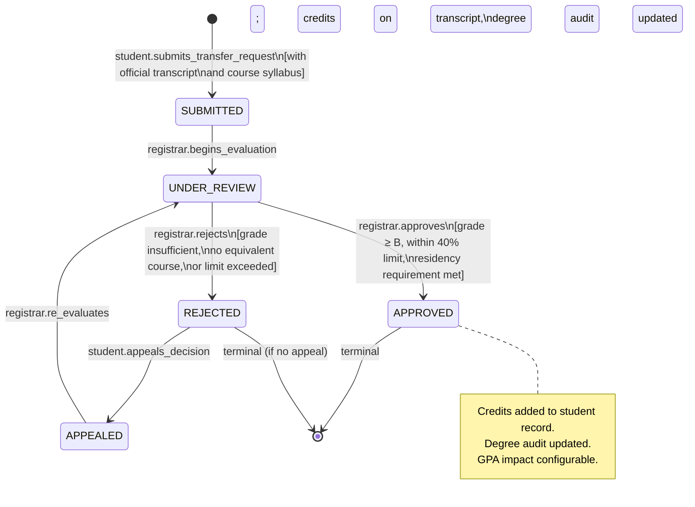
```mermaid
stateDiagram-v2
    [*] --> SUBMITTED : student.submits_transfer_request\n[with official transcript\nand course syllabus]

    SUBMITTED --> UNDER_REVIEW : registrar.begins_evaluation

    UNDER_REVIEW --> APPROVED : registrar.approves\n[grade ≥ B, within 40% limit,\nresidency requirement met]
    UNDER_REVIEW --> REJECTED : registrar.rejects\n[grade insufficient,\nno equivalent course,\nor limit exceeded]

    REJECTED --> APPEALED : student.appeals_decision

    APPEALED --> UNDER_REVIEW : registrar.re_evaluates

    APPROVED --> [*] : terminal; credits on transcript,\ndegree audit updated

    REJECTED --> [*] : terminal (if no appeal)

    note right of APPROVED
        Credits added to student record.
        Degree audit updated.
        GPA impact configurable.
    end note
```

---

## Scholarship Award Lifecycle

The lifecycle of a scholarship award from application through disbursement and renewal.

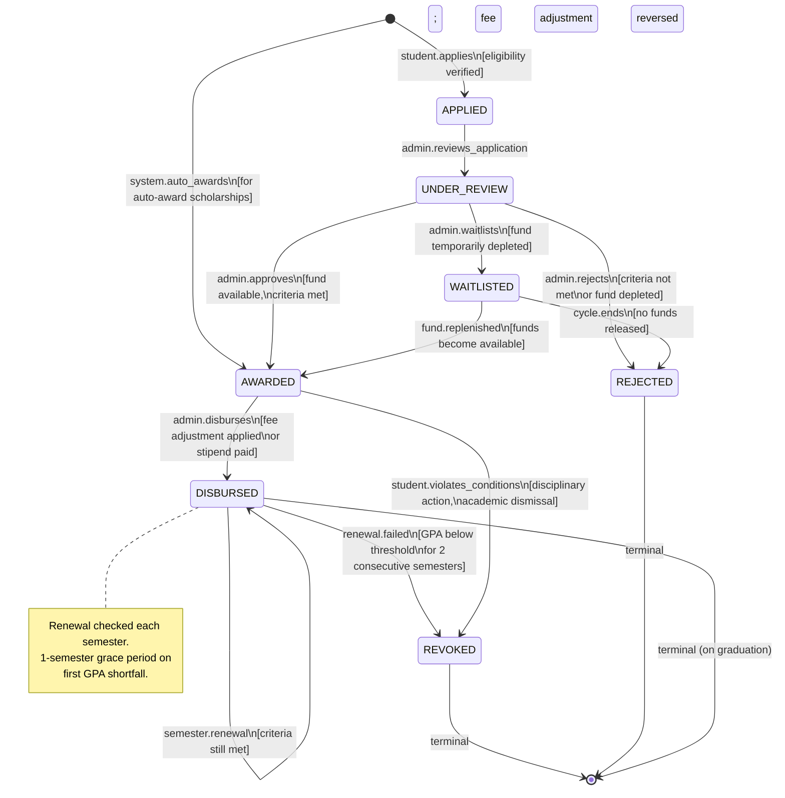
```mermaid
stateDiagram-v2
    [*] --> APPLIED : student.applies\n[eligibility verified]
    [*] --> AWARDED : system.auto_awards\n[for auto-award scholarships]

    APPLIED --> UNDER_REVIEW : admin.reviews_application

    UNDER_REVIEW --> AWARDED : admin.approves\n[fund available,\ncriteria met]
    UNDER_REVIEW --> REJECTED : admin.rejects\n[criteria not met\nor fund depleted]
    UNDER_REVIEW --> WAITLISTED : admin.waitlists\n[fund temporarily depleted]

    WAITLISTED --> AWARDED : fund.replenished\n[funds become available]
    WAITLISTED --> REJECTED : cycle.ends\n[no funds released]

    AWARDED --> DISBURSED : admin.disburses\n[fee adjustment applied\nor stipend paid]

    DISBURSED --> DISBURSED : semester.renewal\n[criteria still met]
    DISBURSED --> REVOKED : renewal.failed\n[GPA below threshold\nfor 2 consecutive semesters]

    AWARDED --> REVOKED : student.violates_conditions\n[disciplinary action,\nacademic dismissal]

    REVOKED --> [*] : terminal; fee adjustment reversed

    REJECTED --> [*] : terminal

    DISBURSED --> [*] : terminal (on graduation)

    note right of DISBURSED
        Renewal checked each semester.
        1-semester grace period on
        first GPA shortfall.
    end note
```

---

## Room Booking Lifecycle

The lifecycle of a room booking request.

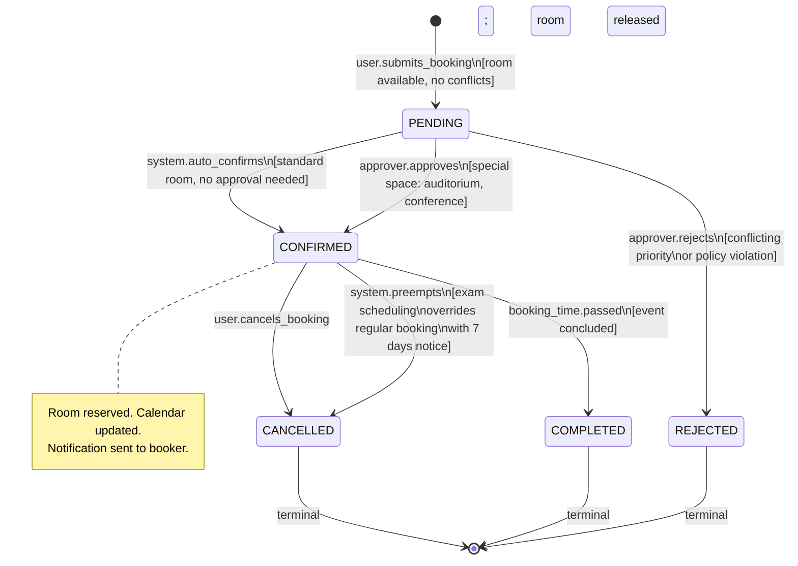
```mermaid
stateDiagram-v2
    [*] --> PENDING : user.submits_booking\n[room available, no conflicts]

    PENDING --> CONFIRMED : system.auto_confirms\n[standard room, no approval needed]
    PENDING --> CONFIRMED : approver.approves\n[special space: auditorium, conference]
    PENDING --> REJECTED : approver.rejects\n[conflicting priority\nor policy violation]

    CONFIRMED --> CANCELLED : user.cancels_booking
    CONFIRMED --> COMPLETED : booking_time.passed\n[event concluded]

    CONFIRMED --> CANCELLED : system.preempts\n[exam scheduling\noverrides regular booking\nwith 7 days notice]

    CANCELLED --> [*] : terminal; room released

    COMPLETED --> [*] : terminal

    REJECTED --> [*] : terminal

    note right of CONFIRMED
        Room reserved. Calendar updated.
        Notification sent to booker.
    end note
```

---

## Admission Cycle Lifecycle

The lifecycle of an admission cycle from creation through completion.

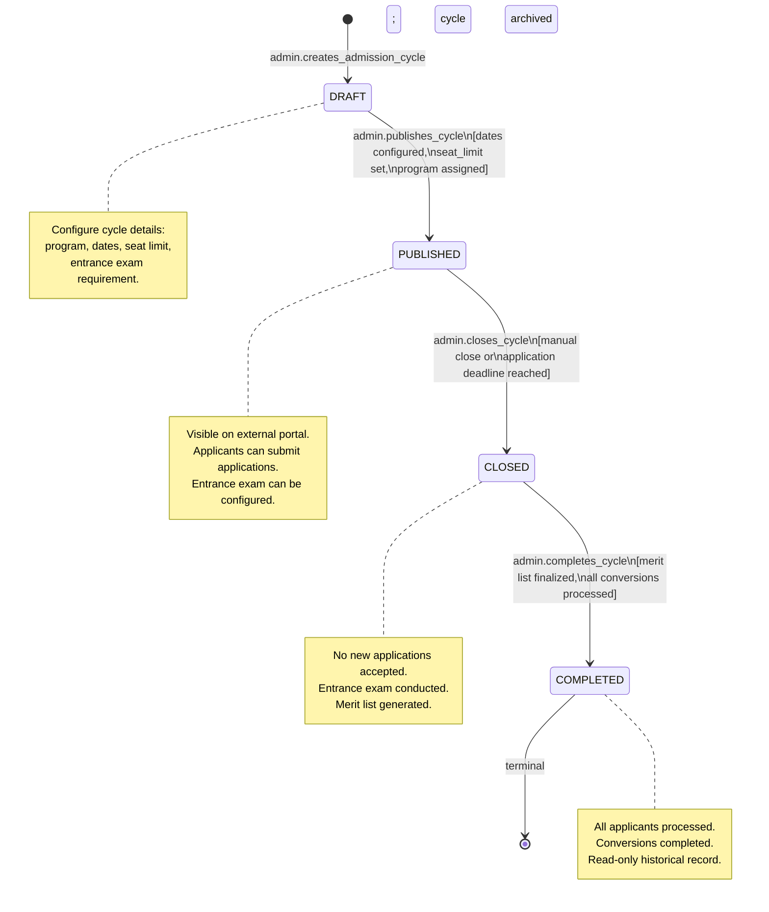
```mermaid
stateDiagram-v2
    [*] --> DRAFT : admin.creates_admission_cycle

    DRAFT --> PUBLISHED : admin.publishes_cycle\n[dates configured,\nseat_limit set,\nprogram assigned]

    PUBLISHED --> CLOSED : admin.closes_cycle\n[manual close or\napplication deadline reached]

    CLOSED --> COMPLETED : admin.completes_cycle\n[merit list finalized,\nall conversions processed]

    COMPLETED --> [*] : terminal; cycle archived

    note right of DRAFT
        Configure cycle details:
        program, dates, seat limit,
        entrance exam requirement.
    end note

    note right of PUBLISHED
        Visible on external portal.
        Applicants can submit applications.
        Entrance exam can be configured.
    end note

    note right of CLOSED
        No new applications accepted.
        Entrance exam conducted.
        Merit list generated.
    end note

    note right of COMPLETED
        All applicants processed.
        Conversions completed.
        Read-only historical record.
    end note
```

---

## Entrance Exam Lifecycle

The lifecycle of an entrance examination from configuration through score finalization.

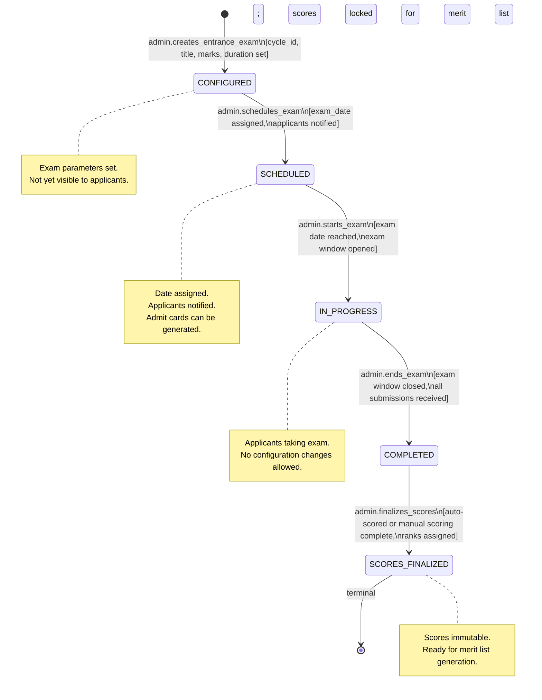
```mermaid
stateDiagram-v2
    [*] --> CONFIGURED : admin.creates_entrance_exam\n[cycle_id, title, marks, duration set]

    CONFIGURED --> SCHEDULED : admin.schedules_exam\n[exam_date assigned,\napplicants notified]

    SCHEDULED --> IN_PROGRESS : admin.starts_exam\n[exam date reached,\nexam window opened]

    IN_PROGRESS --> COMPLETED : admin.ends_exam\n[exam window closed,\nall submissions received]

    COMPLETED --> SCORES_FINALIZED : admin.finalizes_scores\n[auto-scored or manual scoring complete,\nranks assigned]

    SCORES_FINALIZED --> [*] : terminal; scores locked for merit list

    note right of CONFIGURED
        Exam parameters set.
        Not yet visible to applicants.
    end note

    note right of SCHEDULED
        Date assigned.
        Applicants notified.
        Admit cards can be generated.
    end note

    note right of IN_PROGRESS
        Applicants taking exam.
        No configuration changes allowed.
    end note

    note right of SCORES_FINALIZED
        Scores immutable.
        Ready for merit list generation.
    end note
```
