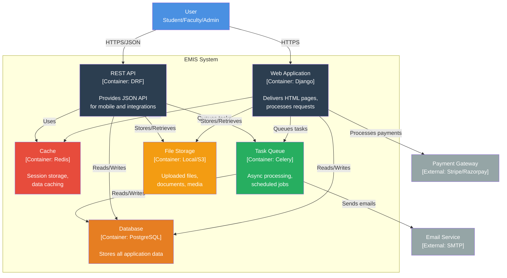
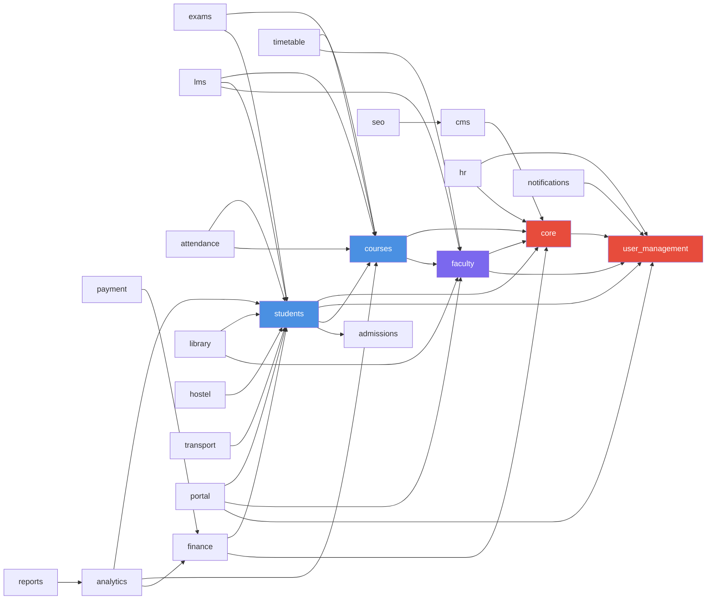

# EMIS - High-Level Architecture Diagram

## System Architecture Overview

EMIS follows a layered architecture with clear separation of concerns. The system is built on Django framework with a modular app-based structure.

## High-Level Architecture

```mermaid
graph TB
    subgraph Client_Layer["Client Layer"]
        Web[Web Browser]
        Mobile[Mobile Browser]
        API_Client[API Clients]
    end
    
    subgraph Presentation_Layer["Presentation Layer"]
        UI[Django Templates + HTMX]
        REST_API[REST API<br/>Django REST Framework]
    end
    
    subgraph Application_Layer["Application Layer (25 Django Apps)"]
        direction TB
        
        subgraph Core_Apps["Core Applications"]
            UserMgmt[User Management<br/>Auth & RBAC]
            CoreApp[Core<br/>Base Models & Utils]
        end
        
        subgraph Academic_Apps["Academic Applications"]
            Students[Students]
            Courses[Courses]
            Faculty[Faculty]
            Admissions[Admissions]
            Exams[Exams]
            Attendance[Attendance]
            Timetable[Timetable]
            LMS[Learning Management]
        end
        
        subgraph Admin_Apps["Administrative Applications"]
            HR[Human Resources]
            Finance[Finance]
            Payment[Payment]
            Inventory[Inventory]
        end
        
        subgraph Facility_Apps["Facility Applications"]
            Library[Library]
            Hostel[Hostel]
            Transport[Transport]
        end
        
        subgraph Support_Apps["Support Applications"]
            Analytics[Analytics]
            Reports[Reports]
            Notifications[Notifications]
            CMS[Content Management]
            SEO[SEO]
            Calendar[Calendar]
            Portal[Portal]
            FileManagement[File Management]
        end
    end
    
    subgraph Business_Logic["Business Logic Layer"]
        Models[Django Models<br/>ORM]
        Managers[Custom Managers]
        Services[Business Services]
        Utils[Utilities & Helpers]
    end
    
    subgraph Data_Layer["Data Access Layer"]
        ORM[Django ORM]
        QueryOptimization[Query Optimization<br/>Select Related / Prefetch]
        Migrations[Django Migrations]
    end
    
    subgraph Integration_Layer["Integration Layer"]
        Middleware[Custom Middleware<br/>Security, Auth, Rate Limit]
        Celery[Celery Task Queue]
        EmailSMS[Email/SMS Services]
        PaymentGW[Payment Gateway Integration]
    end
    
    subgraph Infrastructure_Layer["Infrastructure Layer"]
        WebServer[Gunicorn + Nginx]
        Cache[Redis Cache]
        Database[(PostgreSQL)]
        FileStorage[File Storage<br/>Local/S3]
        StaticFiles[Static Files<br/>WhiteNoise + CDN]
    end
    
    subgraph External_Services["External Services"]
        SMTP[Email Server]
        SMS_GW[SMS Gateway]
        Payment_Service[Payment Gateway]
        CloudStore[Cloud Storage]
    end
    
    %% Client to Presentation
    Web --> UI
    Web --> REST_API
    Mobile --> REST_API
    API_Client --> REST_API
    
    %% Presentation to Application
    UI --> UserMgmt
    UI --> CoreApp
    REST_API --> UserMgmt
    REST_API --> CoreApp
    
    %% Application connections
    UserMgmt --> Students
    UserMgmt --> Faculty
    UserMgmt --> HR
    
    CoreApp --> Students
    CoreApp --> Courses
    CoreApp --> Finance
    
    Students --> Admissions
    Students --> Attendance
    Students --> LMS
    
    Courses --> Timetable
    Courses --> Exams
    Courses --> LMS
    
    Faculty --> Timetable
    Faculty --> Exams
    Faculty --> LMS
    
    Finance --> Payment
    HR --> Finance
    
    Students --> Library
    Students --> Hostel
    Students --> Transport
    
    Analytics --> Students
    Analytics --> Courses
    Analytics --> Finance
    
    Reports --> Analytics
    
    Notifications --> Students
    Notifications --> Faculty
    
    CMS --> SEO
    Portal --> Students
    Portal --> Faculty
    
    %% Application to Business Logic
    UserMgmt --> Models
    Students --> Models
    Courses --> Models
    Finance --> Models
    
    Models --> Managers
    Models --> Services
    Services --> Utils
    
    %% Business Logic to Data Layer
    Models --> ORM
    Managers --> ORM
    ORM --> QueryOptimization
    QueryOptimization --> Migrations
    
    %% Integration Layer connections
    UI --> Middleware
    REST_API --> Middleware
    
    Services --> Celery
    Services --> EmailSMS
    Payment --> PaymentGW
    
    %% Data Layer to Infrastructure
    Migrations --> Database
    ORM --> Database
    
    Middleware --> Cache
    Services --> Cache
    
    FileManagement --> FileStorage
    
    UI --> StaticFiles
    
    %% Infrastructure to External
    EmailSMS --> SMTP
    EmailSMS --> SMS_GW
    PaymentGW --> Payment_Service
    FileStorage -.->|Optional| CloudStore
    
    %% Web Server
    Web --> WebServer
    Mobile --> WebServer
    WebServer --> UI
    WebServer --> REST_API
    
    style Web fill:#4A90E2,color:#fff
    style UI fill:#7B68EE,color:#fff
    style REST_API fill:#7B68EE,color:#fff
    style UserMgmt fill:#E74C3C,color:#fff
    style CoreApp fill:#E74C3C,color:#fff
    style Models fill:#F39C12,color:#fff
    style ORM fill:#27AE60,color:#fff
    style Database fill:#34495E,color:#fff
    style Cache fill:#E67E22,color:#fff
    style WebServer fill:#16A085,color:#fff
```

## C4 Container Diagram

## Layered Architecture Detail

### 1. Presentation Layer
**Responsibility**: User interface and API endpoints
- **Django Templates**: Server-side rendered HTML
- **HTMX**: Dynamic page updates without full reload
- **Bootstrap 5**: Responsive UI framework
- **Django REST Framework**: RESTful API for mobile/integrations

### 2. Application Layer (Django Apps)
**Responsibility**: Business logic organized by domain
- **25 Modular Apps**: Each app is a self-contained module
- **Clear Boundaries**: Apps communicate through defined interfaces
- **App Categories**:
  - Core: user_management, core
  - Academic: students, courses, faculty, admissions, exams, attendance, timetable, lms
  - Administrative: hr, finance, payment, inventory
  - Facilities: library, hostel, transport
  - Support: analytics, reports, notifications, cms, seo, calendar, portal, file_management

### 3. Business Logic Layer
**Responsibility**: Core business rules and data manipulation
- **Models**: Django ORM models representing entities
- **Custom Managers**: Encapsulated query logic
- **Services**: Complex business operations
- **Validators**: Data validation logic
- **Utils**: Reusable helper functions

### 4. Data Access Layer
**Responsibility**: Database interactions
- **Django ORM**: Object-relational mapping
- **Query Optimization**: Select_related, prefetch_related
- **Migrations**: Version-controlled schema changes
- **Connection Pooling**: Efficient database connections

### 5. Integration Layer
**Responsibility**: External integrations and cross-cutting concerns
- **Middleware**:
  - Security headers
  - Rate limiting
  - JWT authentication
  - API key authentication
- **Celery Tasks**: Async email, reports, cleanup
- **External Services**: Email, SMS, payments

### 6. Infrastructure Layer
**Responsibility**: Runtime environment
- **Web Server**: Gunicorn (WSGI) + Nginx (reverse proxy)
- **Database**: PostgreSQL with replication
- **Cache**: Redis for sessions and data
- **File Storage**: Local filesystem or AWS S3
- **Static Files**: WhiteNoise with compression

## Key Architectural Patterns

### 1. Modular Monolith
- Single deployable unit divided into modules (Django apps)
- Each app has its own models, views, templates, URLs
- Apps can be extracted into microservices later if needed

### 2. Layered Architecture
- Clear separation between presentation, business logic, and data
- Dependencies flow downward (presentation → business → data)
- No circular dependencies

### 3. MVC (Model-View-Template)
- Django's variant of MVC pattern
- Models: Data and business logic
- Views: Request/response handling
- Templates: Presentation layer

### 4. Repository Pattern (via Django ORM)
- ORM abstracts database operations
- Custom managers provide repository-like interface
- Migrations handle schema versioning

### 5. Dependency Injection
- Django's built-in DI via settings and apps
- Services injected via function parameters
- Middleware injected into request pipeline

## Data Flow

### Request Flow (Web)
1. User sends HTTP request to Nginx
2. Nginx forwards to Gunicorn
3. Django middleware processes request
4. URL router dispatches to view
5. View interacts with models/services
6. ORM queries database (with caching check first)
7. Response rendered via template
8. HTML returned to user

### Request Flow (API)
1. Client sends API request with JWT token
2. Authentication middleware validates token
3. DRF view handles request
4. Serializers validate/transform data
5. Business logic executed
6. ORM queries database
7. Response serialized to JSON
8. JSON returned to client

### Async Task Flow
1. Request enqueues Celery task
2. Response returned immediately to user
3. Celery worker picks up task from Redis
4. Task executes (send email, generate report, etc.)
5. Result stored in Redis
6. User notified on completion

## Security Architecture

### Authentication
- Session-based for web users
- JWT tokens for API access
- API keys for external integrations

### Authorization
- Role-Based Access Control (RBAC)
- Django permissions system
- Custom permission classes for API

### Data Protection
- HTTPS/TLS for all communications
- Password hashing (PBKDF2)
- SQL injection prevention (ORM)
- CSRF protection (Django middleware)
- XSS protection (template escaping)

### Rate Limiting
- Custom middleware for rate limiting
- Prevents brute force and DoS attacks

## Scalability Strategy

### Horizontal Scaling
- Multiple Gunicorn workers
- Multiple application servers behind load balancer
- Stateless application (session in Redis)

### Database Scaling
- Read replicas for query load
- Connection pooling
- Query optimization and indexing

### Caching Strategy
- Redis for session storage
- Page-level caching for static content
- Query result caching for expensive queries
- Cache invalidation on data changes

### Async Processing
- Long-running tasks offloaded to Celery
- Scheduled tasks (reports, cleanup, notifications)
- Background processing doesn't block user requests

## Deployment Architecture

### Development
- SQLite database
- Local file storage
- Console email backend
- Debug mode enabled

### Production
- PostgreSQL database with replication
- AWS S3 for file storage (optional)
- SMTP email service
- Redis for cache and Celery broker
- Nginx reverse proxy
- SSL/TLS certificates
- Gunicorn with multiple workers

## Technology Stack Summary

| Layer | Technology |
|-------|-----------|
| Frontend | HTML, CSS (Bootstrap 5), JavaScript, HTMX |
| Backend Framework | Django 4.x |
| API | Django REST Framework |
| Language | Python 3.11+ |
| Database | PostgreSQL (Production), SQLite (Dev) |
| Cache | Redis |
| Task Queue | Celery |
| Web Server | Gunicorn + Nginx |
| Static Files | WhiteNoise |
| Authentication | Django Auth + JWT |
| File Storage | Local / AWS S3 |
| Monitoring | Custom logging + Grafana (optional) |

## Module Dependencies

## Summary

EMIS implements a robust, scalable architecture following these principles:

- **Modularity**: 25 Django apps organized by business domain
- **Layered Design**: Clear separation of concerns
- **Scalability**: Horizontal scaling, caching, async processing
- **Security**: Multiple layers of authentication and authorization
- **Maintainability**: Standard Django patterns, DRY principles
- **Performance**: Caching, query optimization, async tasks

The architecture supports current requirements while allowing for future growth and potential microservices extraction if needed.
