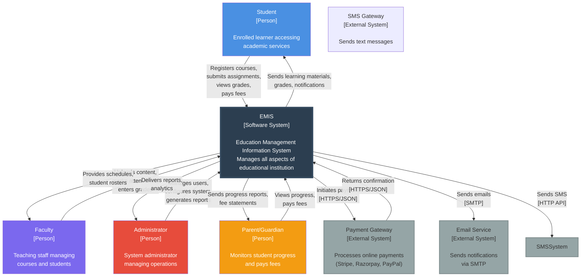
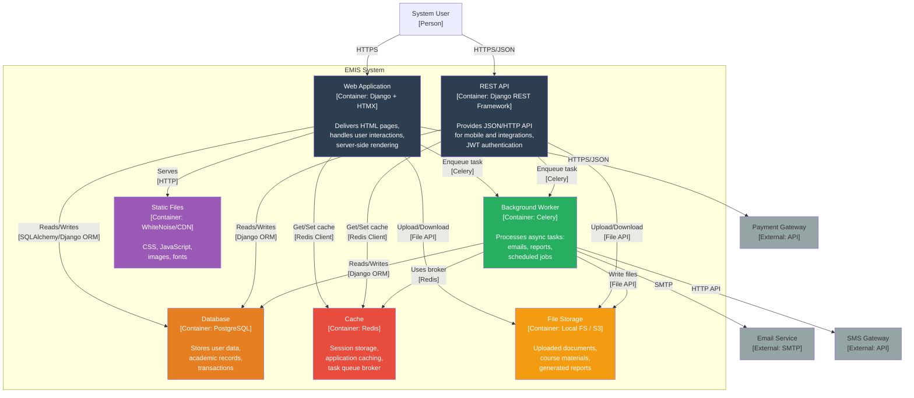
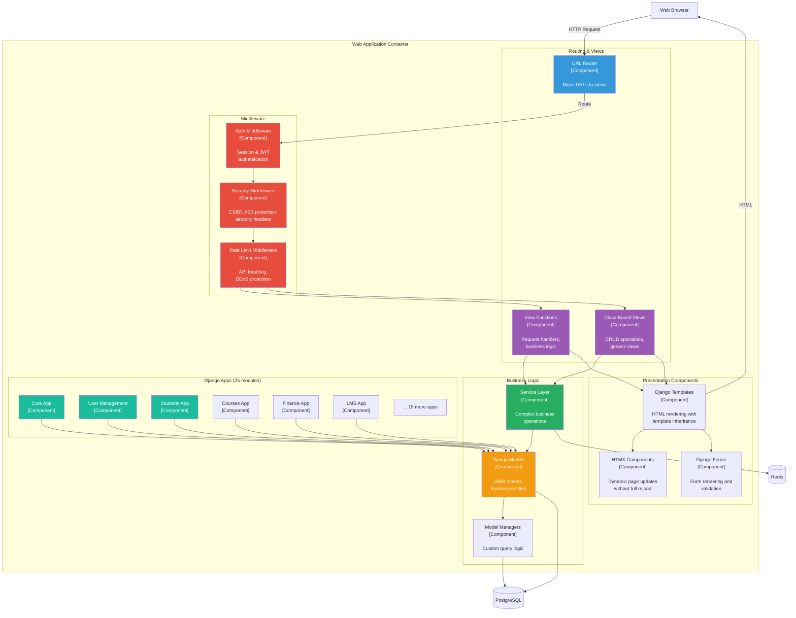
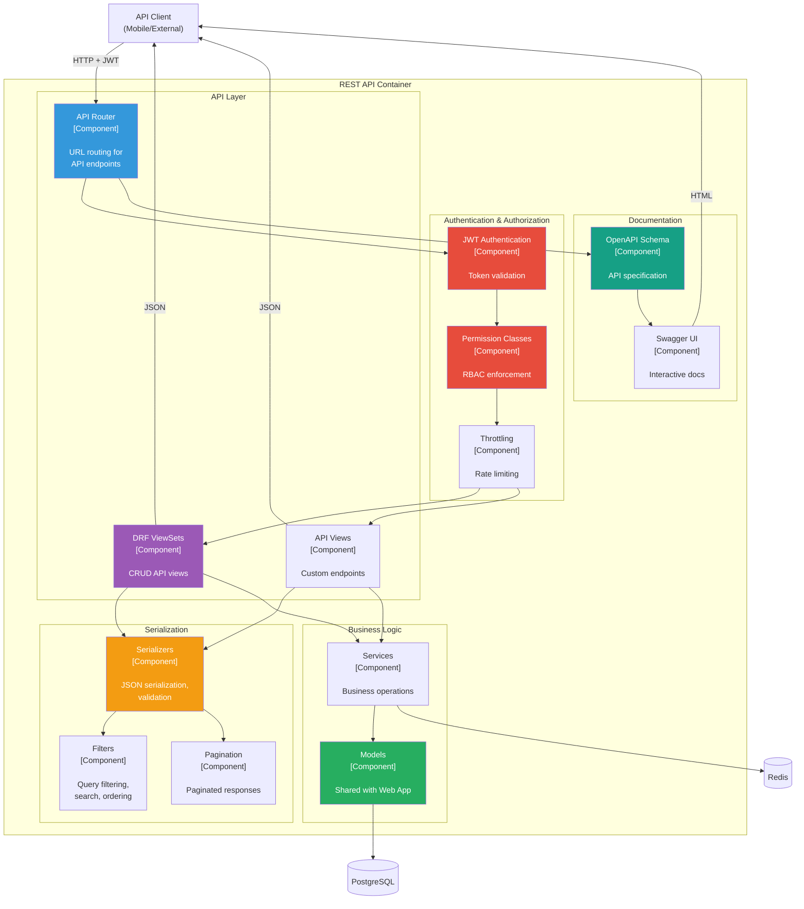
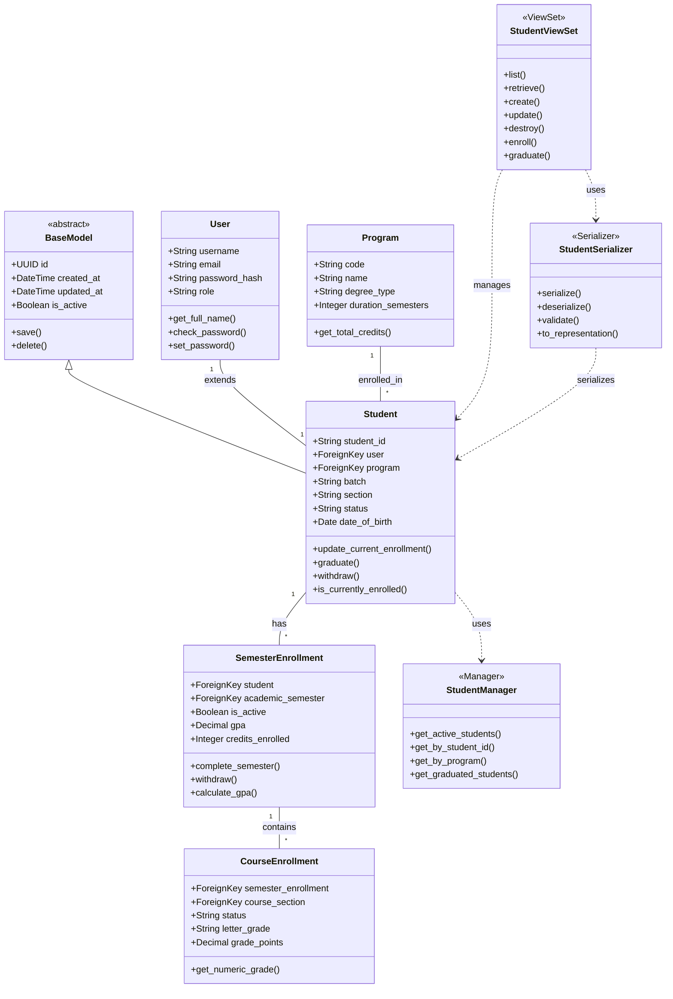
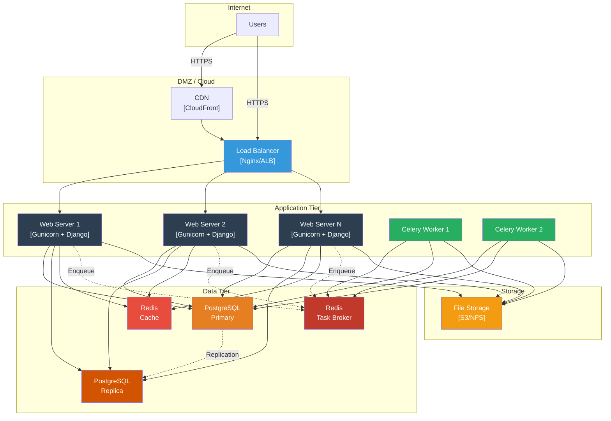

# EMIS - C4 Model Diagrams

## Overview

The C4 model provides a hierarchical set of architecture diagrams for EMIS, showing the system at different levels of abstraction: Context, Containers, Components, and Code.

## Level 1: System Context Diagram

Shows how EMIS fits into the wider ecosystem and its interactions with users and external systems.

## Level 2: Container Diagram

Shows the high-level technology choices and how containers communicate.

## Level 3: Component Diagram - Web Application

Shows the major components within the Web Application container.

## Level 3: Component Diagram - REST API

Shows components within the REST API container.

## Level 4: Code Diagram - Student Model (Example)

Shows classes and their relationships for a specific component.

## Deployment View

Shows how the system is deployed in production.

## Summary

The C4 model provides comprehensive architecture documentation at 4 levels:

1. **Context (Level 1)**: System boundary and external dependencies
2. **Containers (Level 2)**: Major runtime components and their interactions
3. **Components (Level 3)**: Internal structure of containers
4. **Code (Level 4)**: Class-level design (example provided)

Additional views:
- **Deployment**: Physical/cloud infrastructure layout

This hierarchical approach allows stakeholders at different levels to understand the architecture at appropriate levels of detail:
- **Executives**: Context diagram
- **Technical Managers**: Container diagram
- **Architects**: Component diagram
- **Developers**: Code diagram
