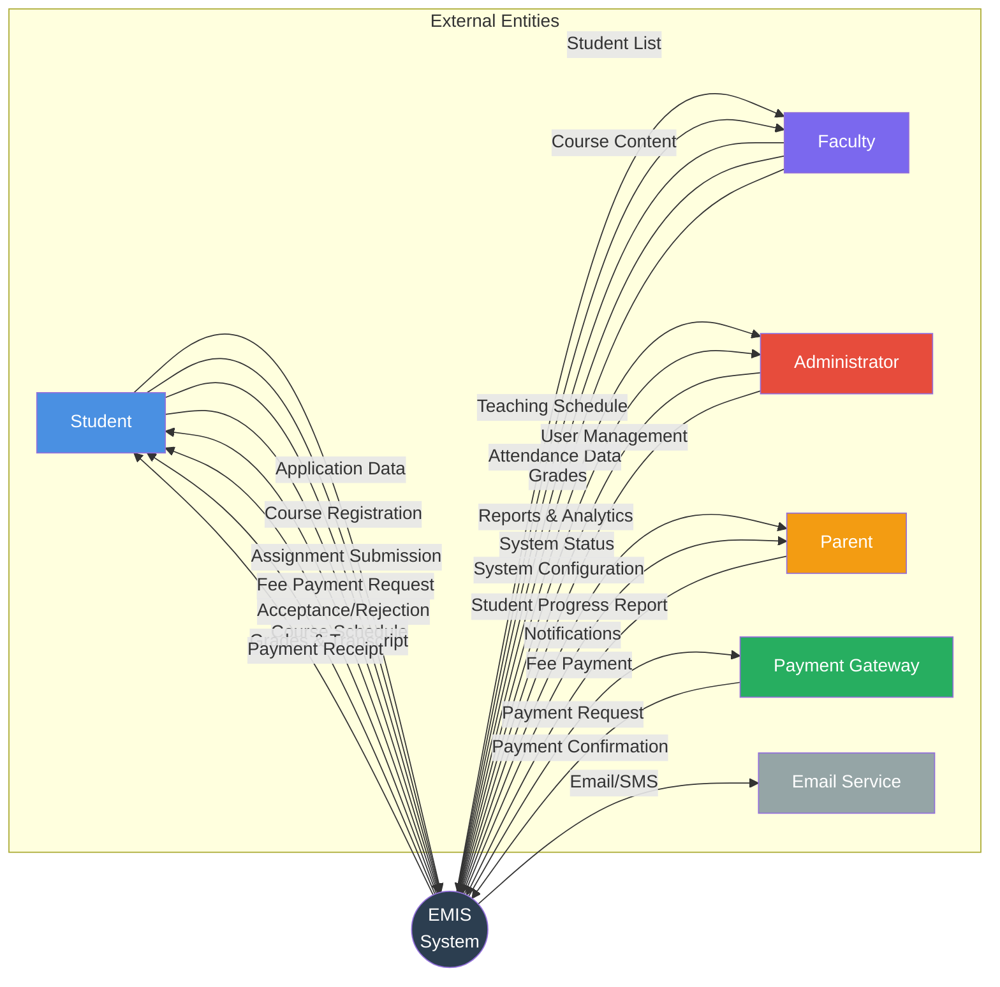
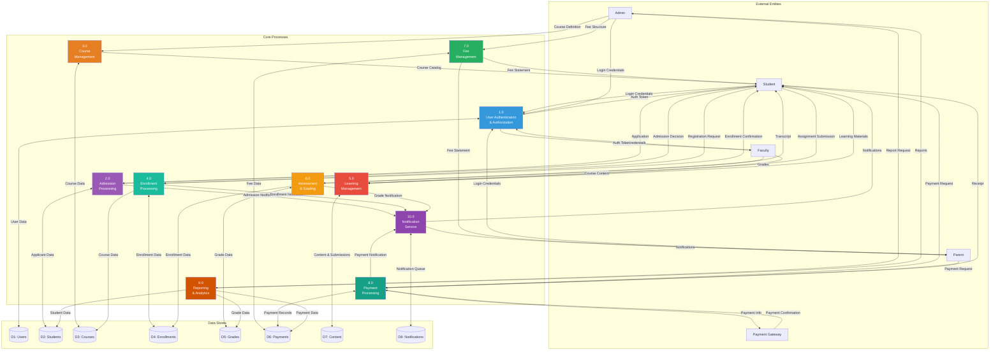
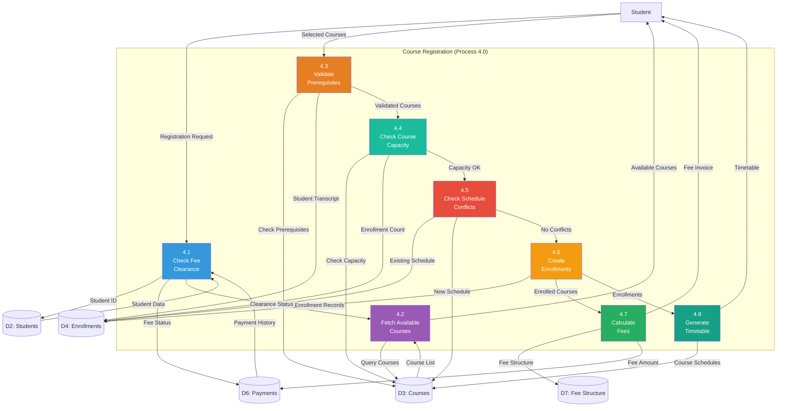
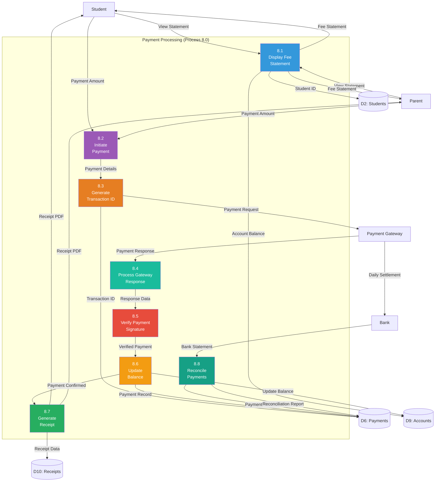
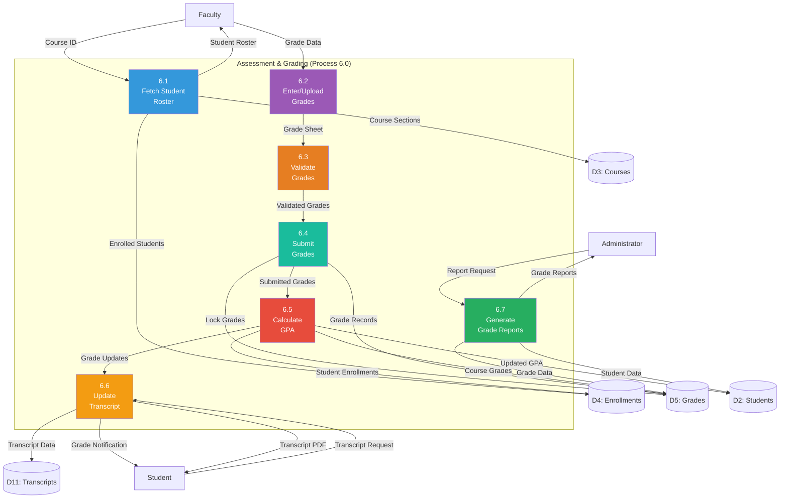

# EMIS - Data Flow Diagrams

## Overview

Data Flow Diagrams (DFD) show how data moves through the EMIS system, transforming as it flows between processes, data stores, and external entities.

## Context Level DFD (Level 0)

## Level 1 DFD - Major Processes

## Level 2 DFD - Course Registration Process

## Level 2 DFD - Payment Processing

## Level 2 DFD - Grade Processing

## Data Store Descriptions

| Store ID | Name | Description | Key Entities |
|----------|------|-------------|--------------|
| D1 | Users | All system users | User accounts, roles, permissions |
| D2 | Students | Student records | Student profiles, status, academic info |
| D3 | Courses | Course catalog | Programs, courses, sections, schedules |
| D4 | Enrollments | Student enrollments | Semester enrollments, course enrollments |
| D5 | Grades | Assessment data | Grades, GPA, exam results |
| D6 | Payments | Financial transactions | Payments, transactions, receipts |
| D7 | Content | Learning materials | Course content, assignments, submissions |
| D8 | Notifications | Communication queue | Notifications, announcements, emails |
| D9 | Accounts | Student accounts | Balances, fee structures, invoices |
| D10 | Receipts | Payment receipts | Receipt PDFs, payment confirmations |
| D11 | Transcripts | Academic transcripts | Transcript records, certificates |

## Data Flow Characteristics

### Input Data Flows
- **User Input**: Forms, file uploads, selections
- **External Services**: Payment confirmations, email delivery status
- **System Generated**: Auto-calculated values, timestamps

### Processing Data Flows
- **Validation**: Data verification and business rule enforcement
- **Transformation**: Data format conversion, calculations
- **Enrichment**: Adding computed fields, lookups

### Output Data Flows
- **User Output**: HTML pages, PDFs, JSON responses
- **External Services**: Email/SMS content, payment requests
- **Storage**: Database writes, file saves

### Control Flows
- **Authentication**: User login, token validation
- **Authorization**: Permission checks, role verification
- **Workflow**: State transitions, approval chains

## Data Transformation Examples

1. **Application to Student**:
   - Input: Application data
   - Transform: Validate, generate student ID, create user account
   - Output: Student record

2. **Course Registration to Enrollment**:
   - Input: Selected courses
   - Transform: Validate prerequisites, check capacity, resolve conflicts
   - Output: Enrollment records, timetable

3. **Grades to GPA**:
   - Input: Individual course grades
   - Transform: Calculate weighted average, determine letter grade
   - Output: Semester GPA, cumulative GPA

4. **Payment Request to Receipt**:
   - Input: Payment amount, method
   - Transform: Generate transaction ID, process payment, update balance
   - Output: Payment receipt, updated account

## Summary

The Data Flow Diagrams show:
- **Level 0**: System as a black box with external entities
- **Level 1**: Major processes and data stores
- **Level 2**: Detailed sub-processes for critical workflows

These diagrams help understand data movement, transformation points, and dependencies across the EMIS system, serving as a blueprint for implementation and integration.
