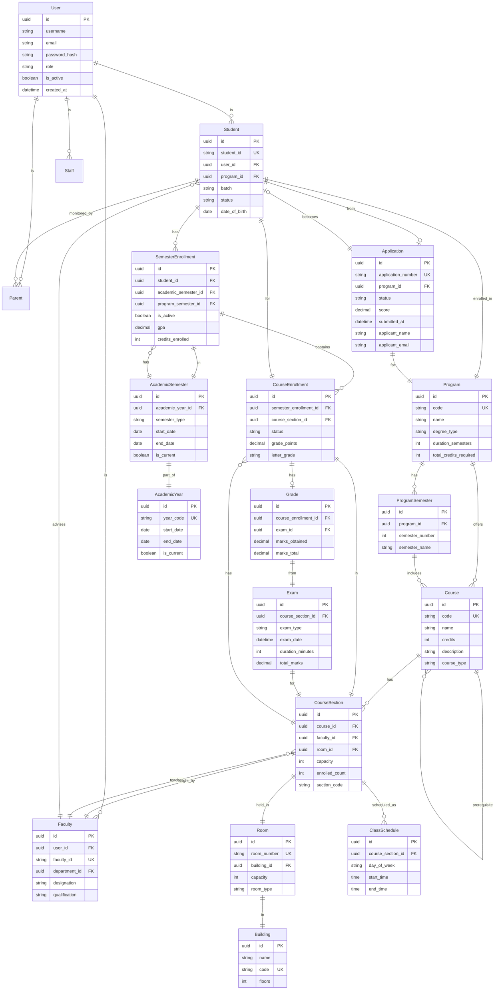
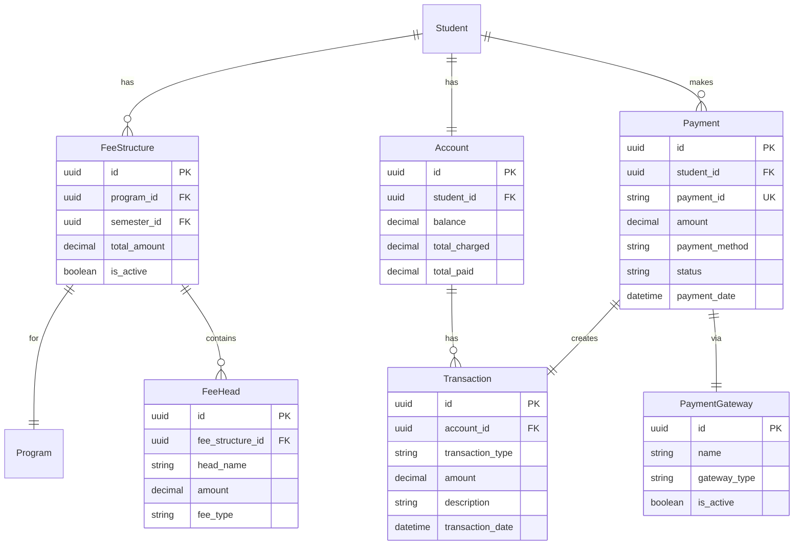
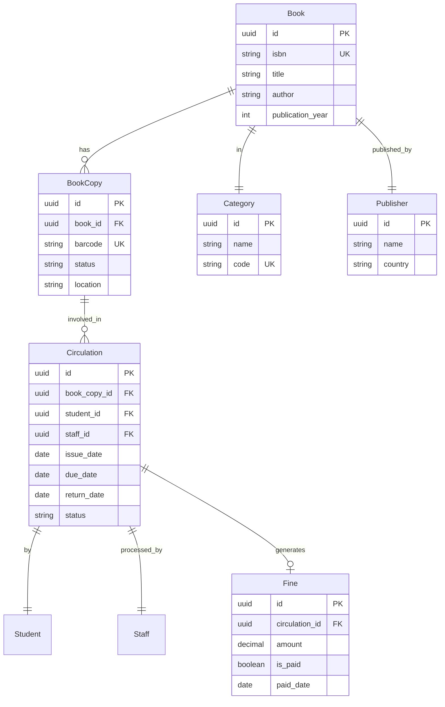
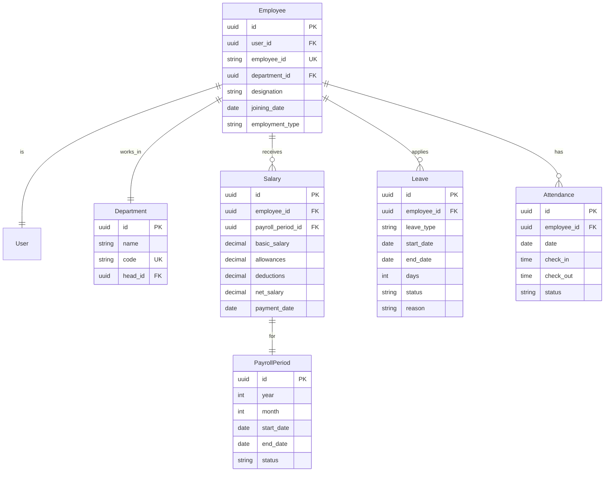
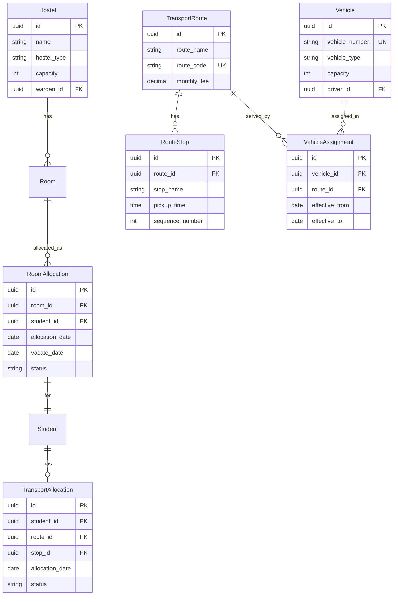
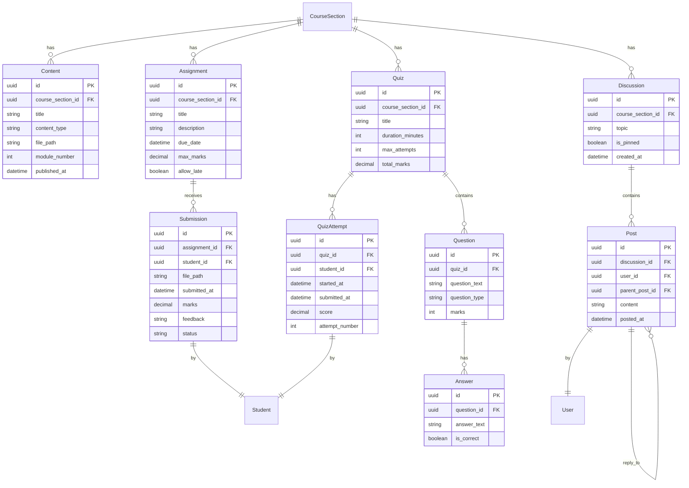
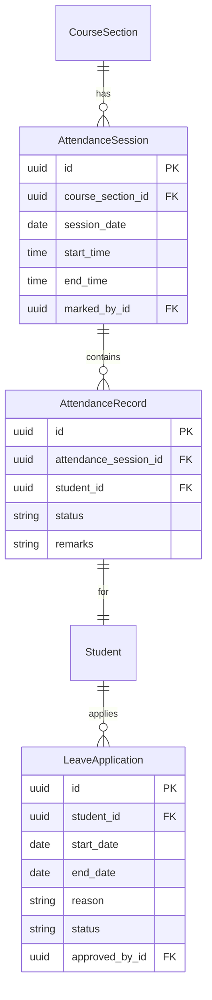
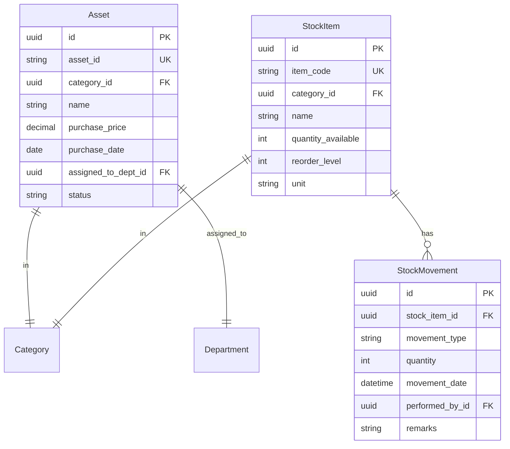
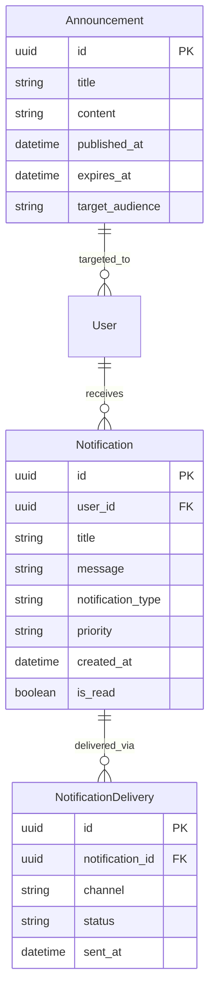

# EMIS - Domain Model

## Overview

The domain model represents the key business entities and their relationships in the EMIS system. This is a conceptual model focusing on the problem domain rather than technical implementation.

## Core Domain Model

## Financial Domain

## Library Domain

## HR Domain

## Hostel & Transport Domain

## LMS Domain

## Attendance Domain

## Inventory Domain

## Notification Domain

## Key Domain Concepts

### 1. User Hierarchy
- **User**: Base entity for all system users
- **Student, Faculty, Staff, Parent**: Specialized user types
- **Role-Based Access**: Each user type has specific permissions

### 2. Academic Structure
- **Program**: Degree program (e.g., BS Computer Science)
- **ProgramSemester**: Semesters within a program
- **Course**: Course offerings
- **CourseSection**: Specific instances of courses
- **SemesterEnrollment**: Student enrollment in a semester
- **CourseEnrollment**: Student enrollment in specific courses

### 3. Academic Calendar
- **AcademicYear**: Fiscal/academic year
- **AcademicSemester**: Fall, Spring, Summer semesters
- **Registration Period**: Time windows for course registration
- **Grading Period**: Windows for grade submission

### 4. Financial Flow
- **FeeStructure**: Defined fees per program/semester
- **Account**: Student financial account
- **Payment**: Fee payment transactions
- **Transaction**: All financial movements

### 5. Assessment
- **Exam**: Scheduled examinations
- **Grade**: Student exam/course grades
- **GPA Calculation**: Weighted average of grades

### 6. Learning Management
- **Content**: Course materials
- **Assignment**: Coursework submissions
- **Quiz**: Online assessments
- **Discussion**: Course forums

## Business Rules

1. **Student Enrollment**:
   - Student must be accepted before enrollment
   - Must clear previous semester dues
   - Cannot exceed maximum credit hours

2. **Course Registration**:
   - Prerequisites must be satisfied
   - No schedule conflicts allowed
   - Course capacity cannot be exceeded

3. **Grade Processing**:
   - Only assigned faculty can enter grades
   - Grades locked after submission
   - Changes require approval

4. **Fee Payment**:
   - Partial payments allowed if configured
   - Receipts generated automatically
   - Outstanding dues prevent registration

5. **Library Circulation**:
   - Maximum borrowing limit enforced
   - Fines calculated for overdue books
   - Outstanding fines prevent new borrowing

6. **Attendance**:
   - Minimum attendance percentage required
   - Authorized absences don't count Against percentage
   - Low attendance triggers warnings

## Summary

The domain model captures the core business concepts and their relationships across all major modules of EMIS. It provides a shared vocabulary for developers, business analysts, and stakeholders while serving as the foundation for database design and API contracts.
