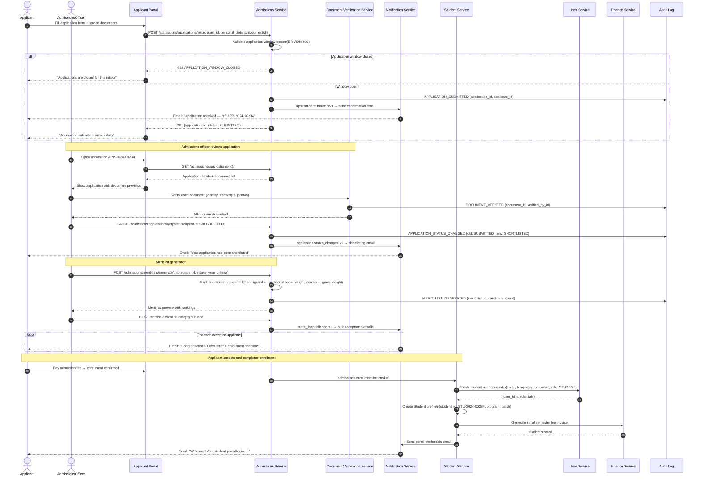
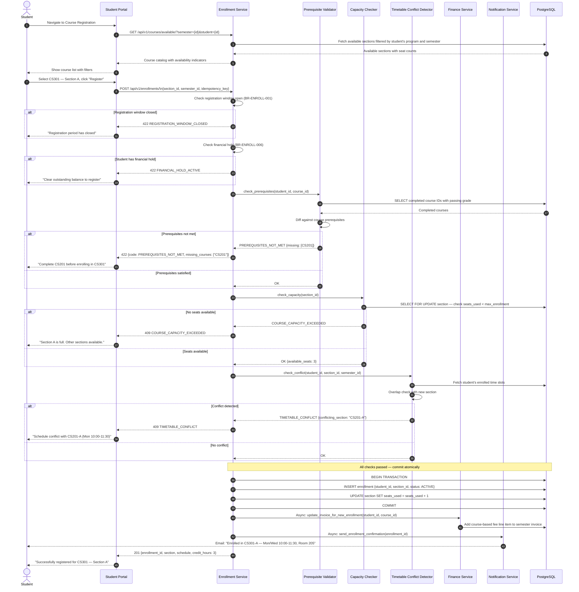
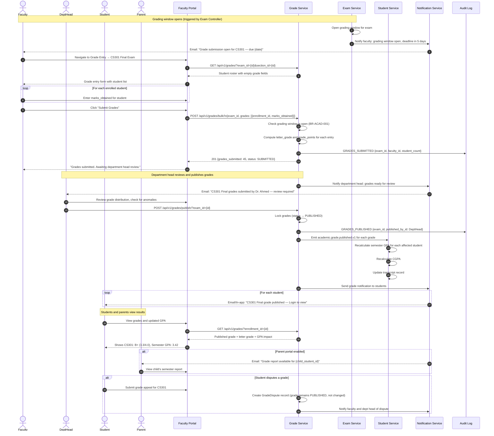
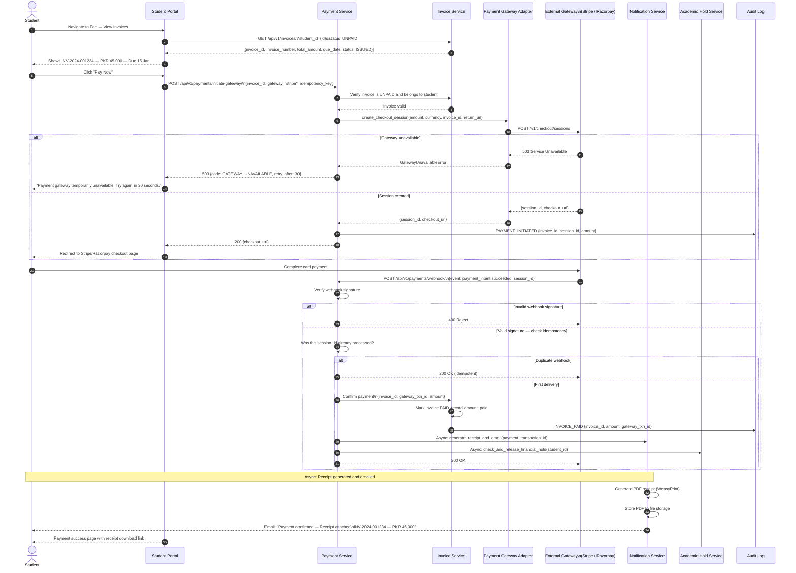
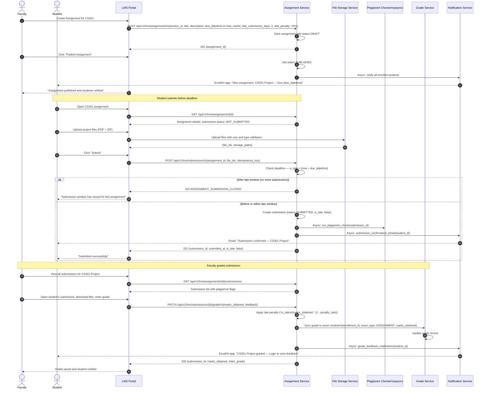
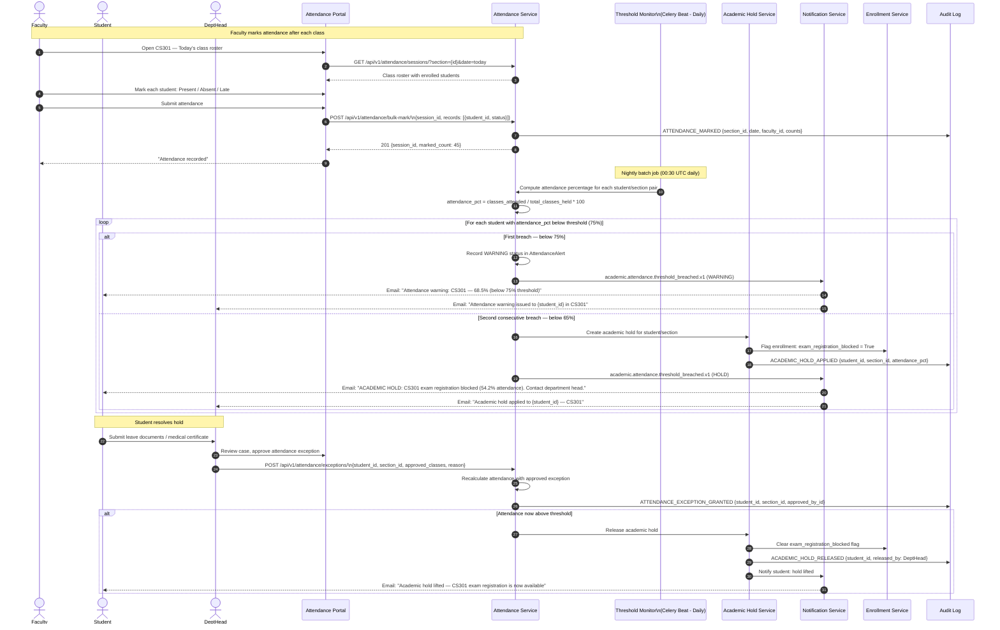

# System Sequence Diagrams — Education Management Information System

This document captures the six primary cross-module system sequences that span multiple EMIS domains. Each sequence shows all participating actors, services, and external systems — covering the happy path and key error branches — along with the audit events emitted at critical steps.

---

## 1. Student Admissions Workflow

Covers the full lifecycle from online application submission through document verification, merit list generation, acceptance, and formal student enrollment.

---

## 2. Course Registration Workflow

Covers the complete course registration flow with prerequisite validation, seat availability check, timetable conflict detection, and fee invoice update.

---

## 3. End-of-Semester Grade Processing

Covers faculty grade entry, department head review, grade lock, GPA recalculation, transcript update, and notifications to students and parents.

---

## 4. Fee Payment Workflow

Covers invoice viewing, payment gateway initiation, confirmation via webhook, receipt generation, and financial hold release.

---

## 5. LMS Assignment Lifecycle

Covers assignment creation by faculty, student submissions, plagiarism check, grading, and grade sync with the exam module.

---

## 6. Attendance-to-Academic-Hold Workflow

Covers daily attendance marking, cumulative threshold monitoring, warning issuance, and automatic academic hold enforcement.

