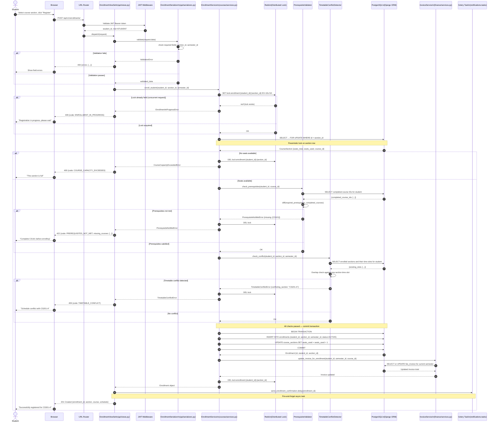
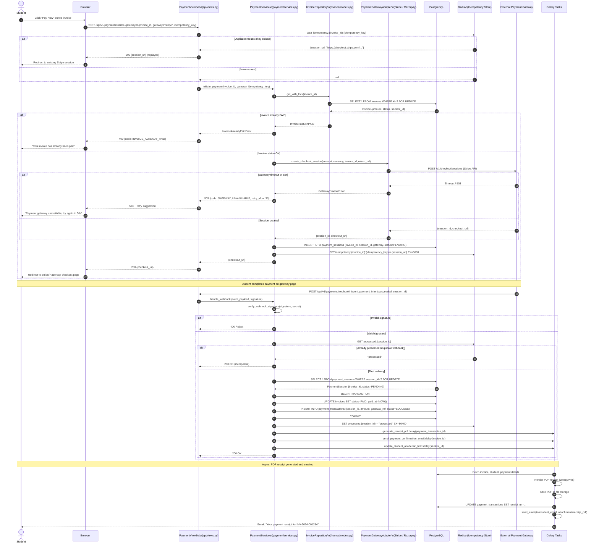
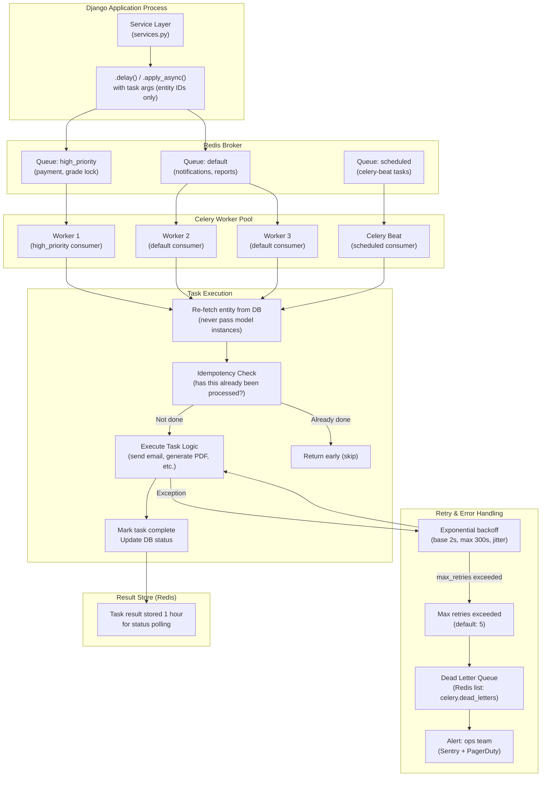

# C4 Code Diagram — Education Management Information System

This document maps EMIS code modules, their dependencies, and the runtime execution paths for the two most critical operations: student course enrollment and fee payment processing.

---

## 1. Code-Level Module Structure

```mermaid
flowchart TB
    subgraph Transport["Transport Layer — HTTP / HTMX / DRF"]
        URLRouter["URL Router\n(urls.py + DRF Router)"]
        ViewSets["DRF ViewSets\n(api/views.py)"]
        TemplateViews["Django Template Views\n(views.py)"]
        Serializers["DRF Serializers\n(api/serializers.py)"]
        Permissions["Permission Classes\n(api/permissions.py)"]
        Middleware["Auth Middleware\n(JWT + Session)"]
    end

    subgraph Application["Application Layer — Business Logic"]
        EnrollmentService["EnrollmentService\n(courses/services.py)"]
        GradeService["GradeService\n(exams/services.py)"]
        PaymentService["PaymentService\n(payment/services.py)"]
        NotificationService["NotificationService\n(notifications/services.py)"]
        ReportService["ReportService\n(reports/services.py)"]
        AttendanceService["AttendanceService\n(attendance/services.py)"]
        AdmissionsService["AdmissionsService\n(admissions/services.py)"]
        InvoiceService["InvoiceService\n(finance/services.py)"]
    end

    subgraph Domain["Domain Layer — Models & Business Rules"]
        StudentModel["Student Model\n(students/models.py)"]
        CourseModel["Course / Section Model\n(courses/models.py)"]
        EnrollmentModel["Enrollment Model\n(courses/models.py)"]
        ExamModel["Exam / Grade Model\n(exams/models.py)"]
        InvoiceModel["Invoice / Payment Model\n(finance/models.py)"]
        UserModel["User / Role Model\n(users/models.py)"]
        NotifModel["Notification Model\n(notifications/models.py)"]
    end

    subgraph Infrastructure["Infrastructure Layer — I/O Adapters"]
        ORM["Django ORM\n(PostgreSQL)"]
        RedisCache["Redis Cache\n(django-redis)"]
        CeleryTasks["Celery Task Dispatcher\n(.delay() / .apply_async())"]
        StripeAdapter["Stripe Adapter\n(payment/adapters/stripe.py)"]
        RazorpayAdapter["Razorpay Adapter\n(payment/adapters/razorpay.py)"]
        EmailAdapter["Email Adapter\n(SMTP via django.core.mail)"]
        SMSAdapter["SMS Adapter\n(notifications/adapters/sms.py)"]
        FileAdapter["File Storage Adapter\n(local / S3)"]
        PDFGenerator["PDF Generator\n(weasyprint / reportlab)"]
    end

    %% Transport → Application
    ViewSets --> Serializers
    ViewSets --> Permissions
    ViewSets --> Middleware
    ViewSets --> EnrollmentService
    ViewSets --> GradeService
    ViewSets --> PaymentService
    ViewSets --> InvoiceService
    ViewSets --> NotificationService
    ViewSets --> ReportService
    TemplateViews --> EnrollmentService
    TemplateViews --> GradeService

    %% Application → Domain
    EnrollmentService --> StudentModel
    EnrollmentService --> CourseModel
    EnrollmentService --> EnrollmentModel
    GradeService --> ExamModel
    GradeService --> StudentModel
    PaymentService --> InvoiceModel
    InvoiceService --> InvoiceModel
    InvoiceService --> StudentModel
    NotificationService --> NotifModel
    AdmissionsService --> StudentModel
    AttendanceService --> StudentModel

    %% Domain → Infrastructure
    StudentModel --> ORM
    CourseModel --> ORM
    EnrollmentModel --> ORM
    ExamModel --> ORM
    InvoiceModel --> ORM
    UserModel --> ORM
    NotifModel --> ORM

    %% Application → Infrastructure (direct)
    EnrollmentService --> RedisCache
    PaymentService --> StripeAdapter
    PaymentService --> RazorpayAdapter
    PaymentService --> CeleryTasks
    NotificationService --> EmailAdapter
    NotificationService --> SMSAdapter
    NotificationService --> CeleryTasks
    ReportService --> PDFGenerator
    ReportService --> CeleryTasks
    InvoiceService --> CeleryTasks
    GradeService --> CeleryTasks

    style Transport fill:#4A90E2,color:#fff,stroke:#357ABD
    style Application fill:#7B68EE,color:#fff,stroke:#6A5ACD
    style Domain fill:#27AE60,color:#fff,stroke:#229954
    style Infrastructure fill:#E67E22,color:#fff,stroke:#D35400
```

---

## 2. Critical Runtime Sequence: Student Course Registration

This sequence shows every internal component involved in a successful course registration, including the distributed lock, prerequisite check, timetable conflict detection, transactional enrollment creation, invoice update, and async notification dispatch.

---

## 3. Critical Runtime Sequence: Fee Payment Processing

This sequence shows the complete payment saga including gateway session creation, webhook callback handling, idempotency checks, receipt generation, and audit logging.

---

## 4. Django App Dependency Graph

This diagram shows which apps may import from which other apps. Arrows represent allowed imports. **Circular dependencies are prohibited.**

```mermaid
flowchart TB
    subgraph Foundation["Foundation (no upstream dependencies)"]
        core["core\n(BaseModel, utils, middleware)"]
        users["users\n(User, Role, Permission, RBAC)"]
    end

    subgraph Academic["Academic Core"]
        courses["courses\n(Program, Course, Section, Enrollment)"]
        students["students\n(Student, SemesterEnrollment)"]
        admissions["admissions\n(Application, MeritList)"]
        faculty["faculty\n(Faculty, TeachingLoad)"]
        timetable["timetable\n(Slot, RoomAllocation)"]
    end

    subgraph Assessment["Assessment"]
        exams["exams\n(Exam, Grade, GPA)"]
        attendance["attendance\n(AttendanceRecord, Leave)"]
    end

    subgraph Finance["Finance & HR"]
        finance["finance\n(FeeStructure, Invoice)"]
        payment["payment\n(PaymentSession, Transaction)"]
        hr["hr\n(Employee, Payroll, Leave)"]
        inventory["inventory\n(Asset, Stock, PurchaseOrder)"]
    end

    subgraph Services["Service Modules"]
        lms["lms\n(Module, Content, Assignment, Quiz)"]
        library["library\n(Book, Issue, Fine)"]
        hostel["hostel\n(Room, Allocation, Mess)"]
        transport["transport\n(Route, Vehicle, Allocation)"]
    end

    subgraph Output["Output & Communication"]
        notifications["notifications\n(Notification, Template)"]
        analytics["analytics\n(Dashboard, Metric)"]
        reports["reports\n(Report, Schedule)"]
        cms["cms\n(Page, Article, Media)"]
        seo["seo\n(MetaTag, Sitemap)"]
        calendar["calendar\n(Event, AcademicCalendar)"]
        portal["portal\n(StudentPortal, FacultyPortal)"]
        files["files\n(Document, StoredFile)"]
    end

    %% Foundation dependencies
    users --> core
    courses --> core
    courses --> users
    students --> core
    students --> users
    students --> courses
    admissions --> core
    admissions --> users
    admissions --> courses
    admissions --> students
    faculty --> core
    faculty --> users
    timetable --> core
    timetable --> courses
    timetable --> faculty

    %% Assessment dependencies
    exams --> core
    exams --> courses
    exams --> students
    exams --> timetable
    attendance --> core
    attendance --> courses
    attendance --> students

    %% Finance dependencies
    finance --> core
    finance --> students
    finance --> courses
    payment --> core
    payment --> finance
    hr --> core
    hr --> users
    inventory --> core

    %% Service module dependencies
    lms --> core
    lms --> courses
    lms --> students
    library --> core
    library --> users
    hostel --> core
    hostel --> students
    transport --> core
    transport --> students

    %% Output dependencies
    notifications --> core
    notifications --> users
    analytics --> core
    analytics --> students
    analytics --> exams
    analytics --> attendance
    analytics --> finance
    reports --> core
    reports --> students
    reports --> exams
    reports --> finance
    portal --> core
    portal --> students
    portal --> exams
    portal --> finance
    portal --> attendance
    portal --> lms
    cms --> core
    seo --> core
    seo --> cms
    calendar --> core
    files --> core

    style Foundation fill:#27AE60,color:#fff
    style Academic fill:#4A90E2,color:#fff
    style Assessment fill:#7B68EE,color:#fff
    style Finance fill:#E67E22,color:#fff
    style Services fill:#E74C3C,color:#fff
    style Output fill:#95A5A6,color:#fff
```

---

## 5. Celery Task Execution Flow

---

## 6. Architectural Invariants

The following rules must **never** be violated. They are checked in code review and via architectural fitness functions in CI.

1. **Services never import from the API layer.** `services.py` must not import from `api/views.py`, `api/serializers.py`, or `api/permissions.py`. The dependency arrow is strictly one-way: Transport → Application → Domain → Infrastructure.

2. **Models never call Services.** Django model methods may compute derived values from their own fields, but must never call service layer functions or Celery tasks. Side effects belong in `signals.py` (for framework-level reactions) or `services.py` (for business-triggered reactions).

3. **Tasks are always idempotent.** Every Celery task must handle the case where it is executed more than once with the same input. The first execution produces the side effect; subsequent executions detect the prior execution and return early without repeating the side effect.

4. **Tasks receive only IDs, never model instances.** Model instances are not serializable across process boundaries. Tasks always receive UUIDs/strings and re-fetch the entity inside the task body.

5. **No circular app imports.** The dependency graph above is the law. If app A imports from app B, then app B must not import from app A directly or transitively. Violations are caught by `import-linter` in CI.

6. **Transaction.atomic wraps all multi-table writes.** Any service operation that writes to more than one database table must be wrapped in `django.db.transaction.atomic()`. Partial writes that leave the database in an inconsistent state are not acceptable.

7. **All database writes to sensitive tables are audited.** Writes to: `grades`, `gpa_records`, `fee_invoices`, `payments`, `student_status_history`, `user_roles`, `payroll_records` must insert a corresponding row into `core_audit_log` within the same transaction.
