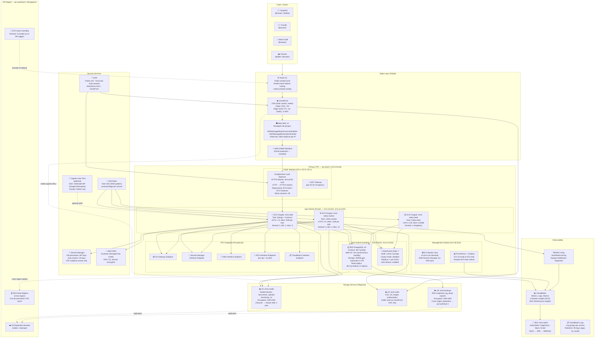

# Cloud Architecture — Education Management Information System

---

## Document Scope

| Field              | Value                                                                 |
|--------------------|-----------------------------------------------------------------------|
| **Version**        | 1.0.0                                                                 |
| **Last Updated**   | 2025                                                                  |
| **Owner**          | Cloud Platform / Architecture Team                                    |
| **Primary Region** | `ap-south-1` (Mumbai, India)                                          |
| **DR Region**      | `ap-southeast-1` (Singapore)                                          |
| **Classification** | Internal — Infrastructure Sensitive                                   |
| **Compliance**     | FERPA (20 U.S.C. § 1232g), ISO/IEC 27001:2022, SOC 2 Type II (target), PDPA |
| **Review Cycle**   | Quarterly or post major architecture change                           |

> **Data Residency Notice:** Student personally identifiable information (PII) must remain within the designated AWS region(s). Cross-region replication for DR purposes must use encrypted channels and comply with applicable data residency regulations. Review legal requirements before enabling any inter-region data transfers.

---

## 1. AWS Services Topology



---

## 2. Service Selection Rationale

| AWS Service | Role in EMIS | Why Chosen | Alternatives Considered |
|---|---|---|---|
| **ECS Fargate** | Container runtime for Django app + Celery | No EC2 management, per-task billing, integrates with ALB, IAM task roles, easy rolling deploys | EC2 Auto Scaling Group (more control, lower cost at scale), EKS (too complex for team size) |
| **RDS PostgreSQL Multi-AZ** | Primary relational database | Managed failover, automated backups, Performance Insights, point-in-time recovery built-in | Self-managed PostgreSQL on EC2 (operational burden), Aurora PostgreSQL (higher cost for this workload) |
| **ElastiCache Redis** | Django cache + Celery broker | Managed Redis with auto-failover, sub-millisecond latency, no ops overhead | Amazon MemoryDB (stronger durability but overkill for cache), SQS (not suitable for caching) |
| **ALB** | Layer 7 load balancing | Path-based routing, WebSocket support (future), native ECS integration, health checks, sticky sessions | NLB (Layer 4 only, no HTTP routing), Nginx on EC2 (extra ops) |
| **CloudFront** | CDN for static files and media delivery | Global PoPs reduce latency for students across regions, Origin Access Control for S3, cache policies | Cloudflare (viable alternative, not AWS-native), no CDN (poor performance for distant users) |
| **Route 53** | DNS with failover routing | Integrates with ALB, CloudFront, health checks; supports failover to DR region | Cloudflare DNS (not AWS-native), raw DNS registrar |
| **AWS WAF v2** | Web application firewall | Managed rule sets, rate limiting, SQL injection protection, integrates with CloudFront and ALB | ModSecurity (self-managed), Cloudflare WAF |
| **S3** | Media files, static assets, backups | Durability 99.999999999%, versioning, lifecycle policies, cross-region replication, signed URLs | EFS (block storage, higher cost for objects), MinIO self-hosted |
| **Secrets Manager** | Database credentials, API keys | Auto-rotation, VPC endpoint (no internet exposure), fine-grained IAM, audit trail via CloudTrail | SSM Parameter Store (no auto-rotation), HashiCorp Vault (self-managed) |
| **KMS (CMK)** | Encryption key management | Centralised key control, automatic rotation, integrates with S3, RDS, Secrets Manager, CloudWatch | AWS managed keys (less control), self-managed keys on EC2 |
| **ACM** | TLS certificate management | Free, auto-renews, attaches to ALB and CloudFront, no manual cert management | Let's Encrypt on Nginx (requires certbot automation), commercial CA |
| **CloudWatch + X-Ray** | Metrics, logs, tracing | Native integration with all AWS services, Container Insights for ECS, no extra infra | Datadog (cost), Prometheus on EC2 (self-managed), Grafana Cloud |
| **SNS** | Alerting fan-out | Decouple alarm generation from notification delivery; supports Email, HTTP, SQS, Lambda targets | SES only (email only), direct webhook (no retry) |
| **IAM + IRSA** | Service identity and access | Task-level IAM roles (no long-lived credentials), least-privilege per ECS task definition | Environment variable credentials (insecure), shared IAM users |

---

## 3. Multi-AZ Configuration

### RDS PostgreSQL Multi-AZ

```
Primary:  ap-south-1a  — db.r7g.large (2 vCPU, 16GB RAM)
Standby:  ap-south-1b  — Synchronous standby (same spec)
Replica:  ap-south-1c  — db.r7g.medium (read-only, async replication)

Failover:    Automatic (60–120 seconds)
Failover trigger: Primary AZ failure, primary host failure, storage failure
Connection:  Via RDS endpoint (DNS flips on failover)
Read routing: Django DATABASE_ROUTERS → replica for read-only queries
```

### ElastiCache Redis Multi-AZ

```
Cluster mode: Disabled (single shard)
Primary:      ap-south-1a  — cache.r7g.large (2 vCPU, 13.07GB RAM)
Read replica: ap-south-1b  — cache.r7g.medium

Auto failover: Enabled (< 30 seconds)
Multi-AZ:      Enabled
Backup:        Daily snapshot at 03:00 UTC, 5-day retention
```

### ECS Fargate Multi-AZ

```
Subnets:    3 private subnets across ap-south-1a, ap-south-1b, ap-south-1c
Spread:     ECS spread placement strategy (AZ balance)
ALB:        Spans all 3 AZs automatically
Min tasks:  2 (ensures at least 1 per 2 AZs during updates)
```

---

## 4. Auto Scaling Configuration

### ECS Service Auto Scaling — emis-web

```
Scaling Policy Type:   Target Tracking
Target Metric:         ECSServiceAverageCPUUtilization
Target Value:          70%
Scale-out cooldown:    60 seconds
Scale-in cooldown:     300 seconds
Min capacity:          2
Max capacity:          8
Desired (baseline):    2

Additional Policy:
Target Metric:         ALBRequestCountPerTarget
Target Value:          500 requests per minute per task
```

### ECS Service Auto Scaling — emis-celery-worker

```
Scaling Policy Type:   Step Scaling (queue depth)
Metric:                Custom CloudWatch metric: CeleryQueueDepth
                       (published by Celery Flower or Prometheus exporter)
Scale-out:
  +1 task when queue depth > 50 (1 min sustained)
  +2 tasks when queue depth > 200 (1 min sustained)
Scale-in:
  -1 task when queue depth < 10 (5 min sustained)
Min capacity:          3 (one per queue)
Max capacity:          12
```

### RDS Storage Auto Scaling

```
Enabled:             Yes
Maximum storage:     1000 GB
Threshold:           10% free storage remaining
```

---

## 5. Cost Optimization

### Reserved Instances / Savings Plans

| Resource | Strategy | Expected Saving |
|---|---|---|
| ECS Fargate (web tasks, 2 always-on) | Compute Savings Plan (1-year, no upfront) | ~36% vs on-demand |
| RDS PostgreSQL primary | Reserved Instance (1-year, partial upfront) | ~40% vs on-demand |
| ElastiCache Redis primary | Reserved node (1-year) | ~38% vs on-demand |
| EC2 Bastion + Prometheus | On-demand (t3.micro/small) — minimal cost | N/A |

### Celery Workers on Fargate Spot

```
emis-celery-worker:
  - Capacity provider: FARGATE_SPOT (70%) + FARGATE (30%)
  - FARGATE_SPOT is ~70% cheaper
  - Workers are stateless and fault-tolerant (tasks re-queued on interruption)
  - Celery's acks_late=True + task idempotency required
  - Expected saving: ~50% on worker compute cost
```

### S3 Lifecycle Policies

```
Bucket: emis-media
  - Current objects → S3 Standard (0–90 days)
  - → S3 Standard-IA (91–365 days)     [~40% cheaper than Standard]
  - → S3 Glacier Instant Retrieval (366+ days)  [~68% cheaper than Standard]
  - Delete old non-current versions after 90 days

Bucket: emis-backups
  - → S3 Standard-IA after 30 days
  - → S3 Glacier Flexible Retrieval after 90 days
  - Expire (delete) after 365 days
```

### CloudFront Caching

```
Static assets (CSS/JS/images):
  Cache-Control: max-age=31536000, immutable
  CloudFront TTL: 1 year
  Expected cache hit ratio: > 95%

Media files (student photos, documents):
  Served via CloudFront signed URLs (private distribution)
  Cache TTL: 24 hours for thumbnails, 0 for sensitive documents

API responses:
  Cache-Control: no-store
  CloudFront: bypass cache (cache policy: CachingDisabled)
```

### Data Transfer Optimization

- Use VPC endpoints for S3, ECR, Secrets Manager → eliminates NAT Gateway data processing charges for these services (~$0.045/GB saving)
- CloudFront serves static files globally → reduces ALB + ECS egress charges
- Enable S3 Transfer Acceleration only if cross-region uploads are required

---

## 6. DR Strategy — Warm Standby

### Architecture

```
Primary Region:   ap-south-1 (Mumbai)      — Active, serving all traffic
DR Region:        ap-southeast-1 (Singapore) — Warm standby
```

### DR Component States

| Component | Normal State (ap-south-1) | DR State (ap-southeast-1) | Activation Method |
|---|---|---|---|
| Route 53 | Routes 100% to primary ALB | Health check triggers failover | Automatic (R53 health check < 3 intervals) |
| CloudFront | Origin: primary ALB + S3 | Origin group: DR ALB as secondary | Automatic (origin failover policy) |
| ECS (web) | 2–8 tasks running | 0 tasks (scale to 2 on trigger) | Manual or Lambda trigger |
| ECS (workers) | 3–12 tasks running | 0 tasks | Manual |
| RDS | Primary + standby in AZs | Cross-region read replica (promote) | Manual — promote replica (< 5 min) |
| ElastiCache | Primary + replica | Independent cluster (warm) | Manual restart with empty cache |
| S3 | Source of truth | Cross-region replication target (< 15 min lag) | Already available |

### RTO / RPO

| Target | Value |
|---|---|
| **RPO (Recovery Point Objective)** | ≤ 15 minutes (RDS cross-region replica lag + S3 replication lag) |
| **RTO (Recovery Time Objective)** | ≤ 2 hours (promote RDS replica, scale ECS tasks, validate, redirect traffic) |

### Failover Runbook (Summary)

```
1. DECLARE DR EVENT — On-call lead confirms primary region unavailable
2. RDS FAILOVER
   a. Promote cross-region read replica in ap-southeast-1 to standalone primary
   b. Update Secrets Manager entry in DR region with new DB endpoint
3. SCALE UP DR ECS
   a. Update ECS service desired count: emis-web → 2, emis-worker → 3
   b. ECS tasks pull latest image from ECR (mirrored to DR region)
4. DNS FAILOVER
   a. Route 53 health check should auto-trigger failover to DR ALB
   b. Manual override: update record set if auto-failover delayed
5. VALIDATE DR ENVIRONMENT
   a. Smoke test login, dashboard, report generation
   b. Verify Celery workers processing tasks
6. COMMUNICATE — Notify users of degraded mode / expected recovery
7. FAILBACK (when primary recovers)
   a. Sync any new data from DR RDS back to primary (pg_dump or logical replication)
   b. Drain DR, switch DNS back, verify
   c. Rebuild cross-region replica from new primary
```

---

## 7. Security Baseline

### IAM Least Privilege

```
ECS Task Role: emis-web-task-role
  Permissions:
  - s3:GetObject, s3:PutObject, s3:DeleteObject → emis-media bucket (prefix: media/*)
  - s3:GetObject → emis-static bucket
  - secretsmanager:GetSecretValue → emis/production/* secrets
  - kms:Decrypt → CMK ARN
  - xray:PutTraceSegments, xray:PutTelemetryRecords

ECS Task Role: emis-worker-task-role
  Permissions:
  - s3:GetObject, s3:PutObject → emis-media bucket (prefix: exports/*, media/*)
  - secretsmanager:GetSecretValue → emis/production/* secrets
  - kms:Decrypt → CMK ARN
  - ses:SendRawEmail (for email notifications)

ECS Execution Role: emis-ecs-execution-role (AWS managed: AmazonECSTaskExecutionRolePolicy)
  + ecr:GetAuthorizationToken, ecr:BatchGetImage (specific ECR repo)
  + secretsmanager:GetSecretValue (for injecting secrets as env vars)
  + logs:CreateLogStream, logs:PutLogEvents
```

### VPC Isolation

- All ECS tasks, RDS, and ElastiCache reside in private subnets with no direct internet access
- Egress via NAT Gateway only (required for external API calls, package installs during build)
- VPC endpoints eliminate internet exposure for S3, ECR, Secrets Manager, KMS, CloudWatch
- Security Groups enforce deny-by-default with explicit allow rules per tier (see `network-infrastructure.md`)

### Encryption

| Data Type | At Rest | In Transit |
|---|---|---|
| RDS database | AES-256 via KMS CMK | TLS 1.3 (enforce via `rds.force_ssl=1`) |
| ElastiCache | AES-256 (encryption at rest) | TLS (in-transit encryption enabled) |
| S3 objects | SSE-KMS (CMK per bucket) | HTTPS (TLS 1.2+ enforced via bucket policy) |
| Secrets Manager | KMS CMK | HTTPS (TLS 1.3 via VPC endpoint) |
| CloudWatch Logs | KMS CMK (log group encryption) | HTTPS |
| EBS volumes (EC2/Fargate) | AES-256 (default encryption account-wide) | N/A |

### Secret Rotation

```
Database credentials (RDS):
  - Secrets Manager auto-rotation: every 30 days
  - Rotation Lambda: AWS-provided SecretsManagerRDSPostgreSQLRotationSingleUser
  - Django reads secret at startup (cached in process; restart triggers fresh read)

API keys (3rd party):
  - Manual rotation process, quarterly review
  - Documented in EMIS security runbook

SECRET_KEY (Django):
  - Rotated on each deployment (generated fresh, stored in Secrets Manager)
  - No long-lived static secret key in production
```

### Security Tooling

- **AWS GuardDuty** — Threat detection (DNS exfiltration, EC2 compromise, IAM anomalies)
- **AWS Security Hub** — Aggregated findings, CIS AWS Foundations benchmark
- **AWS Config** — Track configuration changes, detect drift from compliance rules
- **AWS CloudTrail** — Full API audit log (S3 access, IAM changes, EC2 events) — 1-year retention
- **Amazon Inspector** — Container image vulnerability scanning (integrated with ECR)
- **AWS Macie** — S3 data classification (PII detection in uploaded files)

---

## 8. Estimated Monthly Infrastructure Cost (2000 Concurrent Users)

> **Note:** Estimates based on AWS `ap-south-1` (Mumbai) on-demand pricing as of 2025. Apply Savings Plans/Reserved Instance discounts where indicated. Actual costs vary with traffic patterns.

| Service | Configuration | Est. Monthly Cost (USD) | Notes |
|---|---|---|---|
| **ECS Fargate (web)** | 2–4 tasks avg × 1 vCPU × 2GB × 730h | ~$120–180 | With Compute Savings Plan |
| **ECS Fargate (workers)** | 3–6 tasks × 0.5 vCPU × 1GB, Fargate Spot 70% | ~$40–70 | Spot pricing |
| **RDS PostgreSQL** | db.r7g.large Multi-AZ + 1 read replica | ~$350–420 | With 1-year RI |
| **ElastiCache Redis** | cache.r7g.large + 1 replica | ~$120–150 | With 1-year reserved |
| **ALB** | ~5M requests/month + 10GB processed | ~$25–40 | |
| **CloudFront** | 100GB/month transfer + 10M requests | ~$15–25 | |
| **S3 (media + static + backups)** | 500GB storage + 50GB transfer | ~$15–20 | After lifecycle policies |
| **NAT Gateway** | 50GB/month data processing (2 AZs) | ~$70–90 | VPC endpoints reduce this |
| **Route 53** | 1 hosted zone + health checks | ~$5 | |
| **Secrets Manager** | 10 secrets × 30-day rotation | ~$5 | |
| **CloudWatch** | Logs + metrics + Container Insights | ~$30–50 | 90-day retention |
| **ECR** | 10GB image storage | ~$1 | |
| **WAF** | 1 WebACL + 5M requests | ~$15–20 | |
| **KMS** | 2 CMKs + API calls | ~$5 | |
| **Data Transfer** | ALB + EC2 egress ~20GB/month | ~$5–10 | CloudFront reduces direct egress |
| **EC2 (Bastion + Prometheus)** | 2× t3.small | ~$15 | |
| **SNS** | < 1M notifications/month | ~$1 | |
| **Misc (Config, GuardDuty, Inspector)** | Base charges | ~$20–30 | |
| | | | |
| **TOTAL (estimated)** | | **~$840–1,130 / month** | Before RI/SP discounts |
| **With Savings Plans + RI discounts** | | **~$580–790 / month** | ~30–35% overall saving |

---

## 9. Well-Architected Framework Alignment

| Pillar | EMIS Measures |
|---|---|
| **Operational Excellence** | IaC (Terraform/CDK), GitHub Actions CI/CD, CloudWatch dashboards, runbooks for each alarm |
| **Security** | WAF, GuardDuty, least-privilege IAM, encryption CMK, VPC isolation, secret rotation, MFA on AWS accounts |
| **Reliability** | Multi-AZ RDS + ElastiCache, ECS spread across AZs, R53 health-check failover, backup/restore tested quarterly |
| **Performance Efficiency** | CloudFront CDN, ElastiCache query caching, RDS read replica for reports, right-sized Fargate tasks |
| **Cost Optimization** | Savings Plans, Fargate Spot workers, S3 lifecycle, VPC endpoints (reduce NAT cost), CloudFront caching |
| **Sustainability** | Right-sizing (no idle over-provisioned servers), S3 Glacier for cold data, scale-to-zero Celery workers in off-peak hours |

---

*End of Cloud Architecture — EMIS Infrastructure v1.0*
