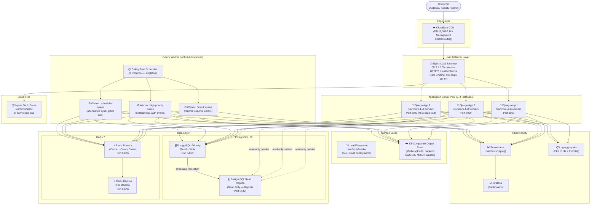
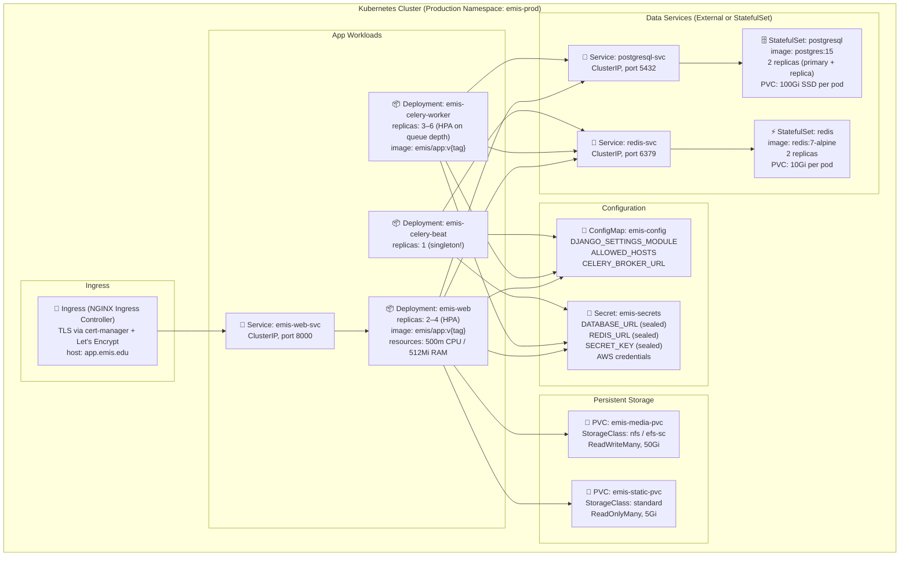
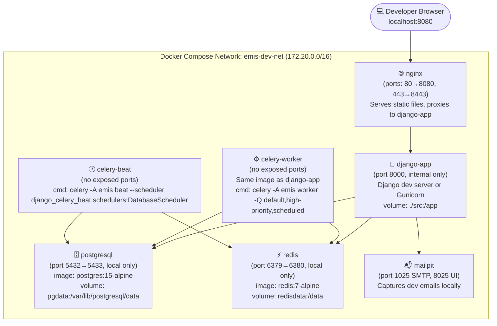

# Deployment Diagram — Education Management Information System

---

## Document Scope

| Field              | Value                                                                 |
|--------------------|-----------------------------------------------------------------------|
| **Version**        | 1.0.0                                                                 |
| **Last Updated**   | 2025                                                                  |
| **Owner**          | Platform / DevOps Team                                                |
| **Classification** | Internal — Infrastructure Sensitive                                   |
| **Compliance**     | FERPA (20 U.S.C. § 1232g), PDPA (Thailand / local equivalents), GDPR (if applicable), ISO/IEC 27001 |
| **Review Cycle**   | Quarterly or after any major infrastructure change                    |

> **Data Privacy Notice:** EMIS stores and processes student records, health data, and academic performance information that is subject to educational data privacy laws. All infrastructure components must enforce encryption at rest and in transit, role-based access control, and audit logging to comply with FERPA, PDPA, and applicable local regulations.

---

## 1. Production Deployment Topology

This diagram represents the recommended single-region production deployment on a Linux-based environment (bare-metal, VPS, or cloud IaaS). Cloud-managed variants (AWS/GCP/Azure) are covered in `cloud-architecture.md`.



---

## 2. Kubernetes Deployment Reference

For Kubernetes-based deployments, the following resource topology applies. Each Django app pod is stateless and can scale horizontally via HPA.



### Key Kubernetes Manifests Summary

| Resource | Name | Purpose |
|---|---|---|
| `Deployment` | `emis-web` | Stateless Django/Gunicorn pods |
| `Deployment` | `emis-celery-worker` | Celery multi-queue worker pods |
| `Deployment` | `emis-celery-beat` | Singleton scheduler (1 replica) |
| `HorizontalPodAutoscaler` | `emis-web-hpa` | Scale web pods on CPU ≥ 70% |
| `HorizontalPodAutoscaler` | `emis-worker-hpa` | Scale workers on Redis queue depth |
| `Ingress` | `emis-ingress` | TLS termination, path routing |
| `ConfigMap` | `emis-config` | Non-secret app configuration |
| `Secret` | `emis-secrets` | Sealed secrets (database, keys) |
| `PersistentVolumeClaim` | `emis-media-pvc` | Shared media storage (RWX) |
| `ServiceAccount` | `emis-sa` | Pod IAM identity (IRSA for S3) |
| `NetworkPolicy` | `emis-netpol` | Deny-by-default pod communication |

---

## 3. Docker Compose Topology (Development)



### Docker Compose Service Matrix

| Service | Image | Ports (host:container) | Volumes | Depends On |
|---|---|---|---|---|
| `nginx` | `nginx:1.25-alpine` | `8080:80`, `8443:443` | `./nginx/dev.conf:/etc/nginx/conf.d/default.conf`, `static_vol` | `django-app` |
| `django-app` | `emis/app:dev` | — (internal: 8000) | `./src:/app`, `media_vol` | `postgresql`, `redis` |
| `celery-worker` | `emis/app:dev` | — | `./src:/app`, `media_vol` | `postgresql`, `redis` |
| `celery-beat` | `emis/app:dev` | — | `./src:/app` | `postgresql`, `redis` |
| `postgresql` | `postgres:15-alpine` | `5433:5432` | `pgdata:/var/lib/postgresql/data` | — |
| `redis` | `redis:7-alpine` | `6380:6379` | `redisdata:/data` | — |
| `mailpit` | `axllent/mailpit` | `8025:8025`, `1025:1025` | — | — |

---

## 4. Scaling Strategy

| Component | Scaling Method | Trigger / Metric | Min | Max | Notes |
|---|---|---|---|---|---|
| **Django (Gunicorn workers)** | Vertical (workers per process) | CPU > 70% per pod | 2 workers | 8 workers | `--workers = (2 × CPU) + 1` |
| **Django App Pods / VMs** | Horizontal (HPA / new VMs) | CPU > 70% avg across pods | 2 pods | 8 pods | Stateless; scale freely |
| **Celery default queue** | Horizontal (worker replicas) | Queue depth > 50 tasks | 1 worker | 4 workers | General async tasks |
| **Celery high-priority queue** | Horizontal | Queue depth > 10 tasks | 1 worker | 4 workers | Notifications, auth events |
| **Celery scheduled queue** | Fixed | N/A (cron-driven) | 1 worker | 2 workers | Grade calc, attendance sync |
| **Celery Beat** | Not scaled | Singleton always | 1 | 1 | Leader election if K8s |
| **PostgreSQL Primary** | Vertical (instance size) | Slow query > 500ms avg | — | — | Scale up; add connection pooler (PgBouncer) first |
| **PostgreSQL Read Replica** | Horizontal (add replicas) | Replica lag > 100ms OR read load > 80% | 1 | 3 | Route report queries to replica |
| **Redis** | Vertical + replica | Memory usage > 75% | 1 primary | 1 primary + 2 replicas | Cluster mode if > 16GB |
| **Nginx LB** | Horizontal (active-active) | Connection count > 5000 | 1 | 2 | Keepalived for VIP failover |
| **Storage (S3/compatible)** | Transparent (object store) | N/A | — | Unlimited | Auto-scales |

---

## 5. Zero-Downtime Deployment Process

EMIS uses a rolling update strategy to ensure availability during deployments. No traffic is dropped during a production release.

### Pre-Deployment Checklist

- [ ] Database migrations are backward-compatible (never drop columns in the same release as the code that removes usage)
- [ ] Feature flags are used for breaking changes
- [ ] Release has passed CI checks (lint, tests, security scan)
- [ ] Backup completed and verified (see Section 6)

### Rolling Update Procedure

```
Step 1 — Notify (5 min before)
  → Post deployment notice in #ops-deployments Slack channel
  → Verify monitoring dashboards are live (Grafana, Uptime)

Step 2 — Pull new image / code
  → docker pull emis/app:{new-tag}
  OR git pull && pip install -r requirements.txt (bare-metal)

Step 3 — Run database migrations
  → python manage.py migrate --check  (verify pending)
  → python manage.py migrate          (apply — must be backward-compatible)
  ✓ Confirm: zero errors, no table locks > 2s

Step 4 — Collect static files
  → python manage.py collectstatic --noinput
  → Sync to CDN or Nginx static root

Step 5 — Rolling restart of app servers
  [Kubernetes]
    → kubectl set image deployment/emis-web app=emis/app:{new-tag}
    → kubectl rollout status deployment/emis-web --timeout=5m
    → maxSurge: 1, maxUnavailable: 0 (ensures capacity is never reduced)

  [Docker Compose / Bare-Metal]
    → For each app server instance (1 at a time):
        a. Remove from load balancer upstream (Nginx: upstream_down flag)
        b. Wait for in-flight requests to drain (30s)
        c. Stop old process: systemctl stop gunicorn@{instance}
        d. Deploy new code
        e. Start new process: systemctl start gunicorn@{instance}
        f. Health-check: curl -f http://localhost:8000/health/
        g. Re-add to load balancer upstream
        h. Wait 60s and monitor error rate before proceeding to next instance

Step 6 — Rolling restart of Celery workers
  → Drain queues: celery -A emis control cancel_consumer {queue}
  → Restart workers (warm shutdown: --max-tasks-per-child or SIGTERM)
  → Verify workers reconnect: celery -A emis inspect active_queues

Step 7 — Restart Celery Beat (brief interruption acceptable)
  → systemctl restart celery-beat
  → Verify next scheduled task fires correctly

Step 8 — Post-deployment verification
  → Smoke test: login, view dashboard, submit a form
  → Check error rate in Grafana (< 0.1% 5xx)
  → Check P95 response time (< 500ms)
  → Monitor for 15 min

Step 9 — Rollback trigger (if needed)
  → Error rate > 1% sustained for 2 min
  → kubectl rollout undo deployment/emis-web
  OR reverse the rolling restart steps with previous image/code
```

---

## 6. Backup and Recovery

### Automated Backup Schedule

| Component | Method | Frequency | Retention | Storage |
|---|---|---|---|---|
| **PostgreSQL (full)** | `pg_dump` → gzip → S3 | Daily at 02:00 UTC | 30 days | S3 bucket: `emis-backups/pg/daily/` |
| **PostgreSQL (incremental WAL)** | WAL archiving (`pg_basebackup` / pgBackRest) | Continuous (WAL shipping) | 7 days of WAL | S3 bucket: `emis-backups/pg/wal/` |
| **PostgreSQL (weekly snapshot)** | Full dump | Every Sunday 01:00 UTC | 12 weeks | S3 Glacier (cold tier) |
| **Redis** | RDB snapshot (BGSAVE) | Every 6 hours | 48 hours (local) | `/var/emis/redis-backups/` |
| **Media files (S3)** | S3 versioning + cross-region replication | Continuous | Versions: 90 days | S3 secondary bucket |
| **App configuration / secrets** | Encrypted export → Git (sealed) | On every change | Indefinite | Git + Vault/Secrets Manager |
| **Django database (fixtures)** | `manage.py dumpdata` | Weekly | 4 weeks | S3 (JSON compressed) |

### RTO / RPO Targets

| Scenario | RPO (Data Loss Tolerance) | RTO (Recovery Time) |
|---|---|---|
| Full primary DB failure | ≤ 5 minutes (WAL lag) | ≤ 30 minutes (promote replica) |
| App server failure | 0 (stateless) | ≤ 2 minutes (LB reroute) |
| Redis failure | ≤ 6 hours (last RDB snapshot) | ≤ 5 minutes (restart or failover) |
| Accidental data deletion | ≤ 24 hours (daily backup) | ≤ 2 hours (restore from backup) |
| Full site disaster | ≤ 1 hour | ≤ 4 hours (DR region spin-up) |

### Recovery Procedures

**PostgreSQL Point-in-Time Recovery (PITR)**
```bash
# 1. Stop application servers (prevent writes during recovery)
systemctl stop gunicorn

# 2. Restore base backup from S3
aws s3 cp s3://emis-backups/pg/daily/pg_dump_2025-01-15.sql.gz .
gunzip pg_dump_2025-01-15.sql.gz

# 3. Create fresh cluster and restore
pg_restore -h localhost -U emis -d emis_db pg_dump_2025-01-15.sql

# 4. Apply WAL logs up to recovery target time
# recovery.conf / postgresql.conf:
# recovery_target_time = '2025-01-15 14:30:00'
# restore_command = 'aws s3 cp s3://emis-backups/pg/wal/%f %p'

# 5. Verify row counts and data integrity
psql -c "SELECT COUNT(*) FROM students; SELECT COUNT(*) FROM enrollments;"

# 6. Restart application servers
systemctl start gunicorn
```

**Promote Read Replica to Primary**
```bash
# Verify replica is caught up
psql -h replica-host -c "SELECT now() - pg_last_xact_replay_timestamp() AS lag;"

# Promote replica
pg_ctl promote -D /var/lib/postgresql/15/main

# Update app DATABASE_URL to point to ex-replica
# Rebuild a new replica from promoted primary
```

---

## 7. Health Checks

All health check endpoints are unauthenticated but rate-limited to 10 req/s from non-internal IPs.

| Endpoint | Method | Response | Checks | Used By |
|---|---|---|---|---|
| `GET /health/` | HTTP 200 | `{"status": "ok"}` | App process alive | Nginx upstream, K8s liveness |
| `GET /health/ready/` | HTTP 200 / 503 | `{"status": "ready", "db": true, "cache": true}` | DB connection, Redis connection | K8s readiness, LB healthcheck |
| `GET /health/db/` | HTTP 200 / 503 | `{"status": "ok", "latency_ms": 4}` | PostgreSQL query latency | Prometheus, Grafana alert |
| `GET /health/cache/` | HTTP 200 / 503 | `{"status": "ok", "latency_ms": 1}` | Redis PING roundtrip | Prometheus |
| `GET /health/celery/` | HTTP 200 / 503 | `{"queues": {"default": 3, "high-priority": 0}}` | Celery worker heartbeat, queue depths | Grafana alert |
| `GET /health/storage/` | HTTP 200 / 503 | `{"status": "ok", "backend": "s3"}` | S3 bucket HEAD request | Monitoring |
| `GET /metrics` | HTTP 200 | Prometheus exposition format | All Django + system metrics | Prometheus scrape |
| `GET /__version__` | HTTP 200 | `{"version": "2.1.0", "commit": "abc123"}` | Deployed version tag | Deployment verification |

### Nginx Upstream Health Check Configuration

```nginx
upstream emis_backend {
    server app1:8000 max_fails=3 fail_timeout=10s;
    server app2:8000 max_fails=3 fail_timeout=10s;
    server app3:8000 max_fails=3 fail_timeout=10s backup;

    keepalive 32;
}

# Active health checks (Nginx Plus or use passive with above)
# For open-source Nginx, use: nginx_upstream_check_module
```

### Kubernetes Liveness / Readiness Probes

```yaml
livenessProbe:
  httpGet:
    path: /health/
    port: 8000
  initialDelaySeconds: 30
  periodSeconds: 10
  failureThreshold: 3

readinessProbe:
  httpGet:
    path: /health/ready/
    port: 8000
  initialDelaySeconds: 15
  periodSeconds: 5
  failureThreshold: 2

startupProbe:
  httpGet:
    path: /health/
    port: 8000
  failureThreshold: 30
  periodSeconds: 10
```

---

## 8. Port Reference

| Service | Port | Protocol | Direction | Notes |
|---|---|---|---|---|
| Nginx (HTTP) | 80 | TCP | Inbound | Redirects to 443 |
| Nginx (HTTPS) | 443 | TCP | Inbound | TLS 1.3 termination |
| Gunicorn (app) | 8000 | TCP | Internal | LB → App only |
| PostgreSQL | 5432 | TCP | Internal | App → DB only |
| Redis | 6379 | TCP | Internal | App/Worker → Redis only |
| Prometheus | 9090 | TCP | Internal | Scrape only |
| Grafana | 3000 | TCP | Internal (VPN) | Admin access only |
| Node Exporter | 9100 | TCP | Internal | Prometheus scrape |
| Celery Flower | 5555 | TCP | Internal (VPN) | Worker monitoring UI |

---

*End of Deployment Diagram — EMIS Infrastructure v1.0*
