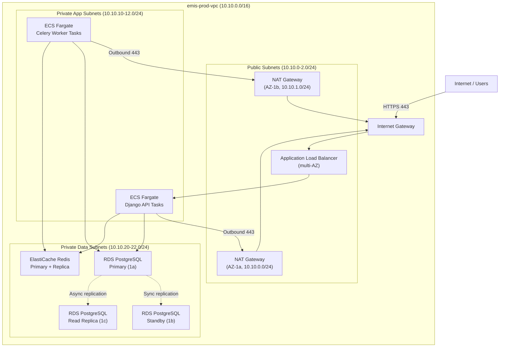

# Network Infrastructure — Education Management Information System

AWS VPC topology, subnet design, security group rules, DNS configuration, and TLS setup for the EMIS production environment.

---

## 1. VPC Design

```
Region: ap-south-1 (Mumbai)
VPC: emis-prod-vpc
CIDR: 10.10.0.0/16
Tenancy: Default
DNS hostnames: Enabled
DNS resolution: Enabled
```

### 1.1 Subnet Layout

| Subnet | CIDR | AZ | Tier | Route Table |
|---|---|---|---|---|
| `emis-public-1a` | 10.10.0.0/24 | ap-south-1a | Public (NAT, ALB) | Public RT (0.0.0.0/0 → IGW) |
| `emis-public-1b` | 10.10.1.0/24 | ap-south-1b | Public (NAT, ALB) | Public RT |
| `emis-public-1c` | 10.10.2.0/24 | ap-south-1c | Public (NAT, ALB) | Public RT |
| `emis-private-app-1a` | 10.10.10.0/24 | ap-south-1a | Private App (ECS Fargate) | Private RT-1a (0.0.0.0/0 → NAT-1a) |
| `emis-private-app-1b` | 10.10.11.0/24 | ap-south-1b | Private App (ECS Fargate) | Private RT-1b (0.0.0.0/0 → NAT-1b) |
| `emis-private-app-1c` | 10.10.12.0/24 | ap-south-1c | Private App (ECS Fargate) | Private RT-1c |
| `emis-private-data-1a` | 10.10.20.0/24 | ap-south-1a | Private Data (RDS, Redis) | Data RT (no outbound internet) |
| `emis-private-data-1b` | 10.10.21.0/24 | ap-south-1b | Private Data (RDS, Redis) | Data RT |
| `emis-private-data-1c` | 10.10.22.0/24 | ap-south-1c | Private Data (RDS, Redis) | Data RT |

### 1.2 Network Architecture Diagram



---

## 2. Internet Gateway and NAT Gateways

| Resource | Placement | Elastic IP | Purpose |
|---|---|---|---|
| Internet Gateway | VPC-level | Shared | Inbound public traffic + outbound for NAT |
| NAT Gateway 1a | emis-public-1a | `EIP-1a` | Outbound internet for App subnet 1a |
| NAT Gateway 1b | emis-public-1b | `EIP-1b` | Outbound internet for App subnet 1b |
| NAT Gateway 1c | emis-public-1c | `EIP-1c` | Outbound internet for App subnet 1c (cost-optional; can route to 1b) |

ECS tasks in private subnets route outbound traffic (to AWS SES, Razorpay, Twilio, Turnitin, S3) through the AZ-local NAT gateway to avoid cross-AZ data transfer charges.

---

## 3. Security Groups

### 3.1 ALB Security Group (`sg-emis-alb`)

| Direction | Protocol | Port | Source/Destination | Purpose |
|---|---|---|---|---|
| Inbound | TCP | 443 | 0.0.0.0/0 | HTTPS from internet |
| Inbound | TCP | 80 | 0.0.0.0/0 | HTTP → redirect to 443 |
| Outbound | TCP | 8000 | `sg-emis-api` | Forward to Django Gunicorn |

### 3.2 API Task Security Group (`sg-emis-api`)

| Direction | Protocol | Port | Source/Destination | Purpose |
|---|---|---|---|---|
| Inbound | TCP | 8000 | `sg-emis-alb` | Receive from ALB only |
| Outbound | TCP | 5432 | `sg-emis-rds` | PostgreSQL |
| Outbound | TCP | 6379 | `sg-emis-redis` | Redis |
| Outbound | TCP | 443 | 0.0.0.0/0 | AWS APIs (SES, S3, Secrets Manager, etc.) via NAT |
| Outbound | TCP | 443 | 0.0.0.0/0 | External APIs (Razorpay, Stripe, Twilio, Turnitin) via NAT |

### 3.3 Celery Worker Security Group (`sg-emis-worker`)

| Direction | Protocol | Port | Source/Destination | Purpose |
|---|---|---|---|---|
| Inbound | — | — | — | No inbound (workers pull from Redis queue) |
| Outbound | TCP | 5432 | `sg-emis-rds` | PostgreSQL |
| Outbound | TCP | 6379 | `sg-emis-redis` | Redis broker |
| Outbound | TCP | 443 | 0.0.0.0/0 | External APIs and AWS services via NAT |

### 3.4 RDS Security Group (`sg-emis-rds`)

| Direction | Protocol | Port | Source/Destination | Purpose |
|---|---|---|---|---|
| Inbound | TCP | 5432 | `sg-emis-api` | API tasks |
| Inbound | TCP | 5432 | `sg-emis-worker` | Celery workers |
| Inbound | TCP | 5432 | `sg-emis-bastion` | Bastion host (admin access only) |
| Outbound | — | — | — | None required |

### 3.5 ElastiCache Security Group (`sg-emis-redis`)

| Direction | Protocol | Port | Source/Destination | Purpose |
|---|---|---|---|---|
| Inbound | TCP | 6379 | `sg-emis-api` | API tasks |
| Inbound | TCP | 6379 | `sg-emis-worker` | Celery workers |
| Outbound | — | — | — | None required |

### 3.6 Bastion Host Security Group (`sg-emis-bastion`)

| Direction | Protocol | Port | Source/Destination | Purpose |
|---|---|---|---|---|
| Inbound | TCP | 22 | Admin IP allowlist (Corporate VPN CIDR) | SSH for DB admin (emergency use only) |
| Outbound | TCP | 5432 | `sg-emis-rds` | DB access |
| Outbound | TCP | 6379 | `sg-emis-redis` | Redis admin |

> **Note:** Bastion SSH access is time-limited. All sessions are logged to CloudTrail and CloudWatch. Preferred approach is AWS Systems Manager Session Manager (no inbound port required).

---

## 4. Network ACLs

NACLs provide a stateless secondary defense layer in addition to stateful security groups.

### 4.1 Public Subnet NACL

| Rule # | Direction | Protocol | Port range | Source/Dest | Action |
|---|---|---|---|---|---|
| 100 | Inbound | TCP | 443 | 0.0.0.0/0 | ALLOW |
| 110 | Inbound | TCP | 80 | 0.0.0.0/0 | ALLOW |
| 120 | Inbound | TCP | 1024–65535 | 0.0.0.0/0 | ALLOW (ephemeral ports) |
| 32767 | Inbound | All | All | 0.0.0.0/0 | DENY |
| 100 | Outbound | TCP | 8000 | 10.10.10.0/22 | ALLOW |
| 110 | Outbound | TCP | 1024–65535 | 0.0.0.0/0 | ALLOW |
| 32767 | Outbound | All | All | 0.0.0.0/0 | DENY |

### 4.2 Private App Subnet NACL

| Rule # | Direction | Protocol | Port | Source/Dest | Action |
|---|---|---|---|---|---|
| 100 | Inbound | TCP | 8000 | 10.10.0.0/22 (public) | ALLOW |
| 110 | Inbound | TCP | 1024–65535 | 0.0.0.0/0 | ALLOW (return traffic) |
| 32767 | Inbound | All | All | 0.0.0.0/0 | DENY |
| 100 | Outbound | TCP | 5432 | 10.10.20.0/22 (data) | ALLOW |
| 110 | Outbound | TCP | 6379 | 10.10.20.0/22 (data) | ALLOW |
| 120 | Outbound | TCP | 443 | 0.0.0.0/0 | ALLOW |
| 130 | Outbound | TCP | 1024–65535 | 0.0.0.0/0 | ALLOW |
| 32767 | Outbound | All | All | 0.0.0.0/0 | DENY |

### 4.3 Private Data Subnet NACL

| Rule # | Direction | Protocol | Port | Source/Dest | Action |
|---|---|---|---|---|---|
| 100 | Inbound | TCP | 5432 | 10.10.10.0/22 (app) | ALLOW |
| 110 | Inbound | TCP | 6379 | 10.10.10.0/22 (app) | ALLOW |
| 32767 | Inbound | All | All | 0.0.0.0/0 | DENY |
| 100 | Outbound | TCP | 1024–65535 | 10.10.10.0/22 (app) | ALLOW |
| 32767 | Outbound | All | All | 0.0.0.0/0 | DENY |

---

## 5. VPC Endpoints

VPC Endpoints route traffic to AWS services without traversing the public internet, reducing data transfer costs and improving security.

| Endpoint | Type | Services | Subnets |
|---|---|---|---|
| S3 Gateway Endpoint | Gateway | S3 | All route tables |
| ECR API Interface Endpoint | Interface | `ecr.api`, `ecr.dkr` | Private App subnets |
| Secrets Manager Interface Endpoint | Interface | `secretsmanager` | Private App subnets |
| KMS Interface Endpoint | Interface | `kms` | Private App subnets |
| CloudWatch Logs Interface Endpoint | Interface | `logs` | Private App subnets |
| STS Interface Endpoint | Interface | `sts` | Private App subnets |
| SSM Interface Endpoint | Interface | `ssm`, `ssmmessages` | All private subnets |

---

## 6. DNS — Route 53

### 6.1 Hosted Zones

| Zone | Type | Purpose |
|---|---|---|
| `emis.example.edu` | Public hosted zone | Student-facing portal, admin portal |
| `internal.emis.local` | Private hosted zone (VPC-bound) | Internal service discovery |

### 6.2 DNS Records

| Record | Type | Value |
|---|---|---|
| `emis.example.edu` | ALIAS | CloudFront distribution (`*.cloudfront.net`) |
| `api.emis.example.edu` | ALIAS | CloudFront distribution (API origin) |
| `admin.emis.example.edu` | ALIAS | CloudFront distribution (admin panel origin) |
| `email.emis.example.edu` | MX | SES inbound endpoint |
| `email.emis.example.edu` | TXT | SPF record: `v=spf1 include:amazonses.com ~all` |
| `_dmarc.emis.example.edu` | TXT | `v=DMARC1; p=quarantine; rua=mailto:dmarc@emis.example.edu` |
| `rds.internal.emis.local` | CNAME | RDS primary endpoint |
| `rds-ro.internal.emis.local` | CNAME | RDS read replica endpoint |
| `redis.internal.emis.local` | CNAME | ElastiCache primary endpoint |

### 6.3 Health Checks and Failover

| Health check | Target | Interval | Failover action |
|---|---|---|---|
| API health check | `https://api.emis.example.edu/api/health/` | 30 s | Route 53 DNS failover to DR region |
| ALB target health | ECS Fargate task `/api/health/` | 10 s | ALB removes unhealthy target |
| RDS health | Multi-AZ automatic | 60 s | RDS automatic failover |

---

## 7. TLS Configuration

### 7.1 Certificate Management

All TLS certificates are provisioned via **AWS Certificate Manager (ACM)**.

| Certificate | Domain | Renewal |
|---|---|---|
| Production wildcard | `*.emis.example.edu` | Auto-renewed by ACM (DNS validation) |
| API certificate | `api.emis.example.edu` | Auto-renewed |

### 7.2 TLS Policy

| Layer | Minimum TLS version | Ciphers |
|---|---|---|
| CloudFront | TLS 1.2 (TLSv1.2_2021 policy) | ECDHE-RSA-AES128-GCM-SHA256, ECDHE-RSA-AES256-GCM-SHA384 |
| ALB | TLS 1.2 (`ELBSecurityPolicy-TLS13-1-2-2021-06`) | TLS 1.3 preferred; TLS 1.2 fallback |
| RDS | TLS 1.2+ enforced (via parameter group `rds.force_ssl=1`) | |
| Redis | TLS 1.2+ enforced via ElastiCache in-transit encryption | |

### 7.3 HSTS

CloudFront response headers policy:
```
Strict-Transport-Security: max-age=63072000; includeSubDomains; preload
X-Content-Type-Options: nosniff
X-Frame-Options: DENY
X-XSS-Protection: 1; mode=block
Referrer-Policy: strict-origin-when-cross-origin
Content-Security-Policy: default-src 'self'; script-src 'self' 'nonce-{nonce}'; ...
```

---

## 8. AWS WAF Rules

WAF Web ACL attached to CloudFront distribution with the following rule groups (evaluated in order):

| Priority | Rule group | Action on match |
|---|---|---|
| 10 | AWS Managed – Core Rule Set (CRS) | Block |
| 20 | AWS Managed – SQL Database | Block |
| 30 | AWS Managed – Known Bad Inputs | Block |
| 40 | AWS Managed – IP Reputation List | Block |
| 50 | Custom – Rate limit: 500 req/5 min per IP on `/api/auth/login/` | Block (429) |
| 60 | Custom – Rate limit: 1000 req/5 min per IP on `/api/` | Block (429) |
| 70 | Custom – Block IPs in deny-list (updated by security team) | Block |
| 100 | Default action | Allow |

---

## 9. Network Flow Summary

### 9.1 Student → Portal Request

```
Student Browser
    → HTTPS → Route 53 → CloudFront (PoP nearest to user)
    → WAF evaluation
    → HTTPS → ALB (public subnet)
    → HTTP:8000 → ECS Fargate API task (private app subnet)
    → PgBouncer → RDS PostgreSQL (private data subnet)
    ← response propagates back up the chain
```

### 9.2 Celery Worker → External API (e.g., Twilio)

```
Celery Worker (private app subnet)
    → TCP:443 → NAT Gateway (public subnet, EIP)
    → Internet Gateway
    → Twilio API (internet)
```

### 9.3 ECS Task → AWS Services (No Internet)

```
ECS Task (private app subnet)
    → VPC Endpoint for Secrets Manager / KMS / CloudWatch Logs
    → AWS service (no NAT, no internet traversal)

ECS Task → S3 Gateway Endpoint → S3 (no NAT)
```
