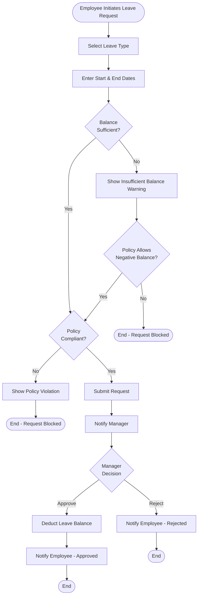
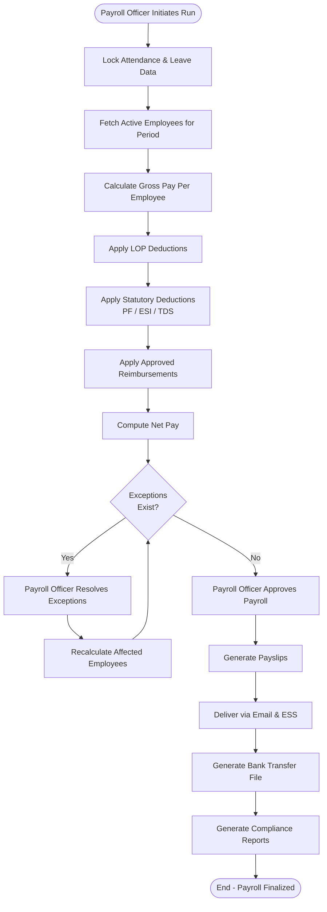
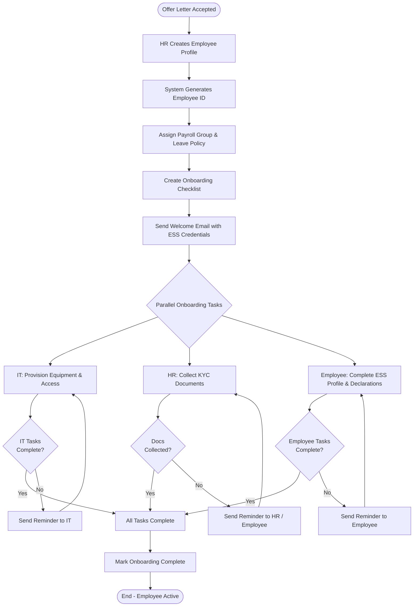
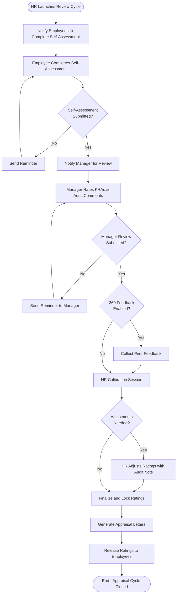
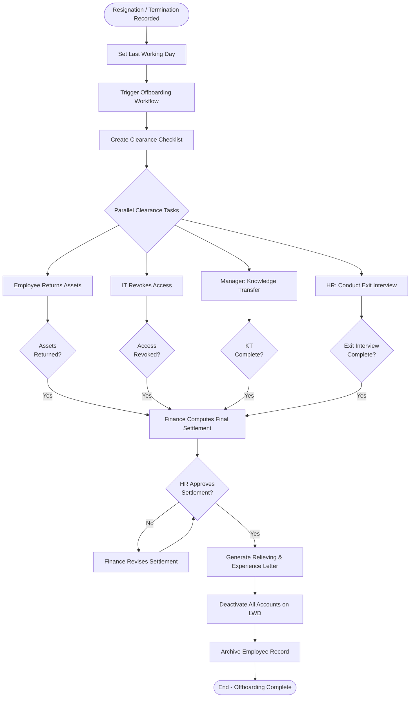

# Activity Diagrams

## Overview
Activity diagrams illustrating the key business process flows in the Employee Management System.

---

## 1. Leave Application Process

---

## 2. Monthly Payroll Processing

---

## 3. Employee Onboarding Workflow

---

## 4. Performance Appraisal Cycle

---

## 5. Employee Offboarding Workflow

