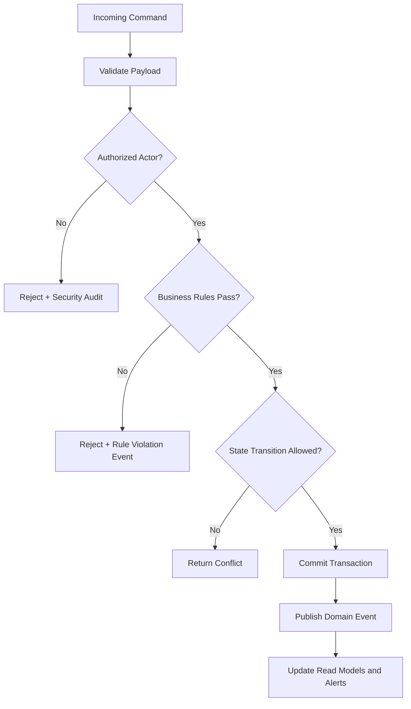
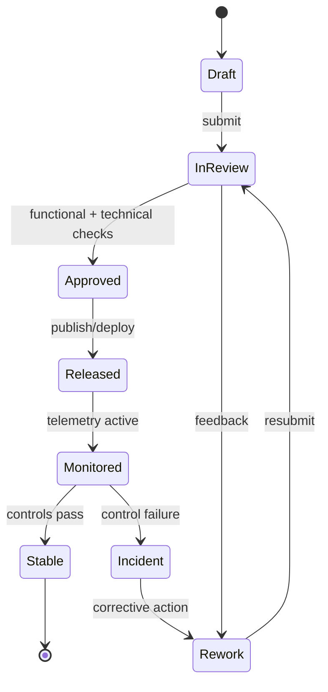

# Business Rules

This document defines enforceable policy rules for **Employee Management System** so command processing, asynchronous jobs, and operational actions behave consistently under normal and exceptional conditions.

## Context
- Domain focus: employee management workflows.
- Rule categories: lifecycle transitions, authorization, compliance, and resilience.
- Enforcement points: APIs, workflow/state engines, background processors, and administrative consoles.

## Enforceable Rules
1. Every state-changing command must pass authentication, authorization, and schema validation before processing.
2. Lifecycle transitions must follow the configured state graph; invalid transitions are rejected with explicit reason codes.
3. High-impact operations (financial, security, or regulated data actions) require additional approval evidence.
4. Manual overrides must include approver identity, rationale, and expiration timestamp.
5. Retries and compensations must be idempotent and must not create duplicate business effects.

## Rule Evaluation Pipeline

## Exception and Override Handling
- Overrides are restricted to approved exception classes and require dual logging (business + security audit).
- Override windows automatically expire and trigger follow-up verification tasks.
- Repeated override patterns are reviewed for policy redesign and automation improvements.

---

---

## Process Narrative (Business rule catalog)
1. **Initiate**: Policy Owner captures the primary change request for **Business Rules** and links it to business objectives, impacted modules, and target release windows.
2. **Design/Refine**: The team elaborates flows, assumptions, acceptance criteria, and exception paths specific to business rule catalog.
3. **Authorize**: Approval checks confirm that changes satisfy policy, architecture, and compliance constraints before promotion.
4. **Execute**: Rule Service executes the approved path and enforces policy evaluator at run-time or publication-time.
5. **Integrate**: Outputs are synchronized to dependent services (IAM, payroll, reporting, notifications, and audit store) with idempotent correlation IDs.
6. **Verify & Close**: Stakeholders reconcile expected outcomes against actual telemetry to confirm rule enforcement.

## Role/Permission Matrix (Business Rules)
| Capability | Employee | Manager | HR/People Ops | Engineering/IT | Compliance/Audit |
|---|---|---|---|---|---|
| View business rules artifacts | Scoped self | Team scoped | Full | Full | Read-only full |
| Propose change | Request only | Draft + justify | Draft + justify | Draft + justify | No |
| Approve publication/use | No | Conditional | Primary approver | Technical approver | Control sign-off |
| Execute override | No | Limited with reason | Limited with reason | Break-glass with ticket | No |
| Access evidence trail | No | Limited | Full | Full | Full |

## State Model (Business rule catalog)

## Integration Behavior (Business Rules)
| Integration | Trigger | Expected Behavior | Failure Handling |
|---|---|---|---|
| IAM / RBAC | Approval or assignment change | Sync permission scopes for affected actors | Retry + alert on drift |
| Workflow/Event Bus | State transition | Publish canonical event with correlation ID | Dead-letter + replay tooling |
| Payroll/Benefits (where applicable) | Compensation/lifecycle change | Apply financial side-effects only after approved state | Hold payout + reconcile |
| Notification Channels | Review decision, exception, due date | Deliver actionable notice to owners and requestors | Escalation after SLA breach |
| Audit/GRC Archive | Any controlled transition | Store immutable evidence bundle | Block progression if evidence missing |

## Onboarding/Offboarding Edge Cases (Concrete)
- **Rehire with residual access**: If a rehire request reuses a prior identity, retain historical employee ID linkage but force fresh role entitlement approval before day-1 access.
- **Early start-date acceleration**: When onboarding date is moved earlier than background-check SLA, block activation and auto-create an exception approval task.
- **Same-day termination**: For involuntary offboarding, revoke privileged access immediately while preserving records under legal hold classification.
- **Rescinded resignation after downstream sync**: If offboarding is canceled after payroll/IAM notifications, execute compensating events and log full reversal trail.

## Compliance/Audit Controls
| Control | Description | Evidence |
|---|---|---|
| Segregation of duties | Requestor and approver cannot be the same identity for controlled actions | Approval chain + user IDs |
| Transition integrity | Only allowed state transitions can be persisted | Transition log + rejection reasons |
| Timely deprovisioning | Offboarding access revocation meets SLA targets | IAM revocation timestamp report |
| Financial reconciliation | Payroll-impacting changes reconcile before close | Payroll batch diff + sign-off |
| Immutable auditability | Controlled actions are archived in WORM/append-only storage | Hash, retention tag, archive pointer |

